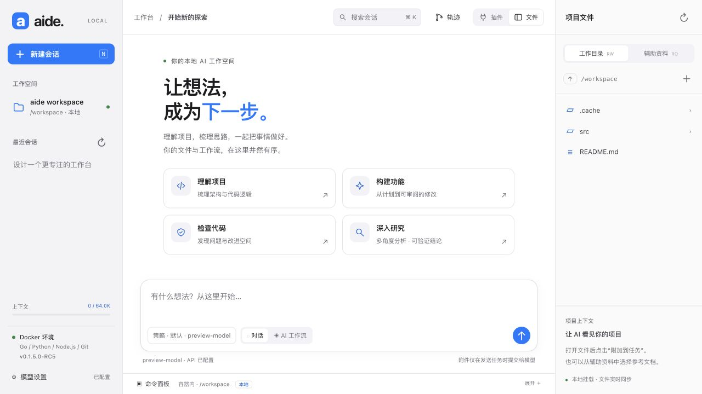
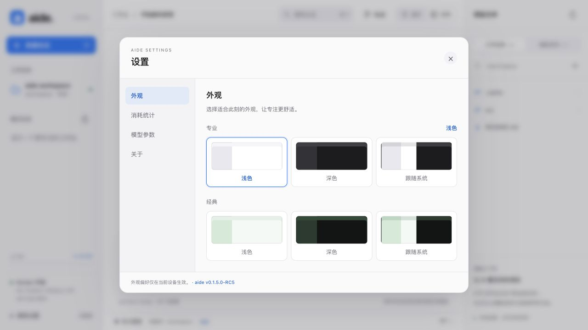
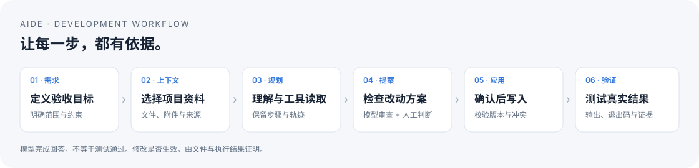

<div align="center">

> **启动配置以 `.env` 为准**：`start.command` → `scripts/aide.sh` → Docker Compose，统一读取 `AIDE_PORT`（默认 8097）和 `COMPOSE_FILE`。临时验收端口不是用户启动入口。目录范围和 macOS 共享根模式见 [工作目录配置](docs/workspace-paths.md)。

[English](README.en.md) · 简体中文

# aide

### AI+IDE，让想法成为下一步。

融合 AI 与集成工作环境 · 理解资料 · 分析问题 · 完成任务

[安装说明](docs/installation.md) · [快速开始](#快速开始) · [使用指南](docs/user-guide.md) · [开发工作流](docs/agent/WORKFLOW.md) · [版本记录](version.md) · [GitHub](https://github.com/skyelan1999/aide)

</div>



> **版本**：本次交付 `0.1.7.0 RC1`，包含新版外观、统一 Agent 开发路由和 Docker 镜像附件。截图来自同套界面的隔离示例环境，截图内 RC5 是拍摄时的后端版本。安装包与发布状态以 [GitHub Releases](https://github.com/skyelan1999/aide/releases) 为准。

## 为什么选择 aide

aide 的名字来自 **AI + IDE**。它把 AI 能力与集成工作环境放在一起，让你围绕专业任务组织项目、资料、工具和操作过程，减少在多个窗口之间切换，把注意力留给分析、判断与成果本身。

aide 把项目文件、AI 对话、修改提案、运行轨迹与命令执行放在同一个工作空间。它面向希望在本机掌握文件与执行环境的开发者：用 AI 理解项目、梳理方案，再由自己审阅和应用改动。

- **围绕真实项目工作**：连接本地目录或 SSH/SFTP 工作区，浏览、编辑、附加文本文件。
- **过程可检查**：查看规划、工具调用、文件提案和模型审查；写入和命令执行需要明确操作。
- **环境可迁移**：Go、Python、Node.js、Git 随 Docker 环境提供，源码、镜像、工作文件与会话数据分别管理。

项目数据在本机持久化；使用云端模型时，任务内容、上下文和工具读取结果会发送到所配置的提供商。aide 是独立项目，借鉴 DeepSeek Harness 的设计思路，不是 DeepSeek 官方产品，也不提供完整 DSH/Cordis 运行时兼容。

## 可以完成什么

| 能力 | 使用方式 | 当前边界 |
| --- | --- | --- |
| AI 对话与开发工作流 | 选择对话，或按规划 → 提案 → 审查生成改动 | 模型审查不等于测试通过；响应按步骤展示 |
| 文件与 Markdown | 浏览、编辑、保存、预览、新标签页打开、附加到任务 | 文本文件有大小与编码限制；保存有哈希冲突校验 |
| 工作区与辅助资料 | 本地、SSH/SFTP；本地资料、Skill 目录、链接、FTP/FTPS/SMB 来源 | MCP 当前只有登记入口；系统文档来源不等于自动生成文档 |
| 模型与策略 | 多模型列表、参数 Profile、手动/自动策略 | 模型共享当前提供商连接；兼容性依赖上游 API |
| 轨迹、搜索与压缩 | 查看任务步骤与工具记录；搜索聊天；压缩历史上下文 | 压缩是摘要化，不是 ZIP，也不保证磁盘体积缩小 |
| Token 与费用 | 热力图、单日明细、按模型费率快照、余额查询 | 区分已计价、估算、未计价；不是提供商正式账单 |
| 容器命令面板 | 手动运行命令，查看输出、退出码，取消任务 | 独立 shell，无 PTY，不适合交互式编辑器或常驻服务 |
| 插件 | 上传、启停、展示工具；带 handler 的工具进入调用循环 | 仅兼容形态子集；插件是可信代码，不是安全沙箱 |
| 外观与关于 | 专业/经典两排，各选浅色、深色或跟随系统；显示版本与仓库入口 | 偏好保存在当前浏览器，未同步到服务端 |



## 按专业场景扩展 aide

aide 可以直接用于日常专业工作。需要适配软件研发、技术资料分析或内部流程时，可让开发 AI 复用现有能力，调整界面、策略、插件及外部系统连接。Agent 路由管理的是开发与维护活动，不替代使用者的专业判断。

1. Fork 或克隆源码，保留 MIT 许可证；为定制建立独立分支。
2. 填写 [场景定制指南](docs/customization.md) 中的需求模板，明确哪些目录、资料和工具可以使用。
3. 让 AI 先读 `AGENTS.md`，按需求 → 设计 → 实现 → 测试 → 文档 → Release 的路由开发。
4. 在隔离环境检查真实界面和结果，再构建自己的 Docker 镜像；源码、镜像和数据卷分别交付。

**源码用于定制，镜像用于快速运行。** 发行镜像包含运行工具链与已编译应用，不替代源码仓库；源码修改后重新构建镜像。[下载 Docker 镜像与校验和](https://github.com/skyelan1999/aide/releases) · [镜像导入与启动](docker-images/README.md)。

## 快速开始

需要 Git、Docker Engine 与 Docker Compose。macOS 可使用 Docker Desktop。当前已有 Apple Silicon 环境验证记录；其他平台应自行构建并检查。宿主机不需要先安装 Go 或 npm 依赖。

也可以直接使用环境检查与安装脚本：`bash scripts/install.sh --check`，然后选择 `--source` 或 `--image 归档路径`。完整前置环境、首次登录和故障处理见 [安装说明](docs/installation.md)。

### 1. 获取项目

```bash
git clone https://github.com/skyelan1999/aide.git
cd aide
```

仓库若要求访问权限，请使用有权限的 GitHub 账户。

### 2. 配置本地目录

首次配置才复制 `.env.example`；已有 `.env` 时直接编辑，避免覆盖。

```bash
cp -n .env.example .env
mkdir -p context
```

将 `.env` 中目录改成实际存在的路径。下面使用 aide 本身作为工作区、`context/` 作为只读资料目录，并将本地浏览范围限制到你的开发目录：

```dotenv
AIDE_PORT=8097
AIDE_WORKSPACE=.
AIDE_CONTEXT=./context
AIDE_LOCAL_ROOT=/absolute/path/to/your/projects
```

**挂载范围要点**：仓库的 Compose 默认 `AIDE_LOCAL_ROOT=$HOME`，即将整个用户主目录可读写挂载到 `/local`。按需改为较小的已存在目录；容器命令和可信插件能访问其权限内的挂载内容。`/context` 保持只读。

### 3. 启动并登录

```bash
bash scripts/aide.sh start
```

macOS 也可以双击 `start.command`。脚本会构建并启动容器，打开浏览器完成本地令牌登录。默认地址为 `http://127.0.0.1:8097`。首次构建需要下载基础镜像；启动会重建当前源码，不是只读查看操作。

本地登录令牌和模型 API Key 是两种凭据。不要分享带令牌的地址或将令牌贴到问题单。普通开发构建可能显示 `dev`/`unknown`；正式版本需要构建身份，见[发布与维护](HANDOVER.md)。

### 4. 配置模型

打开左下角 **模型设置**，填写提供商的 Base URL、API Key，添加模型 ID 与上下文窗口，保存当前模型。支持兼容 Chat Completions 的服务；具体地址、模型名称和费用以你的提供商为准。

“已配置”仅表示配置字段就绪，不代表连接成功。先发送不含私有资料的简短问题确认可用。无模型时文件与命令功能仍可使用。

### 5. 完成第一项任务

1. 点工作空间卡片，确认当前项目路径；打开右侧 **文件**。
2. 打开目标文件，选择 **附加到任务**；补充所需的辅助资料。
3. 在 **策略** 中选择模型与 Profile，输入目标和验收条件。
4. 先用 **对话** 理解项目；需要改动时选择 **AI 工作流**。
5. 检查提案和审查结果，确认后应用文件修改。已有文件须符合附件与版本校验要求。
6. 将建议命令填入命令面板，审阅后手动运行；根据实际输出判断任务是否完成。



详细操作、资料来源、费用、搜索与压缩说明见[使用指南](docs/user-guide.md)。

## 数据与运行环境

| 容器位置 | 内容 | 默认来源 |
| --- | --- | --- |
| `/workspace` | 可读写项目 | 当前仓库或 `AIDE_WORKSPACE` |
| `/context` | 只读辅助目录 | `../Harness` 或 `AIDE_CONTEXT` |
| `/local` | 可读写宿主目录浏览范围 | `$HOME` 或 `AIDE_LOCAL_ROOT` |
| `/data` | 会话、模型配置、令牌、费率与统计 | 命名卷 `aide_aide-data` |
| `/home/aide` | 用户环境与开发缓存 | 命名卷 `aide_aide-home` |

Go 服务使用 `go:embed` 分发前端；前端为原生 JS/CSS，Markdown 解析器随仓库本地分发，无 CDN 和 npm 安装步骤。修改源码后需要重建发布镜像。镜像归档位于 `docker-images/`，不包含挂载目录和数据卷。

```bash
bash scripts/aide.sh status   # 查看服务状态
bash scripts/aide.sh logs     # 查看近期日志
bash scripts/aide.sh test     # 一次性容器中运行 Go race / vet
bash scripts/aide.sh export   # 导出本机 aide:local 镜像
bash scripts/aide.sh stop     # 停止服务，保留数据卷
```

## 参与开发

所有开发 Agent 从 [AGENTS.md](AGENTS.md) 进入同一个流程：

**需求 → 设计 → 实现 → 测试 → 文档 → 清理 → Release**

```bash
python3 scripts/agent-route.py start my-feature --request "需求与目标"
python3 scripts/agent-route.py check
python3 scripts/agent-route.py verify quick
python3 scripts/agent-route.py audit
```

支持 Codex、Claude Code、DeepSeek DSH 的项目入口，以及豆包和 WorkBuddy 的显式启动指令。它是仓库开发规范与检查工具，不是产品内的多 Agent 调度功能。客户端适配方式与能力边界见[接入说明](docs/agent/ADAPTERS.md)。

## 使用边界

- 适用于可信单用户本地工作台，默认端口仅绑定回环地址；不面向公网或多用户托管。
- AI 可以通过读工具读取授权工作区，不能再把“只有显式附件会进入模型”视为保证。
- 文件应用逐文件原子写入，不是跨文件事务；已应用的修改不会因后续失败自动回滚。
- 已支持逐 token SSE 流式输出（chat 模式实时可见）；尚无交互式 PTY、完整 MCP、向量检索或完整 DSH 插件兼容。
- 上下文与缺失 usage 的 Token 数量为启发式估算；压缩可能丢失细节，重要事实应回查原文件和轨迹。

## 文档导航

| 文档 | 面向谁 |
| --- | --- |
| [使用指南](docs/user-guide.md) | 第一次使用与日常操作 |
| [交接与运维](HANDOVER.md) | 部署、升级、备份、恢复与排障 |
| [架构与 API](docs/architecture.md) | 开发和扩展 |
| [产品需求](docs/PRD.md) | 需求范围、编号、状态与限制 |
| [插件协议](docs/plugin-protocol.md) | 编写和评估插件 |
| [文档索引与有效性](docs/README.md) | 区分现行文档与历史证据 |
| [版本记录](version.md) | 已发布版本及变更 |

## 许可与致谢

项目使用 [MIT License](LICENSE)。本地分发的第三方组件保留各自许可证。感谢 [DeepSeek Harness](https://github.com/deepseek-ai/deepseek-harness) 提供设计参考。
