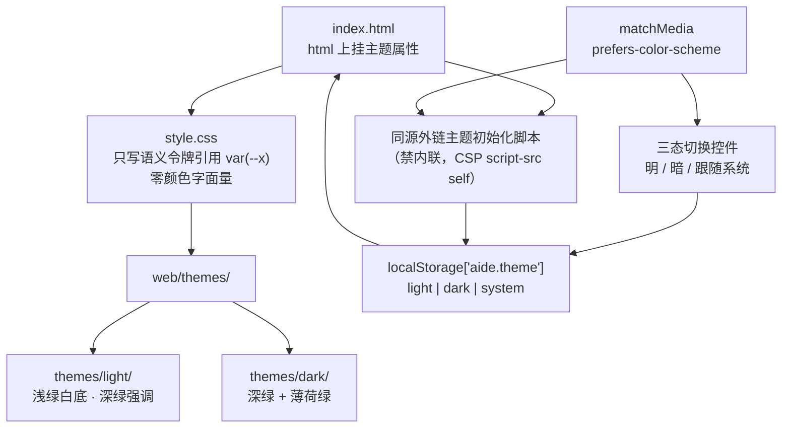
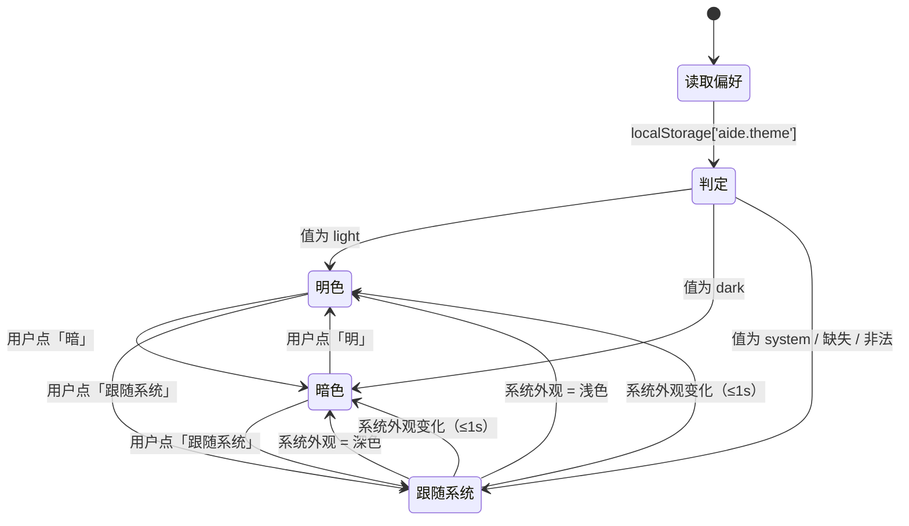

# 增量 PRD：主题与配色系统（light / dark / system）

> 本文是 `doc/PRD.md` v1.1 / v1.2 的**增量需求说明**，供下游架构师消费。需求编号的唯一权威登记处是 `doc/PRD.md` 第 4 / 5 / 6.5 节，本文不引入新编号，只做结构化展开与判定口径细化。**冲突时以 `doc/PRD.md` 为准。**

## 0. 落地状态更新（2026-09-21，main 现状）

代码经 `feat/settings-panel` 分支落地于 main。以下为最终状态；原文档其余内容作为设计历史保留：

| 编号 | 落地状态 | 说明 |
| --- | --- | --- |
| FR-49 颜色令牌化 | 已实现·已验证 | `style.css` 颜色字面量归零，全部走 79 个语义令牌 |
| FR-50 / FR-51 明/暗方案 | 已实现·已验证 | `themes/light/`、`themes/dark/` 平行目录；暗色 ≤2/255 保真 |
| FR-52 三态切换控件 | 已实现·已验证（形态变更） | 由顶栏三按钮改为**设置面板分段控件**（设置中心 FR-58~60），键盘可达、aria-pressed、窄屏不溢出 |
| FR-53 偏好持久化 | 已实现·已验证（存储升级） | 由 `aide.theme` 字符串升级为 `aide.ui` JSON 文档（LIM-21），旧键自动迁移；刷新一致 |
| FR-54 跟随系统 | 已实现·已验证 | system 偏好下系统外观变化实时跟随，显式选择后不跟随 |
| FR-55 首屏无闪烁 | 已实现·已验证 | `settings-init.js`（原 theme-init.js）同步外链于 `<head>` 首位 |
| FR-56 方案目录化 | 已实现·已验证 | 目录结构 + 冻结令牌集合（LIM-20）成立 |
| FR-57 UI 视觉质量 | 已实现·未验收 | 视觉质量经设置中心浏览器验收抽查通过；未做全量截图逐区域比对 |
| NFR-12 明色对比度 | 已实现·未验收 | 明色方案按契约取值；对比度取样表未写入 `docs/verification.md` |
| NFR-13 / 14 / 15 | 已实现·已验证 | 零依赖；embed 递归包含；CSP 未放宽（无内联脚本/样式） |
| NFR-16 暗色保真 | 已实现·已验证 | 暗色 89 个旧字面量按 ≤2/255 偏差由 79 令牌复现 |
| NFR-17 切换时延 | 已实现·未验收 | 切换零网络/不重载成立（双静态 `<link>`）；≤100 ms 未做仪器化测量 |

> 本文的 LIM-16（存储键 `aide.theme`）**已被 `doc/PRD.md` LIM-21 取代**；LIM-15/17/18/19/20 继续有效。

| 项 | 值 |
| --- | --- |
| 文档类型 | 增量 PRD（Increment） |
| 日期 | 2026-09-21 |
| 需求来源 | 用户原话：「帮我修改一下页面配色，要求在支持一个明亮的颜色，配色可选，具备三个按钮、明、暗和跟随系统，UI做的美观一些，配色方案我想单独独立成两个目录，这样后期方便扩展，请先更新PRD在更新对应代码，并做好对应的git维护」 |
| 主文档 | [doc/PRD.md](../PRD.md)（v1.0 → v1.1 → **v1.2**） |
| 本文修订 | 2026-09-21 **v1.2**：依据用户裁决界定 NFR-12 适用范围为明色主题，暗色既有低对比边界不纳入判定（R-13、C8、Q8） |
| 对应分支 | `feat/theme-switching` |
| 文档基线 | `fbe45b2`（PRD v1.0 提交）；功能基线 `4e0da10` 未变动 |
| 涉及源码 | `internal/server/web/`（3 个文件，约 39 KiB）；`server.go` 的 `go:embed` 指令（仅在 embed 不递归时需改） |
| 已定决策（不再讨论替代方案） | ① 配色方案独立成 `light/` 与 `dark/` **两个平行目录**；② 沿用绿色系、**明暗同源**——保留现有深绿 + 薄荷绿气质，明色主题做成浅绿白底 |
| 下游消费者 | 架构师（模块设计与任务分解）→ 工程师 → QA |

---

## 1. 变更背景

### 1.1 现状（改造前实测事实）

| 项 | 事实 | 出处 |
| --- | --- | --- |
| 样式文件 | `internal/server/web/style.css`，14,317 字节，**单行压缩格式**，187 条顶层规则，括号平衡 | 实测 |
| 主题能力 | **只有一套深色主题**：`:root{color-scheme:dark; --bg:--panel:--line:--text:--muted:--green:--accent:--soft}` 共 8 个 CSS 变量 | 实测 |
| 核心问题 | **大量颜色写死为十六进制字面量，未走变量**。全文件 93 处 hex、89 个不同色值，而变量只有 8 个。例：`#26342b` `#111713` `#6b9c7e` `#171d19` `#3e4b41` `#303c33` `#1c251f` `#283a2e` `#304a39` `#c3edd1` `#14291b` `#a6b2a9` `#66766b` `#b9c5bd` `#c8d2cb` `#909e94` `#8fa698` `#bbd4c2` `#99bda6` `#64786a` `#465b4e` `#415c49` `#77a98a` `#7c9082` `#8fa396` `#abc1b3` `#81998a` `#718678` `#1c3726` `#173422` … | 实测 |
| 前端结构 | `index.html` 7,957 B、`app.js` 17,020 B、`style.css` 14,317 B；`<link rel="stylesheet" href="/style.css">`、`<script src="/app.js" defer>` | 实测 |
| 已有 UI | 左侧会话栏、中间对话区、右侧文件面板、底部命令面板、模型设置弹窗、登录弹窗、编辑器弹窗、新建文件弹窗、模式切换（对话 / AI 工作流） | 实测 |
| 安全约束 | `server.go` CSP：`default-src 'self'; script-src 'self'; style-src 'self'; connect-src 'self'; img-src 'self' data:; frame-ancestors 'none'; base-uri 'none'` —— **禁止内联脚本** | 实测 |
| 依赖约束 | `go.mod` 仅 `module aide` + `go 1.26` 两行；前端无 npm、无构建步骤、无 CDN | 实测 |
| 嵌入约束 | `server.go` 第 27 行为 `//go:embed web/*` | 实测 |
| **暗色既有对比度缺陷** | 改造前基线 `fbe45b2` 即存在 3 处交互边界低于 3:1：`input` 输入框边界 **1.36:1**、`.quiet` 次要按钮边界 **1.72:1**、`.composer` 输入区外框 **2.58:1**。**非本次变更引入**；用户裁决本次不修（见 §9 Q8、§7 C8、`doc/PRD.md` R-13） | 架构师实测 |

### 1.2 问题陈述

1. **无法支持明色**：颜色散落在几十处字面量中，改 `:root` 变量对绝大多数元素无效。要支持明色主题，**必须先把所有颜色令牌化**——这是本次改造的核心工作量，不是附带工作。
2. **无法选择配色**：当前 `color-scheme:dark` 固定，用户无法按环境（白天/夜间）或偏好切换。
3. **无法扩展**：配色与样式规则混在同一个压缩文件里，新增一套配色需要逐个改动规则，成本高且易漏。
4. **可读性风险**：现有强调色 `#b4efcc` / `#83d9a8` 为高明度薄荷绿，**在浅色底上对比度天然不足**，直接复用会造成"看着漂亮但读不清"。

### 1.3 本次目标（正交三条）

| 目标 | 判定 |
| --- | --- |
| G1 可切换 | 用户能在**明 / 暗 / 跟随系统**三态间切换，且刷新后保持 |
| G2 可读 | 明暗两套配色均满足对比度下限（正文 ≥4.5:1），不存在不可读组合 |
| G3 可扩展 | 新增配色方案 = 新增一个目录 + 一个枚举取值 + 一个按钮，业务代码零改动 |

---

## 2. 变更范围

| 范围 | 内容 |
| --- | --- |
| **IN** | 颜色令牌化；明色方案；暗色方案（视觉等效保留）；三态切换控件；偏好持久化；跟随系统实时响应；首屏无闪烁；`themes/<theme>/` 目录化与扩展约定；明暗两主题下的视觉质量提升 |
| **OUT** | 用户自定义主题、第三方主题包上传、在线主题市场（新增 OOS-12）；主题导入/导出；主题编辑器；深色/浅色之外的配色（如高对比、护眼黄）；`prefers-contrast` 适配（列 P2 路线）；服务端存储主题偏好；i18n/文案改动；后端 API 与鉴权改动；`go.mod` 依赖变动；任何前端构建工具链；**暗色主题既有低对比边界的修复（R-13，架构师实测 3 处 <3:1，受 NFR-16 保真约束，本次不修，列第 9 节 P2）** |

### 2.1 不动的部分（架构师须显式保持）

- 不新增、不修改任何 API 端点与请求/响应契约（见 `doc/PRD.md` 6.4 的 v1.1 说明）。
- 不放宽 CSP 任何指令（NFR-15）；不引入内联脚本、内联事件、内联样式。
- 不改动 `go.mod`；不新增 `package.json` / lockfile / `node_modules` / 构建脚本。
- 不改动文件、命令、工作流、会话、鉴权的业务逻辑。
- **暗色主题外观冻结**（v1.2 用户裁决「暗色严格原样，只做明色」）：除等价令牌替换（逐通道偏差 ≤2/255）外不得改变暗色外观；既有 3 处低对比交互边界保持原样，不得"顺手修好"（详见 §7 C8、§9 Q8、`doc/PRD.md` R-13）

---

## 3. 需求条目清单

### 3.1 新增功能需求（`doc/PRD.md` 4.8 节）

| 编号 | 名称 | 一句话要求 | 依赖 | 优先级 |
| --- | --- | --- | --- | --- |
| FR-49 | 颜色令牌化 | 除 `themes/**` 外，`style.css` 与 `index.html` 中颜色字面量归零，全部改由语义令牌表达 | — | **P0（核心工作量）** |
| FR-50 | 明色主题 | 浅绿白底 + 深色文字 + 深绿强调色；`color-scheme: light` | FR-49 | P0 |
| FR-51 | 暗色主题 | 深绿 + 薄荷绿，与改造前视觉等效 | FR-49 | P0 |
| FR-52 | 三态切换控件 | 明 / 暗 / 跟随系统 三按钮，单选中，键盘可达，窄屏不溢出 | FR-50、FR-51 | P0 |
| FR-53 | 偏好持久化 | `localStorage['aide.theme']` ∈ {light, dark, system}，刷新后一致 | FR-52 | P0 |
| FR-54 | 跟随系统实时响应 | 系统外观变化 ≤1 s 自动跟随；选明/暗后不再跟随 | FR-53 | P0 |
| FR-55 | 首屏无主题闪烁 | 冷启动首帧即为目标主题；靠**同源外链脚本**实现（禁内联） | FR-53 | P0 |
| FR-56 | 配色方案目录化与扩展约定 | `themes/light/`、`themes/dark/` 平行目录，只放令牌；新增方案不改既有令牌名与业务 JS | FR-49 | P0 |
| FR-57 | UI 视觉质量提升 | 四态样式齐备 + ≥14 个取样点对比度达标 + 无不可读组合 + 无布局回归 | FR-49 ~ FR-56 | P1 |

### 3.2 新增非功能需求（`doc/PRD.md` 第 5 节）

| 编号 | 名称 | 判定口径（摘要） |
| --- | --- | --- |
| NFR-12 | 明色对比度下限 | **仅判定 `light` 明色主题**（v1.2 用户裁决界定适用范围，非豁免；暗色由 NFR-16 判定，其既有低对比边界见 R-13）：正文 ≥4.5:1；大字/组件边界/图标/焦点环/语义色 ≥3:1；按 WCAG 2.1 计算并记入 `docs/verification.md` |
| NFR-13 | 零依赖、无构建 | `go.mod` 两行不变；无 npm 包/构建产物/`package.json`；纯 CSS + 原生 JS |
| NFR-14 | 随二进制嵌入 | 主题资源随 `go:embed` 进镜像；**不带 bind mount** 的运行实例中可正常取到 |
| NFR-15 | CSP 禁内联脚本 | CSP 不得放宽；无内联 `<script>`、无 `onclick=`、无 `javascript:` |
| NFR-16 | 暗色回归不退化 | 与 `fbe45b2` 截图逐区域比对，仅允许等价令牌替换（通道偏差 ≤2/255）；既有布局指标不反转。**该 2/255 为硬约束**：暗色主题既有 3 处低对比边界（R-13）受其保护，本次不得修改 |
| NFR-17 | 切换时延与无副作用 | 不重载页面、无网络请求、不中断轮询与命令流；切换 ≤100 ms；跟随系统 ≤1 s |

### 3.3 新增量化限制（`doc/PRD.md` 6.5 节）

| 编号 | 对象 | 限制 |
| --- | --- | --- |
| LIM-15 | 主题枚举 | 仅 `light` / `dark` / `system`；默认 `system`；非法值回退 `system` |
| LIM-16 | 存储键 | `localStorage` 键名固定 `aide.theme`；不入 cookie、不入服务端、不入容器卷 |
| LIM-17 | 方案数量 | 本期 2 个（light/dark）；`system` 不占目录；架构支持 ≤8 个方案扩展 |
| LIM-18 | 体积 | 单令牌文件 ≤8 KiB；`web/` 总体积 ≤200 KiB；单次主题资源 ≤32 KiB |
| LIM-19 | 生效时限 | 首屏应用早于首次内容绘制（不晚于 `DOMContentLoaded`）；切换 ≤100 ms；跟随系统 ≤1 s |
| LIM-20 | **主题令牌集合（已冻结）** | 令牌清单冻结，**数量基线 79 个**（Δ≤2/255 保真下复现 89 个原字面量的最少色阶数）；`light`/`dark` 必须同名同数量、缺一即失败；令牌名是稳定接口，后续方案不得改名、不得增删；变更令牌集合须单独提需求；**不得为"整洁"精简数量**（精简即突破 NFR-16 的 ≤2/255） |

### 3.4 需同步修改的既有条目

| 位置 | 修改 |
| --- | --- |
| 3.1 本期范围 | 补登记「界面主题与配色方案」 |
| 3.2 非目标 | 新增 OOS-12（用户自定义/第三方主题包/在线市场）；并加 v1.1 范围澄清段 |
| 6.1 技术栈 | 前端行补「主题：纯 CSS 令牌 + 原生 JS，无构建、无依赖」 |
| 6.2 模块边界 | 拆出 `web/themes/`、`web/themes/light/`、`web/themes/dark/` 三行；说明主题初始化脚本置于 `web/` 根 |
| 6.4 API 契约 | 增加「主题改造 API 影响：无」的显式说明 |
| 6.6 挂载与存储 | 增加浏览器 `localStorage`（`aide-token`、`aide.theme`）不参与备份的说明 |
| 7 验收状态汇总 | 新增「主题与配色（v1.1）」行，FR-49 ~ FR-57 全部为未实现 |
| 8 已知缺陷与风险 | 新增 R-09 ~ R-12 |
| 9 后续路线图 | 新增 P2「主题可访问性与扩展」 |
| 10 开工前核对清单 | 新增「涉及 `web/` 改动须重建镜像后验证」 |
| 11 变更记录 | 新增 v1.1 行 |
| 5 NFR-12（v1.2） | 判定范围明确为**仅 `light` 明色主题**；暗色既有边界不纳入本条（适用范围界定，非豁免） |
| 6.5 量化限制（v1.2） | 新增 LIM-20：令牌集合冻结，数量基线 **79**，令牌名为稳定接口 |
| 8 已知缺陷（v1.2） | 新增 **R-13**：暗色既有 3 处交互边界 <3:1（`input` 1.36:1、`.quiet` 1.72:1、`.composer` 2.58:1），本次不修，原因受 NFR-16 保真约束 |
| 9 后续路线图（v1.2） | 新增 P2「暗色主题既有低对比边界修复」（须先登记 FR 编号；修复时同步放宽 NFR-16 对这几处的约束） |
| 7 验收状态汇总（v1.2） | 新增 v1.2 增补：明色按 NFR-12 判定、暗色按 NFR-16 判定，两条判定线并行 |
| 11 变更记录（v1.2） | 新增 v1.2 行 |

---

## 4. 目标结构与扩展约定

### 4.1 扩展约定（FR-56 可判定口径）

| 规则 | 说明 |
| --- | --- |
| 一个方案 = 一个平行目录 | `themes/<theme>/`；目录名必须等于 LIM-15 枚举取值 |
| 目录内容 | **只允许 CSS 令牌**；禁止 JS、图片、字体等资源 |
| 禁止跨主题依赖 | 主题之间不得 `@import` 或相互引用；每个目录必须自包含 |
| 新增第 3 个方案的最小改动面 | ① 新增目录 ② 增加枚举取值 ③ 增加切换按钮。**不得**修改既有令牌名、不得改动业务 JS（会话/文件/命令/工作流相关代码零 diff） |
| 令牌名是接口 | 令牌名一经写入两套主题即视为稳定接口，后续方案不得重命名 |

### 4.2 令牌分类与令牌集合（**已冻结**）

> **v1.2 裁决**：架构师已冻结令牌清单为 **79 个**——即在逐通道偏差 ≤2/255 的保真度下复现改造前 89 个颜色字面量所需的**最少色阶数**。该数量为**数量基线**，写入 `doc/PRD.md` LIM-20。`light` 与 `dark` 两套方案必须定义**同名、同数量**的全部 79 个令牌，缺一即失败；后续不得为"看起来更整洁"而精简（精简会直接突破 NFR-16 的 ≤2/255 保真约束）。

| 类别 | 覆盖对象（令牌名清单由架构设计文档给出，本文不重复展开） |
| --- | --- |
| 背景层级 | 页面底 / 面板 / 次级面板 / hover / 选中 |
| 边框 | 常规分隔线 / 强调边 / 输入框聚焦边 |
| 文字 | 正文 / 次要 / 弱化 / 反色（按钮上的字） |
| 主色 | brand（薄荷绿）/ accent / on-accent |
| 语义状态 | danger / warn / success（对话气泡、错误提示、连接状态） |
| 其他 | 焦点环、遮罩（`dialog::backdrop`）、阴影、滚动条 |

---

## 5. 主题判定与优先级（实现语义）

| 规则 | 判定 |
| --- | --- |
| 优先级 | 用户显式选择（light/dark）**高于**系统外观；`system` 表示"交给系统" |
| 缺省 | 首次访问无偏好 → `system` |
| 非法值 | 非 `light`/`dark`/`system`（含空串、大小写不一致）→ 按 `system` 处理并覆盖写回 | 
| 系统外观变化 | 仅在当前生效值为 `system` 时响应；否则忽略（不改变用户选择） |

---

## 6. 验收标准（逐条可判定）

### 6.1 功能验收

| # | 判定步骤 | 通过条件 | 对应编号 |
| --- | --- | --- | --- |
| A1 | 对 `internal/server/web/style.css` 与 `index.html` 执行 `grep -Eo '#[0-9a-fA-F]{3,8}'` | 命中 **0** 次（改造前 93 次）；字面量仅存在于 `web/themes/**` | FR-49 |
| A2 | 在运行实例选「明」 | 页面为浅绿白底、深色文字，无深色残留区域；`color-scheme` 为 `light`；滚动条与 `<dialog>` 为浅色 | FR-50 |
| A3 | 选「暗」 | 与改造前视觉等效，`color-scheme` 为 `dark` | FR-51 |
| A4 | 观察切换控件 | 三按钮文本为 明 / 暗 / 跟随系统；同一时刻恰有 1 个选中态；Tab 可聚焦、方向键或 Enter 可切换 | FR-52 |
| A5 | 在 1280×720 与 375 px 宽视口检查控件 | 可见、可点、无溢出/裁切；与「对话 / AI 工作流」模式切换可区分 | FR-52 |
| A6 | 选「明」→ 刷新页面 | 仍为明色；`localStorage.getItem('aide.theme') === 'light'` | FR-53 |
| A7 | 手工把 `localStorage['aide.theme']` 写成 `blue` → 刷新 | 页面按系统外观渲染，Console 无报错，键被写回 `system` | FR-53、LIM-15 |
| A8 | 选「跟随系统」→ 切换 macOS「系统设置 → 外观」（或 DevTools 模拟 `prefers-color-scheme`） | ≤1 s 内页面自动跟随，无需刷新、无需重启容器 | FR-54 |
| A9 | 在「跟随系统」下再选「暗」→ 改变系统外观 | 页面保持暗色不跟随；键值为 `dark` | FR-54、FR-53 |
| A10 | 设 `aide.theme='light'`、系统为深色 → 硬刷新（禁用缓存）并录屏 | 首帧即为明色，无「先暗后亮」跳变；无无主题样式渲染 | FR-55、LIM-19 |
| A11 | 浏览器 Console 检查 | 无 CSP 违规报错；CSP 响应头与 NFR-02 记录逐字符一致 | FR-55、NFR-15 |
| A12 | 检查 `themes/` 结构 | `light/` 与 `dark/` 平行；目录内无 JS、无二进制资源；无跨主题 `@import` | FR-56 |
| A13 | 静态检查新增方案的改动面 | 若新增第 3 个方案：业务 JS 相关文件零 diff，既有令牌名零改名 | FR-56、LIM-17 |
| A14 | **仅取明色主题**下逐组件取前景/背景色对算对比度（≥14 个取样点，见 FR-57 列表） | 全部满足 NFR-12 阈值，结果写入 `docs/verification.md`。**取样范围限定 `light`**：NFR-12 不判定暗色（v1.2 裁决），暗色既有低对比边界见 R-13，不得计入本项失败 | FR-57、NFR-12 |
| A15 | 明暗两主题下遍历交互元素 | hover / focus-visible / active / disabled 四态均可区分（"可区分"不等于达到 3:1；暗色既有边界受 R-13 与 C8 保护） | FR-57 |

### 6.2 非功能与回归验收

| # | 判定步骤 | 通过条件 | 对应编号 |
| --- | --- | --- | --- |
| B1 | 对比度计算（**仅明色主题**） | 正文 ≥4.5:1；大字/组件/图标/焦点环/语义色 ≥3:1。**判定范围限 `light`**——暗色主题不纳入本条（NFR-12 适用范围界定，非豁免）；暗色既有 3 处 <3:1 边界（R-13）不构成 B1 失败，其验收走 B6 | NFR-12 |
| B2 | `git diff --stat`；检查仓库根 | 不含 `go.mod` / `go.sum`；无 `package.json` / lockfile / `node_modules` | NFR-13 |
| B3 | `docker compose up -d --build` | 无需任何前置安装步骤即构建成功 | NFR-13 |
| B4 | 在**不带** `web/` bind mount 的实例中打开页面，看 Network | 主题资源返回 200，内容与仓库一致；不得以"宿主机有文件"为由通过 | NFR-14 |
| B5 | 浏览器 Console | 无 CSP 违规；`index.html` 无内联 `<script>` / `onclick=` / `javascript:` | NFR-15 |
| B6 | 1280×720 暗色截图与 `fbe45b2` 逐区域比对 | 仅允许通道偏差 ≤2/255；无错位/边框缺失/可读性下降；`.welcome` 底 406.86 px 仍 < `.conversation` 底 484.30 px；无横向溢出。**R-13 的 3 处既有边界（`input` 1.36:1、`.quiet` 1.72:1、`.composer` 2.58:1）必须保持原值**——将其"顺手修好"即本项失败（违反 C8） | NFR-16、FR-39、R-13 |
| B7 | 切换主题时观察 Network 面板与进行中的任务 | 无网络请求、无页面重载；轮询（FR-35）与命令输出流（FR-14）不中断 | NFR-17 |
| B8 | 主题资源体积检查 | 单令牌文件 ≤8 KiB；`web/` 总体积 ≤200 KiB | LIM-18 |
| B9 | `go test -race -count=1 ./...` + `go vet ./...` | 通过（若 `server.go` 的 embed 指令有改动，本项为必跑） | NFR-07 |
| B10 | `bash scripts/aide.sh status` | 容器 `healthy` | FR-43 |

### 6.3 验证环境与必做前置（硬约束）

> **改动 `web/` 后必须重建镜像（`docker compose up -d --build`）才生效**——前端经 `go:embed` 编译进二进制。**不重建则页面不变，不得据此判定"没生效/实现失败"**，也不得只做本地静态预览（`file://`）就宣布通过。

| 步骤 | 命令 | 预期 |
| --- | --- | --- |
| 1 重建 | `docker compose up -d --build`（在项目目录内执行） | 构建成功 |
| 2 健康 | `bash scripts/aide.sh status` | `Up (healthy)` |
| 3 冒烟 | 打开 `http://127.0.0.1:8097` 并登录 | 页面正常加载，Console 无 error |
| 4 主题实测 | 按 6.1 / 6.2 逐条执行 | 全部通过 |
| 5 记录 | 结果写入 `docs/verification.md`（含对比度数值与截图比对结论） | 有据可查 |

---

## 7. 约束条件（硬约束，不可协商）

| # | 约束 | 说明与判定 |
| --- | --- | --- |
| C1 | **零第三方依赖、无构建步骤** | `go.mod` 目前只有 `module aide` 与 `go 1.26` 两行。不允许引入 Tailwind / PostCSS / Sass / Less / 任何需要构建的前端工具链。主题必须用**纯 CSS + 原生 JS**实现 |
| C2 | **CSP 禁止内联脚本** | 「避免首屏主题闪烁」**不能**用内联 `<script>`；必须靠**同源外链脚本**实现。CSP 不得放宽（不加 `unsafe-inline`、不加 nonce） |
| C3 | **`go:embed` 嵌入限制待核实** | `server.go` 第 27 行当前为 `//go:embed web/*`。新增 `web/themes/light/`、`web/themes/dark/` 子目录能否被**递归**嵌入，是待架构师核实的技术风险点，见 Q1。**产品侧不下技术结论** |
| C4 | **改动 `web/` 后必须重建镜像** | 见 6.3；验证步骤已写入 `doc/PRD.md` 第 10 节核对清单 |
| C5 | **文档纪律** | 本项目规定**改代码前必须先更新 PRD**。本次 `doc/PRD.md` v1.2 + 本文即后续开发依据 |
| C6 | **改动范围纪律** | 不改 API 契约、不改鉴权、不改 CSP 指令、不改 `go.mod`、不改文件/命令/工作流业务逻辑 |
| C7 | **不违背设计原则** | `doc/PRD.md` 1.3 六条原则；本改造主要为 P1（不伪造能力：明色主题须逐组件实测，未测不宣称可用）与 P5（本地单用户）无冲突 |
| C8 | **暗色主题外观冻结**（v1.2 用户裁决「暗色严格原样，只做明色」） | 暗色主题除**等价令牌替换**（逐通道偏差 ≤2/255）外不得改变外观：不得调色、不得调边框粗细/透明度、不得改字号与间距。**本次不修既有低对比边界**——`input` 边界 1.36:1、`.quiet` 次要按钮边界 1.72:1、`.composer` 输入区外框 2.58:1 三处保持原值（登记为 R-13，后续 P2 单独开需求修复）。判定：B6 必须通过；若这 3 处数值发生变化，即判定违反 C8 |

---

## 8. 对既有功能的影响面与回归风险

| 受影响对象 | 影响方式 | 风险 | 回归验证 |
| --- | --- | --- | --- |
| `style.css` | **大范围改写**（令牌化 + 明色方案） | **高**：漏替代一处即造成元素在某一主题下不可读；压缩单行格式 diff 不可读 | NFR-16 截图比对；A1 字面量归零；A14 取样点对比度 |
| `index.html` | 新增样式/脚本引用与切换控件 DOM | 中：CSP 引用错误会导致资源被拦 | A11、B5、B3 |
| `app.js` | 新增主题读/写/监听逻辑；可能与既有 `localStorage` 使用（`aide-token`）交织 | 中：错误可能影响登录流程与轮询 | FR-01 ~ FR-05、FR-14、FR-35 冒烟；登录/登出流程不变 |
| 首屏初始化 | 新增一个**同步**外链脚本 | 中：若被写成 `defer` 则无法满足 FR-55/LIM-19；若依赖 token 则未登录态会失败 | A10 录屏；未登录（登录弹窗）状态下主题仍正确 |
| `server.go` | **仅在 embed 不递归时**需改 `//go:embed` 指令 | 中：错误指令会导致 embed 编译失败或静态资源 404 | B9 `go test -race` + `go vet`；B4、A12 |
| 布局 | `style.css` 整体改写 | 中：可能引入溢出 | B6（1280×720 无横向溢出、`.welcome` 指标不反转）；FR-39 |
| 部署与运维 | 需重建镜像 | 低：`docker compose up -d --build`、容器 healthy | B3、B10；`HANDOVER.md` 270 行「改前端未生效」排障条目仍有效 |
| 备份 | 主题偏好入浏览器 `localStorage` | 低：不参与备份 | 已在 `doc/PRD.md` 6.6 记录 |
| 鉴权/API/工作流/命令/文件 | **预期零影响** | 低 | 冒烟：登录、文件浏览/编辑、命令执行、模式切换各一次 |
| 暗色既有低对比边界（R-13） | 本次**不改**（受 C8 冻结）；仅登记为已知缺陷 | 低：既有缺陷，非本次引入；不使用户可用性低于改造前 | B6 必须确认这 3 处色值保持原值；不得"顺手修好" |
| 明色主题新增可读性要求 | 明色方案须另取深绿强调色，工作量为额外新增 | 中：若直接复用 `#b4efcc`/`#83d9a8`，则 A14 / B1 直接失败（R-11） | A14、B1 |

---

## 9. 待确认问题（需架构师核实或裁决，产品侧不预设技术结论）

| 编号 | 问题 | 为什么必须由架构裁决 | 阻塞 |
| --- | --- | --- | --- |
| **Q1** | `//go:embed web/*` 是否**递归**包含新增子目录 `web/themes/light/`、`web/themes/dark/`？若不递归，需改为 `//go:embed web` 或显式列出子目录 | 直接决定 NFR-14 能否满足：不递归则令牌不进二进制，运行实例 404，本地预览却正常（"本地好、部署坏"） | 阻塞 FR-56 / NFR-14 实现；A12 / B4 |
| Q2 | 首屏防闪的初始化脚本形态：文件名、放置位置、是否与 `app.js` 合并 | 是否合并影响能否满足 FR-55 / LIM-19：`app.js` 是 `defer`（解析后执行），**合并进 `app.js` 则首屏仍会闪**，需明确取舍 | 阻塞 FR-55 实现；A10 |
| Q3 | 令牌注入方式：①两套令牌文件 + `html[data-theme]` 选择器，②单入口按 `data-theme` 分支 | 两种都能满足目录化，但影响文件组织、首屏请求数与缓存行为；须定一种并写入设计 | 阻塞 FR-49 / FR-50 / FR-51 / FR-56 |
| Q4 | 令牌清单冻结：需要多少个令牌、叫什么名字、每个方案取值 | FR-49 已要求覆盖 6 类（见 4.2）；令牌名一旦落地即为稳定接口（FR-56），须在设计中冻结，避免实现期随意命名 | **已裁决（v1.2）**：令牌清单冻结为 **79 个**（Δ≤2/255 保真下复现 89 个原字面量的最少色阶数），**不精简**；数量基线登记为 `doc/PRD.md` LIM-20，令牌名清单见架构设计文档。不再阻塞 |
| Q5 | 切换控件的**位置与形态**（建议：顶栏右侧 `#connection` 与「▤ 文件」之间） | 需同时满足 FR-52 的可见/可点/键盘可达/375 px 不溢出，且不与既有模式切换混淆 | 不阻塞，但影响 A4 / A5 |
| Q6 | 存储键命名一致性：既有键为 `aide-token`（连字符），新增键为 `aide.theme`（点号） | PRD 已按 LIM-16 固定为 `aide.theme`，**本期不统一旧键**。若团队希望统一样式，属额外范围，须单独提需求 | 不阻塞 |
| Q7 | `color-scheme` 在明色主题下对原生控件（`<dialog>`、滚动条、input 自动填充）的实际覆盖范围 | 影响 FR-50 的"无深色残留"判定，需在 Chrome/Safari 实测确认是否需补手工样式 | 影响 A2 判定粒度 |
| Q8 | 暗色主题既有 3 处交互边界对比度 <3:1（`input` 1.36:1、`.quiet` 1.72:1、`.composer` 2.58:1，改造前基线即存在）——本次是否一并修复？ | 修复即偏离 `fbe45b2` 超过 2/255，与 NFR-16 冲突；不修则暗色下这几处边界确实不易辨识 | **已裁决（用户，v1.2）**：**不修**。裁决策略「暗色严格原样，只做明色」——NFR-12 判定范围限定为 `light`（§3.2、§6.2 B1），暗色既有边界登记为 R-13 并纳入 C8 冻结，后续以第 9 节 P2 单独开需求修复 |

> **v1.2 裁决留痕**：本裁决解决的是 NFR-12 与 NFR-16 的**判定范围冲突**。产品口径为「**明色按 NFR-12 判定达标、暗色按 NFR-16 判定不退化**」，两条判定线并行、互不替代；NFR-12 从未要求改变暗色主题（其名称自 v1.1 起即为「**明色**主题对比度下限」），故本次属**适用范围界定**，不是对暗色的豁免。

---

## 10. 交付物与文档同步清单

| # | 交付物 / 动作 | 责任方 | 状态 |
| --- | --- | --- | --- |
| 1 | `doc/PRD.md` 升至 v1.1（4.8 节、NFR-12~17、LIM-15~19、OOS-12、6.x 同步、7/8/9/10/11 节）；v1.2 再修（NFR-12 适用范围、R-13、LIM-20、第 9 节 P2） | 产品经理 | **已完成** |
| 2 | 本增量 PRD `doc/prd/2026-09-21-theme-switching.md`（v1.2 同步 A14 / B1 / B6 / C8 / Q4 / Q8 / §2 / §3.2 / §3.3 / §4.2） | 产品经理 | **已完成** |
| 3 | 主题系统设计（文件组织、首屏初始化、embed 结论、任务分解）；令牌清单已冻结 79 个 | 架构师 | 进行中 |
| 4 | 代码实现（`style.css` 令牌化、`themes/light|dark/`、初始化脚本、切换控件、`app.js` 主题逻辑） | 工程师 | 待办 |
| 5 | 全量回归 + 新功能验证（A1~A15、B1~B10） | QA | 待办 |
| 6 | `docs/verification.md` 追加本轮验证记录（含**明色**对比度数值、暗色截图比对结论、embed 验证结论） | QA | 待办 |
| 7 | Git 维护：需求文档提交与代码提交分离，提交信息说明本次范围 | 交付总监 | 待办 |
| 8 | 若实现改变了 6.1/6.2/6.5 描述的事实（如 embed 指令、目录结构、体积），**回头同步 `doc/PRD.md` 对应节** | 实施者 | 待办 |
| 9 | R-13（暗色既有低对比边界修复）作为独立需求单独开 FR 编号，不在本次范围 | 产品经理 | 待办 |

### 10.1 编号引用速查

| 类别 | 本次新增编号 |
| --- | --- |
| 功能需求 | FR-49、FR-50、FR-51、FR-52、FR-53、FR-54、FR-55、FR-56、FR-57 |
| 非功能需求 | NFR-12、NFR-13、NFR-14、NFR-15、NFR-16、NFR-17 |
| 量化限制 | LIM-15、LIM-16、LIM-17、LIM-18、LIM-19、**LIM-20**（v1.2） |
| 非目标 | OOS-12 |
| 风险 | R-09、R-10、R-11、R-12、**R-13**（v1.2） |
| 验收条目 | A1 ~ A15、B1 ~ B10 |
| 约束 | C1 ~ C8（C8 为 v1.2 新增：暗色外观冻结） |
| 待确认问题 | Q1 ~ Q8（Q4、Q8 已裁决） |
