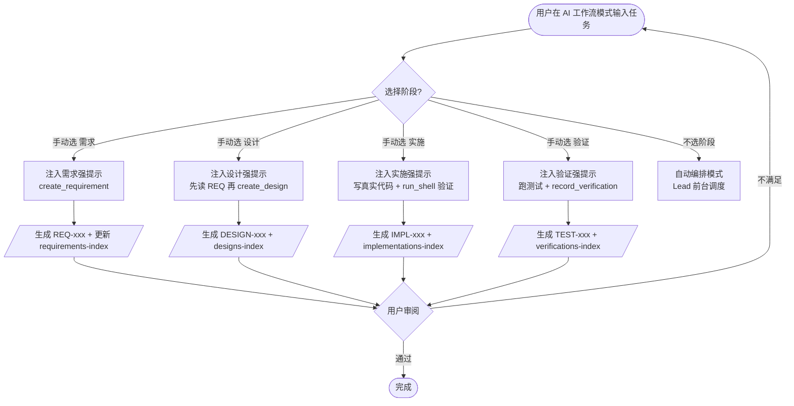
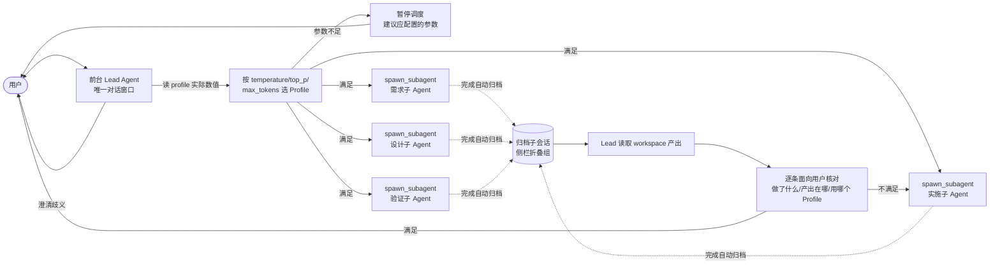
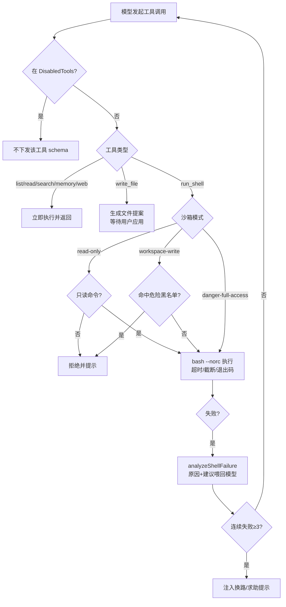

# aide 产品需求文档（PRD）

## 文档信息

| 项 | 内容 |
| --- | --- |
| 文档版本 | v3.2（对照 0.1.10.2 RC1 工作树校正已落地状态） |
| 日期 | 2026-09-25 |
| 状态 | 草稿（Draft） |
| 对应代码基线 | `internal/server` 当前工作树（workflow.go / server.go / context.go / persona.go / voice_agent.go / config_backup.go / command.go），版本 0.1.10.2 RC1（分支 feature/permission-panel） |
| 前序基线 | v3.1（2026-09-25 全貌重编）；v3.0（2026-09-24 全貌重编）；v2.1（2026-09-23，FR-01~100 状态表，见[附录 A](#附录-a历史-fr-基线-fr-01100)） |
| 适用范围 | 反映 aide 当前已实现全貌 + 本次会话规划方向；不包含未授权的发布/推送动作 |

> 状态口径：**已实现**＝代码真实存在并随服务编译；**部分实现**＝主干在、边界待补；**开发中**＝本次会话需求、后端/前端已动工但未闭环；**待开始**＝已规划未动工；**待验证**＝代码在但缺 E2E/浏览器实测。本文件不把"计划执行"写成"已通过"。

---

## 1. 产品概述与目标

### 1.1 定位

aide = **AI + IDE**，面向**可信单用户**的本地 AI 开发工作台。它把项目文件、AI 对话、修改提案、工具调用、运行轨迹与命令执行放进同一个浏览器工作空间，让用户围绕真实项目"理解资料 → 分析问题 → 完成任务 → 审阅应用"，把注意力留给判断与成果本身。

- 形态：Go 单服务（`go:embed` 前端）+ Docker 工具环境（Go / Python / Node.js / Git）+ 浏览器 UI。
- 模型：兼容 OpenAI Chat Completions 协议（默认指向 DeepSeek），可接本机模型服务。
- 边界：本机单用户、回环绑定、不做公网多用户托管；AI 写文件/危险命令先提案或被沙箱拦截，由用户决定。

### 1.2 目标

1. **过程可检查**：规划、工具调用、文件 diff、命令结果、token 消耗全程留痕，可导出、可回放。
2. **可信可控**：写入走人工审批、命令走沙箱分级、密钥不回传前端、性格内容加密存储。
3. **文档驱动的工程闭环**：需求 → 设计 → 实施 → 验证四阶段自动建档（REQ/DESIGN/IMPL/TEST），编号与索引自动维护。
4. **可编排**：从单会话对话，到多智能体（Lead + 专业子 Agent）按参数自动路由分工。
5. **可迁移**：源码、镜像、数据卷分别管理，支持本地目录与 SSH/SFTP 远程工作区。

### 1.3 设计原则

- P1 不伪造能力或测试结果；验证报告必须基于真实运行。
- P2 模型写文件先提案、用户明确应用；`run_shell` 在沙箱内实执行并受分级拦截。
- P3 附件、工具结果、历史回答是资料，不能成为用户授权。
- P4 本机单用户，不提供公网多用户托管。

---

## 2. 术语与编号规范

### 2.1 角色与会话

| 术语 | 含义 |
| --- | --- |
| 主会话 | 用户直接对话的顶层会话（无 `parentId`） |
| 子会话 | `spawn_subagent` 派生的子任务会话，带 `parentId`，完成后自动归档 |
| Lead | 自动编排模式下前台调度的主 Agent，唯一与用户对话、负责分工与最终核对 |
| Run | 一次模型任务调用（一个会话可多轮 Run） |
| 提案 | `write_file` 生成的待用户批准的文件修改（含 baseHash/diff），批准前不落盘 |

### 2.2 文档驱动编号（system-docs）

工作流四阶段产出落盘到**缓存容器** `system-docs/`，编号由工具扫描目录自动分配、索引自动重写：

| 编号 | 目录 | 索引文件 | 由工具生成 | 章节约定 |
| --- | --- | --- | --- | --- |
| `REQ-xxx` | `system-docs/requirements/` | `requirements-index.md` | `create_requirement` | ## 需求描述 / ## 目标 / ## 范围 / ## 验收标准 / ## 技术考量 |
| `DESIGN-xxx` | `system-docs/designs/` | `designs-index.md` | `create_design` | ## 开发流程 / ## 依赖条件 / ## 架构需求 / ## 待确认项 / ## 变更记录 |
| `IMPL-xxx` | `system-docs/implementations/` | `implementations-index.md` | `record_implementation` | 实现内容 / 修改文件 / 基于真实运行的验证结果 |
| `TEST-xxx` | `system-docs/verifications/` | `verifications-index.md` | `record_verification` | 环境 / 用例 / 真实运行结果 / 结论 |

- 编号为三位递增（`REQ-001` 起），扫描已有 `REQ-NNN-*.md` 取 max+1，文件名由标题清洗（保留中文/字母/数字/连字符，截断 40 字符）。
- `read_memory/write_memory` 持久记忆文件位于缓存根 `memory.md`（非 system-docs）。

### 2.3 工作模式

| 模式 | 说明 |
| --- | --- |
| 对话（chat） | 直接问答，可用工具查看工作区 |
| AI 工作流（workflow） | 计划 → 提案 → 审查；可手动选四阶段之一，或不选进入**自动编排** |

---

## 3. 功能需求

> 编号按模块：`SM` 会话 / `WF` 工作区文件 / `TL` 工具 / `MD` 模型策略 / `AU` 权限沙箱 / `MM` 记忆性格反馈 / `AG` 多 Agent / `FL` 工作流四阶段 / `TR` 轨迹与统计 / `DP` 部署 / `PL` 插件 / `UI` 外观交互。

### M1 会话管理（SM）

| 编号 | 功能点 | 业务规则 | 验收标准 | 优先级 | 状态 |
| --- | --- | --- | --- | --- | --- |
| SM-01 | 新建/列表/加载会话 | 侧栏会话列表；`⌘N` 或「＋新建会话」；会话持久化到 `/data` | 新建后可在列表选中并继续对话，重启后仍在 | P0 | 已实现 |
| SM-02 | 会话置顶/归档/删除/导出 | `PATCH /sessions/{id}` 改 pinned/archived；`DELETE`；`GET /api/export` 导出全部（含归档，不含令牌/Key） | 归档项默认从列表隐藏；导出 JSON 可下载且不含凭据 | P0 | 已实现 |
| SM-03 | 会话状态灯 | 运行绿闪 / 审批黄(awaiting_approval) / 失败红 / 完成蓝点加粗 | 各状态颜色与加粗正确，随 Run 终态更新 | P1 | 已实现 |
| SM-04 | 标题自动概括 | `summarizeTopic` 并发执行、独立 ctx 不随 Run 取消；失败不阻断、保留旧标题 | 首 token 不被标题总结阻塞；短任务也能出标题 | P1 | 已实现 |
| SM-05 | 归档后自动回新会话 | 归档当前查看会话后回到新建输入页；取消归档不打断视图 | 归档后输入框聚焦、可直接发新任务 | P2 | 已实现 |
| SM-06 | 运行中标题自动刷新 | 前端轮询 + `scheduleTitleSync`，Run 结束后列表标题更新 | 完成后侧栏标题不残留旧占位 | P2 | 已实现 |
| SM-07 | 全局搜索（⌘K） | `GET /api/search`，**包含归档会话**，结果中标注「已归档」标签 | 输入关键词能命中归档会话并带标签 | P1 | 已实现 |
| SM-08 | 排队/插话模式 | 运行中可继续发送；`queued=true` 进 FIFO 队列、`queued=false` 插话（通道容量 4，满则 429 不留脏消息）；**默认排队模式**；队列项可改/删/升级插话 | 运行中输入默认入队；点「排队」切换；满 4 时收到 429 | P0 | 已实现 |
| SM-09 | 插话上下文包装 | 运行中插话/排队消息经 `wrapSteer()` 包装，告知模型是"回答中补充"而非新话题 | 模型能接住上文，不把插话当新任务 | P1 | 已实现 |
| SM-10 | 发送/停止同键 + 一键回底 | 空闲 `↑` 发送、运行中原位切 `■` 停止；sticky 回底按钮滚离一屏出现 | 运行中按钮变停止；点回底平滑到底部 | P2 | 已实现 |
| SM-11 | 历史压缩 | 自动（历史 >48,000 UTF-8 字节触发摘要）+ 手动「压缩历史」按钮；记录压缩条数 | 压缩后可继续对话；压缩是摘要非 ZIP | P1 | 已实现 |
| SM-12 | 取消任务 | `POST /api/sessions/{id}/runs/{run}/cancel`（cancelTask）立即中断流；提前停止保留已产生的流式输出；EventSource 断开轮询降级 | 取消后 Run 转终态、不再消耗；界面保留已有输出 | P0 | 已实现 |
| SM-13 | 配置备份导出/导入 | `POST /api/config/export` 导出设置快照（信封 `aide-config-backup`，可选含 API Key/来源与工作区密钥/小秘历史）；`POST /api/config/import` 回灌；敏感字段按导入开关取舍 | 导出文件可下载；导入后设置/来源/语音历史按快照恢复，密钥可选不带 | P1 | 已实现 |

**用户故事**：作为开发者，我希望运行一个任务时仍能补充信息（默认排队），并在侧栏一眼看到哪些会话在跑、哪些已完成，归档后清爽回到新会话。

---

### M2 工作区与文件（WF）

| 编号 | 功能点 | 业务规则 | 验收标准 | 优先级 | 状态 |
| --- | --- | --- | --- | --- | --- |
| WF-01 | 工作区配置 | 本地绝对路径 或 SSH·SFTP（主机/端口/用户/远程目录，密码/密钥/无认证）；最近使用一键挂载；缓存路径；自动系统文档路径 | 切换本地/SSH 后文件面板根随之变化；保存后生效 | P0 | 已实现 |
| WF-02 | 双根目录 | `/workspace` 可读写、`/context` 只读、`/local` 宿主浏览范围（`AIDE_LOCAL_ROOT`） | 只读根不可写；越界路径被拒 | P0 | 已实现 |
| WF-03 | 文件浏览/导航 | `GET /api/files` 列目录（单次 2000 项）；↑上级；面包屑路径 | 进入子目录、返回上级正确 | P1 | 已实现 |
| WF-04 | 新建/编辑/保存文件 | 相对路径新建；编辑器 编辑/预览切换；`PUT /api/file`；保存带哈希冲突校验（逐文件原子写） | 修改后本地挂载目录实时可见；冲突时提示 | P0 | 已实现 |
| WF-05 | 文件新标签页视图 | `/file-view` 单页，编辑/预览/保存 | 新标签可独立打开文件并保存 | P2 | 已实现 |
| WF-06 | 附加到任务 | 附件快照最多 8 个、拼装文本 ≤80KB；已有文件须先附加再生成修改 | 超 8 个或超 80KB 被拒；未附加文件不可改 | P0 | 已实现 |
| WF-07 | Markdown 渲染 | 本地 marked（GFM + JS 高亮 + DOM 消毒，剥离 script/iframe 等危险标签） | md 文件预览正确、不执行脚本 | P1 | 已实现 |
| WF-08 | mermaid 流程图渲染 | 把 ```mermaid 代码块替换为 `<div class="mermaid">`，vendor mermaid@10 渲染 SVG | md 中的流程图显示为图形 | P2 | 已实现 |
| WF-09 | md 相对路径链接内部打开 | 事件委托拦截 `.md` 相对链接，在 aide 编辑器内打开（非 404） | 点 md 内相对链接打开对应文件 | P2 | 已实现 |
| WF-10 | Office 文件解析 | `read_file` 对 `.docx/.xlsx/.pptx` 用 python 开源库（python-docx/openpyxl/python-pptx）解析成文本 | AI 能读到 Office 文档正文 | P1 | 已实现 |
| WF-11 | 辅助资料 sources | 本地/Skill/链接/MCP(仅登记)/SFTP/FTP/FTPS/SMB；`list_sources` 工具枚举；登记存缓存 `sources.json`，密码存卷不回传 | 可登记多来源并被 AI 只读引用；MCP 仅登记不调用 | P1 | 已实现 |
| WF-12 | 文本读取限制 | 单文件 256KiB、UTF-8、无 NUL；AI `read_file` 返回截断到 60KiB | 超限被拒/截断 | P1 | 已实现 |
| WF-13 | md 相对路径图片加载 | 渲染时把相对 `` 改写为 aide 文件原始字节接口 `/api/file/raw`（带 access_token 查询参数），正确解析相对当前文档目录的 `../`；支持 png/jpg/jpeg/gif/svg/webp；**模态预览 / 新标签页视图 / 会话消息三处都生效**；外部 http(s) 图片不受影响；加载失败时 `opacity:0.4` 静默降级、不显示破图问号 | 仓库文档里相对图片（如 `docs/images/*.jpg`）正常显示；外链图片原样加载；失败静默不渲染破图 | P1 | 已实现 |

---

### M3 内置工具体系（TL）

工具清单来自 `workflow.go` `builtinTools`，由 `contextTools()` 按 `DisabledTools` 过滤后连同插件工具下发给模型。

| 编号 | 工具名 | 用途 | 关键参数 | 执行方式 | 状态 |
| --- | --- | --- | --- | --- | --- |
| TL-01 | `list_sources` | 列出已启用辅助资料来源 ID 与能力（不含凭据） | 无 | 立即执行 | 已实现 |
| TL-02 | `list_files` | 列工作目录或来源内目录 | `source?`、`path?`（默认 `.`，截断 100 项/4KB） | 立即执行 | 已实现 |
| TL-03 | `read_file` | 读文本文件（Office 自动转文本） | `source?`、`path`（必填） | 立即执行 | 已实现 |
| TL-04 | `write_file` | 生成文件修改提案（**不直接写**） | `path`、`content` | 提案→人工应用 | 已实现 |
| TL-05 | `run_shell` | 沙箱内实执行命令并回传 stdout/stderr/退出码 | `command`（必填） | 立即执行（受沙箱分级） | 已实现 |
| TL-06 | `spawn_subagent` | 派生独立子会话处理子任务，完成自动归档 | `task`（必填）、`profile?` | 创建子会话异步跑 | 已实现 |
| TL-07 | `read_memory` | 读持久记忆文件 | 无 | 立即执行 | 已实现 |
| TL-08 | `write_memory` | 追加写持久记忆（`- ` 列表项） | `content` | 立即执行 | 已实现 |
| TL-09 | `search_text` | 工作区关键字/正则搜索 | `query`、`path?` | 立即执行 | 已实现 |
| TL-10 | `semantic_search` | **离线 TF-IDF 余弦相似度**语义检索（非向量 embedding） | `query` | 立即执行 | 已实现 |
| TL-11 | `create_diagram` | 生成 draw.io `.drawio` XML 文件 | `path`、`xml` | 写文件（落盘） | 已实现 |
| TL-12 | `web_search` | 在线搜索（DuckDuckGo HTML 爬取，限流 fallback SearXNG 公共实例） | `query` | 立即执行 | 已实现 |
| TL-13 | `create_requirement` | 需求阶段建档，分配 REQ-xxx 并更新索引 | `title`、`content`、`related?` | 写 system-docs | 已实现 |
| TL-14 | `create_design` | 设计阶段建档，分配 DESIGN-xxx | `title`、`content`、`reqId?`、`related?` | 写 system-docs | 已实现 |
| TL-15 | `record_implementation` | 实施阶段记录，分配 IMPL-xxx | `title`、`content`、`reqId?`、`designId?` | 写 system-docs | 已实现 |
| TL-16 | `record_verification` | 验证阶段记录，分配 TEST-xxx | `title`、`content`、`reqId?`、`designId?`、`implId?` | 写 system-docs | 已实现 |
| TL-17 | 插件工具 | 未匹配内置名时按插件归属路由，结果可转提案 | 插件自定义 | 插件宿主执行 | 已实现 |
| TL-18 | `ask_user` | 在需求/设计/参数不清时向用户提**一个**澄清问题并暂停等答（single/multi/input/confirm），不自行臆断 | `question`（必填）、`type`（必填）、`options?`、`progressCurrent?/progressTotal?` | 暂停等用户回答 | 已实现 |

**draw.io 前端联动**（TL-11）：`.drawio` 文件在编辑器模态、文件视图、会话消息中用 `embed.diagrams.net` iframe 渲染并撑满区域。最新要求：

- **握手修正**：等 draw.io iframe `postMessage {event:'init'}` 后再发 `{action:'load', xml}`，而非 `onload` 直接发（避免首图丢失）。
- **完整可编辑**：支持手动拖形状/连线手画；可新建空白 `.drawio` 从零画，不依赖 AI 先生成 XML。
- **保存回写**：监听 `{event:'save'}`（含 `{action:'export', format:'xmlsvg'}`）把最新 XML 写回原文件；支持 `.drawio.svg` / `.drawio.png` 文件关联。
- **失败提示**：embed 网络加载失败时给出明确提示，不白屏卡死。

---

### M4 模型与策略配置（MD）

| 编号 | 功能点 | 业务规则 | 验收标准 | 优先级 | 状态 |
| --- | --- | --- | --- | --- | --- |
| MD-01 | 多模型管理 | `Models[]`（id/name/contextWindow），最多 20；id 唯一、name ≤32 字符；窗口 1024–1,048,576 | 增删模型即时生效；超限被拒 | P0 | 已实现 |
| MD-02 | API 连接配置 | Base URL（默认 `https://api.deepseek.com`）、API Key；**密钥不回传前端**，可一键清除；可接本机 `host.docker.internal:11434` | 保存后无 Key 回显；清空保留已有 | P0 | 已实现 |
| MD-03 | 自动获取模型 | 调 `{BaseURL}/models` 拉取模型名填充 | 网络可达时列出可用模型 | P2 | 已实现 |
| MD-04 | 上下文窗口预设 | 32K/64K/128K/200K/256K/1M 一键选 + 自定义输入；缺省 65536 | 选预设后窗口值正确 | P1 | 已实现 |
| MD-05 | 参数 Profile | `temperature/top_p/max_tokens` 配置为命名 Profile；策略弹层选择 | 选 Profile 后本次任务按其采样参数 | P1 | 已实现 |
| MD-06 | 手动/自动策略 | `manual` 用所选 Profile；`auto` 按任务匹配 Profile | 自动路由不硬凑、配置不足时暂停建议 | P1 | 部分实现 |
| MD-07 | 余额查询 | `GET /api/balance` | 已配置时显示余额 chip | P3 | 已实现 |
| MD-08 | 推理强度选择栏 | 策略浮层五档：`auto`（不传）/`off`（`thinking.type=disabled`）/`low`/`medium`/`high`（`thinking.type=enabled` + `reasoning_effort=<档>`）；选档后**真实转成请求参数**下发（provider.go 注入 body），不是摆设；设置持久化；自动路由时 Lead 可按任务复杂度选档 | 选档后请求体带对应 thinking/reasoning_effort 字段；刷新后保留；自动模式 Lead 能选档 | P1 | 已实现 |

---

### M5 权限、沙箱与安全（AU）

| 编号 | 功能点 | 业务规则 | 验收标准 | 优先级 | 状态 |
| --- | --- | --- | --- | --- | --- |
| AU-01 | 三级沙箱模式 | `read-only`（只允许 ls/cat/grep/git status 等只读命令）/ `workspace-write`（默认，危险命令被拦）/ `danger-full-access`（不拦）；设置→权限管理切换 | 切到 read-only 时写命令被拒并提示 | P0 | 已实现 |
| AU-02 | per-tool 权限开关 | `DisabledTools[]` 持久化到 `settings.json`；`contextTools()` 按其过滤工具 schema | 禁用某工具后模型不再看到/调用它；刷新后仍禁用 | P0 | 已实现 |
| AU-03 | run_shell 危险拦截 | `shellBlocked()` 黑名单：递归删除/提权/推送远端/pipe-to-shell 等，命中即拒 | `rm -rf /`、`sudo`、curl|sh 等被拦 | P0 | 已实现 |
| AU-04 | 命令超时/并发/截断 | ShellTimeout 默认 60s、最大 300s（设置可配）；并发最多 4；stdout/stderr 各截断 64KB | 超时被杀；并发超限 429 | P1 | 已实现 |
| AU-05 | 路径与越界约束 | `safePath` + 工作目录锁定 workspace；`bash --norc` 隔离环境；远程 SSH 模式 run_shell 不自动执行 | 越界/符号链接逃逸被拒；SSH 下提示手动运行 | P0 | 已实现 |
| AU-06 | 失败反馈循环 | 命令失败经 `analyzeShellFailure` 翻译成「原因+建议」喂回模型；同一工具连续失败 **≥3 次**注入止损提示；API 抖动自动重试一次 | 失败时模型拿到可读原因；连错 3 次收到换路提示 | P1 | 已实现 |
| AU-07 | 提前停止保留输出 | 轮次超限/提前停止时保留已产生的流式输出，不再显示"未返回任何内容" | 超限时界面保留已有内容 | P1 | 已实现 |
| AU-08 | 工具轮次上限 | 默认 60 轮（`ToolMaxRounds`，≤0 取 60），设置→权限管理可配 5–200 | 改配置后生效；到达上限停止 | P1 | 已实现 |
| AU-09 | 账户与空闲锁屏 | `lockTimeoutSec` 空闲锁屏秒数（0=不锁屏）；`userName` 欢迎语、`userPasswordHash` 存密码 **SHA-256**（不明文）；`POST /api/account/verify-password` 校验；账户密码同时作为小秘语音历史的加密口令 | 设密码并超时后需解锁；密码错误拒绝；小秘历史可加解密 | P1 | 已实现 |

---

### M6 记忆 / 性格 / 反馈（MM）

| 编号 | 功能点 | 业务规则 | 验收标准 | 优先级 | 状态 |
| --- | --- | --- | --- | --- | --- |
| MM-01 | 持久记忆 | 记忆文件 `缓存/memory.md`；`read_memory/write_memory`；每次会话构建上下文时自动注入系统提示 | 写记忆后下一轮模型可见；无记忆时给空提示 | P1 | 已实现 |
| MM-02 | 反馈写入记忆 | 消息下 👍/👎 反馈经 `POST /api/feedback` 记录并写入记忆，用于重训练 | 点好/坏后 feedback 落库并追加记忆 | P2 | 已实现 |
| MM-03 | 性格系统 | AES-256-GCM 加密存储：密钥由 `sha256(password)` 派生，nonce+密文 base64；设置里开关/解锁/编辑/重置；**密钥用户自持**，服务端不回传明文 | 未解锁时不注入；密码错误拒绝解锁/重置 | P1 | 已实现 |
| MM-04 | 性格注入 | 开启且已解锁时，解密后注入系统提示「## 你的性格」 | 性格内容影响模型口吻 | P1 | 已实现 |
| MM-05 | 插件感知训练 | 性格/记忆结合已启用插件能力做感知与个性化 | — | P3 | 待开始 |

---

### M7 多 Agent 与子会话（AG）

| 编号 | 功能点 | 业务规则 | 验收标准 | 优先级 | 状态 |
| --- | --- | --- | --- | --- | --- |
| AG-01 | spawn_subagent 派生 | 创建带 `parentId` 的子会话，Mode=chat，继承父任务工作区身份/模式/远程路径；按所选 Profile 解析采样参数 | 返回子会话 ID 与标题；子会话独立跑 | P1 | 已实现 |
| AG-02 | 子会话自动归档 | 子会话完成后 `autoArchived=true` 自动归档 | 子任务结束后不占活动列表 | P2 | 已实现 |
| AG-03 | 子会话层级列表 | 主会话下缩进 `↳` 显示子会话；运行中绿灯、完成归档灰标签；已归档子会话折叠组（默认展开最近 3 个）；孤儿子会话顶层兜底 | 层级/折叠/灯态正确 | P1 | 已实现 |
| AG-04 | 自动模式多智能体编排 | 工作流下不选阶段时注入 `autoModePrompt`：Lead 前台澄清需求 → 按实际数值选 Profile → 多次 `spawn_subagent` 分工（需求/设计/实施/验证）→ 读产出逐条面向用户核对闭环 | Lead 真正多次召唤子 Agent 并核对；不满足的补做 | P0 | 已实现 |
| AG-05 | 自动路由按数值匹配 | `profileInventoryPrompt()` 列出各 Profile 真实 temperature/top_p/max_tokens；严谨环节选低温；配置不足**暂停**并建议具体参数，不硬选 | Lead 传 profile id；缺参数时停下询问 | P1 | 已实现 |

---

### M8 AI 工作流四阶段（FL）

| 编号 | 功能点 | 业务规则 | 验收标准 | 优先级 | 状态 |
| --- | --- | --- | --- | --- | --- |
| FL-01 | 四阶段按钮 UI | 输入框上方：📝需求(蓝)/⚙️实施(橙)/📐设计(紫)/✅验证(绿)；弹入动画 stagger 70ms；**对话模式隐藏** | 切到工作流才显示按钮；依次错峰弹入 | P1 | 已实现 |
| FL-02 | 需求阶段 | 注入 `requirementPhasePrompt`，强约束必须调 `create_requirement` 建档（不可直接回答不建档） | 产出 REQ-xxx 文档 + 索引更新 | P0 | 已实现 |
| FL-03 | 设计阶段 | 注入 `designPhasePrompt`，先读相关 REQ，用 `create_design` 建档，主动澄清、复杂结构画 draw.io | 产出 DESIGN-xxx，关联 REQ | P0 | 已实现 |
| FL-04 | 实施阶段 | 注入 `implementationPhasePrompt`，在 `/workspace` 写**真实代码**（非贴回复），自动处理依赖，用 `run_shell` 编译测试验证，`record_implementation` 记录 | 代码落盘且有真实运行验证 | P0 | 已实现 |
| FL-05 | 验证阶段 | 注入 `verifyPhasePrompt`，依据 REQ/DESIGN/IMPL 写测试用例、真实执行、量化报告，`record_verification` 记录 | TEST-xxx 报告基于真实运行，禁止把计划写成通过 | P0 | 已实现 |
| FL-06 | 索引自动维护 | 每次建档后重写对应 `*-index.md`（编号/名称/状态/创建时间/关联） | 索引与目录文件一致 | P1 | 已实现 |

---

### M9 轨迹、上下文预览与 Token 统计（TR）

| 编号 | 功能点 | 业务规则 | 验收标准 | 优先级 | 状态 |
| --- | --- | --- | --- | --- | --- |
| TR-01 | 轨迹面板 | 本会话全部任务事件时间线（step/delta/tool/status/done）+ 每任务真实 token 用量 | 打开轨迹看到完整调用时间线 | P1 | 已实现 |
| TR-02 | 会话导出 | 轨迹面板 ⬇ 一键导出当前会话为 Markdown（含工具调用与时间线）；设置里「全部导出」JSON | 导出文件含时间线与工具记录 | P2 | 已实现 |
| TR-03 | 调用情况分析 | 主/子 Agent 调用表格，支持按工具类型 / 谁(agent) / 时间过滤，统计摘要 | 过滤后表格与摘要正确 | P2 | 已实现 |
| TR-04 | 上下文消耗可视化 | 上下文预览堆叠条形图：系统/摘要/历史/附件/指令/工具 schema 分色标注 token；hover 高亮 + 浮动 tooltip；图例可点击切换显隐 | 不同来源不同色；hover 出数值 | P1 | 已实现 |
| TR-05 | 上下文预算预览(R08-04) | `/api/context-preview` 与真实首轮共用构建器；4 字符≈1 token 估算；超限在发送前**可解释拦截**（Provider 收不到该调用）；输出 max_tokens 预留 | 超限给出估算明细并拒绝；预览与真实请求字节一致 | P1 | 已实现 |
| TR-06 | 请求快照证据链 | `RequestSnapshot`（首轮+工具续跑，含 messages/tools/body/SHA256/时间）；`GET .../requests` 取回 | 快照可溯源、指纹可校验 | P2 | 已实现 |
| TR-07 | Token 费用统计 | GitHub 提交图风格热力图；计价可配（输入/输出每百万）；单日明细+周合计；按模型费率快照 | 区分已计价/估算/未计价 | P2 | 已实现 |
| TR-08 | SSE 流式输出 | 逐 token 推送（step/delta/tool/status/done）；首 token 前思考点、闪烁光标、工具活动行；EventSource 断开轮询降级 | chat 模式实时逐字可见 | P0 | 已实现 |
| TR-09 | SSE 顺滑性排查优化 | 排查卡顿/成块/断流：后端 flush 是否及时、中间代理缓冲、前端批量渲染节奏三端联动；保证 token 顺滑吐出、不攒成大块 | 长回答逐字顺滑、不卡顿、不中途断流 | P2 | 待排查优化 |
| TR-10 | 思考过程折叠 | `reasoning_content`/思考过程**默认折叠**成 `<details>`「思考过程」条，可展开窥测；思考进行中显示"思考中…"状态；结束后可收起 | 思考内容默认不占屏、可点开看；状态正确 | P2 | 已实现 |

---

### M10 部署与运行环境（DP）

| 编号 | 功能点 | 业务规则 | 验收标准 | 优先级 | 状态 |
| --- | --- | --- | --- | --- | --- |
| DP-01 | 一键启动 | `start.command` → `scripts/aide.sh` → Docker Compose；`.env` 的 `AIDE_PORT`/`COMPOSE_FILE` 为唯一配置源；默认 `127.0.0.1:8097` | 启动后浏览器打开并令牌登录 | P0 | 已实现 |
| DP-02 | Docker 工具环境 | 容器内 Go/Python/Node.js/Git；前端 `go:embed`，无 npm 构建步骤 | 容器内 `go run`、python 库可用 | P0 | 已实现 |
| DP-03 | 数据卷分离 | `/workspace` RW、`/context` RO、`/local` 宿主范围、`/data`（会话/配置/令牌/费率）、`/home/aide` 缓存 | 数据卷独立备份 | P1 | 已实现 |
| DP-04 | 镜像导入导出 | `scripts/aide.sh export` 导出镜像；`docker-images/` 归档 + SHA256；版本号来自 ldflags | 异机可导入启动 | P1 | 已实现 |
| DP-05 | 健康检查 | `GET /healthz` | 健康检查返回正常 | P1 | 已实现 |
| DP-06 | 本地令牌登录 | 首次粘贴 `/data/auth/access-token`；401 弹登录框 | 未带令牌访问被引导登录 | P1 | 已实现 |

---

### M11 插件系统（PL）

| 编号 | 功能点 | 业务规则 | 验收标准 | 优先级 | 状态 |
| --- | --- | --- | --- | --- | --- |
| PL-01 | 插件协议 v1.1 | DSH/Cordis 形态：默认导出含 `apply(ctx)` 的对象；`.js/.mjs/.cjs` 上传即校验启用 | 合规插件加载并注册工具 | P2 | 已实现 |
| PL-02 | 插件面板 | 上传/搜索/启用停用/删除；`/api/plugin-surface` 展示已启用能力声明 | 启停即时反映到工具集 | P2 | 已实现 |
| PL-03 | 插件工具进循环 | 插件声明的可执行工具进入工具循环，结果可转提案 | 插件工具可被模型调用 | P2 | 已实现 |
| PL-04 | 默认预装 DSH 插件集 | 仓库预置 8 个能力预设插件 | 开箱可见预设插件 | P3 | 已实现 |

---

### M12 外观、国际化与交互（UI）

| 编号 | 功能点 | 业务规则 | 验收标准 | 优先级 | 状态 |
| --- | --- | --- | --- | --- | --- |
| UI-01 | 主题外观 | 专业(蓝)/经典(绿)两排 × 浅色/深色/跟随系统；偏好存当前浏览器 | 切换即时生效、刷新保持 | P2 | 已实现 |
| UI-02 | 中英国际化 | 界面文案 zh-CN/en 切换（含新标签页按钮、语言选择器）；不翻译用户输入/文件/模型回复 | 切语言后界面文案切换 | P2 | 已实现 |
| UI-03 | 模态遮罩关闭 | 点击 dialog/弹层遮罩空白处关闭（事件委托覆盖静态+动态弹层） | 点遮罩不触发内部操作即关闭 | P2 | 已实现 |
| UI-04 | 消息操作条 | 每条 AI 回复下：📋复制 / 🔄重试 / ⏵继续 / 👍好的回答 / 👎有问题（统一样式纯按钮）；重试走 `POST /api/sessions/{id}/runs/{run}/retry`（运行中返回 409） | 复制进剪贴板；好/坏上报 feedback；重试基于原 prompt 重跑 | P2 | 已实现 |
| UI-05 | 三栏桌面布局 | 会话侧栏 / 对话 / 文件面板；窄屏与 1280×720 适配；回底、队列条、上下文卡 | 窄屏可用、无横向溢出 | P2 | 已实现 |
| UI-06 | 设置面板 | JSON 驱动侧边导航：消耗统计/外观/语言/模型参数/归档/权限管理/关于 | 各设置项渲染正确、可保存 | P1 | 已实现 |
| UI-07 | 策略浮层文字换行修复 | 策略浮层里「自动路由」等长文案在窄宽下正确换行，不溢出/不截断 | 浮层内长描述自然折行、不溢出边界 | P3 | 已修复 |

---

### M13 语音小秘（VO）

> 小秘不是简单的语音转输入框，而是一个**常驻、会听会判断的语音 Agent**：它监听环境音、自己分析该不该发、发什么，必要时还能调用/委派其他 Agent。

| 编号 | 功能点 | 业务规则 | 验收标准 | 优先级 | 状态 |
| --- | --- | --- | --- | --- | --- |
| VO-01 | 麦克风听写入口 | 麦克风按钮用浏览器 Web Speech API（`webkitSpeechRecognition`）做前端实时转写，弹出框显示转写文本 | 点麦克风开始听写，弹出框实时显示转写文本 | P1 | 已实现 |
| VO-02 | 小秘作为独立 Agent | 小秘有自己的 system prompt、独立记忆（`VoiceMemory`）与上下文；不直接持工具，而是经 `POST /api/voice-filter` 由后端 AI 研判后决定是否委派/发送 | 小秘能基于听到的内容做判断，而非机械转写 | P1 | 已实现 |
| VO-03 | 动态断句与直接发送 | `voiceFilter` 按语义边界判定，`action=send` 的句子直接由前端发到当前会话（不是填输入框等回车）；模型不可用时降级为 send 原文 | 甄别为指令的话自动作为任务发出，无需手动发送 | P1 | 已实现 |
| VO-04 | 环境声与人声甄别 | 后端输出三态：`send`（对 aide 的指令）/`ignore`（背景声）/`standby`（与人闲聊自动退下不插话）；低置信不贸然发送 | 电视/会议背景音不触发；闲聊时小秘静默 | P1 | 已实现 |
| VO-05 | 语音记录可视化 | `GET /api/voice-history` 返回 `VoiceHistoryEntry` 列表（听到了什么/如何分析/发了哪条/忽略哪条），最多 200 条，可 `DELETE` 清空 | 能回看每段话是被发了还是被忽略 | P2 | 已实现 |
| VO-06 | 小秘设置与历史 | `voiceAssistantName` 可在设置改名；语音历史可加锁：`voice-history/enable·lock·unlock·change-password·disable`，加密信封 AES-256-GCM（口令即账户密码 SHA-256）；`voice-narrate`/`voiceReplyEnabled` 双向朗读 | 改名生效；历史面板完整、可加解密、重启不丢 | P2 | 已实现 |
| VO-07 | 模式兼容 | 发出的语音指令经主会话发送链路，兼容排队/插入模式、对话模式/AI 工作流模式；`accessibilityAutoRead` 输出完成后小秘自动朗读 | 语音发的任务与打字发的走同一条发送链路 | P1 | 已实现 |

---

## 4. 非功能需求

| 类别 | 要求 | 当前实现/边界 |
| --- | --- | --- |
| 安全·加密 | 性格内容 AES-256-GCM 加密，密钥用户自持、服务端不明文回传；API Key 不回传前端 | persona.go；Settings.APIKey `omitempty` |
| 安全·凭据 | 本地令牌单独凭据；不分享带令牌地址；SSH 密码/密钥存数据卷 | login-dialog；sources/workspace |
| 沙箱隔离 | 命令在容器内 `bash --norc` 独立进程组执行；路径锁 workspace；远程模式不自动跑命令 | command.go / workflow.go execShellCommand |
| 危险拦截 | 递归删除/提权/推送/pipe-to-shell 黑名单；read-only 模式只放只读命令 | shellBlocked / readOnlyAllowed |
| 性能 | SSE 逐 token；标题总结并发；上下文预览与真实请求共用构建器避免重复构造 | context.go buildContextPreview |
| 限制 | 单文件 256KiB；附件 8 个/80KB；提案 10 文件/512KiB；工具轮次默认 60(5–200)；命令 60s/并发4/输出 128KB；模型任务 6 分钟/全局 4 并发 | 见 §5 与各 handler |
| 兼容性 | 前端原生 JS/CSS，无 npm；marked/mermaid 随仓库分发；兼容 Chat Completions 协议 | README / index.html |
| 隐私 | 本机单用户、回环绑定；云端模型时任务内容发往所配置提供商 | README 使用边界 |

---

## 5. 关键流程

### 5.1 AI 工作流四阶段流转



### 5.2 自动模式多智能体编排



### 5.3 工具调用与沙箱分级



---

## 6. 需求追踪 / 索引表

### 6.1 模块与状态汇总

| 模块 | 编号区间 | 功能点数 | 已实现 | 开发中 | 待开始/待验证 |
| --- | --- | --- | --- | --- | --- |
| M1 会话管理 | SM-01~13 | 13 | 13 | 0 | 0 |
| M2 工作区与文件 | WF-01~13 | 13 | 13 | 0 | 0 |
| M3 内置工具 | TL-01~18 | 18 | 18 | 0 | 0 |
| M4 模型与策略 | MD-01~08 | 8 | 8 | 0 | 0 |
| M5 权限与沙箱 | AU-01~09 | 9 | 9 | 0 | 0 |
| M6 记忆/性格/反馈 | MM-01~05 | 5 | 4 | 0 | 1（MM-05） |
| M7 多 Agent | AG-01~05 | 5 | 5 | 0 | 0 |
| M8 工作流四阶段 | FL-01~06 | 6 | 6 | 0 | 0 |
| M9 轨迹与统计 | TR-01~10 | 10 | 9 | 0 | 1（TR-09 顺滑排查） |
| M10 部署环境 | DP-01~06 | 6 | 6 | 0 | 0 |
| M11 插件 | PL-01~04 | 4 | 4 | 0 | 0 |
| M12 外观交互 | UI-01~07 | 7 | 7 | 0 | 0 |
| M13 语音小秘 | VO-01~07 | 7 | 7 | 0 | 0 |
| **合计** | — | **111** | **109** | **0** | **2** |

### 6.2 本次会话新增/规划项追踪

| 需求 | 落点编号 | 状态 |
| --- | --- | --- |
| 归档后自动回新会话 | SM-05 | 已实现 |
| 默认排队模式、插话上下文包装 | SM-08/09 | 已实现 |
| 模态遮罩关闭 | UI-03 | 已实现 |
| per-tool 开关持久化 | AU-02 | 已实现 |
| 性格 AES-256-GCM 加密/开关/重置 | MM-03/04 | 已实现 |
| 记忆系统 + 反馈写入重训练 | MM-01/02 | 已实现 |
| 工具轮次默认 60、可配 5–200 | AU-08 | 已实现 |
| 提前停止保留流式输出 | AU-07 | 已实现 |
| 三级沙箱 + 危险拦截 + 失败反馈 | AU-01/03/06 | 已实现 |
| 全局搜索含归档并标注 | SM-07 | 已实现 |
| 文件搜索双模式（search_text + semantic_search TF-IDF） | TL-09/10 | 已实现 |
| Office 文件解析 | WF-10 | 已实现 |
| web_search（DDG HTML 爬取） | TL-12 | 已实现 |
| md 相对链接内部打开 / mermaid 渲染 | WF-08/09 | 已实现 |
| draw.io 插件（工具 + iframe + postMessage 回写） | TL-11 | 已实现 |
| draw.io 握手修正/手画/保存回写/.svg·.png 关联/网络失败提示 | TL-11（前端联动） | 待补全 |
| md 相对路径图片加载（三处视图生效、失败不显示破图） | WF-13 | 已实现 |
| 消息操作条（复制/重试/继续/好/坏） | UI-04 / MM-02 | 已实现（retry 路由已注册） |
| 四阶段按钮 + 四阶段后端建档 | FL-01~06 | 已实现 |
| 自动模式多智能体编排 + 自动路由（按实际参数核对/不足暂停建议） | AG-04/05 | 已实现 |
| 推理强度选择栏（thinking/reasoning_effort + 自动，真实转 API 参数） | MD-08 | 已实现 |
| SSE 顺滑性排查优化（flush/代理缓冲/前端渲染） | TR-09 | 待排查优化 |
| 思考过程默认折叠可展开 | TR-10 | 已实现 |
| 策略浮层「自动路由」文字换行修复 | UI-07 | 已修复 |
| 语音小秘（听写/真 Agent/直接发送/环境声甄别 send·ignore·standby/历史加密/改名/双向朗读） | VO-01~07 | 已实现 |
| 配置备份导出/导入（POST /api/config/export·import） | SM-13 | 已实现 |
| 账户密码 SHA-256 + 空闲锁屏（lockTimeoutSec / verify-password） | AU-09 | 已实现 |
| E2E 浏览器 UI 验收 | — | 待验证 |
| 容器重建后全流程实测 | — | 待验证 |

---

## 7. 开放问题与待确认项

| 编号 | 问题 | 现状 | 建议 |
| --- | --- | --- | --- |
| OQ-01 | ~~消息「🔄重试」后端 404~~ | **已解决**：`POST /api/sessions/{id}/runs/{run}/retry` 已注册（server.go retryTask，运行中返回 409） | 关闭 |
| OQ-02 | ~~`search_text` required 误写 `"command"`~~ | **已解决**：schema required 已改为 `["query"]`（workflow.go） | 关闭 |
| OQ-03 | `semantic_search` 是离线 TF-IDF 余弦相似度，并非向量 embedding；工具描述仍写 "Semantic vector search"，命名易被误解为真语义检索 | 实现与"语义"字面有差距 | 在 UI/提示中明确标注"本地词频语义、非向量检索"，或后续接 embedding |
| OQ-04 | 远程 SSH/SFTP 工作区下 `run_shell` 不自动执行（提示手动运行） | 已知边界 | 后续打通远程 exec |
| OQ-05 | MCP 来源仅登记、不实际协议调用 | 已登记入口 | 视需要实现 MCP client |
| OQ-06 | ~~推理强度（MD-08）后端无 reasoning 参数透传~~ | **已解决**：provider.go 按 `ReasoningEffort` 注入 `thinking`/`reasoning_effort`（auto 不传、off 禁用、low/medium/high 开启） | 关闭 |
| OQ-07 | 无交互式 PTY，不适合常驻服务/交互编辑器 | 已知边界 | 列入非目标，不本期实现 |
| OQ-08 | 本次多项新功能（语音小秘/自动模式/四阶段/配置备份/锁屏）缺真实浏览器 E2E 与容器重建后全流程实测 | 待验证 | 容器重建后按 §5 流程图跑四阶段+自动模式+语音全链路 |

---

## 附录 A：历史 FR 基线（FR-01~100）

> 以下为 v2.1（2026-09-23）保留的功能登记基线，编号不再复用；与现行说明冲突时以本 v3.1 正文为准。原文快照见 `docs/archive/`。

| 编号 | 功能 | 基线状态 |
| --- | --- | --- |
| FR-01~24 | 会话/持久化/标题/回放预算/中断/双根目录/读写文件/原子写/路径/同步/新建/分页/bash/超时/输出/边界/隔离/PTY/Chat适配/模型配置/密钥/真实模型验收/SSE | 实现存在或历史验收；FR-13 分页、FR-19 PTY 未实现 |
| FR-25~33 | 对话模式/三阶段工作流/提案校验/附件覆盖/未附加不可改/人工应用/逐文件替换/审查自动化/工具闭环 | FR-32 审查自动化未实现，余实现存在 |
| FR-34~48 | 三栏布局/状态轮询/diff 展示/建议命令/附件选择/窄屏/富编辑器/会话管理/一键启动/健康检查/脚本集/镜像导入导出/验收脚本/异机恢复/远程协作 | FR-40 富编辑器未实现；FR-41/47 部分 |
| FR-49~60 | 颜色令牌化/明暗主题/三态切换/偏好持久化/跟随系统/无闪烁/配色目录/视觉质量/品牌入口/设置 JSON/玻璃质感 | 主题与外观已交付，全组件对比度认证未做 |
| FR-61~75 | 模型参数/Profile/聊天策略/auto 路由/版本管理/多模型/模型发现/上下文统计/深度研究入口/插件面板/生命周期/协议输出/预装插件 | 实现存在 |
| FR-76~84 | 工作空间面板/本地与 SSH/远程文件/本地路径修复/文档缓存配置/模型工具闭环/来源注册表/多类型来源/来源浏览 | 实现存在；MCP 仅登记 |
| FR-85~94 | 预留/MD 渲染/策略弹层模型选择/任务主题总结/文件 MD 视图/Token 统计/会话轨迹/全局搜索/会话压缩/上下文预算预览 | FR-85 预留；余实现存在 |
| FR-95~100 | 专业/经典两排外观/设置关于 GitHub 链接/跨客户端 Agent 路由/文档核对首页/专业工作台定位与版本镜像/环境检查首次安装 | 0.1.6.0 RC4 起交付 |

### 变更记录

- 2026-09-25 v3.2：对照 0.1.10.2 RC1 工作树校正已落地状态——语音小秘 VO-01~07 由"待开始"改"已实现"（voice_agent.go + voice-filter/narrate/history 路由 + 前端 Web Speech API）；MD-08 推理强度改"已实现"（provider.go 透传 thinking/reasoning_effort）；AG-04/05 自动模式改"已实现"（autoModePrompt/profileInventoryPrompt 已注入）；TR-10 思考折叠、WF-13 md 相对图片改"已实现"；UI-04 重试改"已实现"（retry 路由已注册）；新增 SM-13 配置备份（config/export·import）、AU-09 账户锁屏（SHA-256 + lockTimeoutSec）、TL-18 ask_user 工具；关闭 OQ-01/02/06。功能点 108 → 111。
- 2026-09-25 v3.1：补充本轮遗漏需求——新增 M13「语音小秘」模块（VO-01~07，真 Agent 式语音听写、直接发送、环境声甄别、历史与改名）；补 WF-13（md 相对路径图片加载，三处视图生效、失败不破图）；补全 draw.io 前端联动（init 握手、手画、save 回写、.svg/.png 关联、网络失败提示）；新增 TR-09 SSE 顺滑排查、TR-10 思考过程折叠；明确 MD-08 推理强度映射 `thinking`/`reasoning_effort` 真实参数；补 UI-07 策略浮层文字换行。功能点总数 97 → 108。
- 2026-09-24 v3.0：按代码与文档全量反推重编为产品全貌 PRD；新增 M1–M12 共 97 个功能点，含四阶段工作流、多 Agent、沙箱分级、记忆/性格加密、轨迹可视化、draw.io、Office 解析、双模式搜索等；保留 v2.1 FR-01~100 作附录；登记 OQ-01~08 开放问题。
