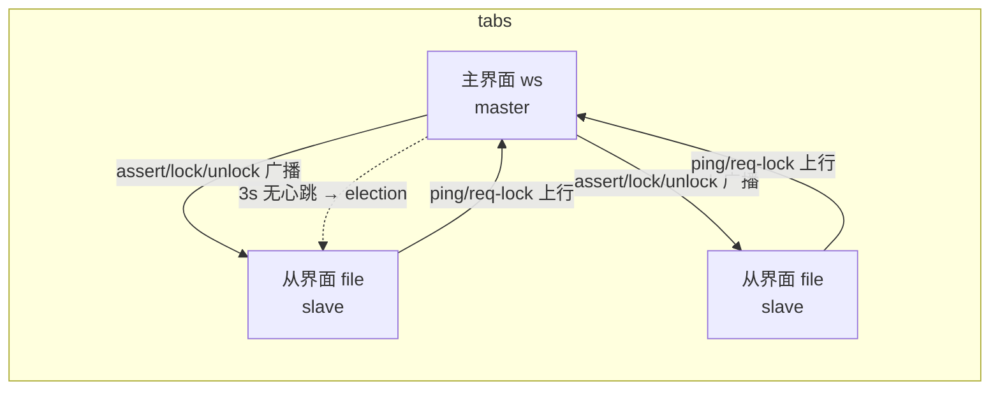
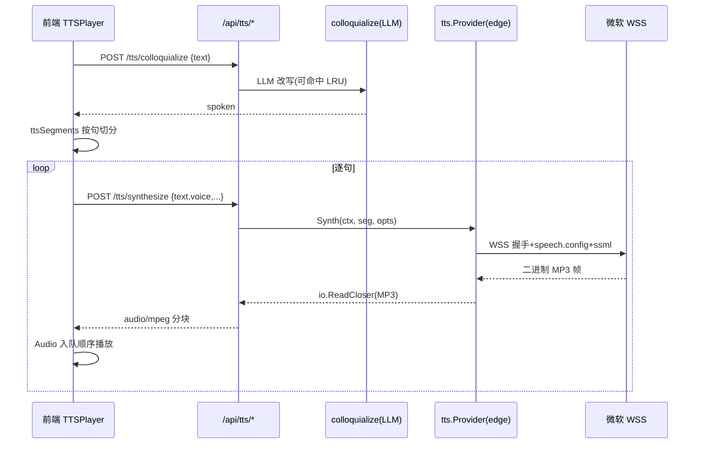
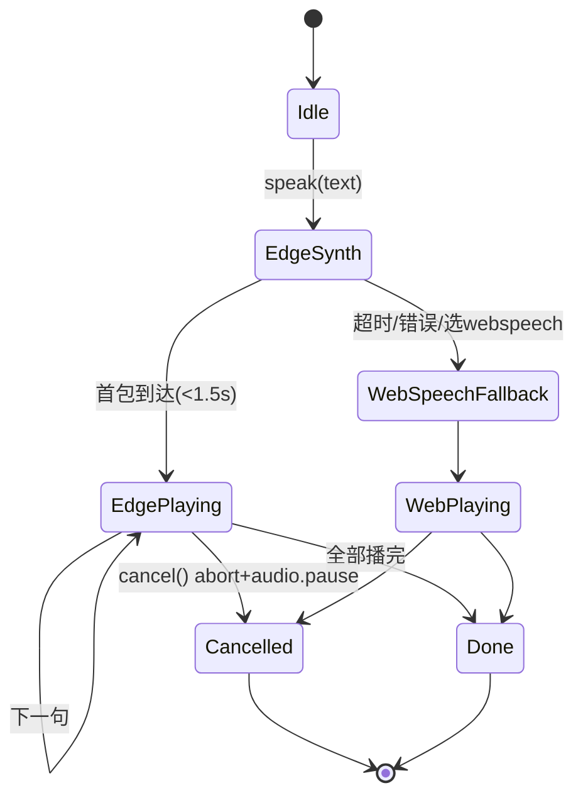

# aide 架构与接口索引

> 第一次浏览仓库可先看[代码目录导航](architecture/code-layout.md)，再按下方模块职责进入具体实现。

> **启动配置以 `.env` 为准**：`start.command` → `scripts/aide.sh` → Docker Compose，统一读取 `AIDE_PORT`（默认 8097）和 `COMPOSE_FILE`。临时验收端口不是用户启动入口。目录范围和 macOS 共享根模式见 [工作目录配置](workspace-paths.md)。

核对日期：2026-10-08。已标记源码基线为 `v0.1.16.0-RC1`；本次UI与知识星图改动是该基线之后的源码候选，尚未发行新tag。aide 融合 AI 与 IDE；架构由 Go 服务、浏览器 UI 与 Docker 工具环境组成。统一虚拟形象使用共享偏好与按需素材播放器，后端真实任务事件确定状态，模型反馈只选择动作变体；响应式侧栏宽度由 CSS 变量与拖动控制器共同维护。小秘明确转交时通过既有 `startTask` 路径创建并启动/排队 Aide 任务；TTS 自动模式按可用提供商回退，无法播放后端音频时退到浏览器合成。历史验收保留于 [验证记录](verification.md)，功能状态以对应任务验收记录为准，发布身份由 tag、镜像和发布记录共同确认。

## 系统结构

```mermaid
flowchart TB
    Browser[浏览器：会话 / 文件 / 设置 / 轨迹] --> API[Go HTTP API：令牌与同源校验]
    API --> Runs[任务与上下文构造器]
    API --> Workspace[工作区身份 / 本地与 SSH 驱动]
    API --> Storage[会话 / 设置 / 来源 / 统计]
    Runs --> Provider[Chat Completions 提供商]
    Runs --> Tools[内置工具 / Node 插件宿主]
    Tools --> Proposals[待批准文件与命令提案]
    Proposals --> Approval[用户确认]
    Approval --> Workspace
    Workspace --> Mounts[/workspace · /context · /local]
    Storage --> Data[/data 持久卷]
```

Go 标准库 HTTP 单体；模型步骤在 goroutine 中执行，文本 token 通过 SSE（`GET /api/sessions/{id}/runs/{run}/events`）增量推送到浏览器，最终任务状态仍由 `GET /sessions/{id}` 持久化兜底。前端使用原生 JS/CSS 和本地 vendor Markdown 库，由 `go:embed` 编入二进制。Node 插件宿主是可信代码执行器，不是权限沙箱。

## 模块职责

| 文件 | 责任 |
| --- | --- |
| `cmd/aide/main.go` | 启动与退出 |
| `internal/server/server.go` | 路由、鉴权、配置、会话存储、统计与费率、构建身份 |
| `workflow.go` | 任务状态、工具循环、提案、应用、摘要压缩 |
| `context.go` | 上下文预览、预算拦截、请求快照 |
| `provider.go` | 模型请求、参数、usage、超时；complete（非流式）+ completeStream（SSE，400 时去 stream_options 重试） |
| `profiles.go` | 内置/用户 Profile、策略文件、参数校验 |
| `workspace_config.go` / `ssh_session.go` | 工作区身份、本地映射、SSH/SFTP 生命周期 |
| `files.go` / `sources.go` / `mcp_source.go` | 路径/内容策略、读写冲突、引用来源与受限 stdio MCP 驱动 |
| `knowledge_map.go` / `knowledge_updates.go` | 有界知识索引、编号重查、版本差量与文件／代码缓存 |
| `knowledge_code.go` / `code_analysis/` | Go／JavaScript／Python AST与静态调用候选 |
| `knowledge_documents.go` / `document_analysis/` | 文档原文提取、本地TF-IDF RAG与原文指纹回填 |
| `web/starmap*` | 独立知识星图、自然尺度、代码探索和自动增量绘制；直接进入，无入场过场 |
| `command.go` | 非交互 shell、NDJSON 输出、超时与取消 |
| `persona.go` / `settings_persona_persist` | 性格系统：多人格（activePersona）、AES-256-GCM 密文（personaCiphers）、可演化 personalities、解锁/保存/重置 |
| `config_backup.go` | 配置备份信封 `aide-config-backup`：导出/导入设置快照、来源与工作区密钥、小秘历史 |
| `voice_agent.go` | 语音小秘：send/ignore/standby 研判、VoiceHistoryEntry 记录、AES-256-GCM 历史加解密、双向朗读 |
| `environment_guide.go` | 系统文档自动挂载与环境引导 |
| `plugins.go` / `plugin_host.js` | 插件登记、加载、schema 和 handler |
| `web/settings-init.js` | 同步首帧外观、`aide.ui`、系统外观响应与跨标签同步 |
| `web/settings-schema.json` / `app.js` | 设置导航、控件与应用交互；SSE 流式渲染（rAF 批量、live 文本/光标/工具行、会话快照去重）；排队/插话（Codex 风格队列条、发送/停止同键、一键回底） |
| `web/themes/**` / `style.css` / `macos.css` | 颜色变量、既有样式与新版表现层 |

文件名省略前缀时均位于 `internal/server/`。不维护容易过时的文件行数/测试数量，查当前源码与本次测试输出。

## 两种路由不能混淆

- 产品模型路由：`profiles.json` + `routing-policy.json`，选择模型参数 Profile。
- 开发 Agent 路由：`AGENTS.md` → `docs/agent/WORKFLOW.md` + `router.json`，管理需求到发布的开发过程，不参与用户模型任务执行。

## 数据与权限

会话写入 `/data/session-<id>.json`；模型连接配置、令牌、Token 统计/费率等也在数据卷。`profiles.json` 与模型策略位于工程目录。来源登记在配置的缓存路径，秘密在数据卷；UI 外观在浏览器 `localStorage['aide.ui']`。

Compose 将工作区可写挂载 `/workspace`，参考资料只读挂载 `/context`；`/local` 默认是可写 HOME。`os.Root` 和路径检查约束文件 API，但手动命令/Node 插件仍具有容器用户可访问的目录权限。插件 helper 当前读取 `/workspace`，不能把它等同于所有远程工作区的统一文件驱动。

任务快照记录工作区身份；旧提案、编辑器保存需要通过身份和哈希检查。文件应用为逐文件原子替换，可能部分成功。压缩用结构化摘要与近期历史构造后续请求，不保证删除 Runs 或缩小磁盘。

上下文预检按模型窗口与输出预留计算预算。历史接近动态阈值时会在任务结束后压缩；若新请求预检仍超限，则先对旧消息生成摘要、保留近期原文并重算预算，再决定是否接受。摘要调用失败、会话在压缩期间变化或压缩后仍超限都会返回错误，不会发送超预算请求。项目记忆、助手脚本和中间产物按工作区写入 `.cache/aide/`；本地工作区记忆随项目目录保存，SSH 工作区记忆当前按 workspace identity 放在本机缓存，尚未做到随远端仓库同步。

## API 索引

除静态资源、`/healthz` 外，`/api/` 路由需要 Bearer token；以 `server.go: Handler` 为完整注册表。

| 方法 | 路由 | 用途 |
| --- | --- | --- |
| GET | `/api/knowledge-map`、`/api/knowledge-map/updates` | 知识／代码快照、稳定编号与版本差量同步；详见[知识星图](architecture/knowledge-map.md) |
| POST | `/api/knowledge-map/assist` | 带编号和片段证据的知识／代码／RAG辅助理解 |
| POST | `/api/knowledge-map/documents/search`、`/api/knowledge-map/documents/reference` | 原文或RAG检索、回填前重查文件指纹与定位 |
| GET | `/api/config` | 脱敏配置、version/revision/buildCommit |
| PUT | `/api/settings` | 模型连接与模型列表 |
| GET | `/api/models`、`/api/balance` | 提供商代理；支持程度依赖上游 |
| GET / PUT | `/api/profiles` | Profile 与当前策略 |
| GET / PUT | `/api/workspace-config` | 工作目录、文档、缓存、远程连接 |
| GET / PUT | `/api/sources` | 引用来源注册表 |
| POST | `/api/sources/{id}/test` | 初始化 stdio MCP 并发现工具（仅保存安全摘要） |
| GET | `/api/files`、`/api/file` | 目录/文本读取 |
| PUT | `/api/file` | 保存；包含路径、正文、哈希和工作区身份 |
| GET / POST | `/api/sessions` | 会话列表/创建 |
| GET | `/api/sessions/{id}` | 会话、消息与任务 |
| POST | `/api/sessions/{id}/runs` | 启动对话或工作流 |
| POST | `/api/sessions/{id}/runs/{run}/cancel`、`/apply` | 取消/应用 |
| GET | `/api/sessions/{id}/runs/{run}/requests` | 请求快照 |
| GET | `/api/sessions/{id}/runs/{run}/events` | SSE 实时事件（step/delta/tool/status/done）；EventSource 经 `?access_token=` 鉴权 |
| POST | `/api/context-preview` | 与运行请求共用构造器的预算预览 |
| GET | `/api/search` | 会话全文搜索 |
| POST | `/api/sessions/{id}/compact` | 手动摘要压缩 |
| GET | `/api/token-stats` | 用量与费用汇总；逐调用缓存命中/未命中与价格快照 |
| GET / PUT | `/api/token-pricing` | 官方 DeepSeek 费率预览；其他模型的自定义费率管理 |
| GET / POST | `/api/plugins` | 插件列表/上传 |
| PUT / DELETE | `/api/plugins/{id}` | 启停/删除 |
| GET | `/api/plugin-surface` | 插件能力清单 |
| POST | `/api/command` | 命令执行，NDJSON 输出 |
| POST | `/api/config/export`、`/api/config/import` | 配置备份导出/导入（信封 `aide-config-backup`，可选含密钥/语音历史） |
| POST | `/api/sessions/{id}/runs/{run}/retry`、`/answer`、`/queue/{index}` | 重试/回答澄清问题/排队项改删升级 |
| GET / POST | `/api/file/raw`、`/api/file/download`、`/api/file/archive`、`/api/file/extract`、`/api/file/rename` | 原始文件查看、文件/目录下载与 ZIP 导出、在工作目录原路径旁创建 ZIP、安全解压到 ZIP 同级新目录、重命名；归档创建拒绝覆盖同名文件；download/raw 允许 `access_token` 供浏览器资源请求使用 |
| PATCH / DELETE | `/api/sessions/{id}`、`/api/sessions/archived/all` | 改 pinned/archived/删除/清空归档 |
| POST | `/api/persona/*`（unlock/save/reset/GET）、`/api/personas/*`（GET/active）、`/api/personality/*`（GET/PUT/reset/evolve） | 性格加解密、多人格切换、性格演化 |
| POST | `/api/voice-filter`、`/api/voice-narrate` | 小秘研判 send/ignore/standby、双向朗读 |
| GET/DELETE/POST | `/api/voice-history`（list/clear/enable/unlock/lock/change-password/disable） | 小秘工作历史与加锁 |
| POST | `/api/account/verify-password` | 账户密码 SHA-256 校验（锁屏/历史口令） |

这里是导航索引，不代替每个 handler 中的完整请求结构、验证与错误码。完整注册表以 `server.go` mux 注册为准。

## 任务与工具

`running → completed / awaiting_approval / failed / cancelled`；待审批提案应用后 completed；服务重启将运行任务标记 interrupted。

规划、提案、审查每个阶段（及 AI 工作流四阶段/自动模式）可进入模型工具循环，循环上限 `ToolMaxRounds` 默认 60、可配 5–200。单步工具调用总预算按轮数推导为 `max(64, 4 × ToolMaxRounds)`，不再固定 24 次；同一工具、参数、结果在步骤内重复 3 次起会提示模型停止原样重试，达到 8 次时暂停剩余重复探测并给用户可继续的说明。预算耗尽时同样给可继续的说明，不将正常步骤标记为错误。`list_files`/`read_file` 直接读，`write_file`/`run_shell` 产生提案。工具结果回传模型；已有文件写入仍需显式附件快照。插件参数 schema 进入工具声明，但可信插件本身能直接使用 Node 能力，不能声称写操作都被安全沙箱阻止。

## 界面设置

```json
{"version":1,"theme":"system","palette":"blue"}
```

`theme` 为 light/dark/system，`palette` 为 blue/green。页面 `data-theme` 是解析后的明暗，`data-theme-pref` 是用户选择，`data-palette` 是风格。专业与经典各一排三项，通过 `aideUI.setAppearance()` 一次保存组合。旧 `aide.theme` 和中间版本 classic 偏好迁移；`settings-schema.json` 侧边分区为：消耗统计(stats)/外观(appearance)/语言(language)/模型(model)/会话数据(sessions-data)/权限(permissions)/账户(account)/性格(persona)/语音(voice)/无障碍(accessibility)/备份(backup)/关于(about)。

文件侧栏顶部采用紧凑间距：标题栏 42px、根目录切换按钮最小 28px，路径与搜索行收紧内边距；触摸设备标题栏 46px、主要按钮 34px。规则统一在 `style.css` 的 `#file-panel` 范围内，适用于经典与专业外观，不改变文件列表行样式。

## 本任务自动命令审批

聊天输入框工具栏在策略按钮旁提供“审批 · 手动 / 帮我审批”，命令确认卡只提供本次确认及调整操作。发送前的选择通过创建任务参数 `autoReview` 写入任务；当前页面内按会话记住新任务选择，不跨会话继承，刷新后未运行任务的选择回到手动。运行中的开关以任务持久化状态为准。`PUT /api/sessions/{id}/runs/{run}/approval-mode` 仅切换该运行任务审核方式；默认关闭，不改变沙箱与插件权限。开启后，`run_shell` 的非只读命令由独立、无工具的模型请求审核，使用任务模型与现有连接，20 秒时限、512 输出 token，用量计入任务。只在明确授权、工作区内、低风险或可逆中等风险且结构化结果完整时自动放行。删除、权限修改、现有受保护命令、不确定操作仍等待人工；失败/超时/取消不放行。此功能当前覆盖 shell 命令确认，不代替文件提案应用或其他插件审批。

命令确认由服务端标记 `approvalKind=shell` 和轮次；按钮提交轮次，过期请求拒绝。审核结果只有在同一轮次、同一开关代际、未被人工应答且上下文有效时生效；切换或人工应答取消进行中的审核。保留最近 50 条具体命令、状态和原因，先持久化记录再唤醒执行；现有命令执行器仍检查沙箱。文件、网页与模型回复均不能自行开启审批方式。

参考 [Codex Auto-review](https://learn.chatgpt.com/docs/sandboxing/auto-review) 的独立审核、具体行动与审批原因设计。本实现使用 Aide 当前连接的模型，未接入 Codex 服务，也未声称具有相同安全保证。

## 锁屏集群

锁屏状态跨标签页（主界面 ↔ 文件查看器）联动，纯前端零后端改动，实现见 `internal/server/web/lock-cluster.js`，频道 `aide-lock-v1`。后端 `/account/verify-password` 仍无状态，只比对 SHA-256；锁屏状态不入库、不回服务端。

每 tab 启动生成 `tabId`（`crypto.randomUUID` 降级）+ `bootTs`；`role` 由 `location.hash` 是否含 `#file=` 决定（`ws`/`file`）。优先级元组 `P=(role: ws=0 < file=1, bootTs, tabId)`，小者胜，**ws 主界面优先当 master**。master 是 `masterLocked` 的唯一写入点；slave 各自维护 `localDismiss`。每 tab 可见遮罩 = `masterLocked && !localDismiss`。

消息协议（均带 `gen` 代际，slave 只接受 `gen` 单调递增）：

| 消息 | 方向 | 语义 |
| --- | --- | --- |
| `hello` | 任意 → 集群 | 新 tab 加入，携带自身优先级 |
| `welcome` | master → hello 者 | 回执当前 `masterLocked` 与 `gen`；slave 据此采用状态 |
| `assert` | master → 集群 | 心跳（1.5s），携带 `masterLocked`；slave 续看门狗 |
| `lock` | master → 集群 | 升锁；slave 清 `localDismiss` 并本地遮罩+语音退下 |
| `unlock` | master → 集群 | 解锁；slave 揭遮罩（不播欢迎语、不恢复麦克风） |
| `bye` | 任意 → 集群 | tab 关闭；slave 发现 master bye 立即重选 |
| `election` | candidate → 集群 | 竞选；对方优先级更高则退让，否则反发 |
| `ping` | slave → master | 活动中继（≥1s 节流），master 续空闲表 |
| `req-lock` | slave → master | slave 点"立即锁屏"，请 master 升锁并广播 |

选举：加入窗口 600ms 内无 `welcome`/`assert` 即发 `election`；收到更强优先级的 `election` 则退让等对方 `assert`，400ms 无人反超即当选 master。新当选 master 继承"最后已知集群锁态"，从未见过 master（首个 tab / 刷新主 tab）则默认锁。slave 3s 收不到心跳触发重选；`lockTimeoutSec` 只在 master 计时，任意 tab 活动经 `ping` 续表。`BroadcastChannel` 不可用时降级为各 tab 独立锁。



## TTS 分层架构

小秘朗读是可插拔管线：后端 `internal/server/tts` 定义 `TTSProvider` 接口（`Name/Synth/Format/Available`），`NewProvider(name, Config)` 按名注册。当前实现 edge-tts——用标准库手写最小 RFC6455 WebSocket 客户端直连微软 Read-Aloud（`wss://speech.platform.bing.com/...`，公开 token + 时间派生的 `Sec-MS-GEC`，无需 key），SSML 映射语速/情感，回流式 MP3。Web Speech 是纯浏览器能力，后端不合成（`ErrBrowserOnly`），由前端兜底；自动模式在 sherpa/edge/Azure 均不可用时直接使用浏览器合成，后端音频解码或播放失败也会回退浏览器。

**音频流路径**：



**降级链**：自动模式优先本地 sherpa-onnx，之后尝试 edge-tts 与已配置的 Azure；均不可用时由前端使用浏览器 Web Speech。后端音频请求、解码或播放失败时，同一段文本改走 `webSpeakReply`/`webSpeakAwait`。显式选择浏览器合成时前端直接使用 Web Speech；显式选定其他引擎时不静默改写用户选择。



**口语化预处理**：对话回复（`speakReply`）在合成前先经 `App.colloquialize` 调 `complete()` 改写为口语稿，按 `sha1(model+原文)` 存内存 LRU（256 条）。导览讲解（`speakAwait`）的文本已由 `voice-narrate` 口语化，跳过这步，避免双重改写。主聊天"朗读"按钮走裸 Web Speech，不进此管线。

**设置与回显**：`Settings` 新增 `ttsProvider/ttsVoice/ttsEndpoint/ttsAPIKey/ttsRate/ttsExpressiveness`；`ttsAPIKey` 同 `apiKey` 模式不回显，`/config` 只给 `hasTTSKey` 布尔与 `ttsVoices` 音色列表。

## 验证与扩展

变更前读取 [统一开发工作流](agent/WORKFLOW.md)。新前端须验证浏览器实际交互；正式发布须在没有 `/web` 挂载的构建镜像中验证 embed 资源。早期预览使用 RC5 后端 + 工作区静态文件；本次发布另行验证无静态目录覆盖的镜像。

待独立规划：PTY、目录分页、streamable HTTP MCP 与统一插件文件驱动。stdio MCP 引用已落地：程序和参数以 `exec.Command` 启动、不经 shell；测试发现工具；AI 仅能调用服务实时声明为只读的工具。会话归档（pinned/archived、子会话自动归档与折叠组）、SSE 流式输出已落地。

## 外部 AI 诊断接口（/api/debug）

`App.Handler()` 外层对 `/api/debug/` 前缀做独立分流，**先于**普通 access-token 校验进入 `serveDebug`，四段中间件顺序执行：

1. **开关判定**：读 `settings.DebugAccessEnabled`；关即整体 `404`（不暴露存在性），仍记一条审计。
2. **独立鉴权**：调试令牌走 `Authorization: Bearer`，常量时间比对 `sha256(token)` 与 `settings.DebugTokenHash`；校验过期时间；SSE `/events` 例外允许 `?access_token=`。普通 access-token（owner）放行全部；调试令牌仅放行非 `/admin`、非 `/audit` 端点。
3. **审计**：每条访问（含 401/404/403）追加 `data/debug-audit.jsonl`（time/ip/ua/method/path/owner/result）。
4. **分发+脱敏**：通过 `a.routes` 分发到 mux；handler 内白名单聚合——只回 `hasKey/hasPassword`、baseURL 主机名、模型 id、挂载与用量，绝不回 key/密码哈希/人格密文/请求快照正文/access-token。

状态落点：`App.startedAt`（uptime）、`App.errorRing`（失败终态由 `finishStream` 落一条）、`App.providerHealth`（ping-provider 探测缓存）。令牌哈希只由 `/api/debug/admin/*` 管理；关闭总开关或吊销即即时清空哈希。详见 [debug-api.md](debug-api.md)。


### 2026-10-08：舒适配色、共享动效与静态加载

- `web/experience.css` 在现有主题与 macos 样式之后加载，统一短交互时长 140/200/260ms、稳定焦点轮廓与选中勾选。主题预览限定于 `data-palette`，普通分段选项保持紧凑。专业主题为中性灰与石板蓝，舒适主题为灰绿；图片、图表、文件预览没有整体滤色，经典主题偏好兼容保留。
- `aide.ui.motion` 支持 `system/full/reduced`；系统 `prefers-reduced-motion` 优先。`settings-init.js` 仍同步执行以避免主题闪烁，同时应用 `data-motion` 并广播 `aide:motion`。CSS、共享形象播放器、星图和 STL 持续绘制遵循该偏好；后台暂停动画，STL 交互在减少动效时仍可重绘。
- `web/experience.js` 为装饰性的短星轨汇聚，动画 940ms，980ms 回收，当前标签页会话首次显示。`startupAnimation=off` 关闭自动播放；外观中可以主动重播。减少动态效果优先关闭；点击、键盘操作或切到后台提前回收。覆盖层 `aria-hidden`、`pointer-events:none`，无输入或初始化等待门禁。
- 除主题初始化外首页脚本使用 `defer`。Mermaid 与 Three/STLLoader/OrbitControls 按需加载且并发去重：合计 3,977,524 字节（约 3.79MiB）从首页初始脚本移出，并非库被移除。Mermaid 首次绘制不依赖语言切换；失败保留文字提示。代码编辑器输入通过 RAF 合帧，滚动只同步偏移，避免每次滚动重复高亮。
- `static_assets.go` 只对嵌入的公共 JS/CSS/图片/字体/JSON 资源发出 SHA-256 ETag 与 `public,max-age=0,must-revalidate`，摘要按进程缓存。浏览器仍向服务端校验，资源变化不会沿用旧摘要。HTML、API、工作区文件继续 `no-store`；并未改变鉴权、CSP 或跨工作区权限。
- 所选正文/背景颜色的算术对比值约 12.0–12.87，白色主按钮文字/石板蓝底约 6.47。数值是设计计算，不是全页面可访问性认证，也不能证明保护视力、消除疲劳或保证每个人的颜色识别。实际首屏时长、FPS、持续使用效果需要设备测量。
- 本次 Safari 观察与构建范围见 `docs/tasks/ui-comfort-motion-20261008.json`。仅隔离候选18189；未发布或替换生产。

### 2026-10-08：天文观测殿视觉层

- `web/sanctum.css` 在 `experience.css` 后加载。共享覆盖工作台导航、文件与插件面板、提醒、输入区、策略菜单、审批澄清卡、设置、文件预览与终端标题；专业主题采用深空石板／珍珠白，淡金仅用于装饰细节，成功、警告与错误的语义颜色保持原有值。经典和舒适主题仍继承各自语义令牌。
- 首页文案突出开放创造、模型／工具／知识连接与可审阅成果。入口星轨为本地、`aria-hidden`、不可聚焦且不接收指针事件的内联 SVG；仅空工作台显示，小屏隐藏。无远端素材或常驻粒子渲染，不对正文、图片、CAD、文档和图表做整体滤色。
- 启动星轨增加精细刻度与淡金弧线，继续保持940ms淡出、980ms回收及减少动态效果优先。共享动效层仍限制短过渡；装饰星轨是静态画面。
- 独立知识星图使用同一石板／月白／淡金层次，搜索、详情、AI区域的表面降低模糊半径，辅助文字提升亮度。当时保留原索引、AI调用提示、编号回调与入场交互；后续入场已删除，当前行为见[知识星图](architecture/knowledge-map.md)。
- 源码巡检和验证边界记录于 `docs/tasks/ui-celestial-sanctum-20261008.json`。本轮Mac锁定，Safari实际检查尚未完成；内置浏览器自签证书拒绝访问，未绕过警告。不能据此声称全UI实际验收通过或整体性能提升。

### 2026-10-08：共享界面精修

- 在现有 `sanctum.css` 中统一会话菜单、文件列表、插件卡、设置、审批命令、聊天操作、PDF/CAD 工具栏的排版、边框和焦点；采用主题语义令牌。参考 [Fluent 2 设计令牌](https://fluent2.microsoft.design/design-tokens) 的语义层次与 [动效指导](https://fluent2.microsoft.design/motion) 的短反馈、减少动效原则；大型产品的完成度为设计参考，没有流量排名或比较性验收结论。
- 主按钮及品牌标识使用 `--on-brand`，修正舒适／经典暗色浅底按钮白字问题；运行环境锁定提示改用主题文字，移除其背景模糊。文件工具栏也改用稳定不透明表面。API 状态保持 `--success/--warn`，停止任务保持危险色；原文档、图片与 CAD 内容无整体滤色。
- 会话更多操作为30px，模型／插件／配置删除为32px；粗指针下扩大到40px。聊天操作不小于30px。隐藏设置开关的相邻滑块显示键盘焦点。审批命令使用等宽字体、主题边框、独立滚动；策略菜单整体限制高度并滚动，小屏单列。
- 以下为较早候选精修记录；星图随后改为共享工作台主题并删除入场动画，当前行为见[知识星图](architecture/knowledge-map.md)。其 CSS 统一搜索、原文／RAG、代码层级、详情和 AI 区域，详情与 AI 区域按高度分隔，小屏以浮层切换；减少透明度与强制颜色有对应样式。此前采用独立夜空基调，现已由工作台主题连续性替代。没有新增常驻动画、外部素材或依赖。
- 手动检查发现重复的 `LockCluster` 有效状态通知会触发星图重新索引并清掉节点详情。`setLocked` 记录首次状态，仅在首次通知或真实状态切换时初始化／清理；重复心跳保留当前选择。真实锁定、解锁及索引取消代次处理保持原有链路。
- 本轮仅更新隔离候选18189，通过 `start.command` 启动；构建、手动浏览器检查、未覆盖场景及回滚文件以 `docs/tasks/ui-observatory-refinement-20261008.json` 为准。构建成功不等于全界面、真实模型或所有设备验收。

### 2026-10-08：星图差量更新与入场删除

星图使用独立页、自然尺度及调用层星等；知识／代码变更通过 `/api/knowledge-map/updates` 按稳定编号自动合并，未变布局与镜头保留。节点视图、文档原文及本地TF-IDF RAG分别表达不同检索范围，Office插件共用原文提取与引用校验。已删除星图刷新按钮和入场过场，保留持续星空、新星渐入与归位。接口、预算、缓存边界、主题和验收状态见[知识星图架构](architecture/knowledge-map.md)与[源码交接](reviews/2026-10-08-starmap-source-sync.md)。
