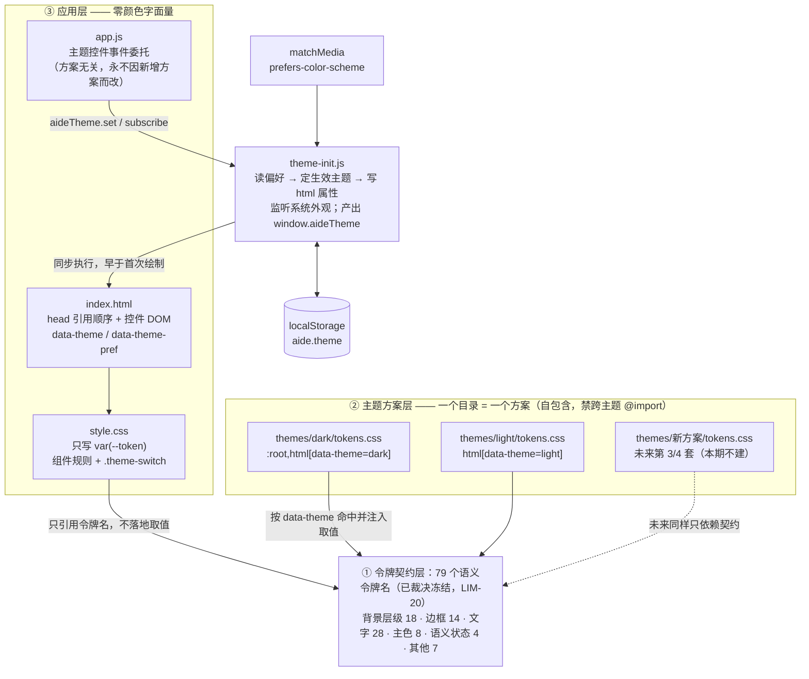
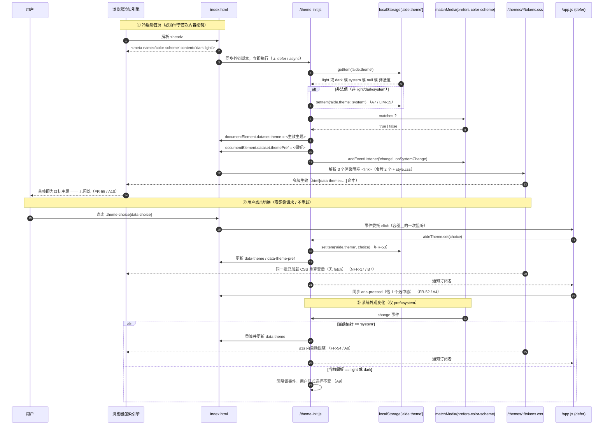
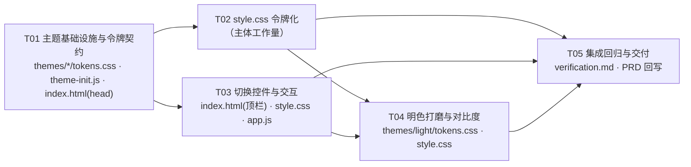

# 主题与配色系统 · 系统设计（增量）

> **历史设计（2026-09-21）**：旧 aide.theme、theme-init.js、单排控件和暗色保真约束已被设置中心及 2026-09-23 新版 UI 修订。 当前状态见 [现行 PRD](../PRD.md) 与 [架构](../architecture.md)。下文“待实施/已验证”仅代表原设计时间点，不能用于今天的发布判断。

| 项 | 值 |
| --- | --- |
| 文档类型 | 系统设计（System Design）+ 任务分解 |
| 日期 | 2026-09-21 |
| 上游依据 | `docs/prd/2026-09-21-theme-switching.md`（增量 PRD）+ `docs/PRD.md` v1.1 |
| 对应分支 | `feat/theme-switching` |
| 功能基线 | `fbe45b2` |
| 作者 | 架构师（高见远） |
| 状态 | 待工程师实施 |

> **事实核对说明**：本文所有"现状"数据均由脚本对**基线 `fbe45b2`** 的 `internal/server/web/style.css`（14,317 B / **单行压缩格式，仅 2 个换行符** / **153 个顶层样式块**（其中 5 个为 `@media`；全文 `{` 共 197 个）/ **93 处 hex** / **89 个不同色值**）实读得出；Go `embed` 行为由容器内**实际运行**验证（见第 4 节），非凭记忆推断。

---

## 1. 设计概述与分层

### 1.1 三层架构：令牌契约 → 主题方案 → 应用层



### 1.2 为什么这样分层能支撑第 3、第 4 套主题

| 设计动作 | 支撑的扩展性 |
| --- | --- |
| 令牌名与令牌值是两层：`style.css` 只认**名字**，主题目录只提供**值** | 新增方案不触碰任何规则、不触碰任何业务 JS；`style.css` 与 `app.js` 对方案数量完全无感知 |
| 令牌集合一次性冻结（**79 个，已裁决，LIM-20**） | 满足 FR-56「令牌名是接口、不得改名」+ LIM-20「不得删减/新增」；新方案只需"填满同一组 79 个键" |
| 主题目录自包含、禁跨主题 `@import` | 删除/新增方案互不影响；单方案文件 ~1.7 KiB，LIM-18 上限 8 KiB 有 4.7 倍余量 |
| `theme-init.js` 集中持有 `VALID` 枚举与解析逻辑，并向 `app.js` 暴露 `window.aideTheme` | "增加枚举取值"只发生在一个文件的一行数组里；解析逻辑（含 system 语义）不会出现第二份实现 |
| 控件用 `data-choice` + 事件委托，`style.css` 用 `[aria-pressed]` 通用选择器着色 | 新增第 3 个按钮无需改 `app.js`、无需在 `style.css` 增写选择器 |

### 1.3 关键不变式（工程师实施时必须保持）

1. `style.css` 与 `index.html` 中**颜色字面量归零**；字面量只允许出现在 `themes/**`（FR-49 / A1）。
2. `theme-init.js` 必须是**同步**外链脚本，且位于 `<head>` 首位，先于任何 `<link rel="stylesheet">`（FR-55 / LIM-19）。
3. 两个令牌文件都**静态常驻** `<head>`；切换主题**不得**发生任何网络请求（NFR-17 / B7）。
4. 不改 `server.go`、不改 CSP、不改 API、不改 `go.mod`（第 4 节已实证无需改 embed 指令）。
5. `app.js` 的主题相关代码必须放在**顶层**（`initialize()` 之外），保证未登录时主题与控件依然可用（增量 PRD §8 明列的风险项）。

---

## 2. 文件清单

| # | 相对路径 | 动作 | 说明 |
| --- | --- | --- | --- |
| 1 | `internal/server/web/themes/dark/tokens.css` | **新建** | 暗色方案；选择器 `:root,html[data-theme="dark"]`；含 `color-scheme:dark` |
| 2 | `internal/server/web/themes/light/tokens.css` | **新建** | 明色方案；选择器 `html[data-theme="light"]`；含 `color-scheme:light` |
| 3 | `internal/server/web/theme-init.js` | **新建** | 首屏主题初始化 + 持久化 + 系统跟随 + `window.aideTheme` |
| 4 | `internal/server/web/index.html` | 修改 | `<head>`：加 `theme-init.js`、两个令牌 `<link>`、`meta color-scheme`；顶栏加 `.theme-switch` 控件 |
| 5 | `internal/server/web/style.css` | 修改 | 93 处字面量 → `var(--token)`；`:root` 去色值；新增 `.theme-switch` 与 `@media(max-width:600px)` 规则 |
| 6 | `internal/server/web/app.js` | 修改 | 新增顶层「主题」片段（事件委托 + `aria-pressed` 同步），不触及会话/文件/命令/工作流代码 |
| 7 | `internal/server/server.go` | **不改** | `//go:embed web/*` 递归包含子目录，实证见第 4 节 |
| 8 | `docs/verification.md` | QA 追加 | 对比度数值、截图比对、embed 与体积结论（本次不由架构产出） |
| 9 | `docs/PRD.md` | 实施后回写 | 若目录结构/体积等 6.1、6.2、6.5 描述的事实变化（设计不变更 PRD 则无需回写） |

`themes/` 目录内**只允许 CSS 令牌**：禁 JS、禁图片、禁字体、禁二进制（A12）。

---

## 3. 令牌清单（**已裁决冻结**）

> **裁决状态：已裁决**（交付总监下发；产品经理同步登记为 LIM-20）
>
> - **令牌清单冻结为 79 个，不精简**，按 **Δ≤2/255**（NFR-16 严格保真）交付。
> - **裁决依据**：用户选择「暗色严格原样、只做明色」——NFR-16 的逐通道偏差阈值 **不放宽**，因此不接受此前拟议的"精简到 47 个（Δ≤4）"等放宽方案。
> - **令牌集合是稳定接口（不可变）**：79 个名字一经落地 **不得改名、不得删减、不得新增**；后续新增配色方案只能"**新增一个目录 + 填满同一组 79 个取值**"，不得改动令牌集合本身。

### 3.1 令牌规范

| 项 | 约定 |
| --- | --- |
| 命名 | `--<角色>[-<限定>]`，全小写 + 连字符；角色取 6 类之一（背景层级 / 边框 / 文字 / 主色 / 语义状态 / 其他） |
| 总数 | **79**（**已裁决冻结，不精简**） |
| 稳定性 | 一经落地即为接口；**后续方案不得改名、不得删键、不得增键**（FR-56 + LIM-20） |
| 保真阈值 | **Δ≤2/255，已裁决不放宽**（NFR-16 / B6） |
| 作用域 | 由主题目录通过 `html[data-theme="…"]` 命中，不在 `style.css` 落地任何色值 |
| `dark` 取值来源 | 除 **6 个显式新增项**（`--field-border`、`--focus-ring`、`--success`、`--selection`、`--scrollbar-thumb`、`--scrollbar-track`；其中前 3 个由 §7.4 消费，后 3 个为**预留**）外，**全部取自改造前字面量本身或其中位色**；已验证每个旧字面量与所属令牌 `dark` 值的**逐通道偏差 ≤2/255**（NFR-16 / B6） |

### 3.2 完整令牌表（79 个）

> 「覆盖的旧字面量」列给出该令牌在 `style.css` 中替代的原值；`—` 表示新增令牌（改造前无对应字面量或为变量别名）。

| # | 令牌名 | 类别 | 语义 | dark | light | 覆盖的旧字面量 |
|---|---|---|---|---|---|---|
| 01 | `--bg` | 背景层级 | 页面底 | `#111513` | `#f4f9f5` | `#111513` |
| 02 | `--bg-inset` | 背景层级 | 内嵌最深底（终端 / 标签轨） | `#101611` | `#e7f0ea` | `#101611` |
| 03 | `--field` | 背景层级 | 输入框 / 文本域底 | `#111713` | `#ffffff` | `#111713` |
| 04 | `--panel` | 背景层级 | 面板底（文件面板 / 卡片） | `#151a17` | `#ffffff` | `#151a17`、`#151b17` |
| 05 | `--panel-alt` | 背景层级 | 次级面板底（侧栏） | `#171d19` | `#eef6f0` | `#171d19` |
| 06 | `--surface` | 背景层级 | 抬升面（composer / dialog / 激活标签） | `#1a241d` | `#ffffff` | `#1a241d`、`#1c251f` |
| 07 | `--surface-alt` | 背景层级 | 次级抬升面（starter / step） | `#19201b` | `#f2f8f3` | `#19201b`、`#172019` |
| 08 | `--code-bg` | 背景层级 | 代码 / diff 块底 | `#1d2820` | `#eef5f0` | `#1d2820` |
| 09 | `--soft` | 背景层级 | 柔和填充 | `#202b24` | `#e9f3ec` | `#202b24` |
| 10 | `--chip-bg` | 背景层级 | 附件 chip 底 | `#203026` | `#e3f0e7` | `#203026` |
| 11 | `--bubble-bg` | 背景层级 | 用户气泡底 | `#23352a` | `#e6f2e9` | `#23352a` |
| 12 | `--hover` | 背景层级 | hover 态底 | `#26342b` | `#e8f3ea` | `#26342b` |
| 13 | `--selected` | 背景层级 | 选中态底（会话项） | `#283a2e` | `#d3e9d8` | `#283a2e` |
| 14 | `--selected-alt` | 背景层级 | 选中态底（标签轨） | `#28372c` | `#d3e9d8` | `#28372c` |
| 15 | `--mode-active` | 背景层级 | 模式切换激活底 | `#304a39` | `#cfe8d6` | `#304a39` |
| 16 | `--toast-bg` | 背景层级 | toast 底 | `#c5ecd2` | `#1e4d33` | `#c5ecd2` |
| 17 | `--brand-hi` | 背景层级 | 主按钮 hover 底 | `#cdf9dd` | `#176040` | `#cdf9dd` |
| 18 | `--backdrop` | 背景层级 | dialog 遮罩 | `#050b08b5` | `#06140c8c` | `#050b08b5` |
| 19 | `--line` | 边框 | 装饰性分隔线（顶栏 / 终端 / 编辑器） | `#29312c` | `#d2e3d8` | `#29312c` |
| 20 | `--field-border` | 边框 | 交互控件边界（输入框 / 文本域） | `#29312c` | `#6f8a7a` | — |
| 21 | `--line-faint` | 边框 | 极弱装饰线 | `#233127` | `#e4efe8` | `#232f26`、`#233329` |
| 22 | `--line-soft` | 边框 | 弱装饰线（标签 / starter） | `#303c33` | `#daeae0` | `#303c33`、`#303a33` |
| 23 | `--line-soft-2` | 边框 | 弱装饰线（step） | `#2e3f33` | `#dfece3` | `#2e3f33` |
| 24 | `--line-soft-3` | 边框 | 弱装饰线（标签轨） | `#293a2e` | `#dbeae1` | `#293a2e` |
| 25 | `--line-mid` | 边框 | 交互边界（quiet 按钮） | `#344139` | `#6f8a7a` | `#344139` |
| 26 | `--line-chip` | 边框 | chip 装饰边 | `#385540` | `#bcd6c4` | `#385540` |
| 27 | `--line-strong` | 边框 | 装饰强调边（brand 徽标） | `#3e4b41` | `#b3cdbb` | `#3e4b41` |
| 28 | `--line-composer` | 边框 | 交互边界（composer / dialog） | `#435e4b` | `#6f8a7a` | `#415c49`、`#45604d` |
| 29 | `--line-accent` | 边框 | 主色装饰边（kbd） | `#759f83` | `#3f8a5c` | `#759f83` |
| 30 | `--focus-border` | 边框 | 输入聚焦边 | `#6b9c7e` | `#2f8b58` | `#6b9c7e` |
| 31 | `--focus-border-2` | 边框 | 输入聚焦边（composer） | `#77a98a` | `#34925e` | `#77a98a` |
| 32 | `--danger-line` | 边框 | danger 边界 | `#8c5c50` | `#a85c4b` | `#8c5c50` |
| 33 | `--text` | 文字 | 正文 | `#e4eae5` | `#0f2318` | `#e4eae5` |
| 34 | `--text-tab` | 文字 | 激活标签文字 | `#d1e2d6` | `#16311f` | `#d3e4d8` |
| 35 | `--text-answer` | 文字 | 回答正文 | `#cfdbd3` | `#16311f` | `#d1ddd5` |
| 36 | `--text-breadcrumb` | 文字 | 面包屑当前项 | `#c6d0c9` | `#16311f` | `#c8d2cb` |
| 37 | `--text-step-summary` | 文字 | 步骤标题 | `#c0d5c7` | `#16311f` | `#c2d7c9` |
| 38 | `--text-step` | 文字 | 步骤内容 | `#bac9bf` | `#1e3a26` | `#bccbc1` |
| 39 | `--text-settings` | 文字 | 设置按钮标签 | `#b7c3bb` | `#1e3a26` | `#b9c5bd` |
| 40 | `--text-output` | 文字 | 终端输出 | `#b4d2be` | `#14301d` | `#b6d4c0` |
| 41 | `--text-code` | 文字 | 建议命令代码 | `#b3c9b9` | `#1e3a26` | `#b5cbbb` |
| 42 | `--text-file` | 文字 | 文件项 | `#b2beb6` | `#1e3a26` | `#b4c0b8` |
| 43 | `--text-terminal` | 文字 | 命令面板标题 | `#aec3b5` | `#14301d` | `#b0c5b7` |
| 44 | `--text-dialog-label` | 文字 | 弹窗标签 | `#acbfb1` | `#1e3a26` | `#abc1b3`、`#aebfb3` |
| 45 | `--text-session` | 文字 | 会话项 | `#a4b0a7` | `#29422f` | `#a6b2a9` |
| 46 | `--text-welcome` | 文字 | 欢迎语段落 | `#8e9c92` | `#29422f` | `#909e94` |
| 47 | `--text-run-meta` | 文字 | 运行元信息 | `#87a290` | `#29422f` | `#89a492` |
| 48 | `--text-dialog` | 文字 | 弹窗正文 | `#8fa898` | `#29422f` | `#8fa698`、`#91aa9a` |
| 49 | `--muted` | 文字 | 次要 | `#839087` | `#3f5a49` | `#839087` |
| 50 | `--text-note` | 文字 | 说明文字 | `#819b8a` | `#3f5a49` | `#81998a`、`#839d8c` |
| 51 | `--text-file-icon` | 文字 | 文件图标 | `#779b84` | `#3f5a49` | `#799d86` |
| 52 | `--text-faint` | 文字 | 弱化 | `#8da194` | `#55705f` | `#8d9f92`、`#8fa396` |
| 53 | `--text-guide` | 文字 | 辅助目录说明 | `#73897b` | `#55705f` | `#758b7d` |
| 54 | `--text-guide-foot` | 文字 | 辅助目录脚注 | `#7c9f88` | `#4a6857` | `#7e9d89`、`#7ea18a` |
| 55 | `--text-placeholder` | 文字 | 占位符 | `#7c9183` | `#547060` | `#7c9082`、`#7e9385` |
| 56 | `--text-terminal-heading` | 文字 | 命令面板弱字 | `#6f8476` | `#55705f` | `#6e8677`、`#718678` |
| 57 | `--text-guide-label` | 文字 | 辅助目录标签 | `#657c6b` | `#55705f` | `#677e6d` |
| 58 | `--text-sep` | 文字 | 面包屑分隔符 | `#506256` | `#5c7766` | `#526458` |
| 59 | `--text-arrow` | 文字 | 欢迎流程箭头 | `#465b4e` | `#5c7766` | `#465b4e` |
| 60 | `--faintest` | 文字 | 最弱（提示 / 序号 / 空态） | `#647669` | `#547060` | `#66766b`、`#64786a`、`#627669`、`#63776a` |
| 61 | `--brand` | 主色 | brand 深绿（焦点环 / 主按钮底） | `#b4efcc` | `#1a6b42` | `#b4efcc` |
| 62 | `--accent` | 主色 | accent（live-dot / 连接态 / 侧条） | `#83d9a8` | `#2b8f5a` | `#83d9a8` |
| 63 | `--brand-text` | 主色 | 主色文字（激活标签） | `#c3edd1` | `#17603c` | `#c3edd1` |
| 64 | `--brand-text-chip` | 主色 | 主色文字（chip） | `#c3e1ce` | `#17603c` | `#c3e1ce` |
| 65 | `--brand-text-2` | 主色 | 主色文字（starter 前缀） | `#bbd4c2` | `#227a4b` | `#bbd4c2` |
| 66 | `--accent-text` | 主色 | 主色文字（starter 副标） | `#99bda6` | `#227a4b` | `#99bda6` |
| 67 | `--on-brand` | 主色 | 主按钮 / brand-icon 上的字 | `#14291b` | `#ffffff` | `#14291b` |
| 68 | `--on-accent` | 主色 | send 按钮上的字 | `#1c3726` | `#ffffff` | `#1c3726` |
| 69 | `--on-toast` | 其他 | toast 上的字 | `#173422` | `#eaf7ee` | `#173422` |
| 70 | `--focus-ring` | 其他 | 焦点环 | `#b4efcc` | `#1a6b42` | — |
| 71 | `--danger` | 语义状态 | danger 文字（停止按钮） | `#ffc0af` | `#b3261e` | `#ffc0af` |
| 72 | `--warn` | 语义状态 | warn 文字（任务错误） | `#efa999` | `#8a5a00` | `#efa999` |
| 73 | `--success` | 语义状态 | success 文字（连接就绪） | `#83d9a8` | `#1a6b42` | — |
| 74 | `--selection` | 语义状态 | 文本选中底（**预留**，本期不消费） | `#304a39` | `#cfe8d6` | — |
| 75 | `--shadow-1` | 其他 | 轻阴影 | `#0002` | `#00000012` | `#0002` |
| 76 | `--shadow-2` | 其他 | 重阴影 | `#0008` | `#00000024` | `#0008` |
| 77 | `--shadow-3` | 其他 | 面板阴影 | `#0006` | `#0000001c` | `#0006` |
| 78 | `--scrollbar-thumb` | 其他 | 滚动条滑块（**预留**，可选增强） | `#3e4b41` | `#b3cdbb` | — |
| 79 | `--scrollbar-track` | 其他 | 滚动条轨道（**预留**，可选增强） | `#101611` | `#e7f0ea` | — |

### 3.3 暗色保真（NFR-16 / B6）—— 实测结论

**校验方式**：把 `style.css` 全部 89 个色值按上表映射，逐项计算 `max(|R-R'|,|G-G'|,|B-B'|)`。

```
[A] NFR-16 保真（字面量 vs 令牌 dark 值，每通道偏差需 ≤2）
  超限 0 个  ✅
  样式表字面量 89 个，未被令牌覆盖: 无
```

⇒ 暗色渲染与 `fbe45b2` 的差异**为 0~2/255**，落在 B6 允许范围内。暗色无需任何目视复核即可判定"视觉等效保留"。

### 3.4 对比度（NFR-12 / B1）—— WCAG 2.1 计算值与公式

**公式（WCAG 2.1 相对亮度）**

```
通道归一化：c = c8 / 255
线性化：    f(c) = c/12.92                    若 c ≤ 0.03928
                 ((c+0.055)/1.055)^2.4        否则
相对亮度：  L = 0.2126·f(R) + 0.7152·f(G) + 0.0722·f(B)
对比度：    CR = (L_亮 + 0.05) / (L_暗 + 0.05)      ∈ [1, 21]
```

| 检查项 | dark | light | 阈值 | 判定 |
|---|---|---|---|---|
| 正文 / 页面底 | 15.08 | 15.48 | 4.5 | dark=OK light=OK |
| 正文 / 面板底 | 14.43 | 16.48 | 4.5 | dark=OK light=OK |
| 正文 / 抬升面 | 13.09 | 16.48 | 4.5 | dark=OK light=OK |
| 正文 / 侧栏底 | 14.03 | 14.97 | 4.5 | dark=OK light=OK |
| 次要 / 页面底 | 5.53 | 7.12 | 4.5 | dark=OK light=OK |
| 次要 / 面板底 | 5.29 | 7.58 | 4.5 | dark=OK light=OK |
| 弱化 / 页面底 | 6.71 | 5.10 | 3.0 | dark=OK light=OK |
| 最弱 / 页面底 | 3.80 | 5.10 | 3.0 | dark=OK light=OK |
| 最弱 / 侧栏底 | 3.54 | 4.94 | 3.0 | dark=OK light=OK |
| 空态 / 侧栏底 | 3.54 | 4.94 | 3.0 | dark=OK light=OK |
| 占位符 / 输入底 | 5.39 | 5.44 | 3.0 | dark=OK light=OK |
| 面包屑 / 页面底 | 11.63 | 13.20 | 4.5 | dark=OK light=OK |
| 步骤内容 / 抬升面 | 9.65 | 11.55 | 4.5 | dark=OK light=OK |
| 终端输出 / 终端底 | 11.27 | 12.28 | 4.5 | dark=OK light=OK |
| 会话项 / 侧栏底 | 7.62 | 9.96 | 4.5 | dark=OK light=OK |
| 会话项激活 / 选中底 | 9.31 | 5.09 | 4.5 | dark=OK light=OK |
| brand / 页面底 | 14.17 | 6.11 | 3.0 | dark=OK light=OK |
| brand / 终端底 | 14.11 | 5.60 | 3.0 | dark=OK light=OK |
| accent / 页面底 | 10.92 | 3.81 | 3.0 | dark=OK light=OK |
| chip 文字 / chip 底 | 9.91 | 6.45 | 4.5 | dark=OK light=OK |
| 激活标签 / 激活底 | 7.56 | 5.83 | 4.5 | dark=OK light=OK |
| starter 前缀 / 抬升面 | 10.53 | 4.93 | 3.0 | dark=OK light=OK |
| accent 文字 / 页面底 | 8.93 | 4.99 | 3.0 | dark=OK light=OK |
| 主按钮字 / 按钮底 | 11.86 | 6.51 | 4.5 | dark=OK light=OK |
| send 字 / send 底 | 9.95 | 6.51 | 4.5 | dark=OK light=OK |
| toast 字 / toast 底 | 10.51 | 8.80 | 4.5 | dark=OK light=OK |
| danger / 页面底 | 11.76 | 6.14 | 3.0 | dark=OK light=OK |
| warn / 页面底 | 9.47 | 5.56 | 3.0 | dark=OK light=OK |
| success / 页面底 | 10.92 | 6.11 | 3.0 | dark=OK light=OK |
| 焦点环 / 页面底 | 14.17 | 6.11 | 3.0 | dark=OK light=OK |
| danger 边界 / 页面底 | 3.30 | 4.59 | 3.0 | dark=OK light=OK |
| 输入聚焦边 / 输入底 | 5.78 | 4.24 | 3.0 | dark=OK light=OK |
| **输入边界 / 输入底** | **1.36** | 3.76 | 3.0 | dark=**豁免(R-13)** light=OK |
| **quiet 边界 / 页面底** | **1.72** | 3.53 | 3.0 | dark=**豁免(R-13)** light=OK |
| **composer 边界 / 页面底** | **2.58** | 3.53 | 3.0 | dark=**豁免(R-13)** light=OK |
| kbd 边 / 侧栏底 | 5.74 | 3.81 | 3.0 | dark=OK light=OK |
| 装饰线 / 页面底（仅需可见） | 1.38 | 1.25 | 1.2 | dark=OK light=OK |
| 装饰线 / 面板底（仅需可见） | 1.32 | 1.34 | 1.2 | dark=OK light=OK |

**R-11 已解决**：明色主题**不继承** `--green:#b4efcc` / `--accent:#83d9a8` 这两个高明度薄荷绿。明色的 `--brand` 改为 `#1a6b42`（深绿），`--accent` 改为 `#2b8f5a`。二者在浅绿白底上的对比度分别为 **6.11:1** 与 **3.81:1**，且主按钮"白字 / 深绿底"为 **6.51:1** —— 均达标。上表 **light 列 34 项全部通过**。

**⚠️ 冲突已解决（已裁决）**：上表 dark 列 3 项不达标（`input` 边界 1.36、`.quiet` 边界 1.72、`.composer` 边界 2.58），均为 `fbe45b2` **既有值**，非本次引入。此前描述的「NFR-12 ↔ NFR-16 不可兼得」冲突已由用户裁决：

| 裁决项 | 结论 |
| --- | --- |
| 采纳方案 | **(a)** —— B1「组件边界 ≥3:1」的判定范围**限定为本次新增的明色主题（light）**；依据：NFR-12 标题原文即「明色对比度下限」，该条从未要求改暗色 |
| 暗色既有 3 处低对比边界 | **本次不修**，登记为**已知缺陷 R-13**（已写入 `docs/PRD.md`），后续单独开 P2 需求修复 |
| NFR-16 暗色保真 | **不放宽**，维持逐通道偏差 ≤2/255 |
| B1 判定口径 | 明色必须全部达标（34/34 已通过）；暗色上述 3 项按 R-13 豁免，**不作为验收失败项** |

### 3.5 体积（LIM-18）—— 实测

```
dark/tokens.css  ≈ 1651 B      light/tokens.css ≈ 1663 B     （单文件上限 8 KiB）
index.html 7.9K + style.css 13.4K + app.js 17.5K + theme-init.js 1.5K + 令牌 3.3K ≈ 44.3 KiB
                                                              （web/ 上限 200 KiB）
```
余量：单令牌文件 4.7×，总体积 4.5×。

---

## 4. Q1 实证：`//go:embed web/*` 是否递归包含子目录

### 4.1 结论（一句话）

**递归。`server.go:27` 的 `//go:embed web/*` 无需任何改动。** 新增 `web/themes/light/`、`web/themes/dark/`（含更深层子目录）均会被编译进二进制，`fs.Sub(assets,"web")` + `http.FileServer` 可取到，NFR-14 自动满足。

### 4.2 实验方法

Go 主机未安装（`command not found: go`），改用项目本身依赖的 `golang:1.26-bookworm` 镜像（本地已存在，`GOLANG_VERSION=1.26.8`），在**系统临时目录** `/tmp/aide-embed-test`（不污染项目）构造三个最小模块：

| 变体 | 指令 | web/ 内容 |
| --- | --- | --- |
| A（= 现状） | `//go:embed web/*` | `index.html` `app.js` `style.css` `themes/light/tokens.css` `themes/light/nested/deep.css`（2 层深）`themes/dark/tokens.css` `.DS_Store` `_ignore.css` |
| B（对照） | `//go:embed web` | `index.html` `app.js` `style.css` `themes/light/tokens.css` `themes/dark/tokens.css` |
| C（链路） | `//go:embed web/*` + `fs.Sub(assets,"web")` + `sub.Open("themes/light/tokens.css")` | `index.html` `style.css` `themes/light/tokens.css` |

### 4.3 实际执行的命令与真实输出

```console
$ docker run --rm -v /tmp/aide-embed-test:/src -w /src golang:1.26-bookworm bash -lc '
    export PATH=/usr/local/go/bin:$PATH
    cd /src/star && go run . ; cd /src/dir && go run . ; cd /src/webroot && go run .'

Go version: go version go1.26.8 linux/arm64

### go run ./  (module star, //go:embed web/*)
=== VARIANT A: //go:embed web/* ===
embedded file count = 8
   web/.DS_Store
   web/_ignore.css
   web/app.js
   web/index.html
   web/style.css
   web/themes/dark/tokens.css
   web/themes/light/nested/deep.css
   web/themes/light/tokens.css
  OPEN web/themes/light/tokens.css              -> OK ("tokens-light")
  OPEN web/themes/dark/tokens.css               -> OK ("tokens-dark")
  OPEN web/themes/light/nested/deep.css         -> OK ("deep")

### go run ./  (module dir, //go:embed web)
=== VARIANT B: //go:embed web ===
embedded file count = 5
   web/app.js   web/index.html   web/style.css
   web/themes/dark/tokens.css    web/themes/light/tokens.css
  OPEN web/themes/light/tokens.css              -> OK ("tokens-light")
  OPEN web/themes/dark/tokens.css               -> OK ("tokens-dark")

### go run ./  (module webroot, //go:embed web/* + fs.Sub)
=== VARIANT C: //go:embed web/* + fs.Sub(assets, "web") + FileServer lookup ===
after fs.Sub, file count = 3
   index.html   style.css   themes/light/tokens.css
  HTTP-PATH /themes/light/tokens.css -> 200 OK
```

### 4.4 判读与官方依据

1. **变体 A 检出 8 个文件，含 2 层深的 `web/themes/light/nested/deep.css`** ⇒ `web/*` 命中的目录会被**递归**展开。⇒ **`server.go` 零改动**。
2. **变体 C 证明链路完整**：`fs.Sub(assets,"web")` 后路径为 `themes/light/tokens.css`，正是 `http.FileServer` 收到 `/themes/light/tokens.css` 时打开的路径，返回 200。
3. 官方文档佐证（`/usr/local/go/src/embed/embed.go` 包注释原文）：
   > "The `//go:embed` directive … using one or more `path.Match` patterns. … **If a pattern names a directory, all files in the subtree rooted at that directory are embedded (recursively)**, except that files with names beginning with '.' or '_' are excluded."
4. **⚠️ 一条必须写进共享知识的差异（实证发现，非文档明写）**：
   | 指令 | 递归 | `.`/`_` 开头文件 |
   | --- | --- | --- |
   | `web/*`（**现状**） | ✅ | **会**被包含（变体 A 检出 `.DS_Store`、`_ignore.css`） |
   | `web` | ✅ | 被排除（变体 B 未检出） |
   即 `web/*` 与 `web` 在此语义上**不等价**。现状用 `web/*`，因此**若 `web/` 或 `web/themes/**` 下出现 `.DS_Store`，它会被嵌入并可由 HTTP 取到**。项目根目录已有 `.DS_Store`，而 `web/` 当前没有（`ls -la` 已确认仅 3 个源文件）。

### 4.5 由 Q1 派生的两条实施纪律

- **不改 embed 指令**（保持 `web/*`）：零源码改动、最低回归风险，且符合 C6「仅在不递归时改」。
- **卫生要求**：新增 `web/themes/**` 前后必须确认无 `.DS_Store` / `_*` 垃圾文件，否则既污染体积（LIM-18）又违反 A12「目录内无二进制资源」。验收命令：
  ```bash
  find internal/server/web -name '.*' -o -name '_*'      # 期望无输出
  ```

---

## 5. Q2 / Q3 / Q5 决策

### 5.1 Q2【首屏防抖初始化脚本的形态】

| 项 | 决策 |
| --- | --- |
| 文件名 / 路径 | `internal/server/web/theme-init.js` → 服务路径 **`/theme-init.js`**（PRD §6.2 指定"置于 `web/` 根"） |
| 加载方式 | `<head>` 中 **`<script src="/theme-init.js"></script>`，无 `defer`、无 `async`、无 `type=module`** |
| 位置 | `<head>` 的**第一个子元素级资源**，先于 `<meta name="color-scheme">` 之后的**所有 `<link rel="stylesheet">`** |
| 与 `app.js` 的职责边界 | `theme-init.js` = **主题唯一事实源**（解析 / 持久化 / 应用 / 系统监听 / 跨标签页同步）。`app.js` = **仅控件交互**（把 `data-choice` 交给 `window.aideTheme.set()`，再按返回值同步 `aria-pressed`） |
| 逻辑复用方式 | `theme-init.js` 挂载 `window.aideTheme`，`app.js` 只调用它，**不复制** resolve/matchMedia/localStorage 任何一行 |

**为什么不能合并进 `app.js`**：`app.js` 带 `defer`（`index.html:3`），defer 脚本在**文档解析完成后**才执行，晚于首次内容绘制 ⇒ 必然出现"先按系统/默认渲染，再跳到目标主题"的闪烁，违反 FR-55 / LIM-19 / A10。

**与 CSS 的先后关系（关键）**：

```
<head>
  <meta charset>  <meta viewport>
  <script src="/theme-init.js"></script>          ← ① 同步执行：写 html[data-theme]
  <meta name="color-scheme" content="dark light">  ← ② 告知 UA 本页支持明/暗（防 UA 默认白底闪）
  <title>
  <link rel="stylesheet" href="/themes/dark/tokens.css">   ┐
  <link rel="stylesheet" href="/themes/light/tokens.css">  ├ ③ 渲染阻塞，按 data-theme 命中
  <link rel="stylesheet" href="/style.css">                ┘
  <script src="/app.js" defer></script>            ← ④ 解析后执行，仅绑定控件
```

① 在 head 解析阶段**同步阻塞**执行，早于任何样式表被解析与任何绘制发生 ⇒ 首次绘制时 `data-theme` 已就位。② 是 MDN 明确推荐的做法（`<meta name="color-scheme">`「to inform user agents about the preferred color scheme, helping prevent unwanted screen flashes during the page load」），不涉及 CSP。

**CSP 合规**：外部同源脚本，`script-src 'self'` 允许；无内联 `<script>`、无 `onclick=`、无 `javascript:`、无内联 `style`。

### 5.2 Q3【令牌注入方式】—— 选「两套令牌文件 + 双静态 `<link>` + `html[data-theme]` 选择器」

**决策：方案①（静态链接）。** 两个令牌文件**始终**同时挂在 `<head>`，靠 `html[data-theme="…"]` 决定哪一套生效。

| 维度 | 方案① 双静态 `<link>`（**采纳**） | 方案② 运行时动态注入 `<link>`（否决） |
| --- | --- | --- |
| 文件组织 | `themes/dark/tokens.css`（`:root,html[data-theme=dark]`）+ `themes/light/tokens.css`（`html[data-theme=light]`） | 同左，但只有"当前生效"那一个被注入 |
| 首屏请求数 | 固定 2 个令牌 + 1 个 style.css + 1 个 theme-init.js | 首屏 1 个令牌（另一个按需） |
| **切换主题的请求数** | **0**（两套都已在内存）✅ 满足 NFR-17 / B7 | **1**（注入另一套 `<link>` ⇒ 发起 fetch）❌ **直接违反 NFR-17「切换时无网络请求」** |
| FR-55 无闪烁确定性 | 高：`<link>` 由解析器发现，渲染阻塞语义明确、有规范保证 | 低：脚本插入的 `<link>` 的渲染阻塞时机不由规范保证，存在 FOUC 风险；且 fetch 起点晚于预扫描 |
| 缓存行为 | 服务端 `server.go:211` 为 `Cache-Control: no-store` ⇒ 两者都**不做缓存**，每次加载都真实取回；静态方式可让预扫描并行取回，TTFB 更优 | 同样 `no-store`，且取回更晚 |
| 新增第 3 方案的改动面 | 见 5.3（4 处） | 3~4 处（同样要改 `index.html` 加按钮） |
| 失败降级 | 若 `theme-init.js` 失败：`data-theme` 缺失 → `:root` 命中**暗色**（= 改造前外观），页面仍完整可用 | 若 `theme-init.js` 失败：**没有任何令牌被注入**，页面完全失去配色 |

**决定性理由**：`NFR-17 / B7` 明确要求「切换主题时无网络请求、无页面重载」。动态注入在**每次跨主题切换**时必然发起一次 fetch，与硬性验收直接冲突；静态双 `<link>` 是唯一能让"切换 = 纯 CSS 变量重算"成立的方案。次要理由：无闪烁有规范级确定性、失败时有暗色降级、实现更简单（`theme-init.js` 只做"读—算—写属性"一件事）。

### 5.3 新增第 3 个方案，精确要改哪些文件（**已定稿**，用于验收 A13）

以新增 `themes/high-contrast/` 为例，**完整改动清单**（**4 处，已定稿，不再压缩**）：

| 序 | 文件 | 改动 | 归属 FR-56 的哪一项 |
| --- | --- | --- | --- |
| ① | `internal/server/web/themes/high-contrast/tokens.css` | **新建**：填满同一组 79 个令牌名，选择器 `html[data-theme="high-contrast"]`，含 `color-scheme` | 「新增目录」 |
| ② | `internal/server/web/theme-init.js` | `VALID` 数组加一项 `'high-contrast'`，并确认 `effective()` 对其语义（若该方案需参与 system 解析，另加分支） | 「增加枚举取值」 |
| ③ | `internal/server/web/index.html` | 顶栏 `.theme-switch` 内加一个 `<button class="theme-choice" data-choice="high-contrast">…</button>` | 「增加切换按钮」 |
| ④ | `internal/server/web/index.html` | `<head>` 加一行 `<link rel="stylesheet" href="/themes/high-contrast/tokens.css">` | **静态方案的代价**（与 ③ 同文件、相邻位置，一次提交完成） |

**不变量（验收 A13 的判据，已裁决）**：

- `app.js` **零 diff**（会话 / 文件 / 命令 / 工作流 / 主题控件全部代码均为方案无关）。
- `style.css` **零 diff**（选择器用通用 `[aria-pressed]`，不枚举方案）。
- 既有 79 个令牌名 **零改名、零删除、零新增**（**LIM-20**：令牌集合不可变，见 §10）。

**关于"FR-56 说只需 3 处"的张力，正面结论（已定稿）**：FR-56 列的 ③「增加切换按钮」本身就落在 `index.html`，因此"要改 `index.html`"并非静态方案的额外负担；静态方案相对动态方案只多出**一行 `<link>`**，且与按钮同文件相邻。用一行 `<link>` 换取「切换零请求（NFR-17 达标） + 无闪烁规范保证 + 暗色降级」，是划算且必要的。上文清单第 ④ 项即该代价的完整、精确记录；该取舍已获交付总监确认，**按此定稿，不再压缩**。

### 5.4 Q5【切换控件形态与位置】

**位置**：顶栏右侧 `.top-actions` 内，`#connection` 与 `#files-toggle` **之间**（`index.html:15`）。

```html
<header class="topbar">
  <div class="breadcrumb">…</div>
  <div class="top-actions">
    <span id="connection" class="connection">连接中</span>

    <div class="theme-switch" role="group" aria-label="界面主题">
      <button type="button" class="theme-choice" data-choice="light"  title="明亮主题"     aria-pressed="false">明</button>
      <button type="button" class="theme-choice" data-choice="dark"   title="暗色主题"     aria-pressed="false">暗</button>
      <button type="button" class="theme-choice" data-choice="system" title="跟随系统外观" aria-pressed="true">跟随系统</button>
    </div>

    <button id="files-toggle" class="quiet">▤ 文件</button>
  </div>
</header>
```

**为什么放顶栏而不是侧栏**：`@media(max-width:600px){.sidebar{display:none}}`（`style.css` 现有规则）—— 侧栏在 375 px 下被隐藏，控件若放侧栏则 A5「375 px 可见可点」必然失败。顶栏在全部断点均可见。

**DOM / class 契约（冻结）**

| 项 | 约定 |
| --- | --- |
| 容器 class | `.theme-switch` |
| 容器语义 | `role="group"` + `aria-label="界面主题"`（可被读屏整体识别为一组） |
| 按钮 class | `.theme-choice` |
| 按钮取值属性 | `data-choice` ∈ `light \| dark \| system`（**与目录名 / LIM-15 枚举一致**） |
| 选中态机制 | `aria-pressed="true"`（**恰 1 个**）；由 `app.js` 同步 |
| 选中态着色 | `style.css` 用**通用**选择器 `.theme-switch .theme-choice[aria-pressed="true"]{…}`，**不枚举方案** |
| 可见文案 | 恰为 `明` / `暗` / `跟随系统`（A4 逐字校验） |
| 无障碍名 | 各自 `title` 给出完整语义（A4 只校验文本，`title` 为附加说明） |
| 键盘 | 用原生 `<button>`：Tab 可聚焦、Enter/Space 可激活（A4「方向键或 Enter」由 Enter 满足），`focus-visible` 复用既有 `outline:2px solid var(--focus-ring)` |

**与既有 `.mode-switch` 的可区分性（A5）**

| 维度 | `.mode-switch`（对话 / AI 工作流） | `.theme-switch`（明 / 暗 / 跟随系统） |
| --- | --- | --- |
| 位置 | 底部 composer 工具条 | 顶部 topbar |
| 取值属性 | `data-mode` | `data-choice` |
| 选中机制 | `.active` 类 | `aria-pressed` |
| 选中着色 | 实心 pill（`--mode-active`） | 描边分段控件 + `--brand` 文字 |
| class 前缀 | `.mode-` | `.theme-` |

**375 px 不溢出（A5）** —— 数值核算（`@media(max-width:600px)`，可用宽度 `375 − 2×20 = 335 px`）：

| 元素 | 现状宽度 | 600 px 断点下宽度 |
| --- | --- | --- |
| `.breadcrumb` | `max-width:200px` | `max-width:96px`（新增） |
| `.topbar` gap | 12px | 10px |
| `#connection` | nowrap 自然宽 ~90px | `max-width:52px` + `overflow:hidden;text-overflow:ellipsis` |
| `.theme-switch` | — | 字体 10px、内距 `5px 6px` ⇒ 24+24+52+4 ≈ **104px** |
| `#files-toggle` | ~58px | `.quiet{padding:4px 7px;font-size:11px}` ⇒ ≈ 47px |
| `.top-actions` gap | 18px | 8px（2 处 = 16px） |
| **合计** | — | 96 + 10 + (52 + 16 + 104 + 47) = **325 px ≤ 335 px** ✅ |

布局改动仅限 `@media(max-width:600px)` 内部；**1280×720 与 1150/950 断点的既有布局零改动**，不触碰 FR-39 的 `.welcome` / `.conversation` 指标。

---

## 6. 主题解析与优先级时序图

> 源文件：`docs/architecture/theme-sequence.mermaid`（可独立渲染）



**优先级判定表（实现语义，对应 PRD §5）**

| 规则 | 实现 |
| --- | --- |
| 优先级 | `light`/`dark`（显式）> 系统外观；`system` = 交给系统 |
| 缺省 | `localStorage` 无键 → `system` |
| 非法值 | 非三值（含空串、大小写不符）→ 按 `system` 渲染**并写回** `system`（LIM-15 / A7） |
| 系统变化 | 仅当 `pref === 'system'` 时响应；否则**忽略且不改存储**（FR-54 / A9） |
| 跨标签页 | 监听 `storage` 事件同步（低成本增强，非验收项） |

---

## 7. `style.css` 令牌化改造说明

### 7.1 格式策略：**保持单行压缩，不做展开重排**

| 方案 | 评估 |
| --- | --- |
| 展开重排（每属性一行） | 产生 1000+ 行改动；`git diff` 全红全绿无法审阅；且项目**无构建/压缩步骤**（C1），展开后体积与"压缩格式"约定同时被破坏 |
| **保持单行压缩（采纳）** | 现有约定不变；用**脚本化精确替换**（见 7.3）而非手改，规避人为漏改；验收不依赖 diff 可读性，而依赖 **A1 字面量归零 + B6 截图比对 + A14 对比度** |

结论：`style.css` 改造前后均为单行压缩格式；**新增规则也需写在同一行内**（或紧跟其后，不改变既有行结构）。

### 7.2 93 处字面量如何逐类映射到令牌

93 处 hex 分布（脚本实测，基线 `fbe45b2`）：`color` 类 **46** 处、`background*` 类 **20** 处（**含 `dialog::backdrop` 1 处**）、`border*` 类 **15** 处、`box-shadow` 类 **4** 处，另含 `:root` 内 **8** 处变量定义（改由主题目录提供）。**46 + 20 + 15 + 4 + 8 = 93 ✓**。逐类映射规则：

| 字面量类别 | 出现位置（示例选择器） | 映射令牌 | 处理方式 |
| --- | --- | --- | --- |
| **背景层级** | `:root` 的 `--bg/--panel/--soft`；`body`、`.sidebar`、`.file-panel`、`.composer`、`dialog`、`.starter`、`.step`、`.chip`、`.user-message`、`.root-tabs`、`.terminal`、`button:hover`、`.session-item.active`、`.mode-switch button.active`、`.toast` | `--bg` / `--bg-inset` / `--field` / `--panel` / `--panel-alt` / `--surface` / `--surface-alt` / `--code-bg` / `--soft` / `--chip-bg` / `--bubble-bg` / `--hover` / `--selected` / `--selected-alt` / `--mode-active` / `--toast-bg` | 1:1 或按第 3.2 节表合并（合并项均经 Δ≤2 校验） |
| **边框** | `.brand small`、`.new-session kbd`、`.workspace-label`、`.starter`、`.step`、`.root-tabs`、`.quiet`、`.file-tools`、`#command-form`、`.composer`、`dialog`、`.chip`、`input:focus`、`.composer:focus-within`、`.danger` | `--line` / `--line-faint` / `--line-soft(-2/-3)` / `--line-mid` / `--line-chip` / `--line-strong` / `--line-composer` / `--line-accent` / `--focus-border` / `--focus-border-2` / `--danger-line` | 同上 |
| **文字** | `:root` 的 `--text/--muted`；`.breadcrumb strong/span`、`.session-item`、`.settings-button`、`.eyebrow`、`.welcome>p`、`.welcome-foot`、`.mode-switch button`、`.send-group>span`、`.composer-note`、`#file-path`、`.file-item*`、`.context-guide*`、`.terminal*`、`.run-meta`、`.step*`、`.chat-answer`、`.diff-columns`、`.suggested-command code`、`dialog p/label`、`.settings-note` | `--text` 及 27 个 `--text-*` / `--muted` / `--faintest` | 同上 |
| **主色 / on-色** | `button.primary`、`.brand-icon`、`.send-button`、`.starter>span`、`.starter b`、`.mode-switch button.active`、`.chip`、`.toast` | `--brand` / `--brand-hi` / `--brand-text` / `--brand-text-chip` / `--brand-text-2` / `--accent-text` / `--on-brand` / `--on-accent` / `--on-toast` | 同上 |
| **语义状态** | `.task-error,.error`、`.danger` | `--danger` / `--warn` | 同上 |
| **阴影 / 遮罩** | `.composer` `#0002`、`dialog` `#0008`、`.toast` `#0008`、`@media(max-width:950px)` `#0006`、`dialog::backdrop` `#050b08b5` | `--shadow-1` / `--shadow-2` / `--shadow-3` / `--backdrop` | 同上 |
| **变量引用（本就无字面量，保留）** | `var(--green)` **11 处**、`var(--accent)` **3 处**、`var(--muted)` 14 处、`var(--line)` 8 处、`var(--text)` 4 处、`var(--bg)` 1 处 | ⚠️ **需改名对齐**（见 §7.4 #3 / #4）：`--green` 11 处 → **1 处 `--focus-ring` + 10 处 `--brand`**；`--accent` 3 处 → **2 处保留 `--accent` + 1 处（`.connection.ready`）改 `--success`** | §7.4 #3 / #4 |

### 7.3 可执行的批量替换脚本（供工程师直接使用）

> 把 89 个旧字面量精确映射为 `var(--token)` 并写回 `style.css`；映射表来源即第 3.2 节「覆盖的旧字面量」列，已通过身份一对一断言（无重复覆盖）。

```python
# 用法：在项目根目录执行  python3 replace_literals.py
# 说明：仅做「字面量 → var(--令牌)」的等价替换；§7.4 的 4 处语义再定向需另行手工处理。
#      本 MAP 的 89 条即第 3.2 节「覆盖的旧字面量」列，已通过"一对一无重复覆盖"断言。
import re

MAP = {
    '#0002':'--shadow-1', '#0006':'--shadow-3', '#0008':'--shadow-2',
    '#050b08b5':'--backdrop', '#101611':'--bg-inset', '#111513':'--bg',
    '#111713':'--field', '#14291b':'--on-brand', '#151a17':'--panel',
    '#151b17':'--panel', '#171d19':'--panel-alt', '#172019':'--surface-alt',
    '#173422':'--on-toast', '#19201b':'--surface-alt', '#1a241d':'--surface',
    '#1c251f':'--surface', '#1c3726':'--on-accent', '#1d2820':'--code-bg',
    '#202b24':'--soft', '#203026':'--chip-bg', '#232f26':'--line-faint',
    '#233329':'--line-faint', '#23352a':'--bubble-bg', '#26342b':'--hover',
    '#28372c':'--selected-alt', '#283a2e':'--selected', '#29312c':'--line',
    '#293a2e':'--line-soft-3', '#2e3f33':'--line-soft-2', '#303a33':'--line-soft',
    '#303c33':'--line-soft', '#304a39':'--mode-active', '#344139':'--line-mid',
    '#385540':'--line-chip', '#3e4b41':'--line-strong', '#415c49':'--line-composer',
    '#45604d':'--line-composer', '#465b4e':'--text-arrow', '#526458':'--text-sep',
    '#627669':'--faintest', '#63776a':'--faintest', '#64786a':'--faintest',
    '#66766b':'--faintest', '#677e6d':'--text-guide-label', '#6b9c7e':'--focus-border',
    '#6e8677':'--text-terminal-heading', '#718678':'--text-terminal-heading',
    '#758b7d':'--text-guide', '#759f83':'--line-accent', '#77a98a':'--focus-border-2',
    '#799d86':'--text-file-icon', '#7c9082':'--text-placeholder', '#7e9385':'--text-placeholder',
    '#7e9d89':'--text-guide-foot', '#7ea18a':'--text-guide-foot', '#81998a':'--text-note',
    '#839087':'--muted', '#839d8c':'--text-note', '#83d9a8':'--accent',
    '#89a492':'--text-run-meta', '#8c5c50':'--danger-line', '#8d9f92':'--text-faint',
    '#8fa396':'--text-faint', '#8fa698':'--text-dialog', '#909e94':'--text-welcome',
    '#91aa9a':'--text-dialog', '#99bda6':'--accent-text', '#a6b2a9':'--text-session',
    '#abc1b3':'--text-dialog-label', '#aebfb3':'--text-dialog-label', '#b0c5b7':'--text-terminal',
    '#b4c0b8':'--text-file', '#b4efcc':'--brand', '#b5cbbb':'--text-code',
    '#b6d4c0':'--text-output', '#b9c5bd':'--text-settings', '#bbd4c2':'--brand-text-2',
    '#bccbc1':'--text-step', '#c2d7c9':'--text-step-summary', '#c3e1ce':'--brand-text-chip',
    '#c3edd1':'--brand-text', '#c5ecd2':'--toast-bg', '#c8d2cb':'--text-breadcrumb',
    '#cdf9dd':'--brand-hi', '#d1ddd5':'--text-answer', '#d3e4d8':'--text-tab',
    '#e4eae5':'--text', '#efa999':'--warn', '#ffc0af':'--danger',
}

assert len(MAP) == 89 and len(set(MAP.values())) > 60
SRC = 'internal/server/web/style.css'
src = open(SRC, encoding='utf-8').read()
for lit, name in MAP.items():
    src = re.sub(re.escape(lit), 'var(%s)' % name, src, flags=re.IGNORECASE)
open(SRC, 'w', encoding='utf-8').write(src)
print('done; remaining hex:', len(re.findall(r'#[0-9a-fA-F]{3,8}', src)))
```

> 该脚本最后的 `remaining hex` 应打印 **0**（A1）。**注意**：`--brand-hi` 的 `dark` 值 `#cdf9dd` 与 `--brand` 的 `light` 值无关；映射按 `dark` 字面量对齐，勿据 `light` 列反查。

**执行后必须自检**（对应 A1 / B2）：

```bash
# A1：style.css 与 index.html 的颜色字面量必须为 0
grep -Eo '#[0-9a-fA-F]{3,8}' internal/server/web/style.css internal/server/web/index.html | wc -l   # 期望 0
# 字面量只允许出现在 themes/**
grep -rEo '#[0-9a-fA-F]{3,8}' internal/server/web/themes | wc -l                                  # 期望 89（两套合计 158）
```

### 7.4 需要**手工**处理的 4 处特例（超出纯字面量替换）

| # | 位置 | 改造前 | 改造后 | 理由 |
| --- | --- | --- | --- | --- |
| 1 | `:root{…}` | `color-scheme:dark;--bg:…;--soft:…;font-family:…;font-size:14px` | `:root{font-family:…;font-size:14px}` —— 删除全部颜色声明与 `color-scheme` | FR-49：`style.css` 零色值；`color-scheme` 移入各主题目录（明/暗各自声明） |
| 2 | `input,textarea{border:1px solid var(--line)}` | 输入框边界用通用分隔线 `--line` | 改为 `var(--field-border)` | 明色下需 ≥3:1 的**交互控件边界**；`--field-border` 的 dark 值仍是 `#29312c`（**暗色零变化**），light 值 `#6f8a7a`（3.76:1 ✅）。这是唯一一处"非 1:1 语义再定向" |
| 3 | `var(--green)` 的 **11 处**引用（**1 处焦点环 + 10 处品牌用途**） | 同一变量承担"焦点环"与"主色文字/图标/底色"两种语义 | 按用途拆分：<br>**→ `var(--focus-ring)`（1 处）**：`button:focus-visible,a:focus-visible`（`outline:2px solid var(--green)`）<br>**→ `var(--brand)`（10 处）**：`button.primary`、`.brand-icon`、`.brand-dot`、`.folder-icon`、`.session-item.active`、`h1 span`、`.send-button`、`.shell-prompt`、**`.run-status`**、**`.dialog-eyebrow`** | 明色下焦点环与主按钮需要不同取值（焦点环要 ≥3:1 于任意背景，主按钮底要配白字 ≥4.5:1）。拆名后 `dark` 两者仍都是 `#b4efcc`，**暗色零变化（偏差 0）**。<br>⚠️ **`.run-status` 不得归入 `--success`**：语义上"状态色"看似更贴切，但 `--success` 的 dark 值是 `#83d9a8`，与原 `#b4efcc` 的最大通道差 **49/255**（R 180↔131、G 239↔217、B 204↔168），**会直接破坏 NFR-16**。故 `.run-status` 归入 `--brand` 是**保真必需**，而非偏好选择。 |
| 4 | `.connection.ready{color:var(--accent)}` | 连接就绪状态复用 `--accent` | 改为 `var(--success)` | 语义归位：让"success 状态"有独立令牌；`--success` 与 `--accent` 的 **dark 值相同**（均 `#83d9a8`）⇒ **暗色零变化**；light 下 `--success` 用 `#1a6b42`，对比度 6.11:1 |

**§7.4 #3 的 11 处引用逐条核对表**（工程师可直接对照 grep 结果，基线 `fbe45b2`）

| # | 选择器 | 声明 | 归入令牌 |
| --- | --- | --- | --- |
| 1 | `button:focus-visible,a:focus-visible` | `outline:2px solid var(--green)` | `--focus-ring` |
| 2 | `button.primary` | `background:var(--green)` | `--brand` |
| 3 | `.brand-icon` | `background:var(--green)` | `--brand` |
| 4 | `.brand-dot` | `color:var(--green)` | `--brand` |
| 5 | `.folder-icon` | `color:var(--green)` | `--brand` |
| 6 | `.session-item.active` | `color:var(--green)` | `--brand` |
| 7 | `h1 span` | `color:var(--green)` | `--brand` |
| 8 | `.send-button` | `background:var(--green)` | `--brand` |
| 9 | `.shell-prompt` | `color:var(--green)` | `--brand` |
| 10 | **`.run-status`** | `color:var(--green)` | `--brand` |
| 11 | **`.dialog-eyebrow`** | `color:var(--green)` | `--brand` |

> 合计 **11 处 = 11 个不同选择器**（每个恰好出现 1 次）：`--focus-ring` **1** 处 + `--brand` **10** 处。第 10、11 项为初版文档遗漏项，已按交付总监裁决归入 `--brand`。
> 核对命令（基线）：`git show fbe45b2:internal/server/web/style.css | grep -o 'var(--green)' | wc -l` → 期望 **11**。

### 7.5 新增 CSS（追加到单行末尾，不破坏既有结构）

```css
/* ① 主题切换控件（通用选择器，不枚举方案） */
.theme-switch{display:flex;gap:2px;padding:2px;border:1px solid var(--line-mid);border-radius:7px}
.theme-switch .theme-choice{padding:5px 9px;border-radius:5px;font-size:11px;color:var(--muted)}
.theme-switch .theme-choice:hover{background:var(--hover);color:var(--text)}
.theme-switch .theme-choice[aria-pressed="true"]{background:var(--soft);color:var(--brand-text)}
.theme-switch .theme-choice:focus-visible{outline:2px solid var(--focus-ring);outline-offset:2px}

/* ② 顶栏窄屏不溢出（仅 ≤600px 生效，其余断点零改动） */
@media(max-width:600px){
  .topbar{gap:10px}
  .top-actions{gap:8px}
  .breadcrumb{max-width:96px}
  .theme-switch .theme-choice{padding:5px 6px;font-size:10px}
  #connection{max-width:52px;overflow:hidden;text-overflow:ellipsis}
  .top-actions .quiet{padding:4px 7px;font-size:11px}
}
```

### 7.6 可选增强（**不纳入 P0 验收**，实施需单独确认）

| 增强 | 规则 | 为何默认不做 |
| --- | --- | --- |
| 文本选中色 | `::selection{background:var(--selection);color:var(--bg)}` | 会改变暗色下 UA 默认选中色 → 触及 NFR-16 的"逐区域"边界，收益低 |
| 滚动条配色 | `html{scrollbar-color:var(--scrollbar-thumb) var(--scrollbar-track)}` | 会改变暗色滚动条外观；V8 视为潜在 B6 偏差。当前依赖 `color-scheme` 由 UA 决定滚动条，行为与 `fbe45b2` 一致 |

若实施，`--selection` / `--scrollbar-*` 三个预留令牌即可启用；否则它们保持"已定义未消费"。

---

## 8. Q7：`color-scheme` 覆盖范围

**规范依据**：CSS Color Adjustment Module Level 1（`color-scheme`）。MDN 原文列出 UA 会据此调整的 UI chrome：

- 画布（canvas surface）颜色；
- **滚动条**及其他交互 UI 的默认颜色；
- **表单控件**的默认颜色；
- 其他浏览器提供的 UI，例如拼写检查下划线。

MDN 同时明确：「Component authors must use the `prefers-color-scheme` media feature to support the color schemes on the rest of the elements」——即 `color-scheme` **不负责**普通元素的前景/背景，那部分由本设计的令牌负责。MDN 亦推荐在 `<head>`、**任何 CSS 之前**加 `<meta name="color-scheme">` 以防加载期闪色（本设计已采纳）。

**对本项目的具体覆盖评估**

| 对象 | `color-scheme` 是否覆盖 | 本设计是否需要补手工样式 | 依据 |
| --- | --- | --- | --- |
| **滚动条** | 是（UA 默认滚动条随 scheme 切换） | 否（保持与 `fbe45b2` 同源的 UA 行为；显式配色列为 §7.6 可选） | MDN 明列 |
| **表单控件**（`input` / `textarea` / `input[type=checkbox]`） | 是（控件内部默认色） | 否——本项目已显式给 `input,textarea` 设定 `background`/`color`/`border`，UA 默认被覆盖，仅 **`checkbox`** 依赖 `color-scheme`（`.checkbox` 内 `input[type=checkbox]`），正是需要它的地方 | MDN 明列 + `style.css` 现有规则 |
| **`<dialog>` 主体** | 有限——`dialog` 的 `background`/`border` 已被 `style.css` 显式覆盖为 `--surface`/`--line-composer`，故 UA 默认被遮蔽 | 否 | `style.css` 中 `dialog{background:#1a241d;border:1px solid #45604d}` |
| **`dialog::backdrop`** | 否——`::backdrop` 的 UA 默认由 `color-scheme` **不**保证；本项目已**显式**赋色 `#050b08b5` → `var(--backdrop)` | 已显式处理，无需补 | `style.css` 中 `dialog::backdrop{background:#050b08b5}` |
| **`input:-webkit-autofill` 自动填充底色** | Chromium 会依据 scheme/主题决定自动填充底色；**规范未承诺**其取值与本设计令牌一致 | **未知，需实测** | 无规范保证 |
| **画布默认底色（body 之前）** | 是 | 否——`body{background:var(--bg)}` + `height:100dvh` 已覆盖；另加 `meta color-scheme` 双保险 | MDN 明列 |
| **打印 / `forced-colors`** | 不在本期范围 | — | 增量 PRD §2 OUT |

### 待 QA 实测项（架构侧不臆断）

| # | 待验证 | 方法 | 期望 |
| --- | --- | --- | --- |
| Q7-a | 明色下 `<dialog>` 及其 `::backdrop` 无深色残留 | Chrome + Safari，1280×720，选「明」，打开登录 / 设置 / 编辑器弹窗，取色 | 弹窗底 = `--surface` 浅色；遮罩为半透明深绿；无 `#1a241d` 残留 |
| Q7-b | 明色下滚动条为浅色 | 在 `.conversation` 制造溢出并截图 | 滚动条浅色（或 overlay 不可见） |
| Q7-c | 明色下 `input:-webkit-autofill` 不出现深色/黄色底块 | Chrome，登录弹窗输入令牌后触发自动填充，取色 | 底色与 `--field` 一致，或已加 `box-shadow: inset 0 0 0 999px var(--field)` 补偿 |
| Q7-d | `meta name="color-scheme"` 在「用户固定明色 + 系统深色」下不产生首帧暗闪 | 设 `aide.theme=light`，系统深色，硬刷新并录屏 | 首帧即浅色（并入 A10 录屏） |
| Q7-e | 暗色下滚动条 / 弹窗与 `fbe45b2` 一致 | 同 Q7-a/b，暗色 | 与基线一致（B6 的一部分） |

---

## 9. 有序任务列表

> 依赖图见 §9.2。共 **5 个任务**；T02 与 T03 可**并行**。

### 9.1 任务明细

#### T01 主题基础设施与令牌契约（P0）
- **涉及文件**：`internal/server/web/themes/dark/tokens.css`（新建）、`internal/server/web/themes/light/tokens.css`（新建）、`internal/server/web/theme-init.js`（新建）、`internal/server/web/index.html`（仅 `<head>`）
- **依赖**：无
- **内容**：按第 3.2 节落地 79 个令牌（dark 选择器 `:root,html[data-theme="dark"]`、light 选择器 `html[data-theme="light"]`，各自含 `color-scheme`）；实现 `theme-init.js`（`VALID`/规范化/`localStorage`/`matchMedia`/`window.aideTheme`，见 §5.1）；`index.html` 的 `<head>` 按 §5.1 顺序加 `theme-init.js`、`meta color-scheme`、两个令牌 `<link>`
- **完成判据**：① `go build ./...` 通过且**未改** `server.go`；② `docker compose up -d --build` 后 `curl -sI http://127.0.0.1:8097/themes/light/tokens.css` 返回 **200**；③ 打开页面 Console 无 CSP 报错；④ 页面已按系统外观着色（此时 `style.css` 尚未令牌化，允许部分元素仍为旧值）；⑤ `find internal/server/web -name '.*' -o -name '_*'` 无输出

#### T02 `style.css` 令牌化改造（P0，**主体工作量**）
- **涉及文件**：`internal/server/web/style.css`、`internal/server/web/themes/dark/tokens.css`、`internal/server/web/themes/light/tokens.css`
- **依赖**：T01
- **内容**：用 §7.3 脚本把 89 个旧字面量替换为 `var(--token)`；执行 §7.4 的 4 处手工特例（删 `:root` 色值、`input` 边界改 `--field-border`、`var(--green)` 拆为 `--brand`/`--focus-ring`、`.connection.ready` 改 `--success`）；保持单行压缩格式
- **完成判据**：① `grep -Eo '#[0-9a-fA-F]{3,8}' style.css index.html` 命中 **0**（A1）；② 暗色页面与 `fbe45b2` 截图**逐区域通道偏差 ≤2/255**（B6，工程师先用浏览器截图自查）；③ 明色下无"深色残留区块"（A2 的第一半）；④ 无横向溢出

#### T03 切换控件与主题交互（P0）
- **涉及文件**：`internal/server/web/index.html`（顶栏）、`internal/server/web/style.css`（`§7.5` 规则）、`internal/server/web/app.js`（顶层主题片段）
- **依赖**：T01
- **内容**：按 **§5.4** 加 `.theme-switch` DOM；加 §7.5 的控件样式与 `@media(max-width:600px)` 规则；`app.js` 加**顶层** `<script>` 片段：容器事件委托 → `window.aideTheme.set(choice)` → 同步 `aria-pressed`；必须位于 `initialize()` 之外
- **完成判据**：① 三按钮文本逐字为 `明` / `暗` / `跟随系统`，任意时刻**恰 1 个** `aria-pressed="true"`（A4）；② Tab 可聚焦、Enter 可切换（A4）；③ 1280×720 与 **375 px** 无溢出（A5）；④ 刷新后保持（A6）；⑤ 手改 `aide.theme='blue'` 刷新 → 按系统渲染且键写回 `system`、Console 无报错（A7）；⑥ 「跟随系统」下改系统外观 ≤1 s 生效（A8）；⑦ 固定明/暗后改系统外观**不跟随**（A9）；⑧ 切换时 Network 面板**零请求**、无重载、轮询不中断（B7/NFR-17）；⑨ 未登录（登录弹窗）状态下主题与控件仍正常

#### T04 明色主题打磨与对比度达标（P1）
- **涉及文件**：`internal/server/web/themes/light/tokens.css`、`internal/server/web/themes/dark/tokens.css`、`internal/server/web/style.css`
- **依赖**：T02、T03
- **内容**：按第 3.2 节表校准 light 取值；实测 §3.4 的 34 个明色取样点；处理 Q7 中"需要补样式"的项（如 `input:-webkit-autofill` 补偿）
- **完成判据**：① **明色主题** A14 全部取样点满足 NFR-12（正文 ≥4.5、组件/焦点环/语义 ≥3）—— 按已裁决口径，B1 组件边界阈值**只判明色**，暗色 `input`/`.quiet`/`.composer` 三处既有边界按 **R-13 豁免**；② hover / `focus-visible` / active / disabled 四态在明暗下均可区分（A15）；③ Q7-a/b/c 实测结论记入 `docs/verification.md`；④ 明色下无"看着漂亮但读不清"的组合

#### T05 集成回归与交付（P0）
- **涉及文件**：`docs/verification.md`、`docs/PRD.md`（必要时回写 §6.1/6.2/6.5 事实）、`internal/server/web/**`（仅缺陷修复）
- **依赖**：T01、T02、T03、T04
- **内容**：`docker compose up -d --build`；在**不带 `web/` bind mount** 的实例中验证主题资源 200（NFR-14 / B4）；跑 A1~A15 与 B1~B10；`go test -race -count=1 ./...`、`go vet ./...`；记录对比度数值与截图比对结论
- **完成判据**：① A1~A15 全通过；② B1~B10 全通过 —— **B1 按已裁决口径判定：明色主题 34/34 必须达标；暗色 `input` / `.quiet` / `.composer` 三处既有边界按已知缺陷 R-13 豁免，不作为失败项**（不得把"暗色边界 ≥3:1"写进验收清单）；③ `bash scripts/aide.sh status` = `Up (healthy)`；④ 仓库根**无** `package.json` / lockfile / `node_modules`（B2）；⑤ `docs/verification.md` 含对比度表与 Q1 embed 结论

### 9.2 任务依赖图



---

## 10. 共享知识（跨文件约定）

> **⭐ 最重要的一条（已裁决，LIM-20）：令牌集合不可变。** 79 个令牌名（§3.2）是**冻结的稳定接口** —— **不得改名、不得删减、不得新增**。后续新增配色方案的唯一做法是"**新增一个 `themes/<方案名>/tokens.css` + 填满同一组 79 个取值**"，**禁止**为某套方案新增专属令牌、也禁止重命名既有令牌。任何"为方便某方案而调整令牌集合"的改动都属破坏性变更，须走需求变更流程。

### 10.1 冻结契约

| 项 | 值 | 约束来源 |
| --- | --- | --- |
| **令牌集合（不可变）** | **79 个，已裁决冻结**：不得改名 / 不得删减 / **不得新增**；新方案只能填满同一组 79 个键 | **LIM-20** + FR-56 |
| 令牌保真阈值 | 暗色与 `fbe45b2` 逐通道偏差 **≤2/255，已裁决不放宽** | NFR-16 / B6 |
| 令牌命名 | `--<角色>[-<限定>]`，全小写连字符；79 个名字见 §3.2 | FR-56 |
| 主题属性（生效主题） | `document.documentElement.dataset.theme` ∈ `light` \| `dark`，**写在 `<html>` 上**，是 CSS 唯一开关 | FR-49~51 |
| 主题属性（用户偏好） | `document.documentElement.dataset.themePref` ∈ `light` \| `dark` \| `system` | FR-52/53 |
| 存储键 | `localStorage['aide.theme']` ∈ `{light, dark, system}`；**不入 cookie / 不入服务端 / 不入容器卷** | LIM-16 |
| 默认值 / 非法值 | 缺失或非法 → `system`，并**写回** `system` | LIM-15 / A7 |
| 主题枚举唯一来源 | `theme-init.js` 的 `VALID` 数组（新增方案只改这里） | FR-56 |
| 控件 class 前缀 | 容器 `.theme-switch`、按钮 `.theme-choice`、取值属性 `data-choice` | §5.4 |
| 模式切换 class 前缀 | `.mode-switch`、`data-mode`（**不得与本控件混用**） | §5.4 |
| 主题目录 | `themes/<方案名>/tokens.css`；目录名 **等于** 枚举取值；目录内**只放令牌 CSS**，禁 JS/图片/字体，禁跨主题 `@import` | FR-56 / LIM-17 / A12 |
| 选择器作用域 | `themes/dark` = `:root,html[data-theme="dark"]`（兼作零 JS 降级）；`themes/light` = `html[data-theme="light"]` | §5.2 |
| 新增方案枚举上限 | 架构支持 ≤8 套；`system` 不占目录 | LIM-17 |
| B1 对比度判定范围 | **明色主题**必须全部达标；**暗色** `input`/`.quiet`/`.composer` 三处既有边界按**已知缺陷 R-13** 豁免 | 已裁决（§11.1-A） |
| 旧键保留 | 既有 `localStorage['aide-token']`（连字符）**本项目不统一**，主题代码不得读写它 | 增量 PRD Q6 |

### 10.2 脚本协作契约（`window.aideTheme`）

```js
window.aideTheme = {
  key,                  // 'aide.theme'
  valid,                // ['light','dark','system']（副本）
  pref(),               // 当前用户偏好
  effective(),          // 当前生效主题 'light' | 'dark'
  set(pref),            // 规范化 → 持久化 → 应用 → 通知；返回最终偏好
  subscribe(fn)         // 注册变更回调，返回退订函数
};
```

- `app.js` **只允许**通过上述 API 操作主题；**禁止**直接读写 `localStorage['aide.theme']`、**禁止**直接调 `matchMedia`。
- `theme-init.js` **禁止**操作任何 DOM 元素（它在 `<head>` 执行，`<body>` 尚不存在）；只允许写 `document.documentElement` 的属性。
- `theme-init.js` 必须在**首行**即完成首次 `paint()`（不得等待任何异步）。

### 10.3 工程纪律

- `server.go` 的 `//go:embed web/*` **保持不变**（Q1 已实证递归）；若因任何原因改动，B9（`go test -race` + `go vet`）转为必跑。
- `web/themes/**` 与 `web/` 根**不得出现** `.DS_Store` / `_*` 垃圾文件（`web/*` 会把它们一起嵌进去）。
- 改动 `web/` 后**必须重建镜像**：`docker compose up -d --build`（前端经 `go:embed` 编译进二进制）。**不重建则页面不变，不得据此判定实现失败**；**不得**只用 `file://` 静态预览宣布通过。
- 主题偏好保存在**浏览器** `localStorage`，**不参与**容器数据卷备份。

### 10.4 验证环境（必做前置）

```bash
cd <项目根>
docker compose up -d --build          # 1 重建（前端嵌入二进制）
bash scripts/aide.sh status           # 2 期望 Up (healthy)
# 3 打开 http://127.0.0.1:8097 登录并冒烟
# 4 按 A1~A15 / B1~B10 逐条执行
# 5 结果写入 docs/verification.md
```

---

## 11. 已裁决事项与待明确事项

### 11.1 已裁决（已定稿，不再开放讨论）

| # | 事项 | 裁决结论 |
| --- | --- | --- |
| **A** | **NFR-12 与 NFR-16 在暗色下不可兼得**：`input` 边界 1.36:1、`.quiet` 边界 1.72:1、`.composer` 边界 2.58:1（均为 `fbe45b2` 既有值，非本次引入） | **✅ 冲突已解决 —— 采纳方案 (a)**：<br>① B1「组件边界 ≥3:1」的判定范围**限定为本次新增的明色主题（light）**——依据 NFR-12 标题原文即「明色对比度下限」，该条从未要求改暗色；<br>② 暗色既有 3 处低对比边界**本次不修**，登记为**已知缺陷 R-13**（写入 `docs/PRD.md`），后续单独开 P2 需求修复；<br>③ **NFR-16 不放宽**，暗色保真维持逐通道偏差 ≤2/255；<br>④ 明色侧 34/34 已全部达标。 |
| **B** | **令牌总数 79 是否可接受 / 是否精简** | **✅ 已裁决 —— 冻结 79 个，不精简**。依据：用户选择「暗色严格原样、只做明色」，故按 **Δ≤2/255** 交付，**不接受**放宽阈值换精简的方案（如 Δ≤4 → 47 个）。<br>**连带约定**：令牌集合为**不可变接口**——79 个名字**不得改名、不得删减、不得新增**；后续配色方案只能"新增一个目录 + 填满同一组 79 个取值"；产品经理同步登记为 **LIM-20**。<br><sub>背景数据（非可选方案）：Δ≤3→58、Δ≤4→47、Δ≤6→29 个。</sub> |

### 11.2 待明确（非阻塞，不影响开工）

| # | 事项 | 性质 | 建议处理 |
| --- | --- | --- | --- |
| 1 | §7.6 两个可选增强（`::selection`、`scrollbar-color`）是否纳入本期 | 非阻塞 | 默认**不纳入** P0；若纳入需在暗色下复核 B6。`--selection` / `--scrollbar-*` 已预留 |
| 2 | Q7-a/b/c/d/e（`<dialog>`、滚动条、`-webkit-autofill`、`meta color-scheme` 首帧）的实测结论 | 非阻塞（影响 A2 判定粒度） | 由 QA 在 Chrome + Safari 实机取色，结论写入 `docs/verification.md`；本设计**不臆断** |
| 3 | 明色主题的"浅绿白底"具体观感是否合意 | 非阻塞（可用性偏好） | 当前取 `--bg:#f4f9f5` + `--panel:#ffffff` + `--brand:#1a6b42`（深绿）+ `--text:#0f2318`。若产品想更"绿"或更"白"，只需改 `themes/light/tokens.css` 单文件，**不影响** `style.css` 与 `app.js` |
| 4 | 375 px 下 `.breadcrumb` 收窄至 96px 是否可接受 | 非阻塞 | 仅影响 ≤600px；若产品要求保留 200px 面包屑，则需改为"图标化主题按钮"（新增 3 个 `<span class="tc-icon">`，对应 A4 在桌面断点仍校验文本） |
| 5 | 是否需要 `theme-init.js` 的 `storage` 事件跨标签页同步 | 非阻塞 | 已实现，属增强；若不希望多标签联动可移除 |
| 6 | `docs/PRD.md` 需要回写哪些事实 | 非阻塞 | 实施后确认：目录结构（`web/themes/**` 三行）、`web/` 体积（~44 KiB）、单令牌文件体积（~1.7 KiB）、`server.go` embed 指令**未变**（该行无需回写） |
| 5 | 明色主题的"浅绿白底"具体观感是否合意 | 非阻塞（可用性偏好） | 当前取 `--bg:#f4f9f5` + `--panel:#ffffff` + `--brand:#1a6b42`（深绿）+ `--text:#0f2318`。若产品想更"绿"或更"白"，只需改 `themes/light/tokens.css` 单文件，**不影响** `style.css` 与 `app.js` |
| 6 | 375 px 下 `.breadcrumb` 收窄至 96px 是否可接受 | 非阻塞 | 仅影响 ≤600px；若产品要求保留 200px 面包屑，则需改为"图标化主题按钮"（新增 3 个 `<span class="tc-icon">`，对应 A4 在桌面断点仍校验文本） |
| 7 | 是否需要 `theme-init.js` 的 `storage` 事件跨标签页同步 | 非阻塞 | 已实现，属增强；若不希望多标签联动可移除 |
| 8 | `docs/PRD.md` 需要回写哪些事实 | 非阻塞 | 实施后确认：目录结构（`web/themes/**` 三行）、`web/` 体积（~44 KiB）、单令牌文件体积（~1.7 KiB）、`server.go` embed 指令**未变**（该行无需回写） |

---

## 附录 A：本设计的实测校验汇总

| 校验 | 方法 | 结果 |
| --- | --- | --- |
| Q1 embed 递归 | `golang:1.26-bookworm` 容器内跑 3 个最小模块 + `fs.WalkDir` | **递归**；8 文件含 2 层深子目录；`fs.Sub` 后 `/themes/light/tokens.css` = 200 |
| 暗色保真 NFR-16 | 89 个旧字面量 × 所属令牌 `dark` 值，逐通道取 max 偏差 | **超限 0 个**（全部 ≤2/255） |
| 明色对比度 NFR-12 | WCAG 2.1 相对亮度公式，34 组前景/背景 | **light 34/34 通过** ✅；dark 31/34（3 项为 `fbe45b2` 既有缺陷 → **已知缺陷 R-13，按裁决豁免**，见 §11.1-A） |
| 令牌覆盖率 | 89 个样式表字面量 vs 令牌覆盖集 | **89/89 覆盖，一对一无重复** |
| 体积 LIM-18 | 令牌文件字节数、`web/` 估算 | 1.65 KiB / 1.66 KiB（≤8 KiB）；`web/` ≈ 44.3 KiB（≤200 KiB） |
| 请求模型 NFR-17 | 静态双 `<link>` 设计推演 + `server.go:211` `no-store` 实读 | 切换主题 **0 请求**；服务端不缓存，故静态并行取回最优 |
| CSP 合规 | 新增资源均为同源外链（`.js` / `.css`）+ `meta` 标签 | 无内联脚本 / 事件 / 样式，CSP 零放宽 |
| 裁决一致性 | 全文复查「令牌数」「B1 判定范围」「T05/T04 完成判据」 | 已统一：79 冻结不精简、B1 只判明色、暗色 3 处按 R-13 豁免 |

---

## 附录 B：裁决应用记录

| 序 | 裁决事项 | 结论 | 本文改动位置 |
| --- | --- | --- | --- |
| 1 | **NFR-12 ↔ NFR-16 暗色冲突** | **已解决**：采纳方案 (a) —— B1「组件边界 ≥3:1」判定范围**限定为明色主题**；暗色既有 3 处低对比边界（`input` 1.36 / `.quiet` 1.72 / `.composer` 2.58）**本次不修**，登记为**已知缺陷 R-13**；**NFR-16 不放宽**（Δ≤2 维持） | §3.4 表格判定列改为「豁免(R-13)」+ 新增「冲突已解决」四行裁决表；§9.1-T05、§9.1-T04 完成判据；§10.1 新增「B1 对比度判定范围」行；§11.1-A；附录 A |
| 2 | **令牌总数是否精简** | **已裁决**：冻结 **79 个，不精简**，按 Δ≤2 交付；依据「用户选择暗色严格保真」；移除原「可重出精简版」的悬置表述 | §3 标题与开头新增「已裁决冻结」说明块；§3.1 增加「总数/稳定性/保真阈值」措辞；§11.1-B |
| 3 | **令牌集合不可变** | **已写入共享知识与约定**：79 个名字不得改名 / 删减 / **新增**；新方案只能填满同一组 79 个键；PM 登记为 **LIM-20** | §10 章首新增「⭐ 最重要的一条」；§10.1 表格新增首行；§5.3 不变量；§1.2 表格；§11.1-B |
| 4 | **§5.3 的 4 处改动面** | 按原稿**定稿**，不再压缩 | §5.3 标题与结论段标注「已定稿」 |

> 裁决时间：2026-09-21（由交付总监下发，依据用户决策）。本文其余内容（Q1 实证、Q2/Q3/Q5 决策、Q7 待 QA 实测项、T01~T05 任务列表）未变更。

### 附录 B.2：修订记录 R2（计数一致性修订，2026-09-21）

工程师实施 §7.4 #3 时发现枚举不完整，据此做了一轮**计数一致性**全量核查与修订（**仅文档，未动源码**）：

| # | 位置 | 问题 | 修订 |
| --- | --- | --- | --- |
| 1 | **§7.4 #3** | 声称 `var(--green)` **11 处**，正文只枚举 **9 个**选择器（漏 `.run-status`、`.dialog-eyebrow`） | 补全为 **11 处 = 1 `--focus-ring` + 10 `--brand`**；新增「11 处逐条核对表」与 grep 核对命令；补 `⚠️ .run-status 不得归入 --success`（dark 偏差 49/255）的说明 |
| 2 | **§1.1 分层图 CONTRACT 节点** | 分类计数写错：边框类**少计 1**、主色类**多计 1** | 改为 **`边框 14`、`主色 8`**（与 §3.2 表逐行统计一致；18+14+28+8+4+7 = 79） |
| 3 | **§3.1 「`dark` 取值来源」** | 声称「5 个显式新增项」但只列 5 个（其中 `--scrollbar-*` 实为 2 个令牌） | 改为 **6 个**并逐个列全（`--field-border`、`--focus-ring`、`--success`、`--selection`、`--scrollbar-thumb`、`--scrollbar-track`），并标注前 3 个已消费 / 后 3 个预留 |
| 4 | **§7.2 hex 分布** | `21 / 19 / 41 / 5 / 1`，与实测不符且口径含糊 | 改为实测值 **`color` 46 · `background*` 20（含 `dialog::backdrop` 1）· `border*` 15 · `box-shadow` 4 · `:root` 8**，并给出 `46+20+15+4+8 = 93 ✓` |
| 5 | **§7.2 变量引用行** | `--green` 处理描述与 #3 不一致；未给出可靠计数 | 补准确计数（`--green` 11 / `--accent` 3 / `--muted` 14 / `--line` 8 / `--text` 4 / `--bg` 1）与拆分去向 |
| 6 | **文首「事实核对说明」** | `3 行` / `153 个 {} 块` 口径含糊（实际 2 个换行符；153 为顶层块，`{` 共 197） | 改为「单行压缩格式，仅 2 个换行符 / 153 个顶层样式块（含 5 个 `@media`；全文 `{` 197 个）」，并注明基线 `fbe45b2` |
| 7 | **§9.1 T03 内容行** | 交叉引用笔误：控件 DOM 契约实际在 §5.4，原误引为相邻编号 | 改为 **§5.4**（全文已无残留误引） |

> 核对方式：脚本解析 §3.2 全部 79 行令牌表按类别计数，与文中所有「N 类 / N 处」断言逐条比对；hex 分类与变量计数均从**基线提交** `git show fbe45b2:internal/server/web/style.css` 实读（工作区已被工程师并发改token 化，不能作为基线）。
