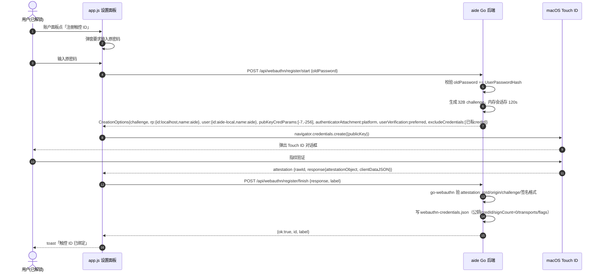
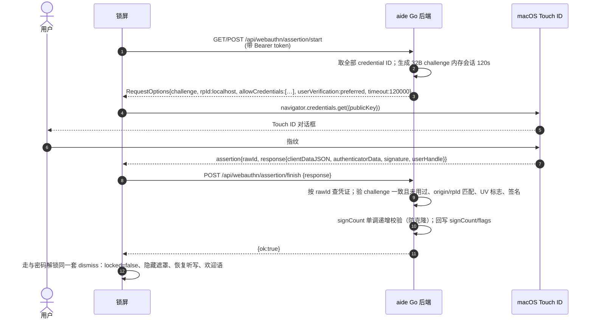

# Touch ID / WebAuthn 解锁 · 技术方案（任务6 调研产出）

> 状态：调研/设计稿，供开发 agent 执行。本文件不改产品代码。
> 分支：feature/permission-panel。基线：见 `git status`（app.js / profiles.json 有他人未提交改动，不得覆盖）。

---

## 0. 结论速览（TL;DR）

- **可行路径**：浏览器端 WebAuthn（PublicKeyCredential / Passkey），macOS Chrome/Safari 以 **Touch ID 作为 platform authenticator**。后端在 Linux 容器内，**绝不**直接调 macOS LocalAuthentication。
- **硬约束（最重要）**：必须用 **http://localhost:8097** 打开 aide。裸 IP `http://127.0.0.1:8097` 虽是 secure context，但 **WebAuthn 的 RP ID 不允许是 IP 字面量**，`localhost` 是规范唯一的 loopback 例外。前端据此做特性检测与提示。
- **库选型**：`github.com/go-webauthn/webauthn`（BSD-3，conformance 测试覆盖，Go 1.26 兼容）。go.mod 当前零依赖，新增依赖需同步改 Dockerfile 并固化 GOPROXY/vendor。
- **安全模型不变**：锁屏本就是纯视觉遮罩；指纹解锁 = 通过 Touch ID 断言后调用与密码解锁完全相同的前端 dismiss 逻辑。指纹/私钥永不出设备，后端只存公钥。
- **回退**：无 Touch ID / 用户取消 / 非 localhost 打开 / 未注册凭证 → 自动隐藏按钮，回退密码输入，不破坏现有密码解锁。

---

## 1. 现有锁屏 / 解锁链路全解析

### 1.1 前端（`internal/server/web/app.js`）

| 位置 | 职责 |
| --- | --- |
| `lockScreen = {timer, locked, wasVoiceListening}`（4018） | 锁屏运行态：空闲定时器、锁定标记、解锁前是否在听写 |
| `lockTimeoutActive()`（4019） | 需同时满足 `hasPassword && lockTimeoutSec>0` 才自动锁屏 |
| `resetIdleTimer()`（4022） | mousemove/keydown/click/scroll/touchstart 任一活动重置倒计时；已锁则不再排期 |
| `lockScreenNow()`（4041） | `locked=true`；记 `wasVoiceListening`；`voiceClose()`+`ttsCancel()` 小秘退下；显示 `#lock-screen`、清空密码框与错误、聚焦输入框 |
| `unlockScreen(pw)`（4056） | `POST /api/account/verify-password`；成功后 `locked=false`、隐藏遮罩、欢迎语 toast+speakReply、按原状态恢复听写、`resetIdleTimer()` |
| `$('lock-form').onsubmit`（4070） | 密码提交；失败显示「密码错误」并 select 密码框 |
| 全局事件监听（4080） | 5 类活动事件驱动 `resetIdleTimer` |
| `setInterval(...refreshLockStatus(),1000)`（4082） | 锁屏时每秒刷新「运行中/空闲」状态条 |
| 页面加载即锁（3110） | `if (state.config?.hasPassword && !lockScreen.locked) lockScreenNow()` |
| 顶栏锁按钮（67/71） | `ovLock` 点击 → 若 `hasPassword` 则 `lockScreenNow()` |
| 设置面板「账户」`renderAccountControl()`（4085） | 用户名 / 锁屏时间 / 原密码 / 新密码 / 保存 / 立即锁屏；`PUT /api/settings` 改密；说明「密码同时是小秘历史 AES-256-GCM 密钥，只存哈希」 |

**DOM 结构（`internal/server/web/index.html:46-58`）**：

```
#lock-screen.lock-screen[hidden]
 └─ .lock-card
     ├─ .lock-eyebrow "AIDE LOCKED"
     ├─ h2#?  .lock-title  "已锁屏"
     ├─ #lock-status.lock-status        ← 状态条
     ├─ form#lock-form
     │   ├─ input#lock-password[type=password]
     │   └─ button[type=submit].primary "解锁"
     ├─ p#lock-error.error
     └─ p.lock-hint "任务在后台继续运行…"
```

### 1.2 后端（`internal/server/server.go`）

- `POST /api/account/verify-password`（939-952）：读 `settings.UserPasswordHash`，`sha256Hex(in.Password) == hash` 常量时间比较；未设密码或不符一律 401 `密码错误`；成功 `{ok:true}`。
- `GET /api/config`（625）暴露 `hasPassword: UserPasswordHash != ""`、`lockTimeoutSec`、`userName` 等。
- `PUT /api/settings`（约 761-776）：改密时校验 `oldPassword` 哈希后写入 `UserPasswordHash = sha256Hex(newPassword)`。
- 持久化：`$AIDE_DATA/settings.json`（容器内 `/data`，宿主卷挂载），`atomicJSON` 0600。
- **鉴权中间件（600-618）**：所有 `/api/*` 必须带 `Authorization: Bearer <access-token>`（token 存 `$data/access-token`，首次启动打印）；并校验 `Origin` 与 `Host` 同源，否则 403。锁屏期间浏览器仍持有 token（页面不刷新登录态），所以 WebAuthn 端点直接挂在 `/api/webauthn/*` 下即可，**无需新增鉴权体系**。
- **重要事实**：锁屏是纯视觉层（4017 注释明示「不停止后端任务」），后端 API 在锁屏时仍可被调用。WebAuthn 解锁与密码解锁的安全边界完全一致——都只是「 dismiss 遮罩」。这是既有设计，本次不改变。

---

## 2. WebAuthn 在目标环境的可行性核实

| 问题 | 结论 | 依据/处置 |
| --- | --- | --- |
| `navigator.credentials.create/get` 支持 | Chrome 桌面 108+、Safari 16+（macOS 13+）均支持；前端必须先做特性检测 | 不支持即隐藏按钮，不报错 |
| macOS Touch ID 作 platform authenticator | 支持。Safari 走 iCloud Keychain（macOS 10.15+ 起）；Chrome 自 120 起也调 macOS 系统级 Touch ID 对话框，体验与 Safari 一致 | `authenticatorAttachment: "platform"`，`userVerification: "preferred"` |
| secure context：`http://127.0.0.1:8097` | loopback 属 potentially trustworthy，secure context 成立 | 但见下一行 RP ID 限制 |
| **RP ID 能设成 `127.0.0.1` 吗** | **不能。RP ID 必须是 registrable domain，裸 IP 永不合法；`localhost` 是规范唯一的 loopback 例外** | **用户必须用 `http://localhost:8097` 打开**。compose 发布的是 `127.0.0.1:8097`，`localhost` 解析到同一地址，零成本切换 |
| Docker 端口映射下 origin | 浏览器看到的 origin 是 `http://localhost:8097`（端口不进 RP ID，RP ID 只取 host） | 后端配置允许 origin 白名单 `http://localhost:8097` |
| 内嵌浏览器 / webview | WKWebView 类环境 Touch ID 支持参差；不赌环境 | 用 `PublicKeyCredential.isUserVerifyingPlatformAuthenticatorAvailable()` 运行时探测，false 即隐藏 |
| Chrome vs Safari 差异 | 两者 Touch ID 体验一致；区别仅在凭证落到 iCloud Keychain 还是 Google Password Manager；Firefox macOS platform authenticator 支持弱 | 特性检测兜底，差异无感 |

**前端守卫逻辑（务必实现）**：

```js
async function touchIdAvailable() {
  if (location.hostname !== 'localhost') return { ok: false, reason: 'use-localhost' };
  if (!window.PublicKeyCredential) return { ok: false, reason: 'unsupported' };
  try {
    const ok = await PublicKeyCredential.isUserVerifyingPlatformAuthenticatorAvailable();
    return ok ? { ok: true } : { ok: false, reason: 'no-touchid' };
  } catch { return { ok: false, reason: 'unsupported' }; }
}
```

`reason='use-localhost'` 时按钮旁提示「请用 http://localhost:8097 打开本页以启用触控 ID」。

---

## 3. Go 侧 WebAuthn 库选型与离线构建

### 3.1 选型

**`github.com/go-webauthn/webauthn`（当前 v0.18.x，BSD-3-Clause）**。
- conformance 测试通过；支持 `packed / tpm / none / apple` 等 attestation 格式；本场景用 **none attestation**（自 attestation，免 MDS 联网校验）。
- 使用者实现 `webauthn.User` 接口，持久化 `webauthn.Credential`（含 `ID / PublicKey / SignCount / Transports / Flags / Attestation`）。
- API 骨架（集成时以 pinned 版本 godoc 为准）：
  - `New(Config{RPID:"localhost", RPName:"aide", Timeout:…, …})`
  - `wa.BeginRegistration(user, opts…) → (CreationOptions, sessionData, err)`
  - `wa.FinishRegistration(user, creationResponse, sessionData) → (*Credential, err)`
  - `wa.BeginLogin(user, opts…) → (RequestOptions, sessionData, err)`
  - `wa.FinishLogin(user, requestResponse, sessionData) → (*Credential, err)`，返回值携带最新 SignCount/Flags 用于回写。

> 备选 `github.com/duo-labs/webauthn`（go-webauthn 的前身，已归档停维护），不采用。

### 3.2 离线/受限网络构建（风险点，必须处理）

现状：`go.mod` **零依赖、无 go.sum**；Dockerfile 只 `COPY go.mod ./`（第 16 行）。引入依赖后：

1. Dockerfile build 阶段必须补 `COPY go.sum ./`，并在 `go build` 前 `go mod download`。
2. 构建机在国内（pip 已走 aliyun 镜像）：给 build 阶段加 `ENV GOPROXY=https://goproxy.cn,direct GOSUMDB=sum.golang.google.cn`，否则拉 `proxy.golang.org` 易卡死。
3. **推荐 `go mod vendor` 并提交 `vendor/`**（与仓库内 `internal/server/web/vendor/` 既有风格一致），Dockerfile 加 `-mod=vendor`，实现完全可复现、不依赖外网。
4. 运行期**不做** attestation 在线校验（用 memory metadata provider / none 策略），容器内零外网依赖。

### 3.3 凭证存储

新增独立文件 **`$dataPath/webauthn-credentials.json`**（0600，`atomicJSON` 原子写，与 settings.json 同目录同手法）。结构：

```jsonc
{
  "version": 1,
  "rpId": "localhost",
  "userHandle": "aide-local",          // 单机单用户，固定 userHandle
  "credentials": [
    {
      "id": "<base64url credentialId>",
      "label": "MacBook Pro 触控 ID",
      "createdAt": 1758900000,
      "credential": { /* webauthn.Credential 原样 JSON：publicKey/signCount/transports/flags/attestation */ }
    }
  ]
}
```

- 不放进 settings.json：凭证是安全资产，独立文件便于 0600 权限与备份导出时单独脱敏（现有配置导出 `config_backup.go` 应**排除**该文件，避免公钥随备份扩散——见 §9）。
- challenge 会话：**进程内内存 map**（`challenge → {kind, expireAt}`），持 `a.mu`；单实例、单机使用足够；finish 后立即删除（一次性）；TTL 120 秒。

---

## 4. 注册流程设计（设置 → 账户 → 绑定本机 Touch ID）

前置条件：已解锁、已设密码。注册需先验密码，防止他人在已解锁界面偷偷登记自己的凭证。



要点：
- `excludeCredentials` 传入已注册凭证 ID，避免同一台机器重复登记。
- `label` 由后端生成默认值（如「MacBook Pro 触控 ID」）或用户填写。
- 失败（密码错 / 用户取消 / 非 localhost）→ 前端 toast 回退，不留半成品凭证。

---

## 5. 解锁流程设计（锁屏界面 → Touch ID 解锁）



要点：
- 前端新增 `unlockByTouchId()`，成功后复用 `unlockScreen()` 的收尾逻辑——把 4056-4068 的收尾抽成 `dismissAfterUnlock()`，密码路径与指纹路径共用，**保证两路径行为逐字节一致**。
- 用户取消（`NotAllowedError`）：静默失败，留在密码框，不报错。
- `assertion/finish` 验证失败一律 401，前端显示 `#lock-error`，密码仍可用。

---

## 6. 回退与凭证管理

| 场景 | 行为 |
| --- | --- |
| 无 Touch ID / 浏览器不支持 | 不显示「触控 ID 解锁」按钮，密码框原样 |
| 用户在 Touch ID 弹窗点取消 | 静默回退密码输入 |
| 用 127.0.0.1 打开 | 按钮隐藏 + 文案引导改用 localhost |
| 未注册任何凭证 | assertion/start 返回空 allowCredentials，前端隐藏按钮 |
| 注册多个设备/多次登记 | 凭证列表展示：label、注册时间、transports、backupEligible |
| 重命名 | `PUT /api/webauthn/credentials/{id}` 改 label |
| 删除/设备丢失 | `DELETE /api/webauthn/credentials/{id}`（body 需 oldPassword 二次确认）；用密码登录后即可撤销 |
| 忘记密码且指纹可用 | 指纹仅解锁本地遮罩，**不重置密码**（密码还是聊天历史 AES 密钥），与现有语义一致 |

设置面板「账户」区在现有「立即锁屏」下方追加：已绑定凭证列表（每行 label + 删除按钮）+「绑定触控 ID」按钮。

---

## 7. 与任务2 主从锁定的集成点

任务2 主从锁定尚未合入本仓库（代码库内暂无 `masterLocked/localDismiss` 实现）。集成约定：

- 指纹 `assertion/finish` 成功后，前端调用**与密码解锁相同的本地状态函数**；
- 从界面分支：只 `localDismiss()`，不广播、不动主界面；
- 主界面分支：指纹解锁 = `masterLocked=false` 并广播（与密码解锁完全同路径）。
- 后端不感知主从——指纹断言只是「本机有人通过了 Touch ID」，dismiss 范围由前端 JS 按任务2 既有分支决定。
- 实现约束：`dismissAfterUnlock()` 必须成为密码与指纹共用的唯一出口，任务2 改造该出口时自动覆盖两条路径。

---

## 8. 端点与存储设计

全部挂在既有 Bearer 中间件之后（`/api/webauthn/*`），复用 `decode/jsonOut/fail` 约定：

| 方法 & 路径 | 请求 | 响应 | 说明 |
| --- | --- | --- | --- |
| `POST /api/webauthn/register/start` | `{oldPassword}` | `CreationOptions`（CBOR/ArrayBuffer 用 base64url JSON） | 先验密码；生成 challenge |
| `POST /api/webauthn/register/finish` | `{response, label}` | `{ok:true, id}` | 验 attestation、落盘凭证 |
| `POST /api/webauthn/assertion/start` | `{}` | `RequestOptions` | 生成 challenge、列出 allowCredentials |
| `POST /api/webauthn/assertion/finish` | `{response}` | `{ok:true}` | 验断言、更新 signCount |
| `GET /api/webauthn/credentials` | — | `[{id,label,createdAt,transports,backupEligible}]` | 列表（**绝不**回传 publicKey/signCount 内部态） |
| `PUT /api/webauthn/credentials/{id}` | `{label}` | `{ok:true}` | 重命名 |
| `DELETE /api/webauthn/credentials/{id}` | `{oldPassword}` | `{ok:true}` | 二次密码确认后删除 |

配置项（`settings.json` / env）：
- `AIDE_WEBAUTHN_RPID`，默认 `localhost`；`AIDE_WEBAUTHN_RP_NAME`，默认 `aide`；`Timeout` 默认 120000ms。
- `/api/config` 增加 `webAuthnReady: true/false`（后端有库可用且 RPID=localhost 时 true），供前端决定是否渲染按钮。

---

## 9. 安全分析

1. **私钥不出设备**：Touch ID 对应的私钥存于 macOS Secure Enclave / iCloud Keychain，后端只存公钥、credential ID、签名计数。
2. **签名计数（signCount）单调校验**：每次成功断言后回写 `authenticator.SignCount`；新值 ≤ 旧值且非合法 0→0 场景即告警/拒绝，防凭证克隆。
3. **origin / RP ID 强校验**：后端固定 RPID=localhost；`finish` 阶段校验 clientDataJSON 的 origin 必须落在白名单（`http://localhost:8097`），challenge 必须与内存会话一致。
4. **challenge 一次性 + 过期**：32 字节 crypto/rand；TTL 120s；finish 即删；不通过 finish 消费的 challenge 到期自动清（后台定时或惰性检查）。
5. **凭证文件保护**：`webauthn-credentials.json` 0600，仅公钥材料，即使泄露也无法离线伪造（私钥在 Secure Enclave）。
6. **注册强认证**：register/start 必须先验原密码，杜绝「已解锁即被登记后门凭证」。
7. **删除强认证**：DELETE 必须带原密码。
8. ** attestation 策略**：`none`，不收集设备型号/证书，最小化隐私面；不开启 MDS 联网。
9. **与现有密码同等强度**：不提升也不降低既有安全边界（锁屏本就是视觉遮罩，API 不因此变安全——保持现状声明即可）。
10. **配置备份注意**：`config_backup.go` 导出时排除 `webauthn-credentials.json`（公钥跨机迁移无意义，且避免扩大暴露面）。

---

## 10. 文档与图需求

需更新的文档清单：
- `docs/user-guide.md`：新增「触控 ID 解锁」一节——要求用 http://localhost:8097 打开、macOS + Chrome/Safari、在设置→账户绑定。
- `README.md`（可选）：特性列表加 Touch ID 解锁。
- `docs/architecture/`：本文件即为设计记录。
- `docs/tasks/<task-id>.json`：开发 agent 接手后按 WORKFLOW 填 acceptance/scope/stages。

时序图：§4 注册、§5 解锁两张 mermaid 图已随本稿给出，交付时原样保留（仓库已内联 mermaid，可直接渲染）。

硬件/浏览器/安全上下文要求（用户须知）：
- Apple Silicon / 带 Touch ID 的 Intel Mac；
- macOS 13+，Chrome 108+ 或 Safari 16+；
- **必须以 `http://localhost:8097` 访问**（127.0.0.1 地址栏不可用，RP ID 不支持 IP）；
- 无需 HTTPS（loopback 例外）；无需外网；
- 无 Touch ID 的机器自动回退密码，功能可选不强制。

---

## 11. 开发 agent 实施清单（落地顺序）

1. `go get github.com/go-webauthn/webauthn@<pinned>`，`go mod vendor`；改 Dockerfile 补 `COPY go.sum ./`、`-mod=vendor`、`GOPROXY=https://goproxy.cn,direct`。
2. 新增 `internal/server/webauthn.go`：Config 初始化、内存 challenge store、credentials 读写（0600）、7 个端点 handler、实现 `webauthn.User` 接口。
3. `server.go` 注册路由；`/api/config` 加 `webAuthnReady`。
4. 前端 app.js：`touchIdAvailable()` 探测；`#lock-screen` 加「触控 ID 解锁」按钮；抽 `dismissAfterUnlock()`；设置面板加凭证管理 UI；i18n 走 `t()` / `data-i18n`。
5. 测试：Go 单测覆盖 challenge 过期/重放、错误签名、signCount 回退拒绝；手动在真实 Touch ID 机器走通注册→锁屏→指纹解锁→删凭证。
6. 不破坏既有：密码解锁全路径回归；`node --check app.js`、`go test ./...`、`go vet` 全绿。

---

## 12. 实现状态（2026-09-25 任务6 交付）

**状态：已实现，待真机 Touch ID 按压验证（NOT_RUN）。**

### 端点清单（实际实现）

| 方法 & 路径 | 说明 |
| --- | --- |
| `POST /api/webauthn/register/start` | body `{oldPassword}`；验密码后返回 CreationOptions，challenge 存内存 map（120s TTL） |
| `POST /api/webauthn/register/finish?challenge=...` | body 为浏览器 attestation 原始 JSON；`?label=` 可选；成功后写 `$data/webauthn-credentials.json` |
| `GET /api/webauthn/credentials` | 返回 `[{id, name, createdAt, signCount}]`（不回传 publicKey） |
| `PUT /api/webauthn/credentials/{id}` | body `{label}` 重命名 |
| `DELETE /api/webauthn/credentials/{id}` | body `{oldPassword}` 二次确认后删除 |
| `POST /api/webauthn/assertion/start` | 返回 RequestOptions（allowCredentials 列出全部已注册凭证） |
| `POST /api/webauthn/assertion/finish?challenge=...` | body 为 assertion 原始 JSON；验签通过后回写 signCount |

### 凭证存储格式

`$dataPath/webauthn-credentials.json`（0600，`atomicJSON` 原子写）：

```json
{
  "version": 1,
  "rpId": "localhost",
  "credentials": [
    {
      "id": "<base64url credentialId>",
      "name": "MacBook 触控 ID",
      "createdAt": 1758900000,
      "credential": { "id": "...", "publicKey": "...", "authenticator": { "signCount": 0 }, "flags": {} }
    }
  ]
}
```

### challenge 会话管理

- 进程内内存 `map[string]*webauthn.SessionData`，key = challenge 的 base64url 字符串；
- TTL 120 秒，finish 时立即删除（一次性）；
- 惰性清理：每次 start 前扫描过期项。

### 依赖

- `github.com/go-webauthn/webauthn v0.18.2`（BSD-3）；
- `go mod vendor` 提交 vendor 目录，Dockerfile 使用 `-mod=vendor` 离线构建；
- Dockerfile 构建阶段设 `GOPROXY=https://goproxy.cn,direct`。

### 前端

- `dismissAfterUnlock()` 为密码与触控 ID 共用唯一出口；
- 锁屏页 `#touchid-unlock-btn` 仅在 `webAuthnReady && hostname==='localhost' && isUserVerifyingPlatformAuthenticatorAvailable()` 时显示；
- 设置→账户→触控 ID/Passkey 分区：注册新设备 + 已注册设备列表（重命名/删除）。

### 未验证项（NOT_RUN）

- 真机 Touch ID 按压注册 → 锁屏 → 指纹解锁 → 删凭证全流程，必须用户本人完成。

---

## 13. 统一主身份认证（#43，RC2 收口）

RC2 在 WebAuthn 之上加了一层**统一本机主身份认证**入口，把"证明本人在场"的所有 A 类敏感动作收敛到同一个端点与同一个前端组件。

### 13.1 端点

`POST /api/auth/verify`（挂在既有 Bearer 中间件后）：

```jsonc
// body（密码 或 WebAuthn 断言二选一）
{ "password": "<账户密码>" }                       // 密码路径
// 或
{ "assertion": { …浏览器 assertionToJSON 原始 JSON… }, "challenge": "<base64url>" }
```

- 成功返回 `{ "ok": true, "scope": "master", "unlocked": true }`（无密码用户返回 `unlocked: <vault 当前态>`）；
- 失败 401：`密码错误` / `指纹验证失败`；两者均写审计 `master-auth:failed:password|webauthn`；
- 成功路径写审计 `master-auth:password` / `master-auth:webauthn` / `master-auth:passwordless`。
- 密码路径额外动作：派生主密钥解锁 vault + 迁移暂存的旧明文 API Key（与 `/api/unlock` 同一逻辑）；
- 断言路径：复用 `/api/webauthn/assertion/finish` 的同一 `ValidateLogin` 校验流程（origin/RP ID/challenge/signCount），**不接触主密钥**，只证明本机用户在场；授权范围与输主密码完全一致（`scope:"master"`），不扩大。

### 13.2 前端组件

新增 `requestMasterAuth()` 统一组件：优先弹 Touch ID/WebAuthn（若 `webAuthnReady && hostname==='localhost' && 有可用平台凭证`），失败或不可用回退密码输入框；二选一通过即 resolve，用于所有 A 类动作。

### 13.3 A 类接入点（6 处）

| 位置 | 原认证方式 | 现在 |
| --- | --- | --- |
| 锁屏解锁 | 密码 | 密码或 Touch ID 二选一（共用 dismissAfterUnlock） |
| 小秘历史查看 ×3 | 密码门 | `requestMasterAuth`（密码或指纹） |
| 改密码 | 原密码 | `requestMasterAuth` |
| vault 解锁（重启后调模型） | 密码弹窗 | `requestMasterAuth` |
| assistant-gate（小蜜会话进入） | `POST /api/sessions/{id}/unlock-assistant` 密码门 | `requestMasterAuth` |

B 类敏感动作（API Key 保存/清除、SSH 凭据、PDF 打开密码等）**不经**此统一组件，沿用各自原流程，不扩大认证面。
