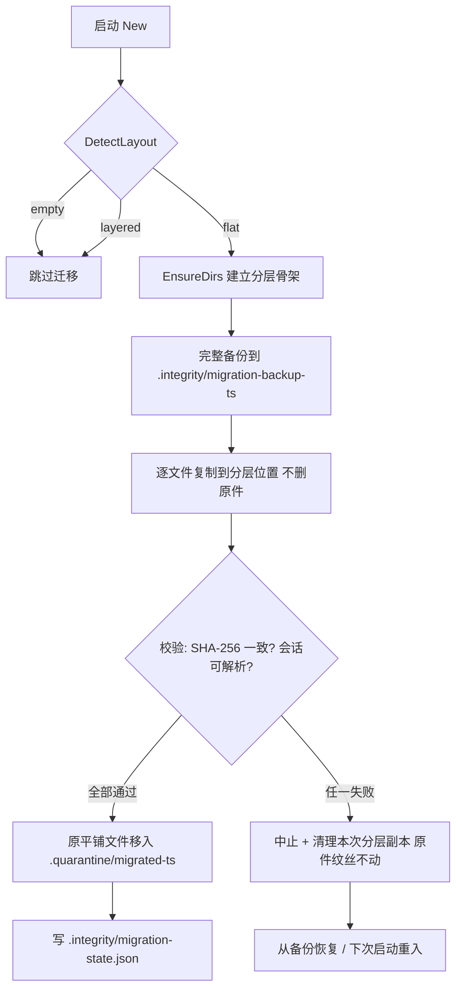

# 数据目录分层与完整性自愈

> 版本：0.1.11.0-RC1 · 分支：feature/permission-panel · 关联：#29 安全 / #30 编号会话 / #38 保险库
> 权威方案：`proposals/data-integrity/data-layering-and-self-healing.html`

aide 把数据分为三类边界：**程序（镜像只读）/ 项目（绑定挂载，用户所有）/ 状态（命名卷，aide 私有）**。
本文描述状态卷 `/data` 从“30+ 平铺文件”重构为语义化分层目录的目标布局、一次性迁移流程，以及启动校验 + 运行巡检 + 自动恢复的闭环。

## 一、目标目录结构

```
/data                        状态卷根（aide 私有，0700）
├─ auth/                     认证凭据（机密，0600）
│   ├─ access-token         本机访问令牌
│   ├─ kdf-salt.bin          Argon2id 固定派生盐
│   ├─ password.phc         账户密码 Argon2id PHC（#29）
│   └─ webauthn-credentials.json  Touch ID / WebAuthn 凭证
├─ sessions/                 会话数据
│   ├─ active/session-*.json    活动会话
│   ├─ archived/session-*.json  归档会话
│   └─ assistant/session-*.json  小蜜系统会话（#30）
├─ assistant/                小蜜私有区（全局、加密）
│   ├─ voice-history.json   小蜜对话历史信封
│   └─ voice-memory.json     小蜜长期记忆
├─ memory/                   aide 主记忆系统
│   ├─ core/                 核心记忆
│   ├─ cache/                嵌入/向量缓存（可再生）
│   └─ feedback/             好/坏回答反馈
├─ config/                   配置
│   ├─ settings.json         全局设置（原子写）
│   ├─ profiles.json          模型自定义配置
│   └─ backups/               配置导入导出与历史副本
├─ stats/                    统计（可再生）
│   ├─ token-stats.json
│   └─ token-pricing.json
├─ audit/                    审计日志（追加写，只增不删）
│   ├─ debug-audit.jsonl     外部接入审计
│   └─ security-audit.jsonl  安全/恢复审计
├─ secrets/                  第三方来源/工作区密钥（加密）
│   ├─ vault.enc
│   ├─ sources-secrets.json
│   └─ workspace-secrets.json
├─ certs/                    TLS 证书与私钥（#29，0600）
│   ├─ cert.pem
│   └─ key.pem
├─ .integrity/               完整性清单 / 基线 / 恢复日志
│   ├─ baseline.json
│   ├─ migration-state.json
│   └─ recovery.log
└─ .quarantine/              损坏用户数据隔离区（不自动删）
```

代码权威来源：`internal/server/paths.go`。所有路径由纯函数返回（如 `SettingsPath(data)`、`SessionPath(data,id,"active")`），`EnsureDirs(data)` 以 0700 创建全部分层目录。

## 二、一次性迁移流程

旧版本把 `settings.json`、`access-token`、`session-*.json`、`voice-history.json` 等 30+ 文件平铺在 `/data` 根。新版启动时运行幂等迁移器：



要点：
- **复制 → 校验 → 再动原件**：任何一步不一致都不删原文件，已复制的分层副本被清理，下次启动从断点续作。
- **原件不直接删**：校验通过后移入 `.quarantine/migrated-<ts>/`，保留一个版本周期。
- **幂等可重入**：已分层直接跳过；部分迁移时，目标已存在且哈希一致视为已完成。
- **损坏会话不强行归位**：JSON 不可解析的会话留在平铺根，由启动校验跳过/隔离，不丢数据。

## 三、完整性校验机制

```mermaid
flowchart LR
    subgraph 构建期
      B1[Docker 构建 对二进制算 SHA-256]
    end
    subgraph 启动
      S1[比对程序哈希与基线] --> S2[校验 /data 目录结构] --> S3[关键文件可解析性]
    end
    subgraph 运行时
      P1[每 5 分钟轻量巡检] --> P2[敏感操作前校验]
    end
    subgraph 上报
      R1[/healthz integrity 状态] --> R2[/api/debug/overview integrity]
    end
    B1 -->|baseline.json| S1
    S3 --> P1
    P1 --> R1
```

- **基线**：`BuildBaseline` 首次启动对运行二进制算 SHA-256，写入 `.integrity/baseline.json`（含 version/commit）。
- **启动校验**：`VerifyIntegrity` 输出 `IntegrityReport{status, checks[], quarantined[], healed[], errors[]}`。
- **运行巡检**：`RunPeriodicIntegrity` 后台 goroutine 每 5 分钟复查，结果回写 healthz。
- 所有写盘沿用 `atomicJSON`（temp+rename），杜绝写一半损坏。

## 四、自愈策略

| 异常分支 | 自动恢复动作 | 安全边界 |
| --- | --- | --- |
| 缺失目录 | `EnsureDirs` 重建 | 无数据损失 |
| 缺失默认配置 | 用默认值打底 | 不丢已有设置 |
| 可再生数据（cache/stats） | 清空重建 | 不影响核心数据 |
| 损坏关键文件（settings/sessions） | 移入 `.quarantine`，settings 回退默认 | 用户数据只隔离、不自动删 |
| 程序层被篡改/换版 | 不自动修复，healthz 标 `degraded`，提示重新部署镜像 | 程序在卷外，只读 |
| 密码/密钥丢失 | 密码不可恢复→重置；access-token 丢失→重新生成 | 符合既有设计 |
| 小蜜历史 re-wrap 失败 | 保留旧/新密文双份，标 `degraded`，不覆盖 | 防止历史丢失 |

每次校验与恢复都追加 `.integrity/recovery.log`，恢复后再校验形成闭环。

## 五、healthz / /api/debug 输出

```json
// GET /healthz
{"status":"ok","service":"aide","integrity":"ok"}
```

`integrity` 取值：`ok`（正常）/ `degraded`（可降级运行，如程序疑似换版、re-wrap 失败）/ `corrupted`（严重损坏需人工介入）。`GET /api/debug/overview` 顶层同样暴露 `integrity` 字段，无浏览器亦可诊断。

## 六、部署注意事项

- **Docker volume 映射**：`/data` 为命名卷，跨项目、跨升级持久；不要把 `/data` 写进用户项目目录。
- **首次启动迁移**：旧平铺卷在首次启动时自动迁移，全程备份可回滚；无需人工干预。
- **权限**：分层目录 0700，敏感文件 0600。
- **TLS 路径对齐**：当前运行期 TLS 证书仍写 `data/tls/`（#29/B 任务在改）；`paths.go` 已定义 `certs/` 目标位置，待 B 完成后统一对齐。
