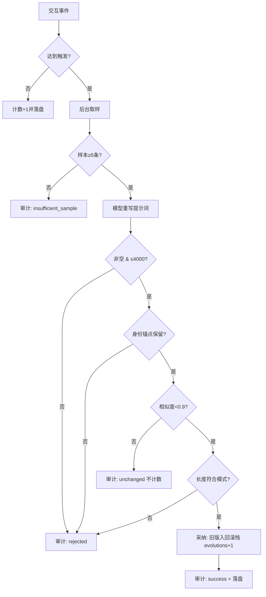

# 可演化性格系统：触发持久化与安全微调

> 版本：0.11.0-RC1 · 分支：feature/permission-panel · 关联：#29 加密 / #31 目录分层 / #33 身份核心
> 代码：`internal/server/personality_evolution.go`、`persona.go`、`workflow.go`、`server.go`、`debug.go`

修复"多次使用后性格不自主微调"：旧实现把演化等同于"必须严格更短"，且触发太窄（aide 仅压缩后、小秘计数只在内存），导致默认提示词一旦精炼后，后续偏好微调几乎必然被拒或永不触发。

## 一、触发机制（四维 + 持久化）

| 维度 | aide | 小秘 | 说明 |
|---|---|---|---|
| 消息/交互计数 | 每 **20** 条用户消息 | 每 **15** 次有效交互（send/analyze 成功） | 达到阈值即触发，计数归零 |
| 时间兜底 | 距上次演化 >**72h** 且累计交互 ≥**5** | 同左 | 防长期不演化，避免只靠计数 |
| 压缩/归档事件 | 压缩后触发 | — | 用"纯压缩模式" |
| 手动 | 设置页「立即演化」 | 同左 | 同步返回结果 |

**持久化**：自上次演化以来的计数、上次演化时间、上次尝试结果、回滚历史全部落盘
`config/personality-state.json`（启动时 `loadPersonalityState()` 读取），重启不清零——替代旧版仅在内存的 `voiceSendSinceEvolve`。

## 二、演化与压缩解耦

两种模式分离，不再用同一套"必须更短"硬卡：

- **常规演化 `refine`**（计数/时间/手动触发）：精炼 + 根据近期**稳定、反复出现**的偏好微调措辞与侧重。允许小幅变长。
- **纯压缩 `compress`**（仅压缩事件触发）：只减不增，用于上下文整理后回收 token。

## 三、采纳条件（refine 模式）

模型返回新提示词后，依次校验，任一不过即拒绝（记录原因）：

1. **非空**；
2. **硬上限**：长度 ≤ **4000** 字符（防长期膨胀）；
3. **核心一致性**：身份锚点（aide→"aide"，小秘→"小秘"或自定义名）必须仍出现（包含性 checklist），否则判核心丢失；
4. **相似度门槛**：与旧版字符二元组 Jaccard ≥ **0.9** 视为"无实质变化"，**不采纳也不计数**；
5. **长度倍率**：`len(new) ≤ len(old) × 1.1`。

`compress` 模式额外要求 `len(new) < len(old)`（严格更短）。

## 四、可观测审计

每次演化尝试（成功/拒绝/失败/无变化/样本不足）都：

- 追加写 `audit/personality-audit.jsonl`：时间、id、触发原因、前后长度、累计 evolutions、备注；
- `log.Printf` 输出一行，失败不再静默；
- 状态在 `/api/debug/overview` 的 `personality` 段可见（evolutions/updatedAt/countSinceEvolve/lastAttemptResult）。

## 五、统一取样

- **aide**：取最近会话最近 12 条真实消息；
- **小秘**：取语音历史 `snapshotHistory()`（含 Summarized/Heard）+ 助理会话消息；
- 最小样本 **5 条**，不足则跳过并记 `insufficient_sample`，不强行演化；
- 只提炼反复出现的稳定偏好，排除一次性琐事。

## 六、回滚与上限

- 采纳前把旧提示词压入回滚栈，保留最近 **5** 份；
- 端点：`POST /api/personality/rollback`（恢复上一版）、`POST /api/personality/reset`（恢复默认并清空历史）；
- evolutions 与提示词长度均设硬上限，防长期漂移膨胀。

## 七、安全归属

- **aide 性格**：明文存 `config/settings.json` 的 `personalities`（工作向，无需密码）；
- **小秘性格**：加密存 `data/assistant/`（语音历史信封，遵循 #29/#31）；
- 演化触发状态 `config/personality-state.json` 为明文运行态，不含敏感对话内容。

## 八、演化决策流程

