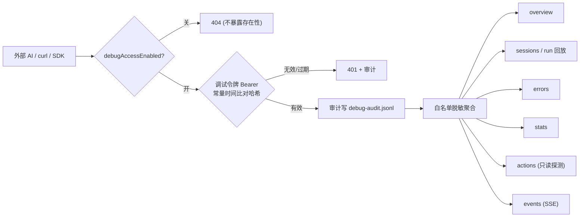
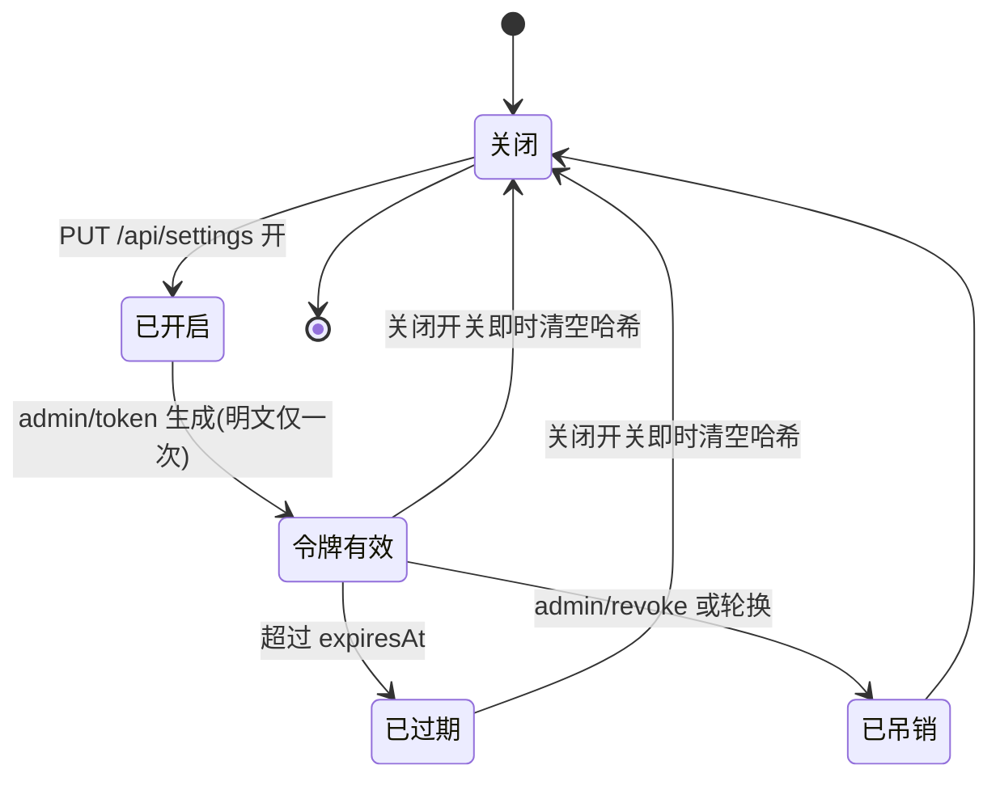

# 外部 AI 机器可读诊断接口（/api/debug）

面向**外部 AI / 脚本 / SDK** 的只读诊断接口。默认关闭；开启后通过一条**独立调试令牌**访问，全程审计、白名单脱敏。
本接口**不面向浏览器终端用户**——浏览器里的设置面板用普通访问令牌管理它。

## 设计原则

- **默认关**：`debugAccessEnabled` 默认 `false`。关闭时 `/api/debug/*` 整体返回 `404`，不暴露接口存在性。
- **只读、最小权限**：除两个受控动作（连通性探测、导出诊断包）外全部为 `GET`；不提供任何修改会话/配置/模型的写动作。
- **独立令牌**：调试令牌与浏览器普通 `access-token` 物理分离，只存 SHA-256 哈希，明文仅创建时返回一次。
- **权限隔离**：调试令牌**只能**访问 `/api/debug/*`，不能访问普通 `/api/*`；管理面（`/admin`、`/audit`）只认普通访问令牌。
- **全程审计**：每次访问落盘 `data/debug-audit.jsonl`。
- **白名单脱敏**：绝不返回 API Key、密码哈希、人格密文、请求快照正文、`access-token`。

## 鉴权

```
GET /api/debug/overview HTTP/1.1
Authorization: Bearer <调试令牌>
```

- 令牌来源：设置 → 无障碍 →「允许外部 AI 接入调试」→ 生成调试令牌（明文仅显示一次）。
- SSE 事件流（`/events`）因 `EventSource` 无法设置请求头，允许 `?access_token=<调试令牌>`。
- 其余端点一律不收 URL 中的凭据。
- 可选来源白名单 `debugAllowOrigins`：仅校验浏览器 `Origin` 头；纯 `curl` 不带 `Origin`，不受影响。

## 端点清单

| 方法 | 路径 | 说明 |
| --- | --- | --- |
| GET | `/api/debug/overview` | 总览：状态/版本/uptime/配置脱敏/挂载/provider 连通性 |
| GET | `/api/debug/sessions` | 会话+最近 run 列表；`?status=running\|failed` 过滤 |
| GET | `/api/debug/sessions/{id}/runs/{run}` | run 回放：步骤/工具名/错误/失败计数（不含消息原文） |
| GET | `/api/debug/sessions/{id}/runs/{run}/events` | SSE 实时观察 run |
| GET | `/api/debug/errors` | 最近 50 条错误 + 跨 run 失败循环 Top10 |
| GET | `/api/debug/stats` | 复用 token 用量统计 |
| POST | `/api/debug/actions/ping-provider` | 只读探测 Provider 连通性+延迟（不回传模型列表） |
| POST | `/api/debug/actions/diagnostic-bundle` | 导出脱敏诊断包 |
| GET | `/api/debug/audit` | 最近 20 条接入审计（管理面，普通访问令牌） |
| POST | `/api/debug/admin/token` | 生成/轮换调试令牌（管理面，普通访问令牌） |
| POST | `/api/debug/admin/revoke` | 吊销调试令牌（管理面） |
| POST | `/api/debug/admin/toggle` | 开关切换（规范入口仍是 `PUT /api/settings`） |

## 接入示例（纯 curl，无浏览器无 cookie）

```bash
TOKEN="<生成调试令牌时显示的明文>"
BASE=http://127.0.0.1:8097

# 总览
curl -s -H "Authorization: Bearer $TOKEN" $BASE/api/debug/overview | jq .

# 会话列表（仅看失败的）
curl -s -H "Authorization: Bearer $TOKEN" "$BASE/api/debug/sessions?status=failed" | jq .

# Provider 连通性
curl -s -X POST -H "Authorization: Bearer $TOKEN" $BASE/api/debug/actions/ping-provider | jq .
```

`overview` 响应样例（脱敏后）：

```json
{
  "status": "ok",
  "version": "0.1.10.2 RC1",
  "uptimeSec": 3721,
  "config": { "providerHost": "api.deepseek.com", "model": "deepseek-v4-flash", "hasKey": true, "hasPassword": true },
  "mounts": {
    "workspace": { "path": "/workspace", "writable": true, "freeBytes": 40000000000 },
    "context":   { "path": "/context",   "writable": false, "freeBytes": 40000000000 }
  },
  "provider": { "reachable": true, "lastProbeMs": 183, "checkedAt": "2026-09-25T10:00:00Z" }
}
```

## 开关与令牌生命周期

总开关默认关。开启：设置面板切换，或
`PUT /api/settings {"debugAccessEnabled": true, "activeModel": "<当前模型>"}`。

- 关闭时：`/api/debug/*` 立即整体 `404`，并**即时清空令牌哈希**（无凭据残留）。
- 令牌轮换：`POST /api/debug/admin/token` 生成新令牌，旧令牌立即失效；明文仅本次返回。
- 吊销：`POST /api/debug/admin/revoke`。

## 写/受控动作边界（默认禁用清单）

本接口**不提供**：发送新会话/消息、取消/重试任务、改设置、改模型、读写工作区文件、导出原始会话消息、查询余额。
两个 `POST` 动作均为只读探测：`ping-provider` 只发一次 `GET {baseURL}/models` 并计时；`diagnostic-bundle` 只聚合已脱敏数据。

## 脱敏红线

- 绝不返回：`apiKey`/`APIKey` 明文、`userPasswordHash`、`personaCiphers`、小秘历史明文、`requestSnapshots` 正文、`settings.json` 全量、`access-token`、`Authorization` 头。
- 只返回：`hasKey:true`、`hasPassword:true`、`baseURL` 主机名、模型 id、布尔/脱敏形态。

## 数据流（mermaid）




