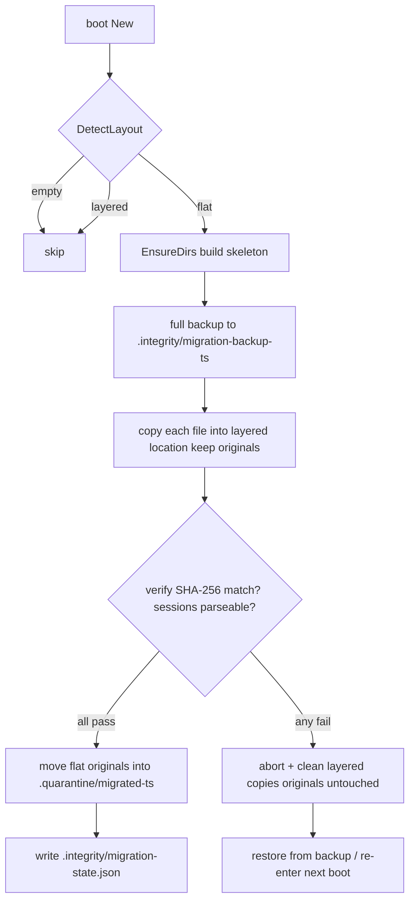

# Data Directory Layering & Integrity Self-Healing

> Version: 0.1.11.0-RC1 · Branch: feature/permission-panel · Related: #29 security / #30 numbered sessions / #38 vault
> Authoritative design: `proposals/data-integrity/data-layering-and-self-healing.html`

aide separates storage into three boundaries: **program (read-only image) / projects (bind-mounted, user-owned) / state (named volume, aide-private)**.
This document describes the target layout that refactors the legacy flat `/data` volume (30+ files) into semantic subdirectories, the one-time migration, and the boot-time + runtime + self-heal loop.

## 1. Target directory structure

```
/data                        state volume root (aide-private, 0700)
├─ auth/                     credentials (secret, 0600)
│   ├─ access-token          local access token
│   ├─ kdf-salt.bin          Argon2id fixed KDF salt
│   ├─ password.phc          account password Argon2id PHC (#29)
│   └─ webauthn-credentials.json  Touch ID / WebAuthn credentials
├─ sessions/                 sessions
│   ├─ active/session-*.json    active sessions
│   ├─ archived/session-*.json archived sessions
│   └─ assistant/session-*.json  assistant system sessions (#30)
├─ assistant/                voice-assistant private area (global, encrypted)
│   ├─ voice-history.json   conversation history envelope
│   └─ voice-memory.json     long-term memory
├─ memory/                   main memory system
│   ├─ core/                 core memory
│   ├─ cache/               embedding/vector cache (regenerable)
│   └─ feedback/             good/best-answer feedback
├─ config/                   configuration
│   ├─ settings.json         global settings (atomic write)
│   ├─ profiles.json         model custom profiles
│   └─ backups/               import/export and history copies
├─ stats/                    stats (regenerable)
│   ├─ token-stats.json
│   └─ token-pricing.json
├─ audit/                    audit logs (append-only)
│   ├─ debug-audit.jsonl     external-access audit
│   └─ security-audit.jsonl  security/recovery audit
├─ secrets/                  third-party / workspace secrets (encrypted)
│   ├─ vault.enc
│   ├─ sources-secrets.json
│   └─ workspace-secrets.json
├─ certs/                    TLS cert & private key (#29, 0600)
│   ├─ cert.pem
│   └─ key.pem
├─ .integrity/               manifests / baseline / recovery log
│   ├─ baseline.json
│   ├─ migration-state.json
│   └─ recovery.log
└─ .quarantine/              corrupted-user-data quarantine (never auto-deleted)
```

Source of truth: `internal/server/paths.go`. Every path is returned by a pure function (e.g. `SettingsPath(data)`, `SessionPath(data,id,"active")`); `EnsureDirs(data)` creates all layered directories at 0700.

## 2. One-time migration flow

Older releases laid 30+ files flat at the `/data` root. On startup, an idempotent migrator runs:



- **Copy → verify → then move originals**: on any mismatch, originals are never deleted; layered copies made this run are removed; the next boot resumes from the checkpoint.
- **Originals are quarantined, not deleted**: after verification, flat files move to `.quarantine/migrated-<ts>/` and are kept for one release cycle.
- **Idempotent/re-entrant**: already layered → skip; partial migration with matching hashes → resume.
- **Corrupt sessions are not forced into the layered area**: unparseable session files stay at the flat root and are skipped/quarantined at boot; no data loss.

## 3. Integrity verification

```mermaid
flowchart LR
    subgraph build
      B1[Docker build hash binary SHA-256]
    end
    subgraph boot
      S1[compare binary hash to baseline] --> S2[check /data dir structure] --> S3[key files parseable]
    end
    subgraph runtime
      P1[light check every 5 min] --> P2[before sensitive ops]
    end
    subgraph report
      R1[/healthz integrity status] --> R2[/api/debug/overview integrity]
    end
    B1 -->|baseline.json| S1
    S3 --> P1
    P1 --> R1
```

- **Baseline**: `BuildBaseline` hashes the running binary on first boot and writes `.integrity/baseline.json` (with version/commit).
- **Boot check**: `VerifyIntegrity` returns `IntegrityReport{status, checks[], quarantined[], healed[], errors[]}`.
- **Runtime patrol**: `RunPeriodicIntegrity` goroutine re-checks every 5 minutes and refreshes healthz.
- All writes use `atomicJSON` (temp + rename) to avoid half-written corruption.

## 4. Self-healing policy

| Anomaly branch | Recovery action | Safety boundary |
| --- | --- | --- |
| Missing directory | rebuild via `EnsureDirs` | no data loss |
| Missing default config | fall back to defaults | existing settings preserved |
| Regenerable data (cache/stats) | clear and rebuild | core data unaffected |
| Corrupted key file (settings/sessions) | move to `.quarantine`; settings fall back to defaults | user data quarantined, never auto-deleted |
| Program layer tampered/rebased | do not auto-fix; healthz `degraded`, prompt redeploy | program lives outside the volume, read-only |
| Password/key lost | password unrecoverable → reset; access-token lost → regenerate | matches existing design |
| Assistant history re-wrap fails | keep both old/new ciphertext, mark `degraded`, do not overwrite | prevents history loss |

Every check and recovery is appended to `.integrity/recovery.log`; after recovery it re-checks, closing the loop.

## 5. healthz / /api/debug output

```json
// GET /healthz
{"status":"ok","service":"aide","integrity":"ok"}
```

`integrity` is one of: `ok` (healthy) / `degraded` (degraded operation, e.g. suspected program rebased or re-wrap failure) / `corrupted` (severe, needs manual intervention). `GET /api/debug/overview` exposes the same top-level `integrity` field for headless diagnostics.

## 6. Deployment notes

- **Docker volume mapping**: `/data` is a named volume, persistent across projects and upgrades; never write `/data` into a user project directory.
- **First-boot migration**: legacy flat volumes migrate automatically on first boot, with backup and rollback; no manual step required.
- **Permissions**: layered directories 0700, sensitive files 0600.
- **TLS path alignment**: at runtime TLS certs are still written to `data/tls/` (#29/B task in progress); `paths.go` already defines the `certs/` target and will align once B completes.
