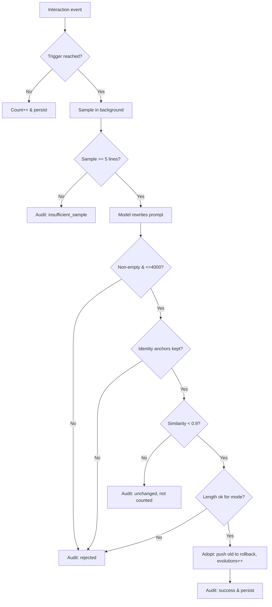

# Evolvable Personality: Persisted Triggers & Safe Fine-tuning

> Version: 0.11.0-RC1 · Branch: feature/permission-panel · Refs: #29 encryption / #31 data layering / #33 identity core
> Code: `internal/server/personality_evolution.go`, `persona.go`, `workflow.go`, `server.go`, `debug.go`

Fixes "the personality never adapts after repeated use". The old design treated evolution as "must be strictly shorter", and triggers were too narrow (aide only after compaction; xiaomi's counter lived only in memory), so once the default prompt was already concise, later preference fine-tuning was almost always rejected or never fired.

## 1. Trigger Mechanism (four dimensions + persistence)

| Dimension | aide | xiaomi (小秘) | Notes |
|---|---|---|---|
| Message / interaction count | every **20** user messages | every **15** valid interactions (send/analyze ok) | fires at threshold, resets counter |
| Time fallback | >**72h** since last evolve AND ≥**5** interactions | same | avoids waiting only on count |
| Compaction / archive event | after compaction | — | uses "pure compression mode" |
| Manual | "Evolve now" in settings | same | returns result synchronously |

**Persistence**: the counter-since-last-evolve, last-evolved time, last-attempt result and rollback history are all written to
`config/personality-state.json` (loaded by `loadPersonalityState()` at startup), surviving restarts — replacing the old in-memory-only `voiceSendSinceEvolve`.

## 2. Evolution vs. Compaction Decoupled

Two separate modes, no longer gated by a single "must be shorter" rule:

- **Refine `refine`** (count / time / manual): condense the prompt and **fine-tune wording/emphasis from recent stable, recurring preferences**. May grow slightly.
- **Compress `compress`** (compaction events only): shrink-only, to reclaim tokens after context folding.

## 3. Adoption Criteria (refine mode)

After the model returns a new prompt, checks run in order; any failure rejects it (reason recorded):

1. Non-empty;
2. **Hard cap**: length ≤ **4000** chars (prevents long-term bloat);
3. **Core consistency**: identity anchors (aide→"aide", xiaomi→"小秘" or its custom name) must still appear (containment checklist), else the core is judged lost;
4. **Similarity gate**: char-bigram Jaccard ≥ **0.9** vs. old prompt counts as "no substantive change" — **neither adopted nor counted**;
5. **Length ratio**: `len(new) ≤ len(old) × 1.1`.

`compress` mode additionally requires `len(new) < len(old)` (strictly shorter).

## 4. Observability & Audit

Every attempt (success / rejected / failed / unchanged / insufficient-sample) is:

- appended to `audit/personality-audit.jsonl`: time, id, trigger, old/new length, evolutions, note;
- logged via `log.Printf`; failures are never silent again;
- surfaced on `/api/debug/overview` under `personality` (evolutions / updatedAt / countSinceEvolve / lastAttemptResult).

## 5. Unified Sampling

- **aide**: last 12 real messages of the most recent session;
- **xiaomi**: voice history `snapshotHistory()` (Summarized/Heard) + assistant-session messages;
- minimum **5** sample lines; below that we skip and record `insufficient_sample` rather than force an evolution;
- only recurring, stable preferences are distilled; one-off trivia is excluded.

## 6. Rollback & Caps

- before adopting, the old prompt is pushed onto a rollback stack keeping the latest **5** versions;
- endpoints: `POST /api/personality/rollback` (restore previous), `POST /api/personality/reset` (restore default and clear history);
- both evolutions count and prompt length have hard caps to prevent long-term drift.

## 7. Security Ownership

- **aide personality**: plaintext in `config/settings.json` `personalities` (work-oriented, no password);
- **xiaomi personality**: encrypted in `data/assistant/` (voice-history envelope, per #29/#31);
- the trigger state file `config/personality-state.json` is plaintext runtime state and contains no sensitive conversation content.

## 8. Evolution Decision Flow

