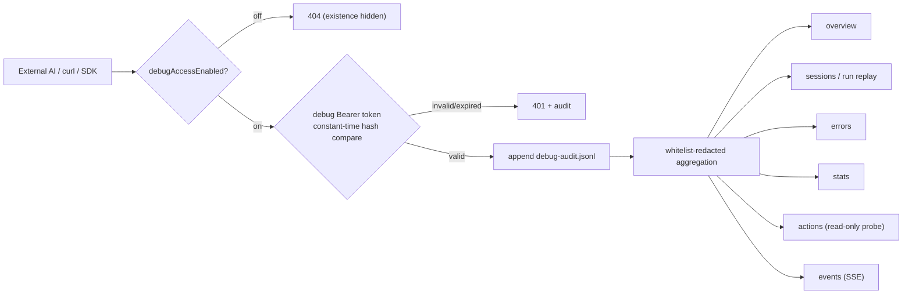
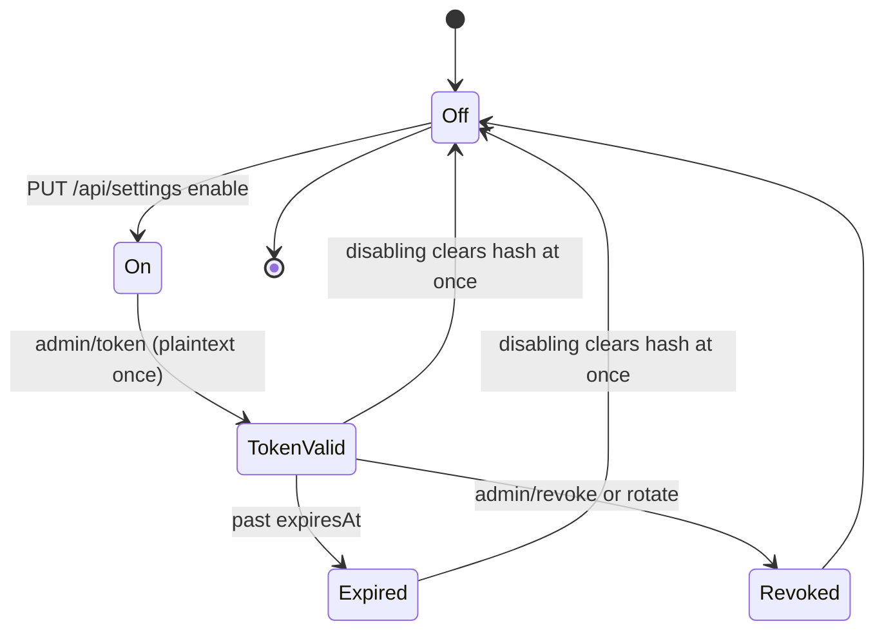

# External AI Machine-Readable Diagnostics API (/api/debug)

A **read-only** diagnostics surface for **external AI agents, scripts and SDKs**. Off by default; when enabled it is accessed with a **standalone debug token**, fully audited and whitelisted-redacted.
This API is **not for end-users in the browser** — the in-app settings panel manages it using the normal access token.

## Principles

- **Off by default**: `debugAccessEnabled` defaults to `false`. When off, the whole `/api/debug/*` tree returns `404`, so its existence is not disclosed.
- **Read-only, least privilege**: all endpoints are `GET` except two controlled read-only actions (provider ping, diagnostic bundle). No endpoint can send messages, change settings, models or workspace files.
- **Standalone token**: the debug token is physically separate from the browser `access-token`; only its SHA-256 hash is stored, and the plaintext is returned exactly once.
- **Scope isolation**: a debug token can call `/api/debug/*` **only** — never normal `/api/*`. The admin surface (`/admin`, `/audit`) accepts the normal access token only.
- **Full audit**: every request is appended to `data/debug-audit.jsonl`.
- **Whitelisted redaction**: never returns API keys, password hashes, persona ciphers, request-snapshot bodies, or the access token.

## Authentication

```
GET /api/debug/overview HTTP/1.1
Authorization: Bearer <debug-token>
```

- Issue the token in Settings → Accessibility → "Allow external AI access for diagnostics" → Generate.
- SSE (`/events`) allows `?access_token=<debug-token>` because `EventSource` cannot set headers.
- All other endpoints reject credentials in the URL.
- Optional origin allowlist `debugAllowOrigins` checks browser `Origin` headers only; plain `curl` sends no Origin and is unaffected.

## Endpoints

| Method | Path | Description |
| --- | --- | --- |
| GET | `/api/debug/overview` | Overview: status/version/uptime/redacted config/mounts/provider health |
| GET | `/api/debug/sessions` | Sessions + latest run; `?status=running\|failed` filter |
| GET | `/api/debug/sessions/{id}/runs/{run}` | Run replay: steps/tool names/errors/failure count (no message bodies) |
| GET | `/api/debug/sessions/{id}/runs/{run}/events` | SSE live run observation |
| GET | `/api/debug/errors` | Last 50 errors + top-10 cross-run failure loops |
| GET | `/api/debug/stats` | Reuses token-usage stats |
| POST | `/api/debug/actions/ping-provider` | Read-only provider reachability + latency (no model list) |
| POST | `/api/debug/actions/diagnostic-bundle` | Export a redacted diagnostic bundle |
| GET | `/api/debug/audit` | Last 20 audit records (admin, normal access token) |
| POST | `/api/debug/admin/token` | Issue/rotate debug token (admin) |
| POST | `/api/debug/admin/revoke` | Revoke debug token (admin) |
| POST | `/api/debug/admin/toggle` | Toggle on/off (canonical path remains `PUT /api/settings`) |

## Pure-curl example (no browser, no cookies)

```bash
TOKEN="<plaintext shown once at generation>"
BASE=http://127.0.0.1:8097

curl -s -H "Authorization: Bearer $TOKEN" $BASE/api/debug/overview | jq .
curl -s -H "Authorization: Bearer $TOKEN" "$BASE/api/debug/sessions?status=failed" | jq .
curl -s -X POST -H "Authorization: Bearer $TOKEN" $BASE/api/debug/actions/ping-provider | jq .
```

Redacted `overview` sample:

```json
{
  "status": "ok",
  "version": "0.1.10.2 RC1",
  "uptimeSec": 3721,
  "config": { "providerHost": "api.deepseek.com", "model": "deepseek-v4-flash", "hasKey": true, "hasPassword": true },
  "mounts": {
    "workspace": { "path": "/workspace", "writable": true, "freeBytes": 40000000000 },
    "context":   { "path": "/context",   "writable": false, "freeBytes": 40000000000 }
  },
  "provider": { "reachable": true, "lastProbeMs": 183, "checkedAt": "2026-09-25T10:00:00Z" }
}
```

## Switch & token lifecycle

Default off. Enable via the settings panel, or
`PUT /api/settings {"debugAccessEnabled": true, "activeModel": "<current model>"}`.

- When off: `/api/debug/*` immediately returns `404` and the token hash is **cleared at once**.
- Rotation: `POST /api/debug/admin/token` issues a new token; the old one stops working immediately; plaintext is returned once.
- Revoke: `POST /api/debug/admin/revoke`.

## Write / controlled-action boundary (disabled by default)

This API does **not** offer: sending sessions/messages, cancelling/retrying runs, changing settings or models, reading/writing workspace files, exporting raw session messages, or balance queries.
The two `POST` actions are read-only: `ping-provider` issues one `GET {baseURL}/models` and times it; `diagnostic-bundle` only aggregates already-redacted data.

## Redaction red lines

- Never returns: `apiKey`, `userPasswordHash`, `personaCiphers`, voice-history plaintext, `requestSnapshots` bodies, full `settings.json`, `access-token`, `Authorization` headers.
- Returns only: `hasKey:true`, `hasPassword:true`, the `baseURL` host, model ids, booleans / redacted forms.

## Data flow (mermaid)




