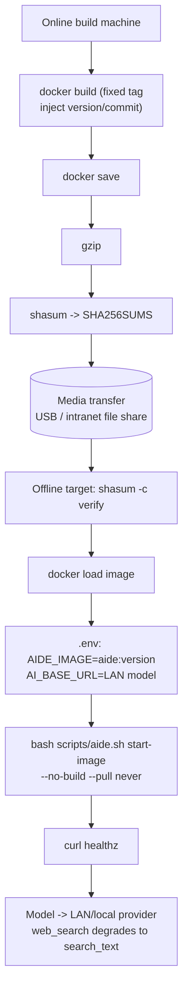

# Installation and first launch

> **Startup configuration:** `.env` is the local source of truth. `start.command` → `scripts/aide.sh` → Docker Compose, using `AIDE_PORT` (default 8097) and `COMPOSE_FILE`. Temporary review ports are not user startup entries. See [workspace mount modes](../workspace-paths.md).

[简体中文](../installation.md) · **English**

aide combines AI and an integrated work environment. The installer checks prerequisites, initializes first-run settings, verifies image archives, and starts the application. It does not silently install host software, request sudo, overwrite `.env`, or delete volumes.

## 1. Prepare the host

| Platform | Requirements | Notes |
| --- | --- | --- |
| Apple Silicon macOS | Docker Desktop, Git, Python 3 for image verification | Start Docker and wait for the engine; published image is linux/arm64 |
| ARM64 Linux | Docker Engine, Compose v2, Git, Python 3 | Current user must be able to access Docker |
| x86 Linux/macOS | Equivalent prerequisites | Build from source instead of importing the ARM archive |
| Windows | WSL2, Docker Desktop WSL integration, Git, Python 3 | Run Bash inside WSL; not validated on a Windows device |

Official installers: [Docker Desktop](https://docs.docker.com/desktop/), [Docker Engine](https://docs.docker.com/engine/install/), [Git](https://git-scm.com/downloads), [Python](https://www.python.org/downloads/). Check Docker Desktop licensing for your organization. aide is MIT-licensed. Host Go is unnecessary. Development checks additionally require Node.js and Python 3.

## 2. Get the matching source

```bash
git clone https://github.com/skyelan1999/aide.git
cd aide
bash scripts/install.sh --check
```

A source ZIP is also usable for image installation. Keep its scripts, Compose file, and `version.md`: an image tarball is not a standalone desktop installer.

The current baseline is **v0.1.10.2-RC1**. This release adds persistent memory, model context-window presets, a 60 default tool-call round limit, fixed Markdown/Mermaid rendering, trajectory export and call analysis, sub-agents, a three-level sandbox, a four-phase AI workflow with auto mode, five reasoning-effort levels, a voice assistant, per-tool permission toggles, configuration backup, lock screen, and persistent personas.

## 3A. Install the published ARM64 image

Use the source and assets from the **same release**:

```bash
git checkout v0.1.10.2-RC1
```

Download `aide-0.1.10.2-RC1-linux-arm64.tar.gz` and `SHA256SUMS` from [Releases](https://github.com/skyelan1999/aide/releases), placing both in `docker-images/`:

```bash
bash scripts/install.sh --image docker-images/aide-0.1.10.2-RC1-linux-arm64.tar.gz
```

The script verifies SHA256, loads the image, checks its architecture, and starts with `--no-build --pull never`. A failed checksum, missing tag, or incompatible architecture stops installation. Existing `.env` is preserved; inspect it if you are upgrading.

## 3B. Build the selected source checkout

```bash
bash scripts/install.sh --source
```

Use a Git checkout for source identity. First builds download base images. If `.env` does not exist, the installer creates it, makes `context/`, and restricts local directory browsing to the repository. It does not overwrite an existing configuration.

## 3C. Offline / air-gap install (target machine has no internet)

For fully isolated intranet/disconnected environments. **Golden rule: on the target machine only `docker load` the imported image and launch it with `start-image`; never run `start`** — `start` triggers `docker build`, which pulls base images and will fail or hang offline. Compose sets `pull_policy: never` as a second guard so a bare `compose up` cannot pull; a missing image fails fast instead of hanging on a fetch.

Three delivery artifacts (all from the same version tag, e.g. 0.1.10.2 RC1):

1. Matching-tag source (or a source ZIP with the Compose file, scripts, and version.md);
2. Self-contained image archive `aide-0.1.10.2-RC1-linux-aarch64.tar.gz` (use `amd64` on x86; Docker reports the architecture as arm64 internally while archive filenames uniformly use aarch64/amd64);
3. A single `SHA256SUMS` manifest in the same directory (legacy per-archive `*.sha256` files are deprecated).

```bash
# On the offline target: verify -> load -> configure -> start
cd aide                                    # matching-tag source root
shasum -a 256 -c docker-images/SHA256SUMS  # verify integrity; stop on mismatch
docker load -i docker-images/aide-0.1.10.2-RC1-linux-aarch64.tar.gz
# Copy .env.example to .env and set:
#   AIDE_IMAGE=aide:0.1.10.2-RC1
#   AI_BASE_URL=http://<lan-model-address>
#   AIDE_WEBSEARCH_URL=        # leave empty: web_search degrades offline
bash scripts/aide.sh start-image           # = --no-build --pull never; never builds/pulls
curl -fsSk https://127.0.0.1:8097/healthz    # health check (-k skips self-signed cert)
```

Offline behavior notes:

- **Point the model at a LAN/local provider** (intranet gateway, local vLLM, etc.); `AI_BASE_URL` must not point to the public internet.
- **`web_search` is unavailable offline**: with `AIDE_WEBSEARCH_URL` unset the tool returns "offline environment, online search unavailable; use search_text to search locally" — it makes no outbound call and does not crash. Use local `search_text`, or self-host SearXNG on the intranet and put its URL in `AIDE_WEBSEARCH_URL`.
- The frontend, drawio, and Office parsing are all bundled into the image (no CDN/external fonts); the image is self-contained with the runtime toolchain.

Offline deployment flow:



## 4. Build, test, and release gate (source development)

`bash scripts/aide.sh start` is already optimized for the startup hot path; you do not need the details below to use it. They describe how it works and the offline/release caveats.

**Two launch modes**

| Command | Behavior | Use when |
| --- | --- | --- |
| `bash scripts/aide.sh start` | Build from source. Hashes the Go source set (cmd+internal+go.mod/go.sum/vendor + Dockerfile/compose.yaml) and stores it in the image label `aide.srcsha`; on a second launch with an unchanged hash it goes straight up with `--no-build` (skips buildkit, seconds to ready), and rebuilds only when the hash changes | You changed source locally |
| `bash scripts/aide.sh start-image` | Start the imported image with `--no-build --pull never`; never builds/pulls | Release image / offline machine |

**Tests and the release gate (#43)**

- The default `start` Docker build **does not run the full `go test`** (`AIDE_RUN_TESTS=0`); it only runs `go vet` + incremental `go build`. After a frontend/Go change the layer cache hits, so vet+build is ~5s and end-to-end ~12s; an unchanged second start takes the quick path at ~3s.
- The full `go test` moved from "every startup" to "the release gate": `scripts/docker-release.sh` and CI builds **must** pass `--build-arg AIDE_RUN_TESTS=1` to force the full suite (~160s) before shipping. The gate is not bypassed.
- To run the full suite locally (with the race detector) manually: `bash scripts/aide.sh test` (in-container `go test -race -count=1 ./... && go vet ./...`).
- To enable tests for one build: `AIDE_RUN_TESTS=1 bash scripts/aide.sh start`.

**Runtime pip layer caching and offline (#46)**

- The runtime stage puts its stable layers (system user + Office-parsing pip dependencies) **before** the `COPY` of the business binary, and the binary (which changes on every code/frontend edit) last. Thus a Go/frontend change only invalidates the final COPY layer; the pip layer stays `CACHED` and never re-downloads online. The shipped image is self-contained and never pip-installs at runtime.
- Dependencies are pinned (python-docx==1.2.0, openpyxl==3.1.5, python-pptx==1.0.2, ezdxf==1.4.4); pip downloads are reused via a BuildKit cache mount.
- **Offline / air-gap first build**: on a networked machine run `bash scripts/prebuild-wheels.sh` to pre-download the manylinux/arm64 wheels into `docker/wheels/`, carry them to the offline build machine, and build with `--build-arg PIP_OFFLINE=1` (`pip install --no-index --find-links=/wheels`, fully local, zero network). `docker/wheels/` ships with only `.gitkeep`; online builds ignore it.

## 5. Select your directories

Use existing paths, preferably absolute:

```dotenv
AIDE_IMAGE=aide:0.1.10.2-RC1
AIDE_PORT=8097
AIDE_WORKSPACE=/absolute/path/to/project
AIDE_CONTEXT=/absolute/path/to/references
AIDE_LOCAL_ROOT=/absolute/path/to/projects
```

For subsequent image runs use `bash scripts/aide.sh start-image`. For custom source, set a separate image name such as `my-aide:local` and use `bash scripts/aide.sh start`. Do not rebuild custom code under a published release label.

The workspace and local roots are writable. References mounted at `/context` are read-only. Sessions, keys, rates, and configuration are in the `/data` volume; development caches are in `/home/aide`. An image archive is not a data backup.

## 6. Sign in and connect a model

Open `https://localhost:8097`. macOS opens a token-authenticated URL automatically; Linux uses xdg-open when available. Without a desktop opener, retrieve the token locally:

```bash
docker compose exec -T aide cat /data/auth/access-token
```

Paste it into the login form. Never share the token or token-bearing URL. This is not your model API key.

> Since 0.1.11 the main port is **HTTPS**: on first start a loopback-only self-signed certificate is generated in the data directory. The browser warns "your connection is not private" — click **Advanced → Proceed to localhost**. Use `localhost` rather than `127.0.0.1` (the WebAuthn RP ID does not allow IP literals). For CLI checks use `curl -k https://...`. Offline installs are unaffected (the cert is generated locally). See [Security: HTTPS/TLS entry hardening](../security/tls.md).

Open **Model settings**, set a Base URL, model ID, and provider key. Installation makes no model calls. Test with a non-sensitive prompt before using private material. In a language-enabled build, change the interface using the login selector or **Settings → Language**.

## Troubleshooting

| Symptom | Action |
| --- | --- |
| Docker unavailable | Start the engine and rerun `--check` |
| Port 8097 in use | Change AIDE_PORT; do not stop unrelated services |
| Missing bind path | Check `.env`; existing configurations are not auto-corrected |
| Missing image tag | Match source/image versions and AIDE_IMAGE |
| Checksum mismatch | Stop and download matching assets again |
| dev/unknown version | Use a release image or build from the Git checkout |
| Model requests fail | Check provider settings, permissions, and network |
| Old conversations missing | Check Compose project name and the original data volume |
| Language selector missing | Check the running image version; use the current release image |

`status`, `logs`, and `stop` are supported by `scripts/aide.sh`. Do not use `docker compose down -v` as an ordinary upgrade step. See [Operations](../../HANDOVER.md).

### Local offline voice (optional)

The image bundles the sherpa-onnx synthesizer (Apache-2.0, offline); Chinese voice models are externalized
to `/data/tts/` to keep the image small. On a networked host run `scripts/tts-setup --model huayan` inside the
container to download the default female voice (~67MB, SHA256-verified); for air-gapped setups place the model
manually per [Local offline TTS](../en/security/tts-local.md). After install + restart, pick "Auto" in Settings →
TTS engine to prefer local offline synthesis (text never leaves the machine).
