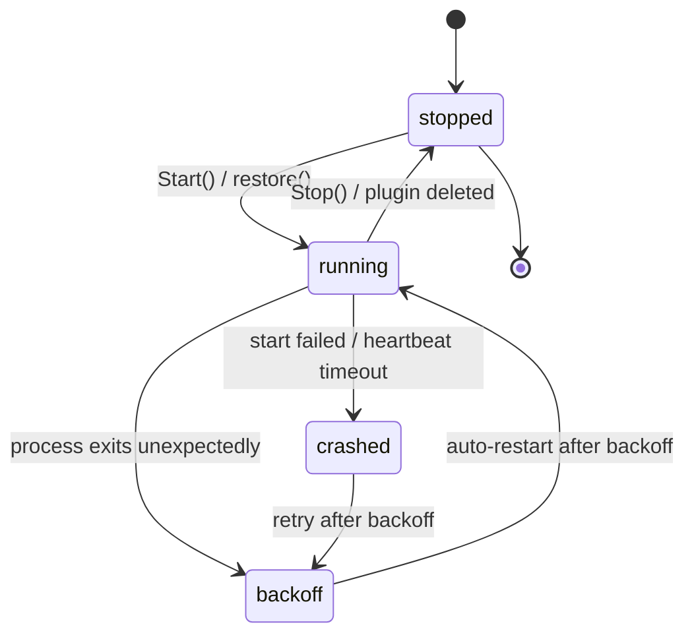

# aide Plugin Protocol v1.2 · Resident Daemon Host Framework

| Item | Value |
| --- | --- |
| Protocol version | v1.2 (2026-09-25; adds a resident daemon host for tcp/udp/ssh/serial communication plugins) |
| Builds on | v1.1 (short-lived `run`/`call`, see `docs/plugin-protocol.md`) — fully backward compatible |
| Host | Node.js host inside the aide container (`internal/server/plugin_host.js`, embedded into the Go binary) |
| Manager | Go side `internal/server/plugin_daemon.go` (`DaemonManager`) |
| Transport | Child-process stdio, **newline-delimited JSON-RPC 2.0 subset** |
| Status | Shipped with aide **0.1.11.0-RC1**; breaking changes require a protocol version bump |

> This document is the foundation of the communication-plugin suite. The tcp / udp / ssh / serial plugins will build on this framework. They only need to declare `daemon: true`, implement tools and lifecycle hooks — process spawning, heartbeats, backoff restarts, and event caching are all handled for them.

---

## 1. Why a daemon mode

v1.1 `call` is a **short-lived process**: every tool call spawns a fresh `node` process that exits as soon as the call finishes, releasing any socket/port it held. That is fine for one-shot tools (reading files, suggesting commands) but fatal for communication plugins:

- A TCP/UDP/serial listener must **hold a port long-term**, not restart listening on every call;
- Inbound external packets must be **pushed back** to aide (traffic events), not just request–response;
- Long-lived connections (SSH sessions) must keep state between two user operations.

v1.2 therefore introduces a **resident daemon process**: each daemon plugin maps to one long-running `node` child process. Go talks to it over newline-delimited JSON-RPC on stdio. The plugin stays in memory after `require`, and tool calls are forwarded over IPC to the already-loaded handler — no new process per call.

## 2. Plugin declaration and shape

Plugins remain CommonJS modules in the DSH/Cordis shape (`apply(ctx)`), identical to v1.1. The differences are:

1. **manifest.json** gains `"daemon": true`:

```json
{
  "id": "tcp",
  "name": "TCP",
  "main": "index.js",
  "daemon": true,
  "enabled": false
}
```

2. The plugin object may declare optional **lifecycle hooks**:

```js
'use strict';
module.exports = {
  name: 'tcp',
  apply(ctx) {
    ctx.tool({
      name: 'tcp-listen',
      description: 'Listen on a TCP port bound to 127.0.0.1',
      handler: async (args, api) => {
        // ...bind a socket; on data call ctx.emit('traffic', {...})
        return { ok: true, port: Number(args.port) };
      },
    });
  },
  async start() { /* called after load: open listener / long connection */ },
  stop()        { /* called before stop: close sockets, release ports */ },
};
```

- `start()` may be async; the host `await`s it after `apply()` and before serving calls.
- `stop()` runs on stdin EOF / SIGTERM and is **the only place to release a port**.
- Inside `apply(ctx)`, beyond the v1.1 `tool/provide/slot/logger`, there is a new **`ctx.emit(type, fields)`** (see §5).

## 3. Process model and launch command

Go uses the same embedded script as v1.1, with a new `daemon` subcommand:

```
node -e <plugin_host.js> daemon <absPluginPath>
```

- Load plugin → `apply(ctx)` → `await start()` → emit `ready` event → start reading stdin line by line.
- No `tool.call` is accepted before the `ready` event; Go forwards no calls before `ready` arrives.
- The restricted environment matches v1.1 (`PATH=/usr/local/bin:/usr/bin:/bin`, `HOME=/home/aide`), plus `AIDE_DAEMON=1` and `AIDE_DAEMON_BIND=127.0.0.1` telling communication plugins to **bind loopback only**.

## 4. stdio JSON-RPC message format

stdout **must only** carry JSON-RPC lines (one JSON object per line, `\n`-delimited). Plugin logs go to **stderr** — never stdout, or the IPC channel is corrupted.

### 4.1 Inbound (Go → plugin)

| Message | Meaning |
| --- | --- |
| `{"jsonrpc":"2.0","id":N,"method":"tool.call","params":{"tool":"<name>","args":{...}}}` | Call a registered tool; `id` correlates the response |
| `{"jsonrpc":"2.0","id":N,"method":"ping"}` | Heartbeat; host must reply `pong` |

### 4.2 Outbound (plugin → Go)

| Message | Meaning |
| --- | --- |
| `{"jsonrpc":"2.0","id":N,"result":<any JSON>}` | Tool success; `result` is the handler's return value |
| `{"jsonrpc":"2.0","id":N,"error":{"code":<int>,"message":"<...>"}}` | Tool failure (`-32601` not found, `-32000` handler error) |
| `{"method":"event","params":{...}}` | Unsolicited event (traffic/event/log), see §5 |

> Calls are **async and out of order**: handlers may be in flight concurrently; responses are correlated by `id` and need not match request order.

## 5. Event reporting (traffic / event / log)

Plugins report events via `ctx.emit(type, fields)`, wrapped by the host as `{"method":"event","params":{...}}`:

```js
ctx.emit('traffic', {
  direction: 'in',          // in | out
  length: 128,              // bytes on the wire
  payloadTruncated: true,   // whether the payload was truncated (body is not reported by default)
});
ctx.emit('event', { subtype: 'connected', message: 'peer 127.0.0.1:5222 connected' });
ctx.emit('log',    { level: 'warn', message: 'reconnecting...' });
```

- `type` is constrained to `traffic` | `event` | `log`; anything else is normalized to `event`.
- Go keeps a **ring buffer of the most recent 1000 events** per daemon process, queryable via `GET /api/plugins/daemons/{id}/events`.
- For safety and size, **packet bodies are not reported by default**; a plugin may attach them explicitly and truncate as needed.

## 6. Lifecycle and crash recovery

### 6.1 State machine



### 6.2 Heartbeat and crash detection

- Go sends `ping` every **30s**; if no `pong` arrives within **5s**, the process is declared crashed, killed, and restarted.
- On process exit (stdout EOF), if it was not an intentional stop, the process enters backoff restart.

### 6.3 Exponential backoff

Restart interval after a crash: **1s → 2s → 4s → 8s → …, capped at 30s**.
If a process runs healthy for more than **60s** before crashing, the backoff base resets to 1s (so a long-stable process's occasional restart is not punitively delayed).

### 6.4 Auto-recovery after container restart

After a process/container restart, `DaemonManager.restore()` reads the registry: every plugin with `daemon:true` **and** `enabled:true` is automatically relaunched. A daemon plugin with `enabled:false` is **not** auto-started.

## 7. HTTP API

| Method | Path | Meaning |
| --- | --- | --- |
| GET | `/api/plugins/daemons` | List all daemon plugin statuses (running/stopped/backoff/crashed) |
| POST | `/api/plugins/daemons/{id}/start` | Start a daemon |
| POST | `/api/plugins/daemons/{id}/stop` | Stop and release its ports |
| POST | `/api/plugins/daemons/{id}/restart` | Stop then start |
| GET | `/api/plugins/daemons/{id}/events` | Query this process's cached recent events |

All routes reuse the existing Bearer Token auth. Tool-call routing: `callPluginTool` sends `daemon:true` plugins through `DaemonManager.Call()` (IPC); everything else keeps the v1.1 short-lived path.

## 8. Compatibility with v1.1

- **Non-daemon plugins are unchanged**: `run`/`call`, short-lived processes, and writing results to a temp file are untouched.
- A daemon plugin's `apply(ctx)` is still loaded once by the v1.1 short-lived `run` command to aggregate its surface (expose tool names/parameters) — this step calls **only `apply()`, never `start()`**, so it does not bind ports during aggregation.
- A plugin is either a v1.1 short-lived plugin or a v1.2 daemon plugin, decided by the manifest `daemon` field; the two never run mixed.
- Plugins that do not declare `daemon:true` are never touched by the `DaemonManager`.

## 9. Security model

- **Disabled by default**: daemon plugins install with `enabled` defaulting to `false`; they start (or auto-recover) only after the user explicitly enables them in the permission panel.
- **Loopback only**: the daemon manager itself listens on no network port; if a communication plugin must bind a socket, it binds `127.0.0.1` only (conveyed via `AIDE_DAEMON_BIND`) and never exposes LAN/WAN.
- **No privileged capabilities**: the container grants no `CAP_NET_RAW`; plugins cannot sniff packets or craft raw sockets.
- **Audit**: all traffic/event/log events are ring-buffered on the Go side and queryable via the API; stopping or deleting a plugin first terminates its process and releases ports.
- **Least-privilege host**: the restricted v1.1 ctx subset is reused; plugins cannot reach internal DSH services, UI rendering, or files outside authorized mount roots.

## 10. Integration points for the four communication plugins

Each of tcp / udp / ssh / serial only needs to:

1. Declare `"daemon": true` in `plugins/<id>/manifest.json` (`enabled` defaults to `false`).
2. Register tools with `ctx.tool({name, description, parameters, handler})` inside `apply(ctx)`.
3. Put persistent listener/long-connection logic in `start()` and release logic in `stop()`.
4. Proactively report packets/state changes with `ctx.emit('traffic'|'event'|'log', {...})`.
5. Not deal with process lifecycle, heartbeats, backoff restarts, or event caching — the `DaemonManager` owns all of it.

Reference implementation: `plugins/testdata/mock-daemon/` (minimal plugin used for end-to-end tests).
