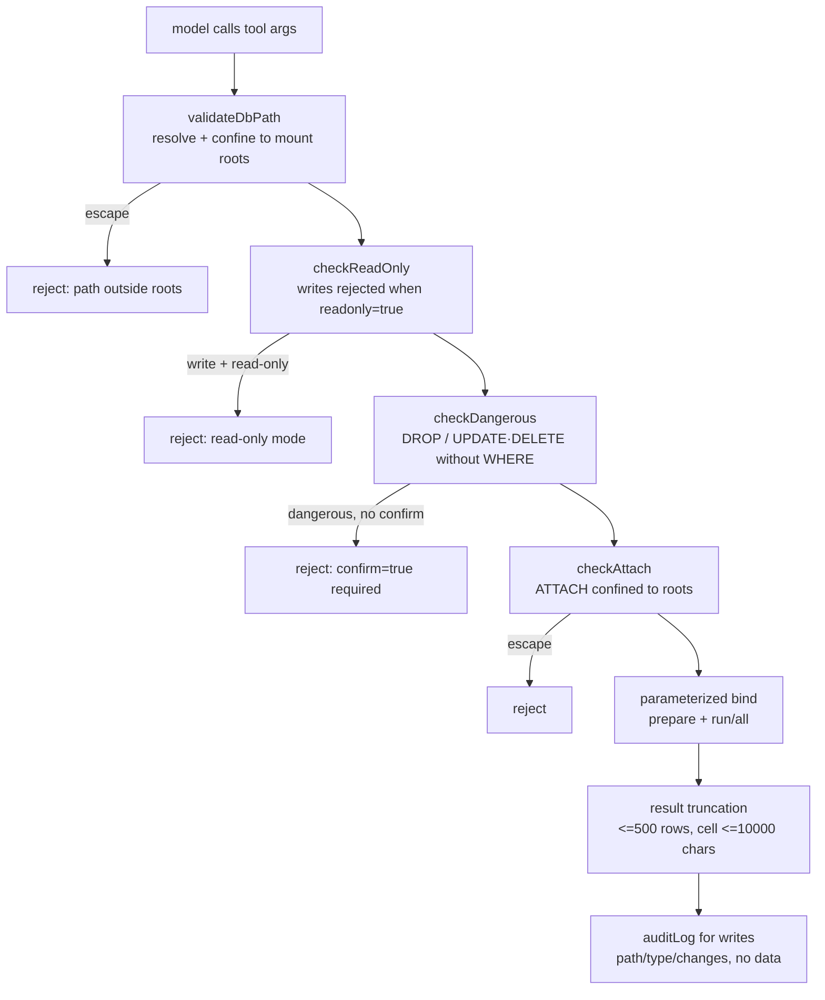

# SQLite Database plugin (sqlite)

A zero-dependency, regular (non-daemon) plugin built on Node's built-in **`node:sqlite`** (`DatabaseSync`). It runs fully offline with no native compilation. Use it to read and write SQLite database files within the authorized mount roots: parameterized queries, transactions, multi-statement migrations, schema introspection, and CSV / consistent-backup export.

- Directory: `plugins/sqlite/` (`manifest.json` + `index.js`)
- Protocol: aide plugin protocol v1.1 (`docs/plugin-protocol.md`)
- Model: **short-lived connection per tool call** — open database → execute → close; no connection is reused across calls.
- Preinstalled, enabled by default; tools default to read-only and require explicit `readonly=false` for writes.

## Tools

| Tool | Purpose | Default | Main return |
| --- | --- | --- | --- |
| `sqlite_query` | Run one parameterized SQL statement | read-only | read: `{columns, rows, rowCount, totalRows, truncated}`; write/DDL: `{changes, lastInsertRowid}` |
| `sqlite_transaction` | Run statements sequentially in one transaction; rollback on any failure | writable | `{committed, results[], changes, lastInsertRowid}` |
| `sqlite_execute` | Run a multi-statement script/migration in a transaction (`db.exec`) | writable | `{changes, executedStatements}` |
| `sqlite_tables` | List tables and views (`sqlite_master`) | read-only | `{tables:[{name,type,sql}]}` |
| `sqlite_schema` | Schema of one table: CREATE SQL, columns, indexes, foreign keys | read-only | `{table, sql, columns, indexes, foreignKeys}` |
| `sqlite_export` | Export CSV or dump (`VACUUM INTO`) | read-only (csv) / writable (dump) | `{format, outputPath, rows\|bytes, truncated?}` |

## Security model

Every request passes through the middleware chain on the left:



- **Path confinement**: `db` and `outputPath` must resolve inside `/workspace`, `/context`, or `/local`. Relative paths resolve against `/workspace`. `../` traversal and out-of-root absolute paths are rejected; existing files/dirs are re-checked via `realpath` to block symlink escape.
- **Read-only by default**: `sqlite_query`/`sqlite_tables`/`sqlite_schema` open the database read-only unless `readonly=false`.
- **Forced parameterization**: always `prepare(sql)` then bind params (positional `?` via array, named `:name` via object); user input is never concatenated into SQL.
- **Dangerous-op guard**: `DROP` and `UPDATE`/`DELETE` without `WHERE` are rejected unless `confirm=true`.
- **ATTACH / extensions**: `ATTACH DATABASE` may only attach files inside the roots; extension loading is disabled (`allowExtension:false`, `load_extension()` throws).
- **Result truncation**: at most 500 rows returned; cells over 10000 chars are truncated with `…[truncated]`; `truncated:true` (with `totalRows`) marks truncation.
- **No deadlocks**: `PRAGMA busy_timeout` (default 5000ms, adjustable via `timeout`); lock conflicts error out within the timeout instead of hanging.
- **Audit**: writes/DDL log `{db path, op type, changes}` to stderr — never row data.

## Examples

> Invoked by the model through the tool loop; `db` is a container path.

**Create table + insert** (`readonly=false`)
```json
{ "db": "/workspace/demo.db", "sql": "CREATE TABLE users(id INTEGER PRIMARY KEY, name TEXT, age INTEGER)", "readonly": false }
```
```json
{ "db": "/workspace/demo.db", "sql": "INSERT INTO users(name, age) VALUES (?, ?)", "params": ["alice", 30], "readonly": false }
-> { "changes": 1, "lastInsertRowid": 1 }
```

**Parameterized query** (read-only by default)
```json
{ "db": "/workspace/demo.db", "sql": "SELECT id, name FROM users WHERE age > ?", "params": [20] }
-> { "columns": ["id","name"], "rows": [{"id":1,"name":"alice"}], "rowCount":1, "totalRows":1, "truncated":false }
```

**Transaction** (commit on success; full rollback on any failure)
```json
{ "db": "/workspace/demo.db", "statements": [
  { "sql": "INSERT INTO users(name,age) VALUES (?,?)", "params": ["bob", 25] },
  { "sql": "UPDATE users SET age=? WHERE name=?", "params": [31, "alice"] }
] }
-> { "committed": true, "changes": 2, ... }
```

**Multi-statement migration**
```json
{ "db": "/workspace/demo.db", "script": "CREATE INDEX idx_age ON users(age); CREATE TABLE log(id INTEGER PRIMARY KEY, msg TEXT);" }
-> { "changes": 0, "executedStatements": 2 }
```

**List tables / inspect schema**
```json
{ "db": "/workspace/demo.db" }                                  // sqlite_tables
{ "db": "/workspace/demo.db", "table": "users" }               // sqlite_schema
```

**Export CSV and backup**
```json
{ "db": "/workspace/demo.db", "format": "csv", "query": "SELECT * FROM users", "outputPath": "/workspace/users.csv" }
{ "db": "/workspace/demo.db", "format": "dump", "outputPath": "/workspace/demo.bak.db" }
```

## Troubleshooting

| Symptom | Cause / fix |
| --- | --- |
| `read-only mode rejects writes` | Tools default to `readonly=true`; pass `readonly=false` to write. |
| `attempt to write a readonly database` | Opened read-only (`/context` is a read-only mount and cannot be written). |
| `database is locked` | Another connection holds a write lock; it errors out after `busy_timeout` — retry, avoid long-held transactions. |
| `path outside roots` | `db`/`outputPath` is not inside `/workspace`, `/context`, `/local`, or uses `..` to escape. |
| `dangerous operation blocked` | `DROP` or `UPDATE/DELETE` without `WHERE`; pass `confirm=true` after confirming. |
| `Unknown named parameter` | Named-param object keys must be `:name`; use an array for positional params. |

## Platform limitations

- **Node version**: relies on built-in `node:sqlite` (`DatabaseSync`); requires Node ≥ 22 (container is Node 24). The `ExperimentalWarning` on load can be ignored.
- **In-container paths**: the plugin sees container paths `/workspace`, `/context`, `/local`, not host paths. `/context` is read-only.
- **macOS Docker Desktop**: `/workspace` etc. are Docker volume mappings; to reach host directories, configure mounts per `docs/workspace-paths.md` first.
- **No hard statement cancellation**: `DatabaseSync` is synchronous and cannot interrupt a running query; the plugin handles lock waits via `busy_timeout`, and the host enforces a 60s call ceiling.
- **Result size**: capped at 500 rows; narrow queries with `WHERE`/`LIMIT` or export to CSV for larger results.
