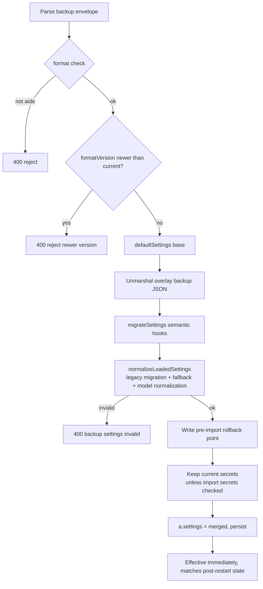

# Security: config backup & cross-version compatibility

> Applies to: 0.1.11.0-RC1

Config backup (`POST /api/config/export` / `POST /api/config/import`) packs all aide settings into a single JSON envelope. This page documents the cross-version import compatibility, illegal-value fallback rules, and the sensitive-field desensitization list.

## 1. Envelope structure

```jsonc
{
  "format": "aide-config-backup",
  "formatVersion": 1,
  "settingsVersion": "0.1.11.0",   // NEW: settings schema version at export, drives migration
  "exportedAt": "2026-09-25T...",
  "appVersion": "0.1.11.0 RC1",
  "includeSecrets": false,
  "includeVoiceData": false,
  "settings": { /* full settings snapshot */ }
}
```

- `formatVersion` (int): envelope format version. **Backups from a newer version are always rejected** (`formatVersion > current` → 400), so a newer format cannot overwrite an older install and break it.
- `settingsVersion` (string): settings schema version. Import uses it to run semantic migration hooks; a missing value is treated as a pre-0.1.11 legacy backup.

## 2. Cross-version import: defaults auto-filled

A backup exported by an older release may lack fields added in later versions. Import no longer starts from an empty `Settings` (the old behavior left missing fields as zero values). Instead:

1. **Base with `defaultSettings()`**: build a full set of current-version defaults;
2. **Overlay with `json.Unmarshal`**: unmarshal the backup JSON onto that base — Go's `Unmarshal` only overwrites fields that are **actually present** in the JSON.

Result:

| Backup situation | Import outcome |
| --- | --- |
| A field is **missing** from the backup | Current-version default is kept |
| A field is **explicitly present** in the backup (including explicit `0`/`""`/`false`) | Backup value is used (then validated) |

`defaultSettings()` is shared by `New()` startup loading, so "first-run defaults" and "defaults backfilled on old-backup import" are identical. Current defaults cover: `baseURL`, `sandboxMode=workspace-write`, `toolMaxRounds=60`, `shellTimeout=60`, `lockTimeoutSec=0`, `reasoningEffort=auto`, `voiceAssistantName=小秘`, `voiceReplyGender=female`, `activePersona=aide`, `ttsProvider=auto`, `ttsRate=1.0`, `debugAccessEnabled=false`.

> Sensitive fields (`apiKey`/`ttsAPIKey`/`userPasswordHash`/`personaCiphers`/`debugTokenHash`) are always left empty in the defaults base and never pre-seeded.

## 3. FormatVersion migration hook framework

Filling missing defaults is handled automatically by the "default base + Unmarshal overlay". The migration hook `migrateSettings(fromVersion, *Settings)` **only handles semantic changes** — field renames, enum conversions, field splits.

```go
func migrateSettings(fromVersion string, merged *Settings) {
    switch fromVersion {
    case "": // no tag = v0 (pre-0.1.11)
        migrateV0ToV1(merged)
    // future versions append a case here, e.g.:
    // case "0.1.11.0": migrateV1ToV2(merged)
    }
}
```

The current example migration `v0 → v1`: legacy single-persona `personaCipher` (string) → `personaCiphers` (map), seeding the old ciphertext as the `aide` persona's custom cipher. This transform is idempotent; `normalizeLoadedSettings` applies the same fallback. Future breaking changes can be added per version.

## 4. Import pipeline



## 5. Illegal-value fallback rules

`validateSettings` checks key numeric/enum values read from outside and falls back to a safe default when out of range:

| Field | Valid range | Fallback |
| --- | --- | --- |
| `toolMaxRounds` | `1..200` | `60` (when `<=0` or `>200`) |
| `shellTimeout` | `1..300` | `60` (when `<=0` or `>300`) |
| `lockTimeoutSec` | `>=0` | `0` (when `<0`) |
| `sandboxMode` | `read-only` / `workspace-write` / `danger-full-access` | `workspace-write` |
| `activeModel` | non-empty and present in the model list | first model in the list; legacy `model` field auto-migrates to a list |
| per-model `contextWindow` | `1024..2097152`; `0` means unset → default `65536` | validated uniformly by `normalizeModels` |

After import, the same `normalizeLoadedSettings` used by `New()` startup loading runs, so "effective immediately after import" and "after a restart" are identical — no restart required.

## 6. Sensitive-field desensitization list (security-C deliverable, must be preserved)

Non-secret export (`includeSecrets=false`) clears any keying material before packing:

| Field | Meaning |
| --- | --- |
| `apiKey` | Provider API key |
| `ttsAPIKey` | TTS engine key (reserved) |
| `userPasswordHash` | Lock-screen Argon2id password hash |
| `personaCipher` | Legacy single-persona personality cipher |
| `personaCiphers` | Per-persona custom personality cipher map |
| `debugTokenHash` | External debug API token hash |

On import this is mirrored: when "import secrets" is unchecked, the above fields **always keep their current value** — even if a desensitized backup carries empty strings, live keys are not wiped. Backup secrets are adopted only when the user explicitly opts in and the backup actually bundled them. Voice-history ciphertext is bundled only when "import voice data" is explicitly checked.
