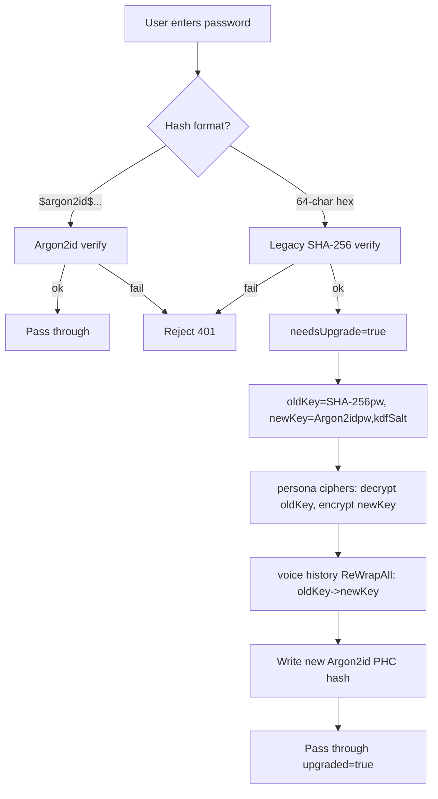

# Security: Password Hashing & Key Derivation (KDF)

- Version: 0.1.11.0-RC3
- Date: 2026-09-26
- Scope: lock-screen password storage, persona custom-personality encryption, voice-assistant history encryption, unified vault master-key derivation

## 1. Why we changed it

Before 0.1.11, a bare **SHA-256** did two jobs at once:

1. Password verification — SHA-256 the password and store the 64-char hex digest;
2. Key derivation — use `SHA-256(password)` directly as the AES-256 key.

SHA-256 is a cryptographic hash but **not a slow hash**: a GPU computes billions per second. If `settings.json` leaked, offline brute force of weak passwords would be nearly free. 0.1.11 switches to **Argon2id** (the Password Hashing Competition winner, OWASP-recommended), tuned to be expensive in both memory and time so brute force becomes impractical.

> High-entropy random tokens (access-token, debug-token) still use bare SHA-256. They are 256-bit random values with no dictionary/brute-force space, so they do not need a slow KDF.

## 2. Argon2id parameters

| Parameter | Value | Notes |
| --- | --- | --- |
| Algorithm | Argon2id | resistant to timing / memory-tradeoff attacks |
| Memory `m` | 65536 KiB (64 MB) | 64 MB per hash |
| Iterations `t` | 3 | three passes |
| Parallelism `p` | 4 | four threads |
| Salt length | 16 bytes (random) | fresh per hash |
| Output length | 32 bytes | = AES-256 key length |

Stored as a standard PHC string:

```
$argon2id$v=19$m=65536,t=3,p=4$<base64 salt>$<base64 hash>
```

## 3. Two keys, two jobs

- **Password hash (login check)**: `HashPassword(password)` produces a PHC string with a **random salt** stored in `settings.json` `userPasswordHash`. The same password hashes differently each time (random salt); verification reads the salt and parameters back from the PHC string and recomputes.
- **Data encryption key**: `DeriveAESKey(password, kdfSalt)` uses a **per-install fixed salt** `data/kdf-salt.bin` (16 random bytes, mode 0600, generated on first launch and never rewritten) to derive a 32-byte AES-256 key used for:
  - persona custom-personality ciphertext (`settings.json` `personaCiphers`);
  - voice-assistant history ciphertext (`voice-history.json`).

The fixed salt provides **domain separation**: it stops cross-site rainbow tables from landing on the data key and decouples the login-hash random salt from the data key. The fixed salt is not a secret — its leak does not directly expose the key — but the password is still required to derive it.

### 3.1 Vault master-key tiers (RC2)

The unified secret vault (SSH credentials + model API key, see [secret-vault.md](./secret-vault.md)) uses a master key chosen by whether a password is set:

- *Password set*: master key = `DeriveAESKey(password, kdfSalt)` (the data encryption key above). After a restart it is not resident in memory until `POST /api/unlock` (password) or `POST /api/auth/verify` (password or WebAuthn assertion) unlocks the vault.
- *No password*: a random 32-byte `crypto/rand` master key is stored `0600` at `/data/secrets/master-key.bin` and auto-loaded at boot. This machine-bound fallback is not derived from a password, but as long as it stays on the local `/data` volume, passwordless users can use stored API keys transparently; copying `settings.json` alone cannot reveal the key.
- When the user later sets a password for the first time, all vault entries are re-wrapped from the machine key to the Argon2id password-derived key (`ReWrap`); `master-key.bin` no longer participates in sealing.

## 4. Smooth migration for existing users

Old `settings.json` files hold `userPasswordHash` as a bare 64-char hex SHA-256. After the upgrade, **no password reset is needed**; the first login migrates automatically:



Key points:

- **Detection**: `IsLegacyHash` treats a 64-char pure-hex string without an `$argon2` prefix as legacy; `VerifyPassword` checks legacy hashes with SHA-256 and returns `needsUpgrade=true`.
- **Re-wrap scope**: persona custom-personality ciphers (including the legacy single-persona `personaCipher` field) plus voice-history ciphertext (`VoiceAgent.ReWrapAll`). Skipped automatically when there is no ciphertext.
- **Atomicity**: all ciphertext is re-encrypted with the new key first, then the new hash and settings are written once; decryption happens in memory only.
- **Crash fallback**: even if the upgrade is interrupted mid-way, the decryption paths (`decryptPersona`, `voice_agent.unlock`) try the **new key first and fall back to the legacy SHA-256 key**, so any intermediate state still opens.
- **Trigger**: `/api/account/verify-password` (lock-screen unlock) migrates on legacy hits; change-password / set-password always write Argon2id PHC directly. WebAuthn register/delete-device old-password checks also go through `VerifyPassword`, accepting both formats.

## 5. Export redaction

When `/api/config/export` is requested without "include secrets", the bundle strips: `apiKey`, `ttsAPIKey`, `userPasswordHash`, `personaCiphers`, legacy `personaCipher`, and `debugTokenHash`. Voice-history ciphertext is only included when "include voice data" is explicitly checked. The export bundle contains no material that can unwrap any ciphertext.

## 6. Related code

- `internal/server/kdf.go`: Argon2id parameters, PHC parsing/verify, `HashPassword`, `VerifyPassword`, `IsLegacyHash`, `DeriveAESKey`, `DeriveAESKeyLegacy`, `ensureKdfSalt`.
- `internal/server/persona.go`: `deriveKey()` switched to Argon2id; `sha256Hex` kept for high-entropy tokens; `decryptPersona` new/legacy key fallback.
- `internal/server/server.go`: `New()` loads/generates `kdf-salt.bin`; `accountVerifyPassword` auto-migration; `migratePasswordHash` performs the re-wrap.
- `internal/server/voice_agent.go`: `ReWrapAll(oldKey, newKey)`; `unlock`/`disable` new/legacy key fallback.
- `internal/server/config_backup.go`: non-secret export redaction.
