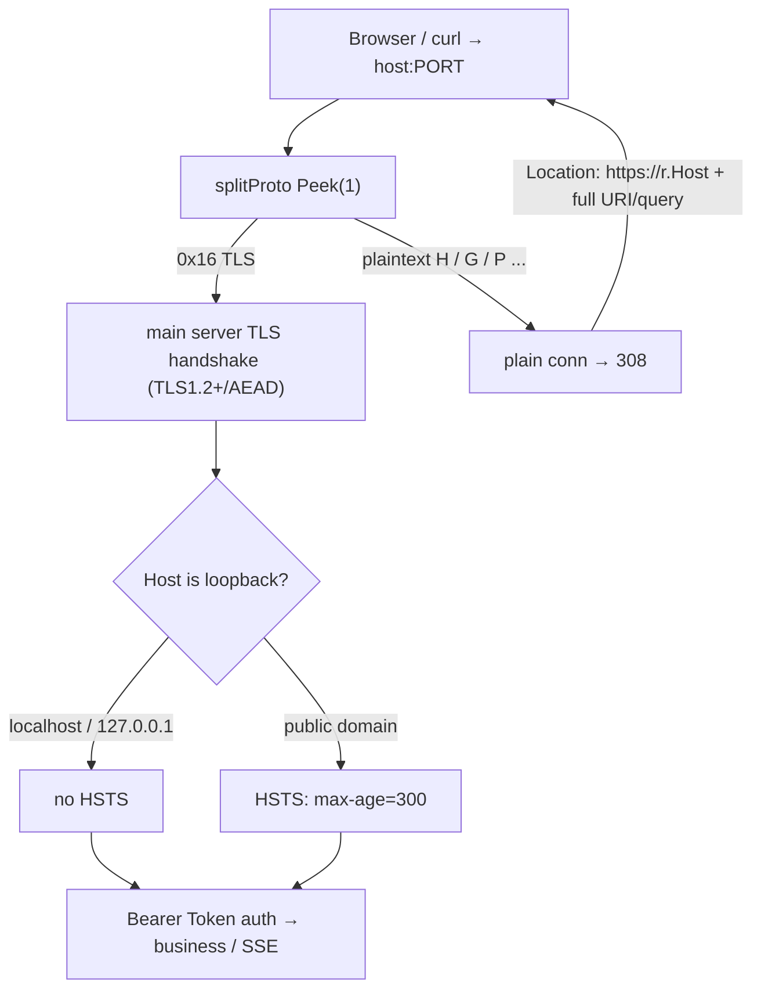

# Security: HTTPS/TLS entry hardening

- Version: 0.1.11.0-RC1
- Date: 2026-09-25
- Scope: server listener, transport encryption, self-signed certificates, security headers, single-port http→https adaptive redirect

## 1. Why harden

Before 0.1.11 the main port was **plain HTTP**. Tokens (access-token, Bearer credentials), conversation content, and file reads/writes travelled on the wire in clear text. Even when bound to `127.0.0.1`, other local processes, browser extensions, proxies, or reverse proxies can still sniff or tamper with loopback traffic; and WebAuthn / Touch ID unlock requires a **Secure Context**. From 0.1.11 the main port speaks **TLS (HTTPS)** and all traffic is encrypted in transit.

## 2. TLS configuration

| Item | Value | Notes |
| --- | --- | --- |
| Minimum version | TLS 1.2 | SSLv3 / TLS 1.0 / 1.1 disabled |
| Preferred | TLS 1.3 | auto-negotiated by Go (incl. HTTP/2 h2), not listed in code |
| TLS 1.2 ciphers | ECDHE forward-secret + AES-128/256-GCM only | see `tlsConfig()` |
| Cipher preference | server-preferred | `PreferServerCipherSuites=true` |
| Key algorithm | ECDSA P-256 | fast, small |
| Cert lifetime | 3650 days (10 years) | local self-host only |

Allowed TLS 1.2 suites (all AEAD + forward secrecy):

- `TLS_ECDHE_ECDSA_WITH_AES_128_GCM_SHA256`
- `TLS_ECDHE_ECDSA_WITH_AES_256_GCM_SHA384`
- `TLS_ECDHE_RSA_WITH_AES_128_GCM_SHA256`
- `TLS_ECDHE_RSA_WITH_AES_256_GCM_SHA384`

CBC, RC4, 3DES, and static-RSA (no forward secrecy) are all disabled.

## 3. Automatic self-signed certificate (under data/certs/)

On first start, if `certs/cert.pem` and `certs/key.pem` are absent, `ensureTLSCert()` generates a loopback-only self-signed certificate:

- **SAN always includes** `DNS:localhost` and `IP:127.0.0.1` (plus `::1`);
- ECDSA P-256 private key, written as `EC PRIVATE KEY` PEM;
- **private key mode 0600**, cert 0644, directory 0700;
- location: **data dir `certs/`** (local `.data/certs/`, container `/data/certs/`, on the persistent data volume);
- reused on restart — it is **not rotated**, so the browser "proceed anyway" exception survives restarts.

### Legacy `data/tls/` → `data/certs/` auto-migration

Early 0.1.11 builds wrote the cert to `data/tls/`. The #31 layered layout standardizes on `data/certs/`. At startup `migrateLegacyTLSDir()` handles this:

- if `certs/` already has the cert → leave it, no overwrite;
- if legacy `tls/cert.pem`+`tls/key.pem` exist but `certs/` is empty → **copy them verbatim into `certs/`** (byte-exact SHA-256 verified), fix perms to cert 0644 / key 0600, **keep the same cert** so the browser does not re-warn, then remove the now-empty legacy `tls/`;
- if only half exists → do not touch, let `ensureTLSCert()` regenerate in `certs/`.

```bash
openssl x509 -in .data/certs/cert.pem -text -noout | grep -A1 "Subject Alternative Name"
# X509v3 Subject Alternative Name:
#     DNS:localhost, IP Address:127.0.0.1, IP Address:::1
```

**The cert lives on the `/data` volume; the image itself contains no private key** — rebuilding or recreating the container does not lose the trusted exception; only deleting the data volume regenerates it.

## 4. Single-port protocol adaptation (http auto-308 to https)

The main port (`AIDE_ADDR`, local default `127.0.0.1:8097`, container `0.0.0.0:8080`) accepts **both HTTP and HTTPS on one port**. `splitProto()` does `bufio.Peek(1)` after `Accept` and routes by the first byte:

- first byte `0x16` (TLS record content type) → prepend the peeked byte back and hand to the main server for a **TLS handshake** (HTTP/2 and SSE long-lived connections keep working);
- anything else (plaintext HTTP) → reply to every request on that connection with **`308 Permanent Redirect`**, `Location = https://<r.Host><r.URL.RequestURI()>``.

Key points:

- `Location` uses **`r.Host`** verbatim (including the host-mapped port, e.g. `localhost:8097`); it does **not** hardcode the in-container 8080;
- **308 preserves the method and body** — `http://` API POSTs from stale cached browser tabs are re-POSTed to https (not downgraded to GET), so WebAuthn register/finish no longer fail with 400 when a plaintext POST hits the TLS port;
- the old separate `AIDE_HTTP_ADDR`/8081 redirect port is **removed**;
- per-connection Peek in its own goroutine, no bulk buffering; writes go straight to the underlying socket, so SSE (`curl -N`) keeps streaming.



## 5. Security response headers

Every response sets:

- `X-Content-Type-Options: nosniff`
- `Referrer-Policy: no-referrer`
- `Content-Security-Policy` (normal pages `frame-ancestors 'none'`; drawio subdir relaxed to `'self'`)
- `Cache-Control: no-store`
- `Strict-Transport-Security: max-age=300` — **only on non-loopback HTTPS**

**HSTS is deliberately not sent on localhost**: once a browser pins `http://localhost` to HTTPS, it pollutes local development. max-age is a short 300s so it can be reclaimed quickly.

**Cookies**: auth is entirely Bearer Token (`Authorization` header; `?access_token=` on trusted paths); **no cookies are used**. If a cookie is ever introduced, it must set `Secure`, `HttpOnly`, and `SameSite=Lax`, and only be sent over HTTPS.

## 6. Browser self-signed warning & macOS trust guide

Because the cert is self-signed and not in a trusted root store, opening `https://localhost:8097` the first time shows a "your connection is not private" warning. This is expected:

- Click **Advanced → Proceed to localhost (unsafe)**;
- the exception applies only to this local cert and survives restarts (see §3);
- WebAuthn / Touch ID works on `https://localhost` (the RP ID does not allow IP literals — open via `localhost`, not `127.0.0.1`).

### Optional: trust the self-signed cert in macOS Keychain (silence the warning)

1. Fetch the in-container cert: `docker compose exec aide cat /data/certs/cert.pem > aide-local.pem`
2. Double-click `aide-local.pem` → add it to the "login" keychain;
3. In Keychain double-click the cert → Trust → change "When using this certificate" to **Always Trust**;
4. Restart the browser; `https://localhost:8097` no longer warns.

This is local-only and does not affect anyone else. Deleting the data volume issues a new cert that must be re-imported.

## 7. WebAuthn / Touch ID and the Secure Context

WebAuthn requires a **Secure Context** (`https://` or `http://localhost`). After switching to HTTPS in 0.1.11:

- the page runs at `https://localhost:8097`, so register/assertion origins carry the `https://` scheme;
- the backend `newWebAuthnManager()` fills `RPOrigins` with all **four** combos http/https × localhost/127.0.0.1, with the port taken from the host-mapped `AIDE_PORT` (default 8097) — so even a stale `http://localhost:8097` cached tab issuing register/finish is not rejected as `origin not allowed`;
- `RPID` stays `localhost` (IP literals are invalid — use the `localhost` URL for Touch ID unlock).

## 8. Production / public deployment notes

The self-signed certificate is **for loopback self-hosting only**. If you expose aide to a LAN or the internet:

1. Do not expose the loopback port directly; put a reverse proxy (Caddy / Nginx / Traefik) in front;
2. Use a publicly trusted CA certificate (e.g. Let's Encrypt) and replace `certs/cert.pem` / `certs/key.pem`;
3. HSTS then kicks in automatically (non-loopback host); you can raise `max-age` over time;
4. The reverse proxy should terminate external TLS (the backend can keep the local self-signed cert).

Offline / air-gapped environments are unaffected: the certificate is generated locally inside the container with no network access.

## 9. Related code

- `internal/server/server.go`: `Run()` single-port `net.Listen` + `splitProto()` Peek routing; main server `ServeTLS`; plaintext conn `httpsRedirectHandler()` 308; `ensureTLSCert()` self-signed cert (writes to `CertsDir`); `tlsConfig()` strict TLS params; `strictTransportSecurity()` / `isLoopbackHost()` conditional HSTS.
- `internal/server/migration.go`: `migrateLegacyTLSDir()` legacy `data/tls/` → `data/certs/` migration.
- `internal/server/webauthn.go`: `newWebAuthnManager()` builds the four http/https × localhost/127.0.0.1 `RPOrigins` from `AIDE_PORT`.
- `internal/server/tls_test.go`: cert generation/SAN/permissions, TLS cipher whitelist, 308 redirect preserving `r.Host`+URI, Peek classification (0x16 vs plaintext), certs migration, HSTS off on localhost.
- `Dockerfile`: `HEALTHCHECK` switched to `curl -fsSk https://127.0.0.1:8080/healthz` (after single-port, plaintext `/healthz` returns 308, so the check must hit https).
- `scripts/aide.sh` / `start.ps1`: health check and opened URL switched to https.
