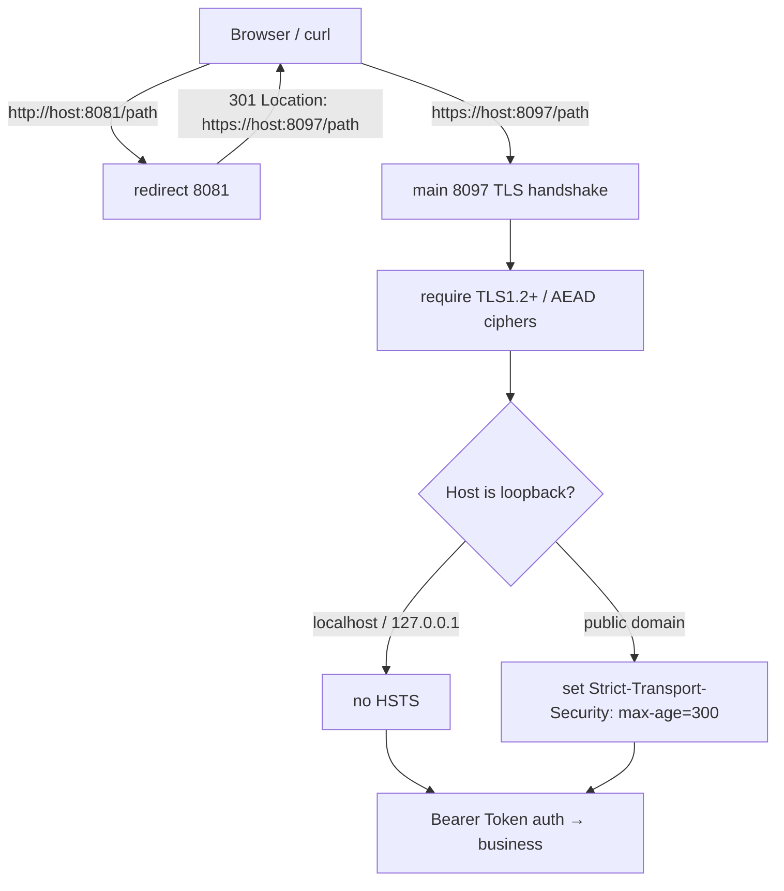

# Security: HTTPS/TLS entry hardening

- Version: 0.1.11.0-RC1
- Date: 2026-09-25
- Scope: server listener, transport encryption, self-signed certificates, security headers, HTTP→HTTPS redirect

## 1. Why harden

Before 0.1.11 the main port was **plain HTTP**. Tokens (access-token, Bearer credentials), conversation content, and file reads/writes travelled on the wire in clear text. Even when bound to `127.0.0.1`, other local processes, browser extensions, proxies, or reverse proxies can still sniff or tamper with loopback traffic; and WebAuthn / Touch ID unlock requires a **Secure Context**. From 0.1.11 the main port speaks **TLS (HTTPS)** and all traffic is encrypted in transit.

## 2. TLS configuration

| Item | Value | Notes |
| --- | --- | --- |
| Minimum version | TLS 1.2 | SSLv3 / TLS 1.0 / 1.1 disabled |
| Preferred | TLS 1.3 | auto-negotiated by Go, not listed in code |
| TLS 1.2 ciphers | ECDHE forward-secret + AES-128/256-GCM only | see `tlsConfig()` |
| Cipher preference | server-preferred | `PreferServerCipherSuites=true` |
| Key algorithm | ECDSA P-256 | fast, small |
| Cert lifetime | 3650 days (10 years) | local self-host only |

Allowed TLS 1.2 suites (all AEAD + forward secrecy):

- `TLS_ECDHE_ECDSA_WITH_AES_128_GCM_SHA256`
- `TLS_ECDHE_ECDSA_WITH_AES_256_GCM_SHA384`
- `TLS_ECDHE_RSA_WITH_AES_128_GCM_SHA256`
- `TLS_ECDHE_RSA_WITH_AES_256_GCM_SHA384`

CBC, RC4, 3DES, and static-RSA (no forward secrecy) are all disabled.

## 3. Automatic self-signed certificate

On first start, if `tls/cert.pem` and `tls/key.pem` are absent under the data dir, `ensureTLSCert()` generates a loopback-only self-signed certificate:

- **SAN always includes** `DNS:localhost` and `IP:127.0.0.1` (plus `::1`);
- ECDSA P-256 private key, written as `EC PRIVATE KEY` PEM;
- **private key mode 0600**, cert 0644, directory 0700;
- location: data dir (local `.data/tls/`, container `/data/tls/`, on the persistent data volume);
- reused on restart — it is **not rotated**, so the browser "proceed anyway" exception survives restarts.

```bash
openssl x509 -in .data/tls/cert.pem -text -noout | grep -A1 "Subject Alternative Name"
# X509v3 Subject Alternative Name:
#     DNS:localhost, IP Address:127.0.0.1, IP Address:::1
```

## 4. HTTP → HTTPS redirect

The main port (`AIDE_ADDR`, local default `127.0.0.1:8097`, container `0.0.0.0:8080`) does **TLS only**. A second lightweight plain-HTTP redirect server listens on `127.0.0.1:8081` by default and 301-redirects any `http://` request to the same host's HTTPS port (path and query string preserved). Set `AIDE_HTTP_ADDR` empty to disable it. Inside the container, 8081 is not exposed to the host; just open `https://localhost:8097`.



## 5. Security response headers

Every response sets:

- `X-Content-Type-Options: nosniff`
- `Referrer-Policy: no-referrer`
- `Content-Security-Policy` (normal pages `frame-ancestors 'none'`; drawio subdir relaxed to `'self'`)
- `Cache-Control: no-store`
- `Strict-Transport-Security: max-age=300` — **only on non-loopback HTTPS**

**HSTS is deliberately not sent on localhost**: once a browser pins `http://localhost` to HTTPS, it pollutes local development and the 8081 redirect. max-age is a short 300s so it can be reclaimed quickly.

**Cookies**: auth is entirely Bearer Token (`Authorization` header; `?access_token=` on trusted paths); **no cookies are used**. If a cookie is ever introduced, it must set `Secure`, `HttpOnly`, and `SameSite=Lax`, and only be sent over HTTPS.

## 6. Browser self-signed warning

Because the cert is self-signed and not in a trusted root store, opening `https://localhost:8097` the first time shows a "your connection is not private" warning. This is expected:

- Click **Advanced → Proceed to localhost (unsafe)**;
- the exception applies only to this local cert and survives restarts (see §3);
- WebAuthn / Touch ID works on `https://localhost` (the RP ID does not allow IP literals — open via `localhost`, not `127.0.0.1`).

## 7. Production / public deployment notes

The self-signed certificate is **for loopback self-hosting only**. If you expose aide to a LAN or the internet:

1. Do not expose the loopback port directly; put a reverse proxy (Caddy / Nginx / Traefik) in front;
2. Use a publicly trusted CA certificate (e.g. Let's Encrypt) and replace `tls/cert.pem` / `tls/key.pem`;
3. HSTS then kicks in automatically (non-loopback host); you can raise `max-age` over time;
4. The reverse proxy should terminate external TLS (the backend can keep the local self-signed cert).

Offline / air-gapped environments are unaffected: the certificate is generated locally inside the container with no network access.

## 8. Related code

- `internal/server/server.go`: `Run()` uses `ListenAndServeTLS`; `ensureTLSCert()` self-signed cert generation; `tlsConfig()` strict TLS params; `httpsRedirectHandler()` 8081 redirect; `strictTransportSecurity()` / `isLoopbackHost()` conditional HSTS.
- `internal/server/tls_test.go`: cert generation/SAN/permissions, TLS cipher whitelist, HTTP→HTTPS 301, HSTS off on localhost.
- `Dockerfile`: `HEALTHCHECK` switched to `curl -fsSk https://127.0.0.1:8080/healthz`.
- `scripts/aide.sh` / `start.ps1`: health check and opened URL switched to https.
