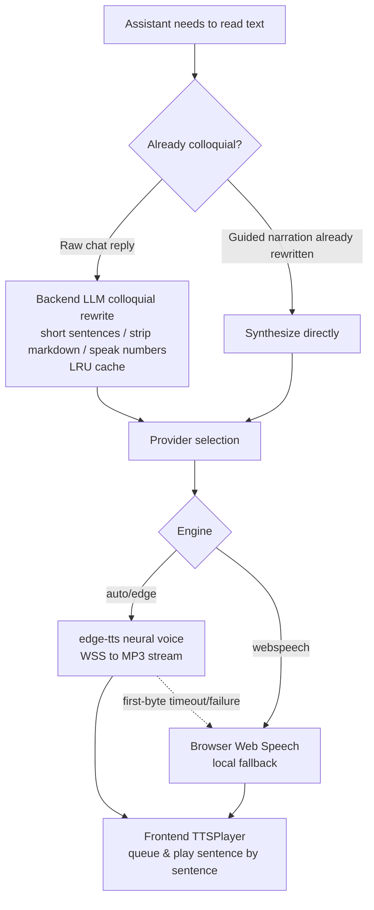
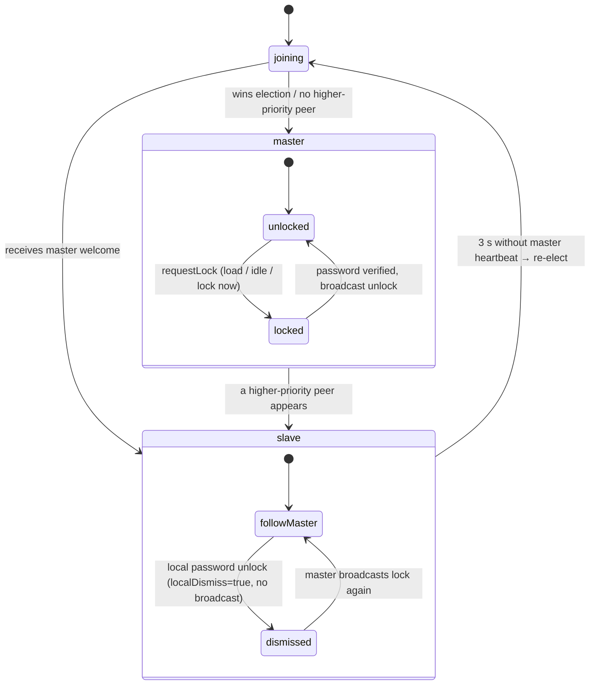
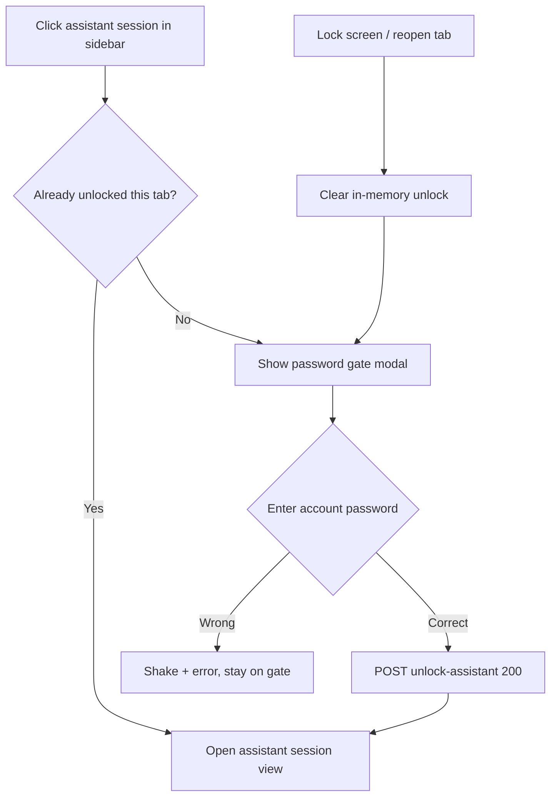
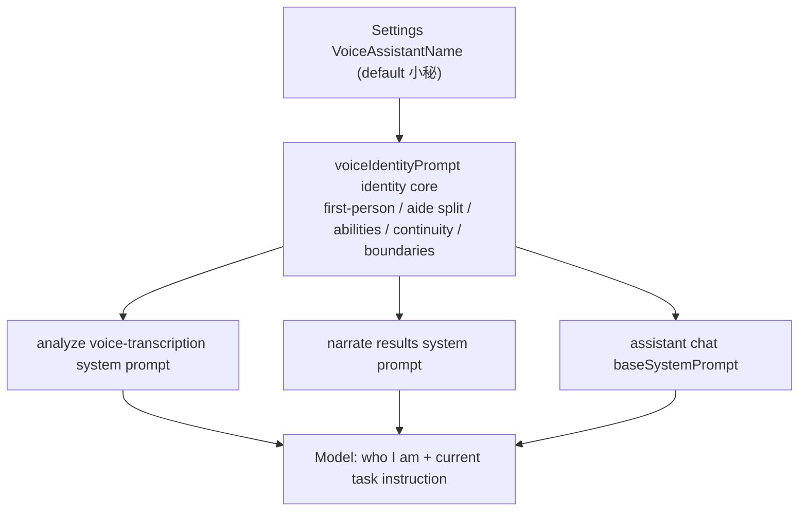
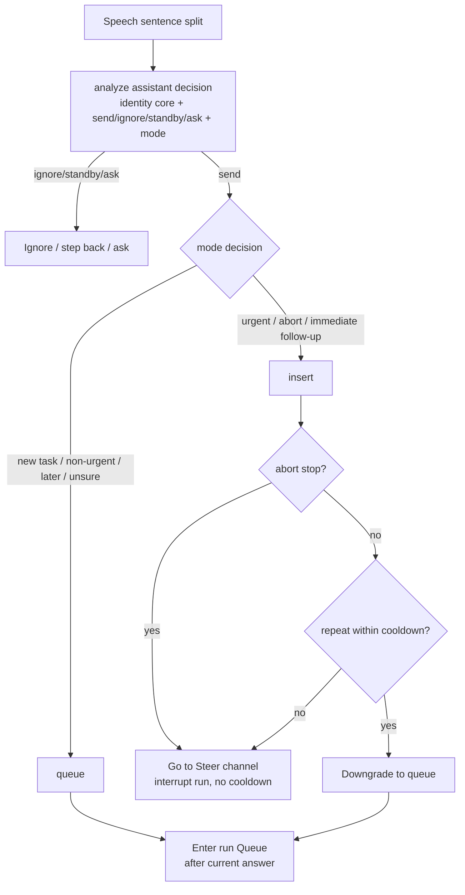
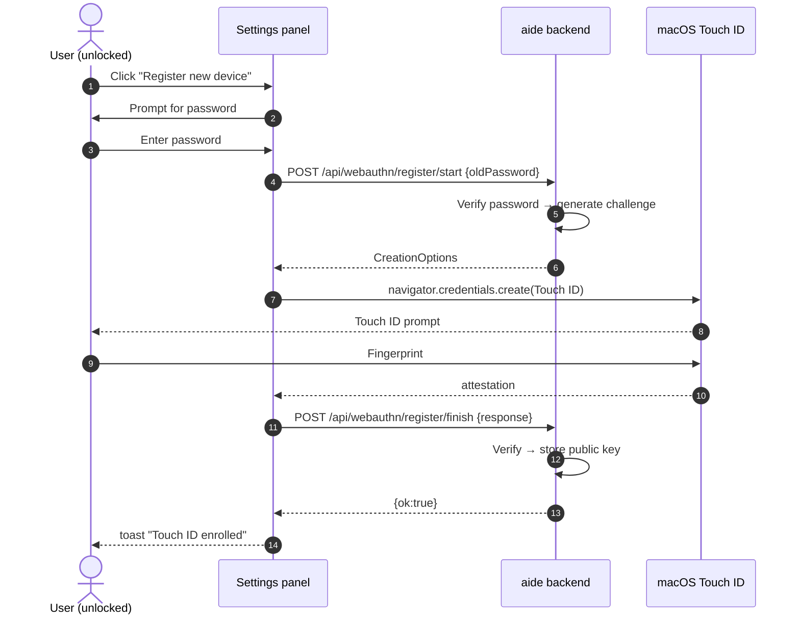
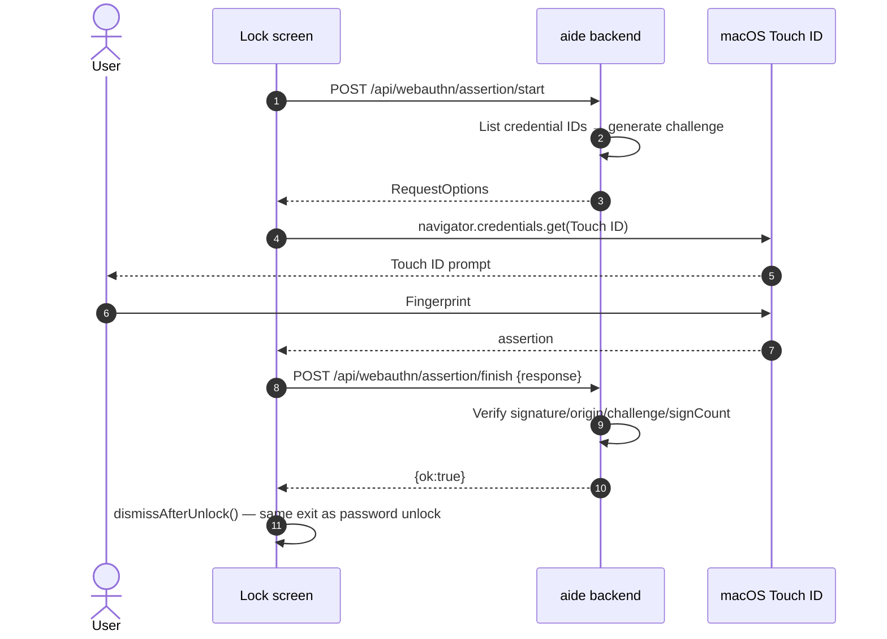

# User guide

[简体中文](../user-guide.md) · **English**

This guide covers the 0.1.11.0 RC3 functional baseline. See [Installation](installation.md) for version boundaries.

## 1. Find your way around

- **Left:** new conversation, workspace, recent conversations, context usage, and model settings.
- **Center:** conversation, workflow steps, proposals, and task input.
- **Top:** global conversation search, trajectory, and file/plugin panel switches.
- **Right:** project files or plugins. On narrow screens, open the navigation drawer.
- **Bottom:** the command panel for manually running commands and inspecting output.

## 2. Choose a language and appearance

Open the aide logo → **Settings → Language**. Click **中文** or **English**. Before an explicit choice, an English browser locale uses English and other locales use Simplified Chinese. An invalid saved preference falls back to browser default. Preferences persist in this browser and synchronize across tabs on the same origin. They are not saved on the server.

Language switching updates product-owned text and starter prompts. It does **not** translate conversations, filenames, file contents, custom names, model responses, terminal output, plugin descriptions, or unknown provider/server diagnostics. Existing draft text remains unchanged. To request an English model answer, write your request in English or explicitly ask the model to answer in English.

**English coverage (0.1.10.2 RC1):** all product-owned UI strings are localized. The 52 previously fragmented strings—whole sentences split into concatenated `t()` pieces—have been consolidated into complete sentences with `{0}`/`{1}` placeholders, so English mode no longer falls back to mixed Chinese fragments.

The login screen and standalone file view also provide a language selector. UI language does not convert currencies: CNY pricing remains CNY.

Under **Appearance**, select Professional or Classic, each with Light, Dark, and System modes. System appearance and browser-default language are independent settings. **About** shows the running build version and the GitHub repository.

### Settings overview

The settings panel is organized into sections: Usage stats (§8), Appearance, Language, Model parameters (custom profiles, §3), Archives (session export), Permissions, Account, Persona, Voice assistant, Accessibility, Configuration backup, and About. Reasoning effort (auto/off/low/medium/high) is switched in the strategy popup near the task input, not in the settings panel.

- **Permissions**: three sandbox modes — read-only (read-only commands such as `ls`/`cat`/`git status` only), workspace-write (default; writes still go through proposal approval and dangerous commands are blocked), and danger-full-access (not recommended for daily use). Tool rounds default to 60, range 5–200; when the limit is reached, already streamed output is kept and you can continue.
- **Account**: username and lock-screen password, stored as an **Argon2id** slow hash (OWASP-recommended: 64 MB memory, 3 iterations, 4 threads); no password means no lock. The password also derives an AES-256 key that encrypts persona custom personalities and the voice-assistant conversation history. Users upgrading from older versions are migrated automatically on first login: the legacy SHA-256 hash is upgraded to Argon2id and existing ciphertexts are transparently re-wrapped with the new key. **Transport**: since 0.1.11 the main port speaks HTTPS/TLS (TLS 1.2 minimum, AEAD forward-secret ciphers); a loopback-only self-signed certificate is generated on first start, so tokens and conversation content no longer travel in clear text. See [Security: password hashing & key derivation](../security/password-hashing.md) and [Security: HTTPS/TLS entry hardening](../security/tls.md).
- **Voice assistant**: the microphone button uses the browser Web Speech API for live transcription; the backend distinguishes "for the AI" from background noise and small talk and automatically drops chit-chat. The assistant name is customizable.
- **Data storage & integrity**: all your private state (sessions, memory, voice assistant, config, keys) lives in the `/data` named volume, decoupled from any project — it survives upgrades and project switches and is never written into a project directory or committed to git. Since 0.1.11, `/data` is automatically organized from the legacy 30+ flat files into semantic subdirectories (`auth/` `sessions/` `assistant/` `memory/` `config/` `stats/` `audit/` `secrets/` `certs/`). Legacy volumes migrate automatically on first boot: everything is backed up first, copied and checksum-verified before being moved, and the migration is rollback-safe and re-entrant — no manual step. A boot check plus a 5-minute runtime patrol verify program integrity and key-file readability: missing directories are rebuilt, regenerable data is cleared and rebuilt, and corrupted user data is moved into `.quarantine/` (never auto-deleted). If the program appears tampered with, `/healthz` is marked `degraded` and redeployment is suggested. The `integrity` field of `GET /healthz` reports the current status (ok / degraded / corrupted). See [Architecture: data directory layering & self-healing](../architecture/data-layout.md).


#### Speech engine & naturalness

The assistant's read-aloud no longer relies only on the browser's built-in Web Speech — on macOS it often falls back to a mechanical old voice like Ting-Ting. Since 0.1.10.2 RC1, read-aloud preferentially uses the backend **edge-tts neural voice** (the same engine as Microsoft Edge "Read aloud", with noticeably more natural Chinese voices such as Xiaoxiao and Yunxi), and automatically falls back to browser speech when it is unavailable.



| Engine | Naturalness | Voices | Network needed | Privacy |
| --- | --- | --- | --- | --- |
| edge-tts (default) | High (neural) | Xiaoxiao/Yunxi/Xiaoyi and ~10 more Chinese voices | Yes | Spoken text is sent to Microsoft |
| Browser Web Speech | Low (macOS often Ting-Ting mechanical) | Depends on OS | No | Fully local, never leaves device |
| Cloud / local OSS (reserved) | High | Extensible | Depends | Depends |

**Neural voice vs. browser mechanical voice**: edge-tts sends text to Microsoft's "Read aloud" channel and streams back a natural neural MP3; browser Web Speech synthesizes locally and works offline, but on macOS it often collapses to a single mechanical voice like Ting-Ting. This was the root cause of "no matter which voice I pick, it sounds the same": not that the voice setting was ignored, but that a too-short first-byte timeout mistakenly degraded to browser speech, so every sentence used the OS mechanical voice.

**Robustness: layered timeouts & auto-retry**: edge-tts connection is timed out in three independent stages so a slightly slow first handshake is no longer treated as "unavailable":

- TCP/TLS connect 5s; WSS handshake 5s; **first audio packet 5s** (was 1.5s — the first connection plus GEC token generation often exceeds 1.5s, so it was relaxed).
- Any timeout retries once with a fresh connection ID; only then does it fall back to browser speech. Non-timeout errors (e.g. 403 auth failure) are not retried.
- The backend caches edge availability for 60s: a lightweight probe runs at startup / before the first synth; `/api/config` and `/api/debug/overview` expose `edgeAvailable` and the last failure reason. The cache is re-probed after expiry, so it switches back to the neural voice seamlessly once connectivity returns.

**Degradation notice**: when edge is unavailable and a read falls back to the browser mechanical voice, a toast appears ("neural voice temporarily unavailable, using browser speech"); the settings page also shows a persistent red warning (with the reason) that disappears once edge recovers.

**Colloquializing & prosody**: chat replies are lightly rewritten by an LLM before being read — short sentences, markdown stripped, numbers read aloud, natural filler words. The result is cached in an in-memory LRU keyed by the original text, so the same reply never costs tokens twice. Guided narration is already colloquialized by the backend `voice-narrate` path and is not rewritten again. Speed and expressiveness map to SSML `prosody` / `express-as` on edge-tts.

**Settings**: Settings → Voice assistant → **Speech engine**:

- **TTS engine**: Auto (recommended) / edge-tts / Browser speech.
- **Voice**: listed grouped by female/male; pick Xiaoxiao (female) / Yunxi (male) / Xiaoyi etc. when edge-tts is chosen. "Default (by gender)" maps female→Xiaoxiao, male→Yunxi, neutral→Xiaoyi.
- **Speed**: 0.8–1.3×.
- **Expressiveness**: 0–1, mapped to edge-tts style intensity.
- **Preview / Save**: preview uses exactly the dropdown's current voice (it does not touch the saved config, and the button restores after playback); click **Save** to persist. After switching voice, the sentence currently playing finishes on the old voice; the next sentence uses the new one.

**Offline & privacy**: edge-tts needs network; offline it degrades to browser speech (fully local). Because edge-tts sends spoken text to Microsoft, **choose "Browser speech" manually in classified environments**. An API key is only for future cloud engines; edge-tts needs none and is never echoed back.

**What is unaffected**: the "Read aloud" button on every main-chat message is a flat mechanical reader for arbitrary text; it still uses raw browser Web Speech and is unaffected by the speech-engine setting.

#### Multi-tab lock semantics

The lock state is coordinated between the main workspace tab and file-view tabs (`#file=…`) by three rules, instead of locking each tab independently:

1. **Main unlocked ⇒ no slave locks.** When the main tab is unlocked, newly opened or refreshed slave tabs are never veiled.
2. **Main locked ⇒ all slaves follow.** Once the main tab locks (on load, on idle timeout, or via "Lock now"), every slave tab is blurred and veiled, and the voice assistant steps back on every tab.
3. **Unlocking a slave only unlocks that slave.** Entering the password on one slave tab removes only that tab's veil; the main tab and other slaves stay locked, and the unlock is not reported back.

A `BroadcastChannel` (channel `aide-lock-v1`) runs a frontend-only leader election. Priority tuple `(role: main=0 < file=1, bootTs, tabId)` elects one **master**; `masterLocked` is writable only there. Other tabs are **slaves** and keep their own `localDismiss`. A tab's visible veil = `masterLocked && !localDismiss`.

- **Idle timer lives on the master only**: `lockTimeoutSec` counts down only on the main tab. Activity on any tab throttles (≥1 s) a `ping` to the master to reset it, so reading files in a slave tab won't let the main tab time out.
- **Joining window**: a new tab first shows a neutral "Confirming security state…" veil (~0.6 s) — it neither reveals content nor grabs the password box — before adopting the cluster's lock state.
- **Re-election after the main tab crashes/refreshes**: a slave that hears no master heartbeat for ~3 s starts an election; the highest-priority surviving tab becomes master and inherits the cluster's last known lock state (a locked cluster stays locked rather than unlocking together).
- **Fallback**: on browsers without `BroadcastChannel`, tabs fall back to independent locking, as in older versions.

```mermaid
sequenceDiagram
  autonumber
  participant M as Main (master)
  participant S1 as Slave 1
  participant S2 as Slave 2
  Note over S1: New slave tab joins
  S1->>M: hello (my priority)
  M-->>S1: welcome(masterLocked=false)
  Note over S1: no veil (rule 1)
  Note over M: Main locks (load / idle / manual)
  M->>S1: lock (masterLocked=true, gen+1)
  M->>S2: lock (masterLocked=true, gen+1)
  Note over S1,S2: follow veil, clear localDismiss (rule 2)
  Note over S1: enter password on slave 1
  S1->>S1: localDismiss=true (no broadcast)
  Note over S1: only slave 1 unveiled; M and S2 stay locked (rule 3)
```


- **Configuration backup**: export all settings to a file, or restore from a backup. A backup exported by an older version imports into the new release with defaults auto-filled for any newly added fields, while explicit backup values (including explicit zeros) are preserved; out-of-range numbers and invalid enums fall back to a safe default. The result takes effect immediately, no restart needed, and matches the post-restart state. Backups from a newer version are rejected. See [Security: config backup & cross-version compatibility](security/config-backup.md).
- **Danger zone — Factory reset**: reset aide's settings and local data by scope, in **Settings → Danger zone → Factory reset**. Scopes are optional and safe by default:
  - *Settings* (checked by default): restore model / TTS / theme / permissions / tool rounds / reasoning effort / sandbox / workflow / accessibility to the current defaults. Credential fields (API key, login password hash, debug token) are **preserved** unless *Credentials & keys* is also checked.
  - *Sessions & memory* (opt-in): clear all sessions (active / archived / assistant), aide core memory, and voice history/memory, and reset personality to default; a fresh assistant system session is recreated automatically.
  - *Credentials & keys* (opt-in): clear login password hash, API key, SSH/vault credentials, source secrets, debug token, WebAuthn, and KDF salt, and **rotate the access-token**, then return to login / first-run.
  - *Workspace config* (opt-in): restore the workspace connection config to local defaults; no user files are deleted.

  **Strong confirmation**: you must check "I understand this cannot be undone" and type "reset" before running. If *Credentials & keys* or *Sessions & memory* (which includes voice history) is selected and you have a login password, you must re-enter it to confirm identity; a wrong password is rejected. **Safety net**: before anything is erased, a full backup (including the encrypted secrets envelope and voice history) is written to `/data/config/backups/factory-reset-<timestamp>.json` and shown in the dialog; it can be restored via *Configuration backup → Import*. **Your files are never touched**: your code and documents under `/workspace` and `/context` are never deleted; reset only affects aide's config and local data volume. Every run is appended to `/data/audit/factory-reset-audit.jsonl` (time, scope, backup path, result — never any secret material). After resetting credentials, set a new password and reconnect your model.

## 3. Configure models and strategies

Open **Model settings**. Enter the provider's Chat Completions-compatible Base URL, add model IDs, choose the active model, and save. Cloud providers normally require a key; compatible local services may not. A blank key preserves the existing secret; explicitly select the clear option to remove it.

**API key encryption (since 0.1.11.0-RC2)**: the model API key is no longer written to `settings.json` in plaintext — it is sealed with AES-256-GCM into the unified secret vault at `/data/secrets/vault.enc`. The UI only shows whether a key is configured (`hasApiKey`) and **never echoes it**. On a machine with an account password, the vault stays locked after a restart; before the first model call you are prompted to unlock (account password, or Touch ID on supported Macs — see Touch ID below). Without a password, a machine-bound random master key at `/data/secrets/master-key.bin` (0600) unlocks the vault automatically. On upgrade, any legacy plaintext key in `settings.json` migrates into the vault on first unlock and the old file is securely shredded. See [Security: Unified Secret Vault](security/secret-vault.md).

**Fetch models** queries the provider's `/models` endpoint. A configured status confirms fields, not successful connectivity. Model IDs and context windows must match the provider.

Use **Strategy** near the task input to select automatic routing or a manual parameter profile. The right column selects the model. System profiles are read-only; custom names are user data and are not translated. Routing rules live in `routing-policy.json`.

## 4. Workspaces and references

Click the workspace card to configure local directories or SSH/SFTP. The directory browser starts at the current value and walks upward when the path is unavailable. Configure system-document and cache paths separately. Saved secrets stay in the data volume. Remote SSH/SFTP passwords, private keys, and key passphrases are stored in a unified encrypted secret vault (AES-256-GCM; the master key is derived from the account password via Argon2id). A private key can be pasted or picked from a file (within /workspace, /context, /local); file mode can reference the path only (not stored) or import an encrypted copy. The UI never echoes the key and shows the public-key SHA-256 fingerprint after save. Saving SSH credentials is rejected until an account password is set. See [Security: Unified Secret Vault](security/secret-vault.md).

Under **References**, add named sources: local path, Skill directory, URL, SFTP, FTP, FTPS, or SMB. MCP currently supports registration only. The built-in system-document source follows the document path; registration does not automatically generate documentation. Read/write flags cannot override a read-only Docker mount or remote permissions.

Source registrations are stored in cache `sources.json`; credentials are stored separately. User-defined source names remain unchanged when changing language.

## 5. Files and attachments

Open a text file to edit it. Markdown opens in preview; switch to **Edit** to change source text. **New tab** opens a standalone view with path, preview, edit, and save controls where permitted.

Saves use the original file hash and workspace identity. If a file changed externally or the workspace changed, reopen it rather than bypassing a conflict. Unsaved content is not translated or rewritten by a language switch.

Select **Attach to task** to include saved text in the next request (up to eight files). AI read tools may also read authorized workspace files; attachments are not the complete boundary of model context. Avoid including sensitive material you do not want the configured provider to receive.

**Text size limit (since RC2)**: the editor/model-tool text cap was raised from 256 KiB to **64 MiB** (UTF-8, no NUL). Large files are streamed via byte-range windows on `GET /api/file` (`offset`/`limit`) and line windows in `read_file`, instead of being loaded whole.

**Editor title bar (#59, RC2/RC3)**: the standalone second row was removed; the read-only badge now lives in the title bar, and Save / New tab / Attach-to-task sit right-aligned at the far edge. Read-only viewers (image/PDF/STL/drawio/DXF/Word) hide the Save button.

**Inline viewers**: beyond images/PDF/STL/drawio, 0.1.11 adds two read-only inline viewers:

- **DXF vector drawing (#57)**: `.dxf` is parsed offline via the vendored `dxf-parser` (MIT) into SVG, covering LINE/CIRCLE/ARC/ELLIPSE/LWPOLYLINE/POLYLINE/SPLINE/TEXT/MTEXT/INSERT/DIMENSION with ACI colors, layers, and line widths; toolbar zoom ± and fit-to-window; read-only, save disabled.
- **Word document (#63)**: `.docx` is rendered offline via vendored `docx-preview` 0.3.2 (Apache-2.0) + JSZip 3.10.1 (MIT), preserving headings/tables/lists/images. Sidecar comments are supported (select text to comment, reply, mark resolved; a comment whose anchor no longer matches is flagged stale rather than deleted). Legacy `.doc` binaries prompt you to save-as `.docx`. Comments live in `/data/comments/`, separate from the document body.

## 6. Chat, workflows, and commands

**Chat** is useful for explanation and analysis. **AI workflow** runs Plan → Propose → Review. Inspect proposed file contents and the review before applying changes. Existing-file proposals require a matching attachment snapshot. Applying files is not proof that tests passed.

Built-in read tools and `run_shell` execute directly: shell commands run in a separate non-interactive sandbox shell with a time limit, output/exit-code reporting, and cancellation (a read-only sandbox allows only read-only commands; dangerous commands are blocked in workspace-write mode). `write_file` creates a proposal for approval. In AI workflow mode, suggested test commands are not executed automatically—insert them into the panel, inspect, then run. There is no persistent `cd`, PTY, or interactive terminal application support.

Plugins are trusted Node code and do not gain an independent security sandbox from this proposal workflow.

## 7. Trajectory, search, and compaction

Open **Trajectory** for tasks, steps, tools, proposals, suggested commands, errors, and token usage. Expand details as needed. Search from the top bar or use **⌘K / Ctrl+K** to find conversations by title or cached content.

Compaction summarizes older history into structured context for later requests. It may be automatic above the threshold or triggered manually. It is not ZIP compression and does not guarantee less disk usage or lossless recall. Reopen source files and task history for precise facts.

### Session numbers

Every regular session (including child sessions) gets an incrementing number `#N` at creation, shown before the title in the session list and global search results (e.g. `#3 Project discussion`).

- Numbers start at `#1` and only increase; deleting a session **never** reuses its number.
- Numbers persist in settings across restarts. Sessions created before this feature have no number; only new sessions carry one.
- Global search (⌘K) results also show the `#N` prefix for quick lookup.

### Real-time session-list refresh (#60)

The session list no longer needs manual refresh. The frontend opens one `GET /api/events` SSE stream; the backend broadcasts a `sessions-changed` event on session create/archive/pin/title/state changes and run start (15 s heartbeat). The frontend reloads at most every 300 ms, **preserves your collapsed groups**, and defers the refresh while you are typing in the focused input box. The stream auto-reconnects on drop.

### Assistant system session

Pinned at the very top of the sidebar is the assistant system session — the chat view for your voice secretary (since RC2 it uses a headphone line SVG instead of the 🤖 emoji):

- **Edge-to-edge card (#62, RC3)**: the workspace block and the assistant entry share one card with zero gap, joined by a small triangle filling the top-right corner; the assistant shows a light-blue bottom accent edge (not a full blue block) to distinguish it from regular sessions.
- **Fixed title**: the title always shows the configured assistant name and is not overwritten by a prompt.
- **Master-auth gate**: clicking it first asks for master identity — account password **or** Touch ID fingerprint (see unified master auth below). Once unlocked, the state lasts for the tab; locking the screen forces re-authentication.
- **Unified history timeline (#62, RC3)**: the old standalone "settings → voice assistant → history" view is removed; voice turns and typed messages are persisted together into the assistant session's runs/messages timeline.
- **Text = voice (#62, RC3)**: typing in the assistant session goes through the same `analyze` intent pipeline as voice transcription (`POST /api/sessions/{id}/assistant-message`), including send/ignore/standby and insert/queue decisions.
- **Cross-session tools (#30 now live)**: inside its own view the assistant can call `search_sessions` (keyword search across all sessions, including archived), `get_session` (by `#N` or session ID), `follow_session` (mark for follow-up), and `push_to_session` (push a note/summary into a target session), and can create/control other sessions via `spawn_subagent`. These tools are never exposed in regular sessions; assistant sessions always use the assistant persona.



### The assistant's self-identity

Across every scene — voice transcription, narrating results, and chatting with you directly — the assistant shares one stable sense of "who I am." This identity core is generated in one place on the backend, `voiceIdentityPrompt`, which reads the configured voice-assistant name and is prepended to the system prompt of every request.

- **First-person self**: the assistant calls itself by `{name}` and always speaks as "I" — "I'm {name}" — rather than referring to itself as aide or as some generic assistant.
- **Division of labor with aide**: aide is the AI workbench that actually does the hands-on work (writing code, running commands, editing files, producing formal output); its main chat stays silent. The assistant is the bridge between you and aide — listening, understanding your real intent, routing that intent to aide, summarizing results, explaining in plain language, and following up with reminders — while also acting as your life assistant and companion. Formal output is left to aide; the assistant does not overstep and write code for it.
- **Capabilities**: voice-intent judgment (`send`/`ignore`/`standby`/`ask`); cross-session scheduling (`search_sessions`/`get_session`/`follow_session`/`push_to_session`, by `#number` or session ID, including archived); scrolling the screen and opening files; summarizing and narrating; rewriting written replies into spoken scripts; and handing tasks to a sub-agent or aide when needed.
- **Continuity and memory**: the assistant has its own long-term memory and conversation history (stored encrypted), can reference things you said before, and keeps its tone, stance, and naming consistent; it lives pinned at the top of the session list.
- **Boundaries**: it does not produce formal output on aide's behalf; it does not fabricate information you never said or abilities it does not have; it protects your privacy and confirms before key or irreversible actions.
- **Renaming follows immediately**: after you change the voice-assistant name in settings, the assistant's next reply uses the new self-identity and self-name; the assistant-session title follows along.



### Queue vs. interrupt dispatch

When the assistant relays an understood intent to aide, it now decides for itself whether to **interrupt (insert)** or **queue (queue)** — instead of always cutting in on the current answer.

**Decision signals** (part of the analyze decision):
- **insert (interrupt the current run right away)**: explicit urgency (right now / immediately / hurry / do it now); abort or stop-loss (stop / hold on / cancel / abort / no that's wrong / not this way / wait a second); strongly time-sensitive, must be handled now; or a follow-up tightly tied to the ongoing context that needs an immediate reply.
- **queue (wait for the current answer to finish, then run in order; this is the default)**: an independent new task/request; non-urgent, can wait for the current answer; a follow-up or later item (then / in a bit / by the way / next).
- When unsure, always queue (conservative default).

**How it relates to the manual queue/interrupt modes**: insert equals the manual "steer" — it goes straight onto the current run's steer channel and affects the current turn immediately; queue equals the manual "queue" — it enters the run's Queue and is picked up automatically after the current answer finishes. It reuses the existing mechanism, nothing new.

**Abort handling**: when you say "stop / no / that's wrong / cancel", the assistant always inserts and interrupts the current run immediately; output already streamed is never lost (it relies on the StreamBroker's interrupted state).

**Interrupt cooldown**: to avoid model misjudgements cutting in too often, a *non-abort* interrupt repeated within the cooldown window is auto-downgraded to queue. The window is set by "interrupt sensitivity" — conservative 5s, normal 3s, aggressive 1s. Explicit abort commands are never throttled and always interrupt.

**Settings** (Settings → Voice assistant → Dispatch):
- **Default send mode**: queue (default) / insert. Used when the assistant is unsure or the model omits mode.
- **Interrupt sensitivity**: conservative (default) / normal / aggressive — sets the cooldown window length.

**Observability**: in the assistant history and the voice panel log, every sent message is tagged "插队/Interrupt" or "排队/Queue", together with the assistant's reason, so you can review what was interrupted and why.



## 8. Usage and pricing

**Settings → Usage** shows token totals and a daily heatmap. Hover or focus a day for detail; select it for a daily breakdown. Known per-call costs use the rate snapshot at call time. Default-rate estimates and unpriced legacy records are shown separately. Zero means free; blank pricing is invalid.

Changing a rate affects subsequent calls, not historical snapshots. Provider balance is separate from local usage accounting and may be unavailable. These values are not an official bill; caching, plans, and provider rules can differ. Missing usage and context counts may be heuristic estimates.

## 9. Plugins

Upload a trusted `.js`, `.mjs`, or `.cjs` file, name it, and enable it. Shape validation, loading, and tool declarations do not imply full DSH compatibility. Tools with handlers can participate in the model loop. See the [protocol](../plugin-protocol.md).

### SQLite plugin

The preinstalled **SQLite** plugin (`sqlite`) uses Node's built-in `node:sqlite` with zero dependencies and works offline, reading/writing SQLite files inside the authorized mount roots: parameterized queries, transactions, migrations, schema introspection, and CSV/backup export. Tools are read-only by default; writes require explicit `readonly=false`. Database paths are confined to `/workspace`, `/context`, `/local`, queries are parameterized, and results are truncated by default. See [plugins/sqlite.md](plugins/sqlite.md).

### Unified master identity (#43, RC2)

Every "prove it's you" sensitive action now goes through one endpoint, `POST /api/auth/verify`: **password or Touch ID fingerprint, either one passes**, returning `{ok:true, scope:"master"}` and writing an audit record. The shared `requestMasterAuth()` component prefers the fingerprint prompt and falls back to a password box. It backs six A-class actions: lock-screen unlock, assistant-history views (×3), password change, vault unlock (before the first model call after restart), and the assistant-session gate. B-class actions (save/clear API key, SSH credentials, PDF open password, etc.) keep their own existing flows. Passwordless users are considered identified by default; the vault unlocks automatically via the machine key.

### Touch ID Unlock (macOS)

On MacBooks with Touch ID (or a Touch ID Magic Keyboard), you can unlock the lock screen with a fingerprint instead of a password.

**Requirements**:
- MacBook with Touch ID or external Touch ID Magic Keyboard;
- macOS 13+, Chrome 120+ or Safari 16+;
- **Open aide via `https://localhost:8097`** — WebAuthn RP ID does not allow IP literals. The button is hidden when opened via `127.0.0.1`. Since 0.1.11 the main port is HTTPS; dismiss the self-signed-cert warning to continue.

**Enrollment** (Settings → Account → Touch ID / Passkey):
1. Click "Register new device" and confirm with your lock-screen password;
2. When the Touch ID prompt appears, rest your finger on the sensor;
3. The device appears in the enrolled list.

**Unlocking**: on the lock screen, click "Touch ID Unlock" and rest your finger. Cancelling the fingerprint prompt silently falls back to password entry. The fingerprint unlock uses the exact same dismiss path as password unlock.

**Security**: the private key never leaves the Secure Enclave / iCloud Keychain; the backend stores only the public key and a monotonically increasing signature counter.





## 10. Common recovery actions

- Repeated login: verify the instance, port, and local access token.
- Old UI: verify the build identity and image first, then browser caching.
- File conflict: reopen the current workspace/file; do not force stale content over new work.
- Wrong cost: compare per-call rate snapshots and provider billing semantics.
- Missing context after compaction: return to original files and recorded tasks.

See [Operations](../../HANDOVER.md) for backups and upgrades.

### Discover models before saving

Fetch models uses the current Base URL and API Key fields without saving the draft. A blank key reuses the saved key only when the endpoint is unchanged. When changing providers, enter that provider's key; the previous provider's key is not forwarded. Clear saved key requests discovery without credentials. Choose a returned model in the model ID field, add it, then save settings. The provider must support `{Base URL}/models`.

### AI reference access

AI can call `list_sources`, then `list_files` or `read_file` with a source ID and relative path. Actual file contents return as tool messages, with source IDs visible in file-tool history. AI source access is read-only even if an editor source is marked writable. Docker live tests cover local, Skill, HTTP, FTP, explicit FTPS, password SFTP and SMB1 file reads. Curl does not support SMB2/3 here. MCP remains registration-only.
