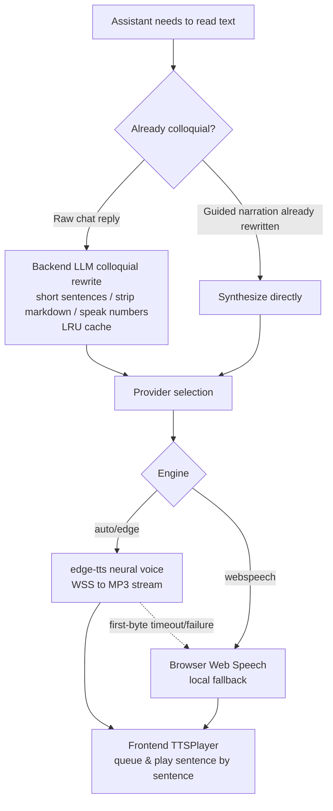
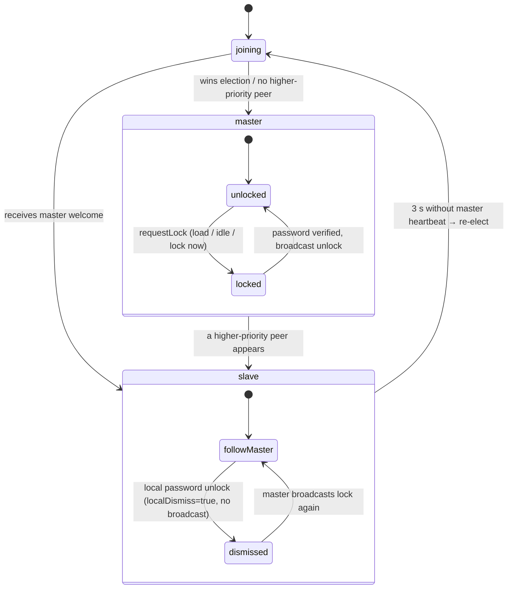
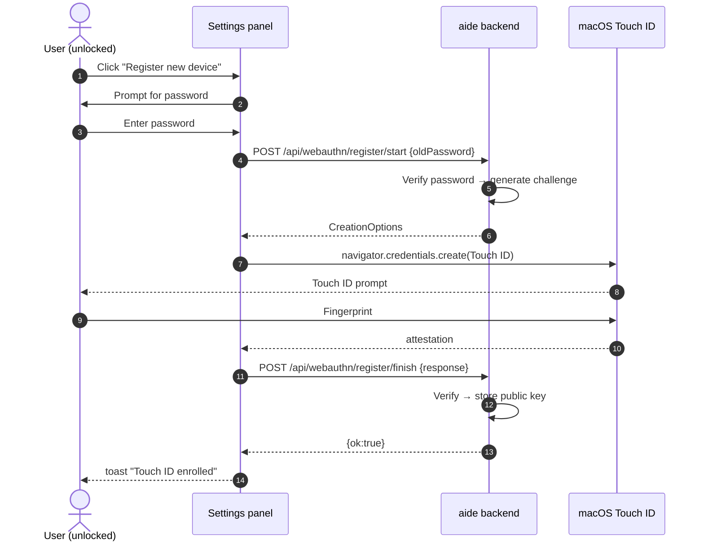
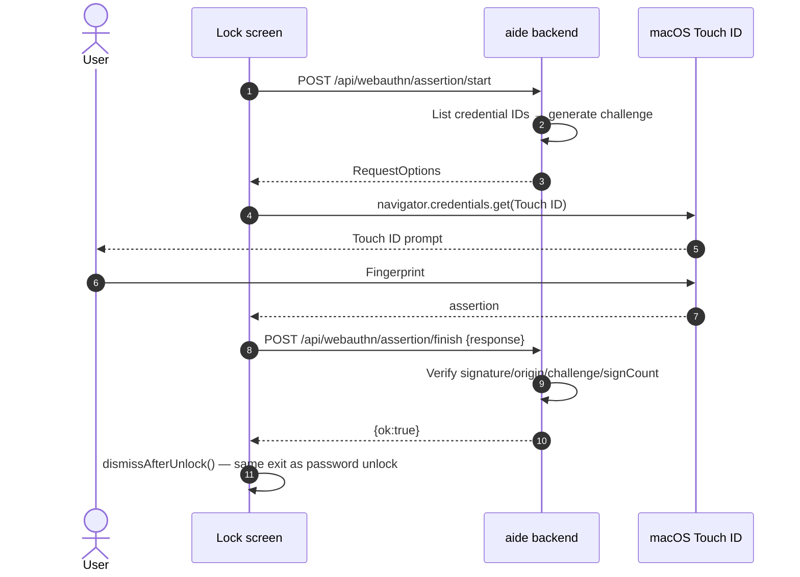

# User guide

[简体中文](../user-guide.md) · **English**

This guide covers the 0.1.10.2 RC1 functional baseline. See [Installation](installation.md) for version boundaries.

## 1. Find your way around

- **Left:** new conversation, workspace, recent conversations, context usage, and model settings.
- **Center:** conversation, workflow steps, proposals, and task input.
- **Top:** global conversation search, trajectory, and file/plugin panel switches.
- **Right:** project files or plugins. On narrow screens, open the navigation drawer.
- **Bottom:** the command panel for manually running commands and inspecting output.

## 2. Choose a language and appearance

Open the aide logo → **Settings → Language**. Click **中文** or **English**. Before an explicit choice, an English browser locale uses English and other locales use Simplified Chinese. An invalid saved preference falls back to browser default. Preferences persist in this browser and synchronize across tabs on the same origin. They are not saved on the server.

Language switching updates product-owned text and starter prompts. It does **not** translate conversations, filenames, file contents, custom names, model responses, terminal output, plugin descriptions, or unknown provider/server diagnostics. Existing draft text remains unchanged. To request an English model answer, write your request in English or explicitly ask the model to answer in English.

**English coverage (0.1.10.2 RC1):** all product-owned UI strings are localized. The 52 previously fragmented strings—whole sentences split into concatenated `t()` pieces—have been consolidated into complete sentences with `{0}`/`{1}` placeholders, so English mode no longer falls back to mixed Chinese fragments.

The login screen and standalone file view also provide a language selector. UI language does not convert currencies: CNY pricing remains CNY.

Under **Appearance**, select Professional or Classic, each with Light, Dark, and System modes. System appearance and browser-default language are independent settings. **About** shows the running build version and the GitHub repository.

### Settings overview

The settings panel is organized into sections: Usage stats (§8), Appearance, Language, Model parameters (custom profiles, §3), Archives (session export), Permissions, Account, Persona, Voice assistant, Accessibility, Configuration backup, and About. Reasoning effort (auto/off/low/medium/high) is switched in the strategy popup near the task input, not in the settings panel.

- **Permissions**: three sandbox modes — read-only (read-only commands such as `ls`/`cat`/`git status` only), workspace-write (default; writes still go through proposal approval and dangerous commands are blocked), and danger-full-access (not recommended for daily use). Tool rounds default to 60, range 5–200; when the limit is reached, already streamed output is kept and you can continue.
- **Account**: username and lock-screen password, stored as an **Argon2id** slow hash (OWASP-recommended: 64 MB memory, 3 iterations, 4 threads); no password means no lock. The password also derives an AES-256 key that encrypts persona custom personalities and the voice-assistant conversation history. Users upgrading from older versions are migrated automatically on first login: the legacy SHA-256 hash is upgraded to Argon2id and existing ciphertexts are transparently re-wrapped with the new key. See [Security: password hashing & key derivation](../security/password-hashing.md).
- **Voice assistant**: the microphone button uses the browser Web Speech API for live transcription; the backend distinguishes "for the AI" from background noise and small talk and automatically drops chit-chat. The assistant name is customizable.

#### Speech engine & naturalness

The assistant's read-aloud no longer relies only on the browser's built-in Web Speech — on macOS it often falls back to a mechanical old voice like Ting-Ting. Since 0.1.10.2 RC1, read-aloud preferentially uses the backend **edge-tts neural voice** (the same engine as Microsoft Edge "Read aloud", with noticeably more natural Chinese voices such as Xiaoxiao and Yunxi), and automatically falls back to browser speech when it is unavailable.



| Engine | Naturalness | Voices | Network needed | Privacy |
| --- | --- | --- | --- | --- |
| edge-tts (default) | High (neural) | Xiaoxiao/Yunxi/Xiaoyi and ~10 more Chinese voices | Yes | Spoken text is sent to Microsoft |
| Browser Web Speech | Low (macOS often Ting-Ting mechanical) | Depends on OS | No | Fully local, never leaves device |
| Cloud / local OSS (reserved) | High | Extensible | Depends | Depends |

**Colloquializing & prosody**: chat replies are lightly rewritten by an LLM before being read — short sentences, markdown stripped, numbers read aloud, natural filler words. The result is cached in an in-memory LRU keyed by the original text, so the same reply never costs tokens twice. Guided narration is already colloquialized by the backend `voice-narrate` path and is not rewritten again. Speed and expressiveness map to SSML `prosody` / `express-as` on edge-tts.

**Settings**: Settings → Voice assistant → **Speech engine**:

- **TTS engine**: Auto (recommended) / edge-tts / Browser speech.
- **Voice**: pick Xiaoxiao (female) / Yunxi (male) / Xiaoyi etc. when edge-tts is chosen; otherwise mapped by the male/female preference.
- **Speed**: 0.8–1.3×.
- **Expressiveness**: 0–1, mapped to edge-tts style intensity.
- **Preview**: synthesize a one-line sample with the current choices.

**Offline & privacy**: edge-tts needs network; offline it degrades to browser speech (fully local). Because edge-tts sends spoken text to Microsoft, **choose "Browser speech" manually in classified environments**. An API key is only for future cloud engines; edge-tts needs none and is never echoed back.

**What is unaffected**: the "Read aloud" button on every main-chat message is a flat mechanical reader for arbitrary text; it still uses raw browser Web Speech and is unaffected by the speech-engine setting.

#### Multi-tab lock semantics

The lock state is coordinated between the main workspace tab and file-view tabs (`#file=…`) by three rules, instead of locking each tab independently:

1. **Main unlocked ⇒ no slave locks.** When the main tab is unlocked, newly opened or refreshed slave tabs are never veiled.
2. **Main locked ⇒ all slaves follow.** Once the main tab locks (on load, on idle timeout, or via "Lock now"), every slave tab is blurred and veiled, and the voice assistant steps back on every tab.
3. **Unlocking a slave only unlocks that slave.** Entering the password on one slave tab removes only that tab's veil; the main tab and other slaves stay locked, and the unlock is not reported back.

A `BroadcastChannel` (channel `aide-lock-v1`) runs a frontend-only leader election. Priority tuple `(role: main=0 < file=1, bootTs, tabId)` elects one **master**; `masterLocked` is writable only there. Other tabs are **slaves** and keep their own `localDismiss`. A tab's visible veil = `masterLocked && !localDismiss`.

- **Idle timer lives on the master only**: `lockTimeoutSec` counts down only on the main tab. Activity on any tab throttles (≥1 s) a `ping` to the master to reset it, so reading files in a slave tab won't let the main tab time out.
- **Joining window**: a new tab first shows a neutral "Confirming security state…" veil (~0.6 s) — it neither reveals content nor grabs the password box — before adopting the cluster's lock state.
- **Re-election after the main tab crashes/refreshes**: a slave that hears no master heartbeat for ~3 s starts an election; the highest-priority surviving tab becomes master and inherits the cluster's last known lock state (a locked cluster stays locked rather than unlocking together).
- **Fallback**: on browsers without `BroadcastChannel`, tabs fall back to independent locking, as in older versions.

```mermaid
sequenceDiagram
  autonumber
  participant M as Main (master)
  participant S1 as Slave 1
  participant S2 as Slave 2
  Note over S1: New slave tab joins
  S1->>M: hello (my priority)
  M-->>S1: welcome(masterLocked=false)
  Note over S1: no veil (rule 1)
  Note over M: Main locks (load / idle / manual)
  M->>S1: lock (masterLocked=true, gen+1)
  M->>S2: lock (masterLocked=true, gen+1)
  Note over S1,S2: follow veil, clear localDismiss (rule 2)
  Note over S1: enter password on slave 1
  S1->>S1: localDismiss=true (no broadcast)
  Note over S1: only slave 1 unveiled; M and S2 stay locked (rule 3)
```


- **Configuration backup**: export all settings to a file, or restore from a backup.

## 3. Configure models and strategies

Open **Model settings**. Enter the provider's Chat Completions-compatible Base URL, add model IDs, choose the active model, and save. Cloud providers normally require a key; compatible local services may not. A blank key preserves the existing secret; explicitly select the clear option to remove it.

**Fetch models** queries the provider's `/models` endpoint. A configured status confirms fields, not successful connectivity. Model IDs and context windows must match the provider.

Use **Strategy** near the task input to select automatic routing or a manual parameter profile. The right column selects the model. System profiles are read-only; custom names are user data and are not translated. Routing rules live in `routing-policy.json`.

## 4. Workspaces and references

Click the workspace card to configure local directories or SSH/SFTP. The directory browser starts at the current value and walks upward when the path is unavailable. Configure system-document and cache paths separately. Saved secrets stay in the data volume.

Under **References**, add named sources: local path, Skill directory, URL, SFTP, FTP, FTPS, or SMB. MCP currently supports registration only. The built-in system-document source follows the document path; registration does not automatically generate documentation. Read/write flags cannot override a read-only Docker mount or remote permissions.

Source registrations are stored in cache `sources.json`; credentials are stored separately. User-defined source names remain unchanged when changing language.

## 5. Files and attachments

Open a text file to edit it. Markdown opens in preview; switch to **Edit** to change source text. **New tab** opens a standalone view with path, preview, edit, and save controls where permitted.

Saves use the original file hash and workspace identity. If a file changed externally or the workspace changed, reopen it rather than bypassing a conflict. Unsaved content is not translated or rewritten by a language switch.

Select **Attach to task** to include saved text in the next request (up to eight files). AI read tools may also read authorized workspace files; attachments are not the complete boundary of model context. Avoid including sensitive material you do not want the configured provider to receive.

## 6. Chat, workflows, and commands

**Chat** is useful for explanation and analysis. **AI workflow** runs Plan → Propose → Review. Inspect proposed file contents and the review before applying changes. Existing-file proposals require a matching attachment snapshot. Applying files is not proof that tests passed.

Built-in read tools and `run_shell` execute directly: shell commands run in a separate non-interactive sandbox shell with a time limit, output/exit-code reporting, and cancellation (a read-only sandbox allows only read-only commands; dangerous commands are blocked in workspace-write mode). `write_file` creates a proposal for approval. In AI workflow mode, suggested test commands are not executed automatically—insert them into the panel, inspect, then run. There is no persistent `cd`, PTY, or interactive terminal application support.

Plugins are trusted Node code and do not gain an independent security sandbox from this proposal workflow.

## 7. Trajectory, search, and compaction

Open **Trajectory** for tasks, steps, tools, proposals, suggested commands, errors, and token usage. Expand details as needed. Search from the top bar or use **⌘K / Ctrl+K** to find conversations by title or cached content.

Compaction summarizes older history into structured context for later requests. It may be automatic above the threshold or triggered manually. It is not ZIP compression and does not guarantee less disk usage or lossless recall. Reopen source files and task history for precise facts.

## 8. Usage and pricing

**Settings → Usage** shows token totals and a daily heatmap. Hover or focus a day for detail; select it for a daily breakdown. Known per-call costs use the rate snapshot at call time. Default-rate estimates and unpriced legacy records are shown separately. Zero means free; blank pricing is invalid.

Changing a rate affects subsequent calls, not historical snapshots. Provider balance is separate from local usage accounting and may be unavailable. These values are not an official bill; caching, plans, and provider rules can differ. Missing usage and context counts may be heuristic estimates.

## 9. Plugins

Upload a trusted `.js`, `.mjs`, or `.cjs` file, name it, and enable it. Shape validation, loading, and tool declarations do not imply full DSH compatibility. Tools with handlers can participate in the model loop. See the [protocol](../plugin-protocol.md).

### Touch ID Unlock (macOS)

On MacBooks with Touch ID (or a Touch ID Magic Keyboard), you can unlock the lock screen with a fingerprint instead of a password.

**Requirements**:
- MacBook with Touch ID or external Touch ID Magic Keyboard;
- macOS 13+, Chrome 120+ or Safari 16+;
- **Open aide via `http://localhost:8097`** — WebAuthn RP ID does not allow IP literals. The button is hidden when opened via `127.0.0.1`.

**Enrollment** (Settings → Account → Touch ID / Passkey):
1. Click "Register new device" and confirm with your lock-screen password;
2. When the Touch ID prompt appears, rest your finger on the sensor;
3. The device appears in the enrolled list.

**Unlocking**: on the lock screen, click "Touch ID Unlock" and rest your finger. Cancelling the fingerprint prompt silently falls back to password entry. The fingerprint unlock uses the exact same dismiss path as password unlock.

**Security**: the private key never leaves the Secure Enclave / iCloud Keychain; the backend stores only the public key and a monotonically increasing signature counter.





## 10. Common recovery actions

- Repeated login: verify the instance, port, and local access token.
- Old UI: verify the build identity and image first, then browser caching.
- File conflict: reopen the current workspace/file; do not force stale content over new work.
- Wrong cost: compare per-call rate snapshots and provider billing semantics.
- Missing context after compaction: return to original files and recorded tasks.

See [Operations](../../HANDOVER.md) for backups and upgrades.

### Discover models before saving

Fetch models uses the current Base URL and API Key fields without saving the draft. A blank key reuses the saved key only when the endpoint is unchanged. When changing providers, enter that provider's key; the previous provider's key is not forwarded. Clear saved key requests discovery without credentials. Choose a returned model in the model ID field, add it, then save settings. The provider must support `{Base URL}/models`.

### AI reference access

AI can call `list_sources`, then `list_files` or `read_file` with a source ID and relative path. Actual file contents return as tool messages, with source IDs visible in file-tool history. AI source access is read-only even if an editor source is marked writable. Docker live tests cover local, Skill, HTTP, FTP, explicit FTPS, password SFTP and SMB1 file reads. Curl does not support SMB2/3 here. MCP remains registration-only.
