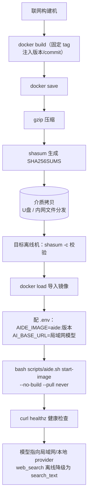

# 安装与首次启动

> **启动配置以 `.env` 为准**：`start.command` → `scripts/aide.sh` → Docker Compose，统一读取 `AIDE_PORT`（默认 8097）和 `COMPOSE_FILE`。临时验收端口不是用户启动入口。目录范围和 macOS 共享根模式见 [工作目录配置](workspace-paths.md)。

aide 融合 AI 与 IDE，让你在本地更专注地处理专业任务。可直接使用发行版，需要扩展时再按 [定制指南](customization.md) 修改源码。安装脚本负责环境检查、首次配置、校验镜像和启动应用；不会静默安装收费软件、请求 sudo、覆盖已有 .env 或删除数据卷。

## 1. 安装宿主环境

| 平台 | 前置环境 | 注意 |
| --- | --- | --- |
| macOS Apple Silicon | Docker Desktop、Git；镜像校验需要 Python 3 | 打开 Docker Desktop，等待引擎就绪；本次镜像为 linux/arm64 |
| Linux ARM64 | Docker Engine、Compose v2、Git、Python 3 | 当前用户须有访问 Docker 引擎的权限 |
| Linux/macOS x86 | 同上 | 使用源码构建；不要直接使用 ARM 归档 |
| Windows | WSL2 Linux 环境与 Docker Desktop WSL 集成、Git、Python 3 | 在 WSL 的 Bash 中运行；本轮未在 Windows 实机验证 |

安装入口：[Docker Desktop](https://docs.docker.com/desktop/) / [Docker Engine](https://docs.docker.com/engine/install/) / [Git](https://git-scm.com/downloads) / [Python](https://www.python.org/downloads/)。Docker Desktop 的适用许可由使用者按其组织情况确认；aide 自身使用 MIT 许可证。不需要在宿主机安装 Go；日常运行无需 npm。开发路由检查另外需要 Node.js 与 Python 3。

## 2. 下载同一版本的源码

```bash
git clone https://github.com/skyelan1999/aide.git
cd aide
git checkout v0.1.10.2-RC1
bash scripts/install.sh --check
```

也可解压 Release 源码 ZIP 后进入根目录。镜像安装脚本需要同版源码中的 Compose、version.md 和 scripts；Docker 归档本身不是双击安装程序。

## 3A. 发行镜像安装（Apple Silicon / ARM64）

从 [Release](https://github.com/skyelan1999/aide/releases) 下载镜像和 SHA256SUMS，放在同一目录，例如 aide/docker-images/：

```bash
bash scripts/install.sh --image docker-images/aide-0.1.10.2-RC1-linux-arm64.tar.gz
```

脚本先检查校验和，再导入镜像并检查架构，最后使用 `--no-build --pull never` 启动。版本不匹配、校验失败或架构不匹配会停止，不会偷偷重建。

## 3B. 源码安装（含 x86）

```bash
bash scripts/install.sh --source
```

首次构建需联网下载基础镜像。脚本创建 context/，仅在 .env 不存在时复制模板，并把本地浏览范围限制到仓库目录。镜像内包含应用与工具链，宿主目录通过挂载提供。

## 3C. 离线 / 空气 Gap 安装（目标机零联网）

适用于完全不连公网的内网/隔离环境。**核心原则：目标机只 `docker load` 已导入镜像并用 `start-image` 启动，绝不执行 `start`**——`start` 会触发 `docker build`，进而拉取基础镜像，在离线机上必然失败或挂起。Compose 已设 `pull_policy: never`，双保险防止裸跑 `compose up` 意外拉取；缺镜像会立即报错而非联网等待。

交付物三件套（来自同一版本 tag，如 0.1.10.2 RC1）：

1. 同 tag 源码（或源码 ZIP，内含 Compose、scripts、version.md）；
2. 自包含镜像归档 `aide-0.1.10.2-RC1-linux-aarch64.tar.gz`（x86 机为 `amd64`；Docker 内部架构标识为 arm64，归档文件名统一用 aarch64/amd64）；
3. 同目录清单 `SHA256SUMS`（单文件；历史零散 `*.sha256` 已废弃）。

```bash
# 目标离线机：校验 → 导入 → 配置 → 启动
cd aide                                   # 同 tag 源码根目录
shasum -a 256 -c docker-images/SHA256SUMS # 校验归档完整性，失败即停
docker load -i docker-images/aide-0.1.10.2-RC1-linux-aarch64.tar.gz
# 复制模板并指定已导入镜像 tag、局域网模型地址（见 .env.example 注释）
#   AIDE_IMAGE=aide:0.1.10.2-RC1
#   AI_BASE_URL=http://<局域网模型地址>
#   AIDE_WEBSEARCH_URL=        # 留空：web_search 离线降级
bash scripts/aide.sh start-image          # = --no-build --pull never，绝不 build/pull
curl -fsSk https://127.0.0.1:8097/healthz   # 健康检查（-k 跳过自签证书校验）
```

离线行为说明：

- **模型必须指向局域网/本地 provider**（内网网关、本地 vLLM 等），`AI_BASE_URL` 不可填公网地址。
- **`web_search` 离线不可用**：未配置 `AIDE_WEBSEARCH_URL` 时该工具直接返回“离线环境不可用在线搜索，请用 search_text 搜本地”，不发起任何外联、不崩溃；需要联网检索时改用本地 `search_text`，或在内网自建 SearXNG 后把地址填入 `AIDE_WEBSEARCH_URL`。
- 前端、drawio、Office 解析等全部内置镜像，无 CDN/外部字体依赖；镜像自包含运行工具链。

离线部署流程：



## 4. 构建、测试与发布门禁（源码开发）

日常 `bash scripts/aide.sh start` 已针对启动热路径优化，无需理解以下细节即可使用；本节说明其工作方式与离线/发布注意事项。

**两种启动模式**

| 命令 | 行为 | 适用 |
| --- | --- | --- |
| `bash scripts/aide.sh start` | 源码构建启动。计算 Go 源码集合（cmd+internal+go.mod/go.sum/vendor + Dockerfile/compose.yaml）哈希，写入镜像 label `aide.srcsha`；二次启动若哈希未变则 `--no-build` 直起（跳过 buildkit，数秒到可访问），变化才 `--build` | 改了源码后本地开发 |
| `bash scripts/aide.sh start-image` | 用已导入镜像 `--no-build --pull never` 直起，绝不 build/pull | 发行镜像 / 离线机 |

**测试与发布门禁（#43）**

- 日常 `start` 的 Docker 构建**默认不跑全量 `go test`**（`AIDE_RUN_TESTS=0`），只做 `go vet` + 增量 `go build`。改前端/Go 后层缓存命中，vet+build 约 5s、端到端约 12s；无改动二次启动走快捷路径约 3s。
- 全量 `go test` 从「每次启动」移到「发布门禁」：`scripts/docker-release.sh` 与 CI 构建必须带 `--build-arg AIDE_RUN_TESTS=1`，强制跑全量测试（约 160s）才放行。门禁不绕过。
- 需要本地全量测试（含 race 检测）时手动跑：`bash scripts/aide.sh test`（容器内 `go test -race -count=1 ./... && go vet ./...`）。
- 临时在构建中打开测试：`AIDE_RUN_TESTS=1 bash scripts/aide.sh start`。

**运行时 pip 层缓存与离线（#46）**

- runtime stage 把稳定层（系统用户 + Office 文档解析 pip 依赖）放在 `COPY` 业务二进制**之前**，把随代码变化的二进制放到最后。这样改 Go/前端只失效最末 COPY 层，pip 层稳定 `CACHED`、不重复联网下载；运行期镜像自包含、绝不联网 pip。
- 依赖版本已锁定（python-docx==1.2.0、openpyxl==3.1.5、python-pptx==1.0.2、ezdxf==1.4.4），pip 下载经 BuildKit cache mount 复用。
- **离线/air-gap 首次构建**：联网机先 `bash scripts/prebuild-wheels.sh` 把 manylinux/arm64 wheel 预下载到 `docker/wheels/`，随源码带到离线构建机，构建时加 `--build-arg PIP_OFFLINE=1`（`pip install --no-index --find-links=/wheels`，纯本地、零联网）。`docker/wheels/` 默认仅含 `.gitkeep`；在线构建忽略它。

## 5. 配置自己的项目

首次默认使用源码目录作为工作区。如需其他目录，修改 .env 后重新启动；路径必须存在，推荐绝对路径：

```dotenv
AIDE_IMAGE=aide:0.1.10.2-RC1
AIDE_PORT=8097
AIDE_WORKSPACE=/absolute/path/to/project
AIDE_CONTEXT=/absolute/path/to/reference
AIDE_LOCAL_ROOT=/absolute/path/to/projects
```

发行镜像后续运行用 `bash scripts/aide.sh start-image`；自定义源码改动后将 AIDE_IMAGE 设为自己的镜像名，用 `bash scripts/aide.sh start` 重建。不要使用 Docker 命令直接覆盖当前业务目录；升级前备份数据卷。

## 6. 登录与连接模型

macOS 脚本自动打开带本地登录令牌的浏览器；Linux 有 xdg-open 时同样处理。无桌面时访问 `https://localhost:8097`，在本机终端运行 `docker compose exec -T aide cat /data/auth/access-token`，复制令牌到登录框。不要把令牌或带令牌的 URL 分享出去。

> aide 自 0.1.11 起主端口走 **HTTPS**：首次启动自动在数据目录生成仅本机回环可用的自签证书，浏览器会提示"连接不是私密连接"，点 **高级 → 继续前往 localhost** 即可（例外对本机这张证书长期有效）。请用 `localhost` 而非 `127.0.0.1` 打开，WebAuthn / Touch ID 的 RP ID 不支持 IP 字面量。命令行健康检查用 `curl -k https://...` 跳过自签校验。离线环境证书本地生成，不受影响。详见 [安全：HTTPS/TLS 入口加固](security/tls.md)。

然后在模型设置填写 Base URL、API Key 和模型 ID。安装不会调用模型；模型费用取决于提供商。先用非敏感问题测试连接，再打开实际资料。

## 常见问题

| 现象 | 处理 |
| --- | --- |
| docker 不存在 / 引擎未就绪 | 安装并启动 Docker，重新运行 --check |
| 端口 8097 被占用 | 修改 AIDE_PORT，不要停掉不属于本项目的服务 |
| bind source path 不存在 | 检查 .env 目录；已有 .env 不会被脚本自动纠正 |
| 镜像标签找不到 | 使用同版源码/归档，确认 docker load 成功及 AIDE_IMAGE |
| checksum mismatch | 停止使用该归档，重新下载同版文件和 SHA256SUMS |
| 版本显示 dev/unknown | 使用正式附件或在 Git 仓库内运行 start 注入版本/SHA |
| 连接模型失败 | 检查提供商配置；安装成功不等于模型已连通 |
| 重启后没有旧会话 | 检查 Compose 项目名及 /data 卷，不要创建新卷代替恢复 |

停止：`bash scripts/aide.sh stop`。查看状态：`bash scripts/aide.sh status`。日志：`bash scripts/aide.sh logs`。不要使用 `docker compose down -v` 清除数据。备份与回滚见 [交接手册](../HANDOVER.md)。

### 配置可浏览的本地目录

工作空间配置中的「浏览」只能访问挂载到 `/local` 的宿主目录。在 aide 仓库根目录执行：

```bash
# 将当前 aide 仓库设为本地浏览根目录
python3 scripts/configure-local-root.py
# 或指定其他已存在的目录（含空格时加引号）
python3 scripts/configure-local-root.py --path "/absolute/path/to/projects"
```

脚本更新 `.env` 的 `AIDE_LOCAL_ROOT` 和 `COMPOSE_FILE`，保留其他配置，不自动重启服务。确认当前任务结束后，执行 `docker compose up -d --no-build --pull never` 重建容器以应用挂载；服务会短暂中断，命名数据卷保留。使用「工作空间配置 → 本机路径 → 浏览」选择目录并保存。浏览器显示并回填电脑上的真实路径；不能通过「上一级」越过配置的浏览根目录；macOS 要从 `/` 浏览已共享目录，运行 `python3 scripts/configure-local-root.py --path /` 后照常启动。应用内切换目录只能选择已挂载范围内的位置，扩大范围须重新配置并重建容器。

### 本地离线语音（可选）

镜像已内置 sherpa-onnx 合成器（Apache-2.0，离线），但中文音色模型外置在 `/data/tts/` 以控体积。
联网环境在容器内执行 `scripts/tts-setup --model huayan` 下载默认女声（约 67MB，含 SHA256 校验）；
保密/空气隙环境按 [本地离线 TTS](security/tts-local.md) 手动放入模型。装完重启后，设置页「语音引擎」选「自动」即优先本地离线，文本不出本机。
