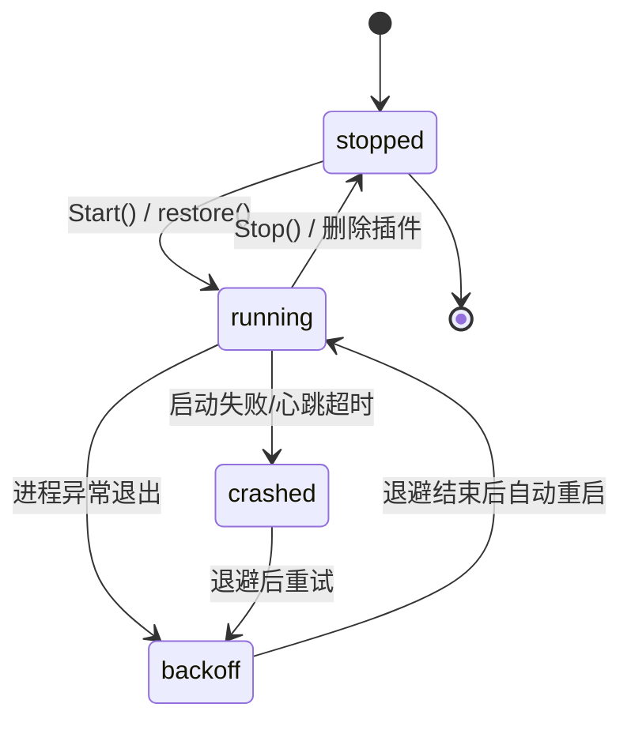

# aide 插件协议 v1.2 · 常驻守护（Daemon）宿主框架

| 项 | 值 |
| --- | --- |
| 协议版本 | v1.2（2026-09-25；新增常驻 daemon 宿主，面向 tcp/udp/ssh/serial 等通讯协议插件） |
| 上位协议 | v1.1（短命 `run`/`call`，见 `docs/plugin-protocol.md`）——本版本完全向后兼容 |
| 宿主 | aide 容器内 Node.js 宿主 `internal/server/plugin_host.js`（随 Go 二进制 embed） |
| 管理器 | Go 侧 `internal/server/plugin_daemon.go`（`DaemonManager`） |
| 通信 | 子进程 stdio，**行分隔 JSON-RPC 2.0 子集** |
| 状态 | 随 aide **0.1.11.0-RC1** 发布；破坏性变更须升协议版本号 |

> 本文是「通讯协议插件套件」的基础框架。tcp / udp / ssh / serial 四个协议插件将基于本框架开发，它们只需要按本规范声明 `daemon: true`、实现工具与生命周期钩子即可，不需要关心进程拉起、心跳、退避重启与事件缓存。

---

## 1. 为什么需要 daemon 模式

v1.1 的 `call` 是**短命进程**：每次工具调用都新起一个 `node` 进程，执行完即退出，进程结束即释放它占用的 socket / 端口。这对一次性工具（读写文件、跑命令建议）足够，但对通讯协议插件是致命的：

- 一个 TCP/UDP/串口监听端口必须**长期占用**，不能每次调用都重启监听；
- 收到的外部报文必须**主动推回** aide（流量事件），而不只是「请求—响应」；
- 长连接（SSH 会话）需要在两次用户操作之间**保持会话状态**。

v1.2 因此引入**常驻守护进程**：每个 daemon 插件对应一个长驻 `node` 子进程，Go 与它之间用 stdio 上的行分隔 JSON-RPC 通信。插件 `require` 后常驻内存，工具调用经 IPC 转发到已加载的 handler，不再每次新起进程。

## 2. 插件声明与形态

插件仍为 CommonJS 模块、DSH/Cordis 形态（`apply(ctx)`），与 v1.1 一致。区别在于：

1. **manifest.json** 新增 `"daemon": true`：

```json
{
  "id": "tcp",
  "name": "TCP 通讯",
  "main": "index.js",
  "daemon": true,
  "enabled": false
}
```

2. 插件对象可选地声明**生命周期钩子**：

```js
'use strict';
module.exports = {
  name: 'tcp',
  apply(ctx) {
    ctx.tool({
      name: 'tcp-listen',
      description: '在 127.0.0.1 上监听一个 TCP 端口',
      handler: async (args, api) => {
        // ...绑定套接字，收到数据时用 ctx.emit('traffic', {...}) 上报
        return { ok: true, port: Number(args.port) };
      },
    });
  },
  async start() { /* 宿主加载后调用：建立监听/长连接 */ },
  stop()        { /* 宿主停止前调用：关闭套接字、释放端口 */ },
};
```

- `start()` 可为 async；宿主在 `apply()` 之后、对外服务之前 `await` 它。
- `stop()` 在 stdin EOF / SIGTERM 时调用，用于释放端口（**这是端口释放的唯一时机**）。
- `apply(ctx)` 里除 v1.1 的 `tool/provide/slot/logger` 外，多了一个 **`ctx.emit(type, fields)`**（见 §5）。

## 3. 进程模型与启动命令

Go 侧用与 v1.1 同一个 embed 脚本，新增 `daemon` 子命令：

```
node -e <plugin_host.js> daemon <absPluginPath>
```

- 加载插件 → `apply(ctx)` → `await start()` → 上报 `ready` 事件 → 开始逐行读取 stdin。
- `ready` 事件之前不接受任何 `tool.call`；Go 侧在 `ready` 到达前不会转发调用。
- 受限环境变量与 v1.1 一致（`PATH=/usr/local/bin:/usr/bin:/bin`、`HOME=/home/aide`），另注入 `AIDE_DAEMON=1`、`AIDE_DAEMON_BIND=127.0.0.1` 提示协议插件**仅绑回环地址**。

## 4. stdio JSON-RPC 消息格式

stdout **只能**输出 JSON-RPC 行（每行一个 JSON 对象，`\n` 分隔）。插件日志一律走 **stderr**，不得写入 stdout，否则污染 IPC 通道。

### 4.1 入站（Go → 插件）

| 消息 | 说明 |
| --- | --- |
| `{"jsonrpc":"2.0","id":N,"method":"tool.call","params":{"tool":"<名称>","args":{...}}}` | 调用已注册工具；`id` 用于配对响应 |
| `{"jsonrpc":"2.0","id":N,"method":"ping"}` | 心跳；宿主须回 `pong` |

### 4.2 出站（插件 → Go）

| 消息 | 说明 |
| --- | --- |
| `{"jsonrpc":"2.0","id":N,"result":<任意JSON>}` | 工具调用成功；`result` 即 handler 返回值 |
| `{"jsonrpc":"2.0","id":N,"error":{"code":<int>,"message":"<...>"}}` | 工具调用失败（`-32601` 未注册、`-32000` handler 异常） |
| `{"method":"event","params":{...}}` | 主动事件（流量/事件/日志），见 §5 |

> 工具调用是**异步乱序**的：handler 可能并发在途，响应靠 `id` 配对，不保证顺序与请求一致。

## 5. 事件上报（traffic / event / log）

插件通过 `ctx.emit(type, fields)` 上报事件，宿主包装为 `{"method":"event","params":{...}}`：

```js
ctx.emit('traffic', {
  direction: 'in',          // in | out
  length: 128,              // 报文字节数
  payloadTruncated: true,   // 载荷是否被截断（默认不上报载荷正文）
});
ctx.emit('event', { subtype: 'connected', message: '远端 127.0.0.1:5222 已连接' });
ctx.emit('log',    { level: 'warn', message: '重连中...' });
```

- `type` 限定为 `traffic` | `event` | `log`，其余归一为 `event`。
- Go 侧为每个 daemon 进程**环形缓存最近 1000 条**，经 `GET /api/plugins/daemons/{id}/events` 查询。
- 出于安全与体积，**默认不上报报文正文**；需要时由插件在 `fields` 里显式携带，并自行截断。

## 6. 生命周期与崩溃恢复

### 6.1 状态机



### 6.2 心跳与崩溃判定

- Go 每 **30s** 发一次 `ping`；**5s** 内未收到 `pong` 即判定崩溃，杀掉进程并触发重启。
- 进程退出后（stdout EOF）若非人为停止，进入退避重启。

### 6.3 指数退避

崩溃后重启间隔：**1s → 2s → 4s → 8s → …，封顶 30s**。
若进程连续健康运行超过 **60s** 后才崩溃，则重置退避基数回 1s（避免长期正常的偶发重启被惩罚性拉长）。

### 6.4 容器重启后自动恢复

进程/容器重启后，`DaemonManager.restore()` 读取注册表：凡声明 `daemon:true` **且** `enabled:true` 的插件自动重新拉起。`enabled:false` 的 daemon 插件**不会**被自动启动。

## 7. HTTP API

| 方法 | 路径 | 说明 |
| --- | --- | --- |
| GET | `/api/plugins/daemons` | 列出所有 daemon 插件状态（running/stopped/backoff/crashed） |
| POST | `/api/plugins/daemons/{id}/start` | 启动指定 daemon |
| POST | `/api/plugins/daemons/{id}/stop` | 停止并释放端口 |
| POST | `/api/plugins/daemons/{id}/restart` | 先停后启 |
| GET | `/api/plugins/daemons/{id}/events` | 查询该进程缓存的最近事件 |

以上路由均复用现有 Bearer Token 鉴权。插件工具调用分流：`callPluginTool` 对 `daemon:true` 插件走 `DaemonManager.Call()`（IPC），其余保持 v1.1 短命进程。

## 8. 与 v1.1 的兼容性

- **非 daemon 插件完全不变**：`run`/`call` 命令、短命进程、结果写临时文件的行为一字未改。
- daemon 插件的 `apply(ctx)` 仍会被 v1.1 的短命 `run` 命令加载一次，用于聚合 surface（暴露工具名/参数）——这一步**只调用 `apply()`，不调用 `start()`**，因此不会在聚合时误绑定端口。
- 一个插件要么是 v1.1 短命插件，要么是 v1.2 daemon 插件，由 manifest 的 `daemon` 字段决定，二者不混跑。
- 未声明 `daemon:true` 的插件，`DaemonManager` 一律不碰。

## 9. 安全模型

- **默认全部禁用**：daemon 插件安装后 `enabled` 默认为 `false`，必须由用户在权限面板显式开启才会被启动或自动恢复。
- **仅绑回环**：daemon 管理器自身不监听任何网络端口；协议插件如需绑定套接字，必须只绑 `127.0.0.1`（通过 `AIDE_DAEMON_BIND` 约定），不暴露到局域网/公网。
- **无特权 capability**：容器不授予 `CAP_NET_RAW`，插件不能抓包或伪造原始套接字。
- **审计**：所有 traffic/event/log 事件由 Go 侧环形缓存留痕，可经 API 查询；停止/删除插件会先终止进程并释放端口。
- **最小权限宿主**：沿用 v1.1 的受限 ctx 子集，插件无法访问 DSH 内部服务、UI 渲染或超出授权挂载根的文件。

## 10. 四个协议插件的接入点

tcp / udp / ssh / serial 插件各自只需：

1. 在 `plugins/<id>/manifest.json` 声明 `"daemon": true`（`enabled` 默认 `false`）。
2. `apply(ctx)` 里用 `ctx.tool({name, description, parameters, handler})` 注册工具。
3. 需要常驻监听/长连接的逻辑放在 `start()`，释放逻辑放在 `stop()`。
4. 报文/状态变化时用 `ctx.emit('traffic'|'event'|'log', {...})` 主动上报。
5. 无需自行处理进程生命周期、心跳、退避重启、事件缓存——全部由 `DaemonManager` 负责。

参考实现：`plugins/testdata/mock-daemon/`（端到端测试用极简插件）。
