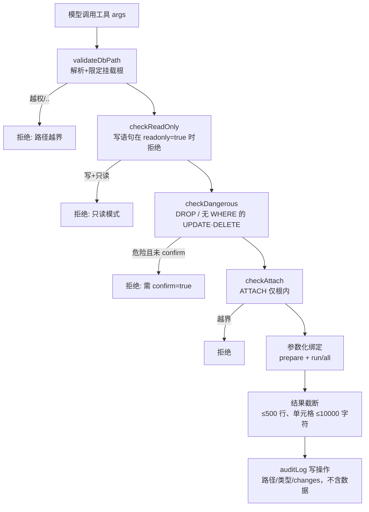

# SQLite 数据库插件（sqlite）

零第三方依赖的普通插件，基于 Node 内置 **`node:sqlite`**（`DatabaseSync`），可离线运行、免原生编译。用于在授权的挂载根内读写 SQLite 数据库文件：参数化查询、事务、多语句迁移、表结构探查与 CSV / 一致性备份导出。

- 插件目录：`plugins/sqlite/`（`manifest.json` + `index.js`）
- 协议：aide 插件协议 v1.1（`docs/plugin-protocol.md`）
- 形态：普通（非 daemon）插件——**每次工具调用短连接**：打开数据库 → 执行 → 关闭，不跨调用复用连接。
- 预装状态：随仓库预装、默认启用；工具默认只读，写操作需显式 `readonly=false`。

## 工具清单

| 工具 | 用途 | 默认 | 主要返回 |
| --- | --- | --- | --- |
| `sqlite_query` | 执行单条参数化 SQL | 只读 | 读：`{columns, rows, rowCount, totalRows, truncated}`；写/DDL：`{changes, lastInsertRowid}` |
| `sqlite_transaction` | 单事务顺序执行多条语句，任一失败回滚 | 可写 | `{committed, results[], changes, lastInsertRowid}` |
| `sqlite_execute` | 事务内执行多语句脚本/迁移（`db.exec`） | 可写 | `{changes, executedStatements}` |
| `sqlite_tables` | 列出表与视图（`sqlite_master`） | 只读 | `{tables:[{name,type,sql}]}` |
| `sqlite_schema` | 单表结构：建表 SQL、列、索引、外键 | 只读 | `{table, sql, columns, indexes, foreignKeys}` |
| `sqlite_export` | 导出 CSV 或 dump（`VACUUM INTO`） | 只读（CSV）/写（dump） | `{format, outputPath, rows\|bytes, truncated?}` |

## 安全模型

所有工具在 handler 入口依次经过下列中间件：



- **路径限制**：`db` 与 `outputPath` 必须落在挂载根 `/workspace`、`/context`、`/local` 之内。相对路径基于 `/workspace` 解析；拒绝 `../` 遍历、拒绝根外绝对路径，并对已存在的文件/目录做 `realpath` 复查以阻断符号链接越权。
- **默认只读**：`sqlite_query`/`sqlite_tables`/`sqlite_schema` 默认 `readonly=true`（以只读模式打开数据库）。写/DDL 必须显式 `readonly=false`。
- **强制参数化**：一律 `prepare(sql)` + 绑定参数（位置参数 `?` 用数组、命名参数 `:name` 用对象），绝不把用户输入拼进 SQL 文本。
- **危险操作拦截**：`DROP`、以及不带 `WHERE` 的 `UPDATE`/`DELETE`，在未传 `confirm=true` 时直接拒绝。
- **ATTACH / 扩展**：`ATTACH DATABASE` 仅允许附加根内文件，否则拒绝；SQLite 扩展加载默认禁用（`allowExtension:false`，`load_extension()` 抛错）。
- **结果截断**：读结果最多返回 500 行，单元格文本超过 10000 字符截断并加 `…[truncated]`；发生截断时返回 `truncated:true`（并给出 `totalRows`）。
- **防锁死**：`PRAGMA busy_timeout`（默认 5000ms，可经 `timeout` 调整），锁冲突在超时内报错返回而非挂死。
- **审计**：写/DDL 操作向 stderr 记录 `{db 路径, 操作类型, changes}`，不记录任何数据正文。

## 使用示例

> 下列由模型通过工具循环调用；`db` 为容器内路径。

**建表并插入**（`readonly=false`）
```json
{ "db": "/workspace/demo.db", "sql": "CREATE TABLE users(id INTEGER PRIMARY KEY, name TEXT, age INTEGER)", "readonly": false }
```
```json
{ "db": "/workspace/demo.db", "sql": "INSERT INTO users(name, age) VALUES (?, ?)", "params": ["alice", 30], "readonly": false }
→ { "changes": 1, "lastInsertRowid": 1 }
```

**参数化查询**（默认只读）
```json
{ "db": "/workspace/demo.db", "sql": "SELECT id, name FROM users WHERE age > ?", "params": [20] }
→ { "columns": ["id","name"], "rows": [{"id":1,"name":"alice"}], "rowCount":1, "totalRows":1, "truncated":false }
```

**事务**（成功提交；任一句失败整体回滚）
```json
{ "db": "/workspace/demo.db", "statements": [
  { "sql": "INSERT INTO users(name,age) VALUES (?,?)", "params": ["bob", 25] },
  { "sql": "UPDATE users SET age=? WHERE name=?", "params": [31, "alice"] }
] }
→ { "committed": true, "changes": 2, ... }
```

**多语句迁移**
```json
{ "db": "/workspace/demo.db", "script": "CREATE INDEX idx_age ON users(age); CREATE TABLE log(id INTEGER PRIMARY KEY, msg TEXT);" }
→ { "changes": 0, "executedStatements": 2 }
```

**列出表与查看结构**
```json
{ "db": "/workspace/demo.db" }                                  // sqlite_tables
{ "db": "/workspace/demo.db", "table": "users" }               // sqlite_schema
```

**导出 CSV 与备份**
```json
{ "db": "/workspace/demo.db", "format": "csv", "query": "SELECT * FROM users", "outputPath": "/workspace/users.csv" }
{ "db": "/workspace/demo.db", "format": "dump", "outputPath": "/workspace/demo.bak.db" }
```

## 故障排查

| 现象 | 原因与处理 |
| --- | --- |
| `只读模式拒绝写操作` | 工具默认 `readonly=true`；确需写入时显式传 `readonly=false` |
| `attempt to write a readonly database` | 数据库以只读打开（`/context` 挂载本身只读，无法写） |
| `database is locked` | 另一连接持有写锁；`busy_timeout` 后报错，重试即可，不要在长事务中长时间持锁 |
| `路径越界` | `db`/`outputPath` 不在 `/workspace`、`/context`、`/local` 内，或含 `..` 逃逸 |
| `危险操作被拦截` | `DROP` 或无 `WHERE` 的 `UPDATE/DELETE`；确认无误后传 `confirm=true` |
| `Unknown named parameter` | 命名参数对象键需带 `:name` 形式；位置参数请传数组 |

## 平台局限

- **Node 版本**：依赖内置 `node:sqlite`（`DatabaseSync`），需 Node ≥ 22，本项目容器为 Node 24；加载时的 `ExperimentalWarning` 可忽略。
- **容器内路径**：插件看到的是容器路径 `/workspace`、`/context`、`/local`，不是宿主机路径。`/context` 为只读挂载。
- **macOS Docker Desktop**：容器内 `/workspace` 等由 Docker 卷映射决定；要访问宿主机目录，先按 `docs/workspace-paths.md` 配置挂载，再在容器根范围内操作。
- **语句级硬超时**：`DatabaseSync` 为同步 API，无法中断已开始执行的查询；插件以 `busy_timeout` 解决锁等待，宿主另有 60s 调用上限兜底。
- **结果规模**：默认截断到 500 行；更大结果请用 `WHERE`/`LIMIT` 收敛或导出 CSV。
