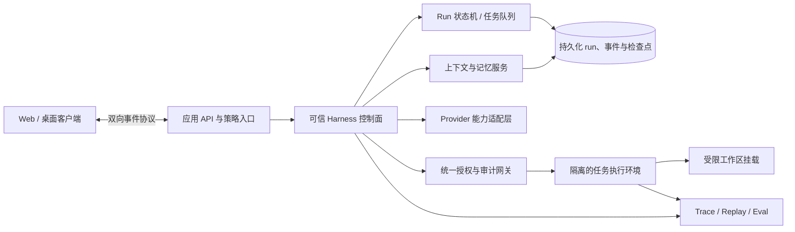

# Aide Agent Harness 架构审阅与演进建议

审阅日期：2026-10-02
代码基线：`6a839798392351516cf5c1da66cb8c81f1f93063`（`main`）
范围：Aide 产品运行时的 agent harness、执行环境、上下文与协作；另评开发期 agent 路由。
方法：静态阅读仓库实现和官方一手架构资料；未运行外部基准、未进行独立渗透测试，也未把厂商自述的性能数字当成横向实测。

## 摘要

Aide 已经不是单轮聊天封装：它有可恢复的任务检查点、有限轮工具循环、计划/提案/审查工作流、流式事件、模型 Profile、子会话、工具调用记录、上下文预算与压缩，以及读写路径和 shell 策略。以一个本地优先、单用户、可自托管工作台衡量，这些是实用且有针对性的能力。

与 2026 年头部 agent harness 公开呈现的架构相比，主要差距集中在运行时边界和可证明性，而非“缺少更多 Agent 角色”：Aide 的 Go 控制逻辑和模型驱动命令仍同处一个应用运行环境；shell 权限主要依赖命令/路径规则和 Docker 容器；长任务状态由应用进程及会话 JSON 管理；子 agent 已有会话级派生，但缺少清楚可见的 DAG、预算治理和自动化结果评估证据；质量验证尚未形成可回放的任务级 eval 与端到端 trace 闭环。

建议路线是先加强隔离、运行可恢复性、审计/eval，再逐步改善上下文与子 agent 调度。暂不建议先做大规模多 Agent 化或换成重量级框架：Anthropic 的长期任务实验也显示，规划、生成、评估会带来明显质量提升，但成本和耗时陡增，且评估器本身仍会漏掉深层交互问题。[Anthropic 长任务 harness 实验](https://www.anthropic.com/engineering/harness-design-long-running-apps)

## 1. 头部架构的共同做法

这里的“先进”指公开资料中的成熟设计模式，不代表存在一个适合所有应用的世界第一实现。OpenAI、Anthropic 和 SWE-agent 的产品边界不同，以下归纳的是可以迁移的工程原则。

| 架构面 | 公开的前沿做法 | 对 Aide 的意义 |
| --- | --- | --- |
| 控制面与执行面 | OpenAI 将 harness 视作控制面，将运行 shell、操作文件的 sandbox 视作执行面；控制面负责工具路由、授权、trace、恢复和 run state。sandbox 可托管或自带。 | 把模型可执行代码与 Aide 密钥、会话库、管理 API 分隔，降低一次提示注入或命令失控的影响范围。[Agents API 架构](https://developers.openai.com/api/docs/guides/agents-api/architecture)、[Sandbox Agents](https://developers.openai.com/api/docs/guides/agents/sandboxes) |
| 长期任务 | 任务运行可跨进程/计算环境持续；状态外置后可快照、恢复或换 sandbox。最新 Agents API 将持久运行、subagents、环境生命周期作为标准化能力。 | 让任务不依赖单个 Go 进程或 Docker 容器的寿命，并把重试语义、取消和副作用纳入设计。[Agents API](https://openai.com/index/introducing-the-agents-api/) |
| 上下文管理 | 及时检索而非预载全部材料；把紧凑规则、长期记忆、当前任务状态分层；通过 compaction、结构化记忆和子任务隔离控制上下文噪声。 | 让长会话可持续，减少无关历史挤占模型注意力，并可说明决策证据来自哪里。[Anthropic context engineering](https://www.anthropic.com/engineering/effective-context-engineering-for-ai-agents) |
| 工具接口 | SWE-agent 将 Agent-Computer Interface 当作一等设计面：工具输出短而可操作，编辑可即时 lint，搜索和文件阅读按 agent 的交互特点优化。 | 除“模型能调用工具”外，还需衡量工具的可理解性、失败反馈、输出规模和恢复能力。[SWE-agent ACI](https://github.com/SWE-agent/SWE-agent/blob/main/docs/background/aci.md) |
| 长任务开发 | Anthropic 的实验从规划与分 sprint、明确可验收合同、生成、独立 QA 迭代；后续模型更强后，逐项消融 harness，而非不断叠加固定脚手架。 | Aide 可用小型 eval 验证每项机制是否真的改善结果；角色数量应由效果实验决定。[Harness design](https://www.anthropic.com/engineering/harness-design-long-running-apps)、[Effective long-running harnesses](https://www.anthropic.com/engineering/effective-harnesses-for-long-running-agents) |
| 安全与授权 | 以环境隔离、文件系统边界、网络出站控制和最小权限限制能力；提示注入检测/动作分类器只能作为纵深防护的一层。 | 不能把 system prompt、危险命令黑名单或模型审批判断当作强安全边界。[Anthropic containment](https://www.anthropic.com/engineering/how-we-contain-claude) |
| 仓库可读性 | OpenAI 的 harness engineering 实践把短 `AGENTS.md` 当导航，把详细知识放入结构化文档，并通过可执行架构约束保持边界。 | Aide 最近加入的代码导航与 skill 路由方向正确；下一步应让规则由检查器验证并能反馈至每次任务。[OpenAI harness engineering](https://openai.com/index/harness-engineering/) |

## 2. Aide 当前架构盘点

### 已有基础

1. **明确的运行主链。** `internal/server/workflow.go` 管理任务执行、阶段、工具循环、提案和检查点；`provider.go` 隔离模型请求；工具包括文件读写、shell、引用检索、MCP 和子 agent。前端通过 SSE 收事件，并从会话快照恢复状态。
2. **任务可部分恢复。** `Task` 持有 `CheckpointMessages`、`CheckpointStep` 和 `CanResume`；启动时将遗留 `running` 标成 `interrupted`，存在检查点时允许用户继续。此设计比纯内存 agent loop 扎实，但恢复边界还需扩充到外部副作用。
3. **用户可见的提案与确认。** `write_file` 进入待审提案并由用户显式应用；工具轮数、shell 超时和若干沙箱模式可配置。上下文预算可预览，自动/手动压缩保留摘要和近期历史。
4. **可观测性已有雏形。** 保存请求快照、Token usage、步骤状态、工具调用记录和实时事件，便于事后查看；仍未统一成关联一整个 run 的 trace/span 模型。
5. **渐进整理开发体验。** 仓库已建立 `AGENTS.md`、流程文档、专业 skill 路由与代码目录导航。架构文档也把“开发 Agent 路由”和“产品模型路由”区分开。

### 当前不足与风险

| 优先级 | 发现 | 代码依据与影响 |
| --- | --- | --- |
| P0 | **控制面与命令执行隔离不足。** | `execShellCommand` 在 Aide 服务容器内启动 bash；Compose 有 `cap_drop: ALL`、`no-new-privileges`、资源上限，但同时挂入 `/workspace`、只读 `/context`、用户 HOME 的 `/local`、`/data` 和 `/home/aide`。Docker 边界降低宿主风险，却未把运行任务从会话数据、服务凭据和控制逻辑所在容器拆开。若开启 `danger-full-access`，shell 策略会绕过常规命令拦截；不能将黑名单视为安全沙箱。 |
| P0 | **不同工具权限尚未统一成显式能力策略。** | `write_file` 是提案，而 `run_shell` 在工具循环中直接执行；MCP 只允许已发现的只读工具；插件则作为可信代码由 Node 执行。用户授权体验和审计粒度因工具类型而异，难以对文件、命令、网络、插件和子 agent 一致设置 allow/ask/deny。 |
| P1 | **持久化恢复不是完整 durable execution。** | 会话以 JSON 文件保存，进程启动将 `running` 标为 `interrupted`，用消息检查点恢复；当前没有外部队列、run 事件日志重放、工作租约、幂等键、崩溃后的副作用对账或可恢复 sandbox 快照。模型响应与命令副作用之间若在保存边界处崩溃，可能重复执行或需要人工判断。 |
| P1 | **多 Agent 有派生能力，但不是完整调度平面。** | `spawnSubagent` 建子会话并后台执行，Task 记录父子 session 和工具归属；主 agent 收到子会话 ID 后仍需模型自行跟进、检查产物和综合结果。公开代码中未见明确的全局并发/成本预算、依赖 DAG、抢占、超时收敛、失败重派策略或独立 evaluator 评估契约。 |
| P1 | **运行质量验证主要由通用仓库测试承担。** | Go/JS 测试、quick/full 门禁和单项任务证据有基础，但报告/代码中未见稳定的代表性任务集、变更前后 pass@task、成本/延迟分布、工具误用率、恢复成功率或安全攻击回归基准。单元测试通过不能证明 agent 在真实项目中完成任务。 |
| P2 | **上下文记忆仍偏摘要加提示词。** | 有 token 预算、压缩、项目记忆和按需 source/MCP；文档指出语义搜索目前是本地 TF-IDF，而非向量检索。还缺少记忆来源、置信度、过期/冲突解决、任务级检索评估和跨 run 产物索引的统一合同。 |
| P2 | **工具协议和 provider 能力处在应用内部耦合层。** | 当前架构图是 Chat Completions provider + 内置工具循环；各供应商的流式、结构化输出、缓存、tool call、重试和上下文特性需要统一映射。应保留多供应商能力，但需定义 feature capability contract，避免静默退化造成行为差异。 |
| P2 | **前沿开发 skill 与产品运行时 skill 不是同一套能力。** | `.agents/skills/` 路由的是代码维护协作；运行时可以把 `skill` 类型来源作为参考资料附加，但没有证据表明它已经是可发现、渐进加载、版本化、受权限约束且可评估的运行时能力目录。要避免 UI 或文档把这两者混称为“agent 已支持 skills”。 |
| P3 | **架构事实需要自动对账。** | 路由与文档质量已有改善，但模块说明、工具 schema、权限语义和 API 能力仍有人工维护部分；随功能增长容易出现文档与实现偏差。应优先用 schema、测试和生成式索引减少复制。 |

## 3. 建议目标架构

这是目标方向，不要求一次性拆服务。第一阶段可在单个 Go 部署中建立接口边界和数据库/事件表；只有并发、恢复或隔离需求有数据证明时，才把控制面和执行面分别部署。

## 4. 演进路线

### 近期：先建立可度量和最小权限（0–2 个月）

1. 定义代表性 task eval：代码修复、文档/文件生成、检索问答、长任务恢复、工具权限拒绝、提示注入。保存输入 fixture、期望产物、关键 invariant 和人工评分 rubric；每次发布跑固定样本。
2. 建立统一 run trace：`run_id → model call → tool call → approval → artifact → verification`；记录模型/provider、耗时、Token/费用、退出原因和输入/输出 hash。Secrets 与敏感正文默认脱敏。
3. 将工具统一注册为声明式 capability：资源范围、读/写/执行、网络需求、风险等级、授权模式和审计字段。UI 提示与后端策略共用同一 schema；禁止只有前端隐藏按钮的权限控制。
4. 将“常规 shell policy”和“隔离强度”区分呈现。为当前模式写明确的威胁模型；对写入 `/data`、访问 `/local`、出网和 Docker socket 做负向测试，确保模型命令没有越权路径。
5. 建立真实用户 run 的可选脱敏 replay 工具，以本地 fixture 回归工具选择/失败处理；不默认上传会话到云端。

**验收指标建议：** eval 集通过率和人工盲评质量不下降；危险路径越权用例 0 次放行；每个失败 run 可由 trace 定位到模型、工具、授权或环境阶段；主要 workflow 的 p50/p95 耗时和单任务 token 成本可见。

### 中期：durable run 与隔离执行（2–6 个月）

1. 为 run、step、tool invocation 建可事务更新的状态存储和追加事件日志；引入 idempotency key、lease、超时恢复和副作用状态。重启后从事件/检查点恢复，必要时先查询副作用再决定重放。
2. 定义 `ExecutionEnvironment` 接口：create、exec、read/write artifact、snapshot、restore、cancel、destroy。初期可实现现有 Docker backend；之后支持本机开发运行时、远程 sandbox 或一次性容器，不让任务状态绑死某种 Docker 实例。
3. 将凭据保留在控制面，通过窄权限代理或短期 token 向执行环境提供能力；按任务挂载目录，不把应用数据卷和用户 HOME 整体暴露给命令环境。默认收紧出站网络，必要时按域名/工具单独开放。
4. 用户界面把后台 run、重试、继续、停止和批准显示为可恢复生命周期；在来源、目标、影响范围上向用户解释批准请求，而不是仅显示命令原文。

**验收指标建议：** 随机杀掉执行容器后恢复成功率、重复副作用率、恢复时间、取消延迟、执行环境残留清理率均纳入集成测试；基线任务在 source 和 release 镜像两种部署中可复现。

### 中期后段：上下文与 agent 协作按实测扩展（6–12 个月）

1. 给项目记忆、文档、任务计划、工具输出和生成物加来源、时间、workspace identity、哈希和权限标签；检索时依据任务意图按需取片段，用户可检查/清理持久记忆。
2. 把 `spawn_subagent` 的自由派生演进为有上限的 DAG/任务图：声明输入、输出契约、可共享文件、预算、并发、截止时间、失败重试/终止和 join 条件。默认只给子任务必要文件与工具。
3. 只有 eval 显示独立审查者能减少逃逸缺陷时，才增加 evaluator 阶段。使用差异审查、构建/测试结果、用户验收标准等硬证据作为 grader 输入，避免让 evaluator 只凭另一段自然语言“感觉完成”。
4. 按 benchmark 结果决定是否采用模型原生工具协议、MCP 或其他 provider 专属能力；维护能力矩阵和适配层契约，不用一个最低公分母抹去有价值的 provider 功能。

## 5. 架构决策建议

- **保留 Go 单体作为控制面起点。** 通过 package/interface 边界拆解，不为了“像某个框架”引入多服务运维负担。
- **先让执行环境成为可替换边界。** 对本地 Docker 与之后的脱离 Docker 运行、远程执行建立统一生命周期契约；不要先重写整个 agent loop。
- **把权限与恢复列为 P0/P1。** 更复杂的 planner 或更多专业 agent 不会自动改善安全、用户信任或任务确定性。
- **把评估作为扩展的准入条件。** 每添 compaction、记忆、multi-agent、自动批准或工具优化，都需要单变量对照任务集和成本/质量结果；能删就删，不以功能数衡量先进程度。
- **明确双层 harness。** `.agents/skills/` 是开发 aide 的外部协作 harness；`internal/server/workflow.go` 是 Aide 产品运行时 harness。共享原则和资料可以复用，运行权限、配置、测试结果不能相互借用。

## 6. 结论

Aide 当前强项是产品功能整合、本地部署控制、工作区和数据边界意识、可见的审批提案，以及已经有检查点和多 provider 方向。短板是这些保护和持久性更多由应用代码与容器约定实现，尚缺一层独立可信的执行控制、可证明的 durable run、统一权限策略和持续任务评估。

最值得投入的下一步是 **执行面隔离 + run trace/eval + 崩溃恢复**。将这三项做到可测、可复现后，再根据实际任务收益增加动态 skills、记忆检索和 DAG 子 agent。如此能沿着前沿架构的能力方向前进，同时保留 Aide 的本地、自托管和多形态优势。

## 参考资料

1. OpenAI, [Introducing the Agents API](https://openai.com/index/introducing-the-agents-api/), 2026-09-10.
2. OpenAI, [Agents API architecture](https://developers.openai.com/api/docs/guides/agents-api/architecture) 与 [Sandbox Agents](https://developers.openai.com/api/docs/guides/agents/sandboxes)，访问于 2026-10-02。
3. OpenAI, [The next evolution of the Agents SDK](https://openai.com/index/the-next-evolution-of-the-agents-sdk/), 2026-04-15.
4. OpenAI, [Harness engineering: leveraging Codex in an agent-first world](https://openai.com/index/harness-engineering/), 2026-02-11.
5. OpenAI, [Unlocking the Codex harness: how we built the App Server](https://openai.com/index/unlocking-the-codex-harness/), 2026-02-04.
6. Anthropic, [Harness design for long-running application development](https://www.anthropic.com/engineering/harness-design-long-running-apps), 2026-03-24.
7. Anthropic, [Effective harnesses for long-running agents](https://www.anthropic.com/engineering/effective-harnesses-for-long-running-agents), 2025-11-26.
8. Anthropic, [Effective context engineering for AI agents](https://www.anthropic.com/engineering/effective-context-engineering-for-ai-agents), 2025-09-29.
9. Anthropic, [How we contain Claude across products](https://www.anthropic.com/engineering/how-we-contain-claude), 2026.
10. SWE-agent, [Agent-Computer Interface](https://github.com/SWE-agent/SWE-agent/blob/main/docs/background/aci.md), 访问于 2026-10-02.
