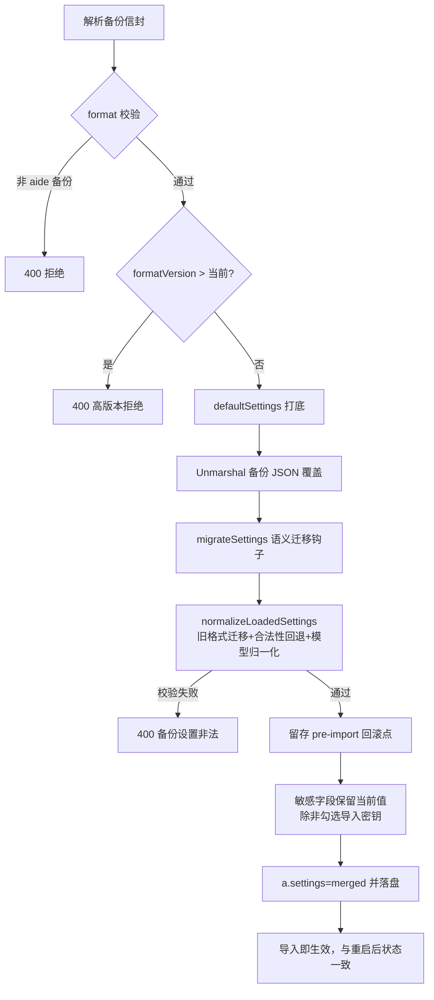

# 安全：配置备份与跨版本兼容

> 适用版本：0.1.11.0-RC1

配置备份（`POST /api/config/export` / `POST /api/config/import`）把 aide 的全部设置打包成一个 JSON 信封。本文说明跨版本导入的兼容机制、非法值回退规则与敏感字段脱敏清单。

## 1. 信封结构

```jsonc
{
  "format": "aide-config-backup",
  "formatVersion": 1,
  "settingsVersion": "0.1.11.0",   // 新增：导出时的设置结构版本，供跨版本迁移判断
  "exportedAt": "2026-09-25T...",
  "appVersion": "0.1.11.0 RC1",
  "includeSecrets": false,
  "includeVoiceData": false,
  "settings": { /* 完整设置快照 */ }
}
```

- `formatVersion`（整型）：信封格式版本。**来自更高版本的备份一律拒绝导入**（`formatVersion > 当前值` → 400），避免新格式覆盖旧版导致不可用。
- `settingsVersion`（字符串）：设置结构语义版本。导入时据此跑语义迁移钩子；缺失该字段视为 0.1.11 之前的旧备份。

## 2. 跨版本导入：默认值自动补全

旧版本导出的备份可能缺少后续版本新增的字段。导入不再以"空 Settings"为底（旧行为会让缺失字段落成零值），而是：

1. **`defaultSettings()` 打底**：先构造一份当前版本完整默认设置；
2. **`json.Unmarshal` 覆盖**：把备份 JSON 反序列化到这份默认上——Go 的 `Unmarshal` 只覆盖 JSON 中**实际出现**的字段。

由此：

| 备份情况 | 导入结果 |
| --- | --- |
| 某字段在备份中**缺失** | 保留当前版本默认值 |
| 某字段在备份中**显式给出**（含显式 `0`/`""`/`false`） | 采用备份值（随后走合法性校验） |

`defaultSettings()` 与 `New()` 启动加载共用同一份默认底，保证"首次安装默认"和"旧备份导入补默认"完全一致。当前默认覆盖：`baseURL`、`sandboxMode=workspace-write`、`toolMaxRounds=60`、`shellTimeout=60`、`lockTimeoutSec=0`、`reasoningEffort=auto`、`voiceAssistantName=小秘`、`voiceReplyGender=female`、`activePersona=aide`、`ttsProvider=auto`、`ttsRate=1.0`、`debugAccessEnabled=false`。

> 敏感字段（`apiKey`/`ttsAPIKey`/`userPasswordHash`/`personaCiphers`/`debugTokenHash`）在默认底中一律留空，绝不预置。

## 3. FormatVersion 迁移钩子框架

缺失字段补默认由"默认底 + Unmarshal 覆盖"自动完成；迁移钩子 `migrateSettings(fromVersion, *Settings)` **只处理语义变化**——字段重命名、枚举转换、字段拆分。

```go
func migrateSettings(fromVersion string, merged *Settings) {
    switch fromVersion {
    case "": // 无标签 = v0（0.1.11 之前）
        migrateV0ToV1(merged)
    // 未来按版本追加 case：
    // case "0.1.11.0": migrateV1ToV2(merged)
    }
}
```

当前示例迁移 `v0 → v1`：旧单人格 `personaCipher`（字符串）→ `personaCiphers`（映射），把旧性格密文播种为 `aide` 人格的自定义密文。该变换幂等，`normalizeLoadedSettings` 内有同款兜底。未来新增破坏性变更时在此按版本追加即可。

## 4. 导入处理流程



## 5. 非法值回退规则

`validateSettings` 对外部读入的关键数值/枚举做校验，越界即回落安全默认：

| 字段 | 合法区间 | 非法时回退 |
| --- | --- | --- |
| `toolMaxRounds` | `1..200` | `60`（`<=0` 或 `>200`） |
| `shellTimeout` | `1..300` | `60`（`<=0` 或 `>300`） |
| `lockTimeoutSec` | `>=0` | `0`（`<0`） |
| `sandboxMode` | `read-only` / `workspace-write` / `danger-full-access` | `workspace-write` |
| `activeModel` | 非空且在模型列表内 | 取模型列表第一个；旧 `model` 字段自动迁移为列表 |
| 每模型 `contextWindow` | `1024..2097152`，`0` 视为未设置 → 默认 `65536` | 由 `normalizeModels` 统一校验 |

导入后调用与 `New()` 启动加载**同一**个 `normalizeLoadedSettings`，因此"导入后立即生效"与"重启后"状态完全一致，无需重启。

## 6. 敏感字段脱敏清单（安全 C 任务成果，必须保留）

非敏感导出（`includeSecrets=false`）在打包前清空以下任何可解密封面的材料：

| 字段 | 含义 |
| --- | --- |
| `apiKey` | 模型 Provider API Key |
| `ttsAPIKey` | TTS 引擎密钥（预留） |
| `userPasswordHash` | 锁屏密码 Argon2id 哈希 |
| `personaCipher` | 旧单人格性格密文 |
| `personaCiphers` | 每人格自定义性格密文映射 |
| `debugTokenHash` | 外部调试接口令牌哈希 |

导入侧对称处理：未勾选"导入密钥"时，上述字段**一律保留当前值**——即使脱敏备份里这些是空串，也不会把现网密钥清空。仅当用户显式勾选且备份确随附敏感数据时才采用备份值。小秘历史密文仅在显式勾选"导入语音数据"时随附。
