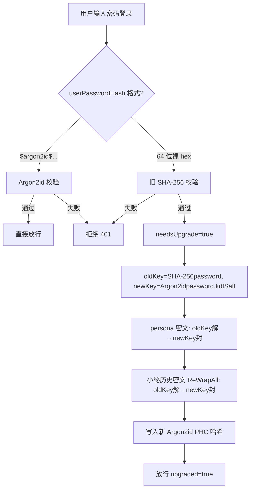

# 安全：密码哈希与密钥派生（KDF）

- 版本：0.1.11.0-RC3
- 日期：2026-09-26
- 适用范围：账户锁屏密码存储、人格自定义性格加密、小秘对话历史加密、统一凭证保险库主密钥派生

## 1. 为什么要换

旧版（0.1.10 及以前）用裸 **SHA-256** 同时做两件事：

1. 账户密码校验——把密码做 SHA-256 后存 64 位十六进制；
2. 数据密钥派生——直接把 `SHA-256(password)` 当作 AES-256 密钥。

SHA-256 是密码学哈希，但**不是慢哈希**：在 GPU 上每秒可算数十亿次。一旦 `settings.json` 泄露，离线暴力破解弱密码几乎没有成本。0.1.11 起改用 **Argon2id**（密码哈希竞赛冠军、OWASP 推荐），在内存与时间上都足够昂贵，让暴力破解变得不现实。

> 高熵随机 token（access-token、debug-token）仍用裸 SHA-256 存储。它们本身是 256 位随机数，不存在字典/暴力枚举空间，不需要慢 KDF。

## 2. Argon2id 参数

| 参数 | 值 | 说明 |
| --- | --- | --- |
| 算法 | Argon2id | 抗时序/抗内存权衡攻击 |
| 内存 `m` | 65536 KiB（64 MB） | 每次哈希占用 64 MB |
| 迭代 `t` | 3 | 三遍 |
| 并行 `p` | 4 | 4 线程 |
| 盐长度 | 16 字节（随机） | 每次哈希独立随机 |
| 输出长度 | 32 字节 | 即 AES-256 密钥长度 |

存储为标准 PHC 字符串：

```
$argon2id$v=19$m=65536,t=3,p=4$<base64盐>$<base64哈希>
```

## 3. 两层密钥，各司其职

- **密码哈希（登录校验）**：`HashPassword(password)` 每次用**随机盐**生成 PHC 串存进 `settings.json` 的 `userPasswordHash`。同一密码两次哈希结果不同（随机盐），但校验时从 PHC 串里读回盐与参数重算。
- **数据加密密钥**：`DeriveAESKey(password, kdfSalt)` 用**本机固定盐** `data/kdf-salt.bin`（16 字节随机，权限 0600，首次启动生成后永不重写）派生 32 字节 AES-256 密钥，用于：
  - 人格自定义性格密文（`settings.json` 的 `personaCiphers`）；
  - 小秘对话历史密文（`voice-history.json`）。

固定盐的作用是**域分离**：让数据密钥无法被跨站彩虹表命中，也让登录哈希的随机盐与数据密钥解耦。固定盐不是秘密——它泄露也不直接暴露密钥，但必须与密码配合才能派生。

### 3.1 凭证保险库主密钥分层（RC2）

统一凭证保险库（SSH 凭据 + 模型 API Key，见 [secret-vault.md](./secret-vault.md)）的主密钥按用户是否设密码分两层：

- **已设账户密码**：主密钥 = `DeriveAESKey(password, kdfSalt)`（即上文数据加密密钥），重启后驻留内存为空，须经 `POST /api/unlock`（密码）或 `POST /api/auth/verify`（密码或 WebAuthn 断言）解锁；
- **未设账户密码**：生成 32 字节 `crypto/rand` 随机主密钥，以 `0600` 落盘 `/data/secrets/master-key.bin`，启动时自动加载并解锁 vault。该文件是机器绑定的兜底密钥——它本身不是从密码派生的，但只要它留在本机 `/data` 卷上，无密码用户就能无感使用已入库的 API Key；单独拷走 `settings.json` 仍解不出 key。
- 用户后续首次设置密码时，vault 全部条目从机器密钥 re-wrap 到 Argon2id 密码派生密钥（`ReWrap`），此后 `master-key.bin` 不再参与解密封面。

## 4. 旧用户平滑迁移

旧 `settings.json` 里 `userPasswordHash` 是 64 位裸 hex SHA-256。升级后**不需要重置密码**，首次登录自动完成迁移：



要点：

- **识别**：`IsLegacyHash` 判断 64 位纯 hex 且无 `$argon2` 前缀即为旧格式；`VerifyPassword` 对旧格式用 SHA-256 校验并返回 `needsUpgrade=true`。
- **re-wrap 范围**：人格自定义性格密文（含旧单人格 `personaCipher` 字段）+ 小秘历史密文（`VoiceAgent.ReWrapAll`）。无密文时自然跳过。
- **原子性**：先把所有密文用新密钥封好，再一次性写入新哈希与 settings；解密全程在内存，不落盘明文。
- **中断兜底**：即使升级中途崩溃，解密路径（`decryptPersona` / `voice_agent.unlock`）会**先用新密钥、失败再回退旧 SHA-256 密钥**，保证任何中间状态都能打开。
- **触发点**：`/api/account/verify-password`（锁屏解锁）命中旧格式即迁移；改密码 / 首次设密码一律直接写 Argon2id PHC。WebAuthn 注册与删除设备的旧密码校验同样走 `VerifyPassword`，兼容两种格式。

## 5. 导出脱敏

`/api/config/export` 未勾选"包含敏感信息"时，导出包会清除：`apiKey`、`ttsAPIKey`、`userPasswordHash`、`personaCiphers`、旧 `personaCipher`、`debugTokenHash`。小秘历史密文仅在显式勾选"包含小秘数据"时随附。导出包不含任何可解密封面的材料。

## 6. 相关代码

- `internal/server/kdf.go`：Argon2id 参数、PHC 解析/校验、`HashPassword`、`VerifyPassword`、`IsLegacyHash`、`DeriveAESKey`、`DeriveAESKeyLegacy`、`ensureKdfSalt`。
- `internal/server/persona.go`：`deriveKey()` 切换为 Argon2id；`sha256Hex` 保留给高熵 token；`decryptPersona` 新旧密钥回退。
- `internal/server/server.go`：`New()` 加载/生成 `kdf-salt.bin`；`accountVerifyPassword` 自动迁移；`migratePasswordHash` 执行 re-wrap。
- `internal/server/voice_agent.go`：`ReWrapAll(oldKey, newKey)`；`unlock`/`disable` 新旧密钥回退。
- `internal/server/config_backup.go`：非敏感导出脱敏。
