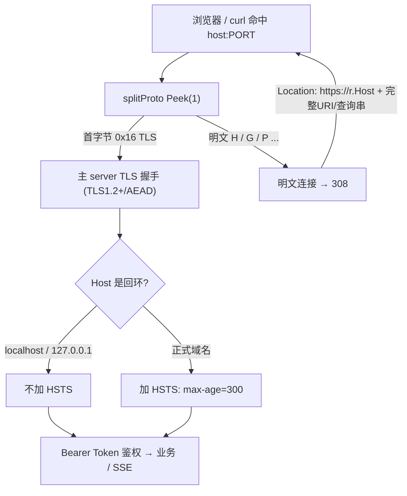

# 安全：HTTPS/TLS 入口加固

- 版本：0.1.11.0-RC1
- 日期：2026-09-25
- 适用范围：服务端监听、传输加密、自签证书、安全响应头、单端口 http→https 自适应跳转

## 1. 为什么要加固

0.1.10 及以前，aide 主端口是**纯明文 HTTP**。令牌（access-token、Bearer 凭据）、会话内容、文件读写都在网络上裸奔。即便只绑定 `127.0.0.1`，本机上的其他进程、浏览器扩展、反向代理或代理工具仍可能窃听或篡改回环流量；WebAuthn / Touch ID 解锁也要求**安全上下文（Secure Context）**才能启用。0.1.11 起主端口改为 **TLS（HTTPS）**，传输全程加密。

## 2. TLS 配置

| 项 | 值 | 说明 |
| --- | --- | --- |
| 最低版本 | TLS 1.2 | 禁用 SSLv3 / TLS 1.0 / 1.1 |
| 推荐协商 | TLS 1.3 | Go 自动启用（含 HTTP/2 over h2），不在代码里列举 |
| TLS 1.2 套件 | 仅 ECDHE 前向保密 + AES-128/256-GCM | 见 `tlsConfig()` |
| 套件偏好 | 服务端优先 | `PreferServerCipherSuites=true` |
| 私钥算法 | ECDSA P-256 | 生成快、体积小 |
| 证书有效期 | 3650 天（10 年） | 仅本机自托管 |

TLS 1.2 白名单套件（全部 AEAD + 前向保密）：

- `TLS_ECDHE_ECDSA_WITH_AES_128_GCM_SHA256`
- `TLS_ECDHE_ECDSA_WITH_AES_256_GCM_SHA384`
- `TLS_ECDHE_RSA_WITH_AES_128_GCM_SHA256`
- `TLS_ECDHE_RSA_WITH_AES_256_GCM_SHA384`

CBC、RC4、3DES、静态 RSA（无前向保密）一律禁用。

## 3. 自签证书自动生成（落在 data/certs/）

首次启动时若 `certs/cert.pem`、`certs/key.pem` 不存在，`ensureTLSCert()` 自动生成一张仅本机回环可用的自签证书：

- **SAN 固定包含** `DNS:localhost` 与 `IP:127.0.0.1`（另含 `::1`）；
- 私钥 ECDSA P-256，写为 `EC PRIVATE KEY` PEM；
- **私钥权限 0600**，证书 0644，目录 0700；
- 位置：**数据目录 `certs/`**（本地 `.data/certs/`，容器 `/data/certs/`，落在持久化数据卷）；
- 已存在则**复用不轮换**——重启不会打断浏览器已点过的"继续访问"例外。

### 旧 `data/tls/` → `data/certs/` 自动迁移

0.1.11 早期版本曾把证书写在 `data/tls/`。#31 分层规范统一为 `data/certs/`。启动时 `migrateLegacyTLSDir()` 自动处理：

- 若 `certs/` 已有证书 → 不覆盖、不动；
- 若旧 `tls/cert.pem`+`tls/key.pem` 存在而 `certs/` 为空 → **原样复制到 `certs/`**（逐字节 SHA-256 校验），权限校正为 cert 0644 / key 0600，**保持同一张证书**避免浏览器重新告警，成功后删除空的旧 `tls/`；
- 任一半缺失 → 不动，由 `ensureTLSCert()` 在 `certs/` 重新生成。

```bash
openssl x509 -in .data/certs/cert.pem -text -noout | grep -A1 "Subject Alternative Name"
# X509v3 Subject Alternative Name:
#     DNS:localhost, IP Address:127.0.0.1, IP Address:::1
```

**证书随 `/data` 数据卷持久化，镜像本身不含私钥**——换镜像、重建容器都不丢已信任的例外；只删数据卷才会重新生成。

## 4. 单端口协议自适应（http 自动 308 跳 https）

主端口（`AIDE_ADDR`，本地默认 `127.0.0.1:8097`，容器 `0.0.0.0:8080`）**一个端口同时接受 HTTP 与 HTTPS**，由 `splitProto()` 在 `Accept` 后用 `bufio.Peek(1)` 看首字节分流：

- 首字节 `0x16`（TLS record 类型）→ 包回该字节后交给主 server 做 **TLS 握手**（保持 HTTP/2 与 SSE 长连接正常）；
- 其余（明文 HTTP）→ 对该连接上的所有请求返回 **`308 Permanent Redirect`**，`Location = https://<r.Host><r.URL.RequestURI()>``。

要点：

- `Location` 直接用 **`r.Host`**（含宿主映射端口，如 `localhost:8097`），**不写死容器内 8080**；
- **308 保留方法与请求体**——浏览器旧缓存标签里的 `http://` API POST 会以 POST 重放到 https，不会被降级成 GET，故指纹注册（register/finish）不再因打到 TLS 端口收明文而 400；
- 不再需要独立的 `AIDE_HTTP_ADDR`/8081 跳转端口（已移除）；
- 每连接独立 goroutine Peek，不批量缓冲；写路径直连底层 socket，SSE（`curl -N`）持续不断流。



## 5. 安全响应头

每个响应统一设置：

- `X-Content-Type-Options: nosniff`
- `Referrer-Policy: no-referrer`
- `Content-Security-Policy`（普通页 `frame-ancestors 'none'`；drawio 子目录放宽为 `'self'`）
- `Cache-Control: no-store`
- `Strict-Transport-Security: max-age=300`——**仅在非回环的 HTTPS 站点下发**

**HSTS 刻意不在 localhost 下发**：一旦浏览器把 `http://localhost` 钉死到 HTTPS，会污染本地开发。max-age 取短值 300 秒，便于快速回收。

**Cookie**：当前全程 Bearer Token（`Authorization` 头，受信路径上的 `?access_token=`），**不使用 Cookie**。未来若引入 Cookie，必须同时设置 `Secure`、`HttpOnly`、`SameSite=Lax`，且仅在 HTTPS 连接下发。

## 6. 浏览器自签警告与 macOS 信任引导

因为证书是本地自签、不被系统信任根收录，首次用浏览器打开 `https://localhost:8097` 会看到"您的连接不是私密连接"警告。这是预期行为：

- 点击 **高级 → 继续前往 localhost（不安全）** 即可；
- 该例外只对本机这张证书生效，重启不轮换（见 §3）；
- WebAuthn / Touch ID 在 `https://localhost` 下可正常启用（RP ID 不支持 IP 字面量，请用 `localhost` 而非 `127.0.0.1` 打开）。

### 可选：把自签根加入 macOS 钥匙串（消除警告）

1. 取出容器内证书：`docker compose exec aide cat /data/certs/cert.pem > aide-local.pem`
2. 双击 `aide-local.pem` → 加入"登录"钥匙串；
3. 钥匙串中双击该证书 → "信任" → "使用此证书时" 改为 **始终信任**；
4. 重启浏览器后 `https://localhost:8097` 不再告警。

仅本机自用，不影响他人；删数据卷会换一张新证书，需重新导入。

## 7. WebAuthn / Touch ID 与 Secure Context

WebAuthn 要求 **Secure Context**（`https://` 或 `http://localhost`）。0.1.11 切到 HTTPS 后：

- 页面跑在 `https://localhost:8097`，`register` / `assertion` 的 origin 会带 `https://` 前缀；
- 后端 `newWebAuthnManager()` 的 `RPOrigins` 同时覆盖 **http/https × localhost/127.0.0.1** 共 4 条，端口取自宿主映射 `AIDE_PORT`（默认 8097）——这样即便浏览器旧标签仍用 `http://localhost:8097` 缓存页面发起 register/finish，也不会被 `origin not allowed` 拒绝；
- `RPID` 仍固定 `localhost`（IP 字面量不合法，故 Touch ID 解锁请用 `localhost` 地址访问）。

## 8. 生产 / 公网部署建议

自签证书**仅适用于本机回环自托管**。若要把 aide 暴露到局域网或公网：

1. **不要**直接暴露回环端口，前面放反向代理（Caddy / Nginx / Traefik）；
2. 用受信任 CA 签发证书（Let's Encrypt 等），替换 `certs/cert.pem` 与 `certs/key.pem`；
3. 此时 HSTS 会自动生效（非回环 Host），可把 `max-age` 逐步调大；
4. 反向代理需把客户端协议透传给后端（或后端仍用本地自签、代理层做外部 TLS 终止）。

离线 / 空气 gap 环境不受影响：证书在容器内本地生成，无需任何外联。

## 9. 相关代码

- `internal/server/server.go`：`Run()` 单端口 `net.Listen` + `splitProto()` Peek 分流；主 server `ServeTLS`；明文连接 `httpsRedirectHandler()` 308；`ensureTLSCert()` 自签证书（写 `CertsDir`）；`tlsConfig()` 严格 TLS 参数；`strictTransportSecurity()` / `isLoopbackHost()` HSTS 条件下发。
- `internal/server/migration.go`：`migrateLegacyTLSDir()` 旧 `data/tls/` → `data/certs/` 迁移。
- `internal/server/webauthn.go`：`newWebAuthnManager()` 按 `AIDE_PORT` 动态生成 http/https × localhost/127.0.0.1 四条 `RPOrigins`。
- `internal/server/tls_test.go`：证书生成/SAN/权限、TLS 套件白名单、308 跳转保留 `r.Host`+URI、Peek 分类（0x16 vs 明文）、certs 迁移、localhost 不加 HSTS。
- `Dockerfile`：`HEALTHCHECK` 改 `curl -fsSk https://127.0.0.1:8080/healthz`（单端口后明文 `/healthz` 会是 308，必须打 https）。
- `scripts/aide.sh` / `start.ps1`：健康检查与打开 URL 改 https。
