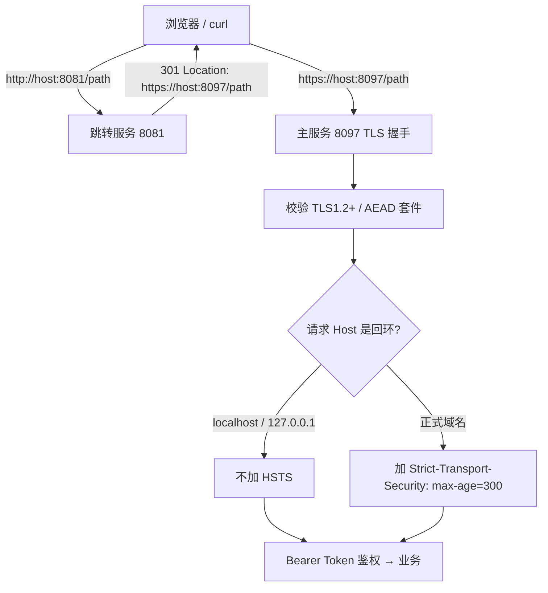

# 安全：HTTPS/TLS 入口加固

- 版本：0.1.11.0-RC1
- 日期：2026-09-25
- 适用范围：服务端监听、传输加密、自签证书、安全响应头、HTTP→HTTPS 跳转

## 1. 为什么要加固

0.1.10 及以前，aide 主端口是**纯明文 HTTP**。令牌（access-token、Bearer 凭据）、会话内容、文件读写都在网络上裸奔。即便只绑定 `127.0.0.1`，本机上的其他进程、浏览器扩展、反向代理或代理工具仍可能窃听或篡改回环流量；WebAuthn / Touch ID 解锁也要求**安全上下文（Secure Context）**才能启用。0.1.11 起主端口改为 **TLS（HTTPS）**，传输全程加密。

## 2. TLS 配置

| 项 | 值 | 说明 |
| --- | --- | --- |
| 最低版本 | TLS 1.2 | 禁用 SSLv3 / TLS 1.0 / 1.1 |
| 推荐协商 | TLS 1.3 | Go 自动启用，不在代码里列举 |
| TLS 1.2 套件 | 仅 ECDHE 前向保密 + AES-128/256-GCM | 见 `tlsConfig()` |
| 套件偏好 | 服务端优先 | `PreferServerCipherSuites=true` |
| 私钥算法 | ECDSA P-256 | 生成快、体积小 |
| 证书有效期 | 3650 天（10 年） | 仅本机自托管 |

TLS 1.2 白名单套件（全部 AEAD + 前向保密）：

- `TLS_ECDHE_ECDSA_WITH_AES_128_GCM_SHA256`
- `TLS_ECDHE_ECDSA_WITH_AES_256_GCM_SHA384`
- `TLS_ECDHE_RSA_WITH_AES_128_GCM_SHA256`
- `TLS_ECDHE_RSA_WITH_AES_256_GCM_SHA384`

CBC、RC4、3DES、静态 RSA（无前向保密）一律禁用。

## 3. 自签证书自动生成

首次启动时若数据目录下 `tls/cert.pem`、`tls/key.pem` 不存在，`ensureTLSCert()` 自动生成一张仅本机回环可用的自签证书：

- **SAN 固定包含** `DNS:localhost` 与 `IP:127.0.0.1`（另含 `::1`）；
- 私钥 ECDSA P-256，写为 `EC PRIVATE KEY` PEM；
- **私钥权限 0600**，证书 0644，目录 0700；
- 位置：数据目录（本地 `.data/tls/`，容器 `/data/tls/`，落在持久化数据卷）；
- 已存在则**复用不轮换**——重启不会打断浏览器已点过的"继续访问"例外。

```bash
openssl x509 -in .data/tls/cert.pem -text -noout | grep -A1 "Subject Alternative Name"
# X509v3 Subject Alternative Name:
#     DNS:localhost, IP Address:127.0.0.1, IP Address:::1
```

## 4. HTTP → HTTPS 跳转

主端口（`AIDE_ADDR`，本地默认 `127.0.0.1:8097`，容器 `0.0.0.0:8080`）**只做 TLS**。另起一个轻量明文跳转服务，默认监听 `127.0.0.1:8081`，把任何 `http://` 请求 301 到同主机的 HTTPS 端口（保留路径与查询串）。置空环境变量 `AIDE_HTTP_ADDR` 可关闭。容器内 8081 不向宿主机暴露，用户直接用 `https://localhost:8097` 访问即可。



## 5. 安全响应头

每个响应统一设置：

- `X-Content-Type-Options: nosniff`
- `Referrer-Policy: no-referrer`
- `Content-Security-Policy`（普通页 `frame-ancestors 'none'`；drawio 子目录放宽为 `'self'`）
- `Cache-Control: no-store`
- `Strict-Transport-Security: max-age=300`——**仅在非回环的 HTTPS 站点下发**

**HSTS 刻意不在 localhost 下发**：一旦浏览器把 `http://localhost` 钉死到 HTTPS，会污染本地开发与 8081 跳转。max-age 取短值 300 秒，便于快速回收。

**Cookie**：当前全程 Bearer Token（`Authorization` 头，受信路径上的 `?access_token=`），**不使用 Cookie**。未来若引入 Cookie，必须同时设置 `Secure`、`HttpOnly`、`SameSite=Lax`，且仅在 HTTPS 连接下发。

## 6. 浏览器自签警告

因为证书是本地自签、不被系统信任根收录，首次用浏览器打开 `https://localhost:8097` 会看到"您的连接不是私密连接"警告。这是预期行为：

- 点击 **高级 → 继续前往 localhost（不安全）** 即可；
- 该例外只对本机这张证书生效，重启不轮换（见 §3）；
- WebAuthn / Touch ID 在 `https://localhost` 下可正常启用（RP ID 不支持 IP 字面量，请用 `localhost` 而非 `127.0.0.1` 打开）。

## 7. 生产 / 公网部署建议

自签证书**仅适用于本机回环自托管**。若要把 aide 暴露到局域网或公网：

1. **不要**直接暴露回环端口，前面放反向代理（Caddy / Nginx / Traefik）；
2. 用受信任 CA 签发证书（Let's Encrypt 等），替换 `tls/cert.pem` 与 `tls/key.pem`；
3. 此时 HSTS 会自动生效（非回环 Host），可把 `max-age` 逐步调大；
4. 反向代理需把客户端协议透传给后端（或后端仍用本地自签、代理层做外部 TLS 终止）。

离线 / 空气 gap 环境不受影响：证书在容器内本地生成，无需任何外联。

## 8. 相关代码

- `internal/server/server.go`：`Run()` 改用 `ListenAndServeTLS`；`ensureTLSCert()` 自签证书生成；`tlsConfig()` 严格 TLS 参数；`httpsRedirectHandler()` 8081 跳转；`strictTransportSecurity()` / `isLoopbackHost()` HSTS 条件下发。
- `internal/server/tls_test.go`：证书生成/SAN/权限、TLS 套件白名单、HTTP→HTTPS 301、localhost 不加 HSTS。
- `Dockerfile`：`HEALTHCHECK` 改 `curl -fsSk https://127.0.0.1:8080/healthz`。
- `scripts/aide.sh` / `start.ps1`：健康检查与打开 URL 改 https。
