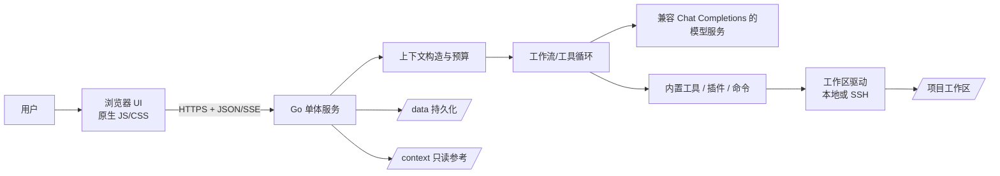
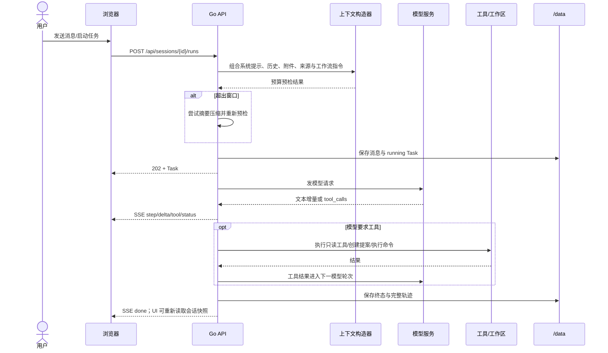
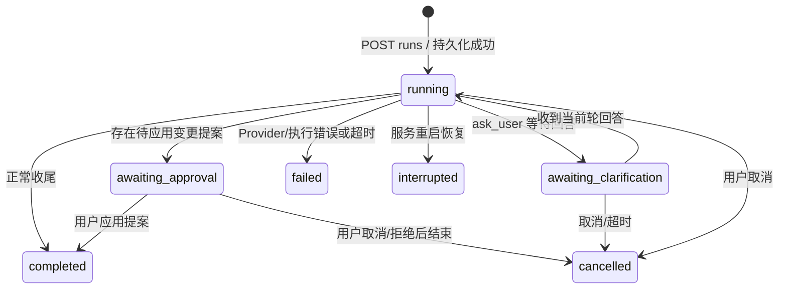
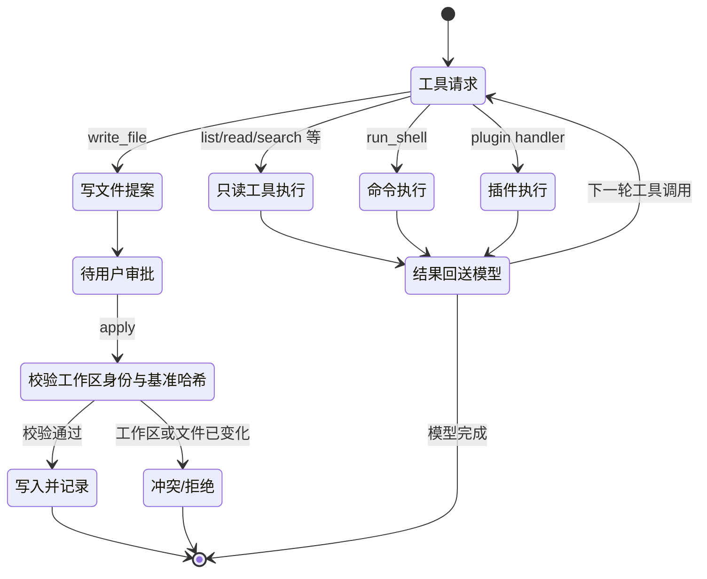
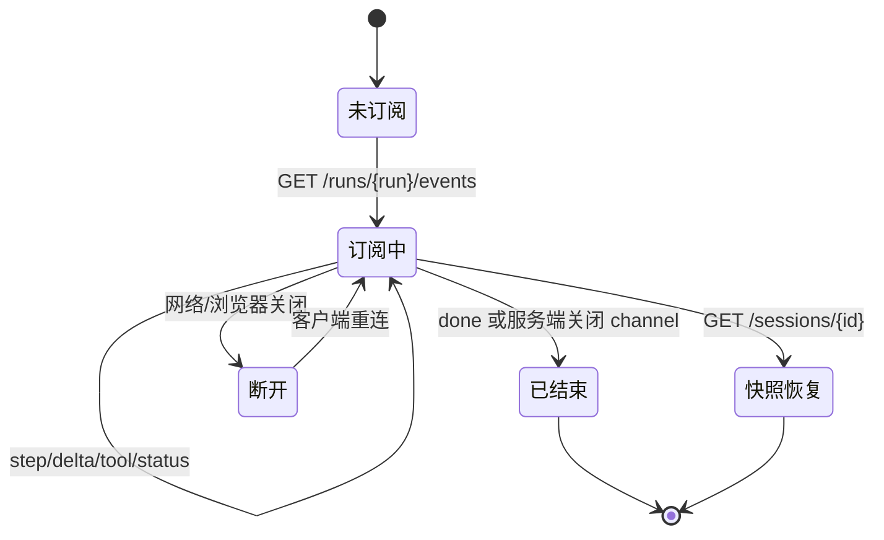

# aide 系统方案、状态机与运行机制

> 本文按 2026-09-30 工作树梳理 aide 的系统结构和实际运行机制，供开发、维护和交接使用。描述以当前源码为准；带“边界/注意”的内容用于区分实现与设计预期。架构索引 `docs/architecture.md` 和 PRD 中的部分状态信息可能早于当前工作树，本文不将旧规划或未验证功能表述为已发布能力。

## 1. 系统定位与边界

aide 是面向可信单用户的本地 AI + IDE 工作台。它把模型对话、项目文件、工具执行、变更提案、命令输出和任务轨迹放在同一个工作区中。用户通过浏览器交互，Go 服务负责会话与任务编排、工作区访问、模型代理和持久化；Docker 提供隔离的运行环境和开发工具。

系统的主要边界：

- **产品形态**：Go 标准库 HTTP 单体服务；前端静态资源通过 `go:embed` 编入二进制。
- **运行形态**：Docker Compose 将项目目录、参考目录和本机共享目录挂载到容器，并把状态持久化到独立 `/data` 卷。
- **模型接入**：通过兼容 OpenAI Chat Completions 的接口调用配置中的模型服务。模型请求可能产生增量输出，也可能返回工具调用。
- **权限模型**：当前工具设置中的“禁用”按工具名在 schema 构造与后端执行边界共同拒绝；Aide 与小秘共享该 deny 判断。文件写入通过提案后由用户应用；命令执行即时运行，但受到容器权限、工作目录和执行预算约束。Node 插件是可信代码，不构成独立安全沙箱。`allow/ask/deny` 的统一、可配置授权策略尚未完成：现有文件提案只覆盖特定写入流程，不能视为通用 ask 审批。
- **用户模型路由**（Profile / routing policy）与开发阶段的 Agent 工作流路由（`AGENTS.md` / `docs/agent`）是两套不同机制。

## 2. 组件与职责

| 层 | 主要职责 | 代码入口/落点 |
| --- | --- | --- |
| 启动与容器 | 初始化服务，提供 Go/Node/Python 等运行工具和持久卷 | `cmd/aide/main.go`、`internal/server/server.go:Run`、`Dockerfile`、`compose.yaml` |
| HTTP/API | TLS、路由、访问令牌校验、设置与 API handler | `internal/server/server.go:Handler` |
| Web UI | 会话列表、聊天、任务轨迹、文件/设置等交互；消费 JSON、SSE 和 NDJSON | `internal/server/web/app.js`、`index.html`、`style.css` |
| 会话与任务 | 对话消息、运行记录、工具步骤、变更提案、队列与插话 | `internal/server/server.go:Session`、`internal/server/workflow.go:Task` |
| 上下文与模型 | 历史/附件/来源构造、窗口预算、Profile 参数、模型请求和流式解析 | `context.go`、`provider.go`、`profiles.go` |
| 工具与扩展 | 文件读取/提案写入、命令、插件、只读 MCP 来源等 | `workflow.go`、`command.go`、`plugins.go`、`plugin_host.js`、`mcp_source.go` |
| 工作区与来源 | 本地或 SSH/SFTP 工作区身份、路径访问、只读参考源 | `workspace_config.go`、`ssh_session.go`、`files.go`、`sources.go` |
| 存储与安全 | 会话、设置、统计、密钥、TLS 证书、审计与缓存 | `paths.go` 及 `internal/server/*` 持久化模块 |

### 2.1 部署与网络

`Run()` 创建 HTTP Server 和 TLS 配置，在同一个监听端口按首字节分流：TLS 连接进入 HTTPS 服务，明文 HTTP 收到 308 跳转。Compose 默认仅绑定宿主机回环地址，容器端口为 8080。服务健康检查访问 `/healthz`。正常访问 API 需要 Bearer access token；EventSource 场景使用事件 URL 的 `access_token` 参数。

Compose 主要挂载如下：

| 容器路径 | 用途 | 默认边界 |
| --- | --- | --- |
| `/workspace` | 当前项目工作区 | 可写；用户项目数据 |
| `/context` | 参考资料 | 只读挂载 |
| `/local` | 主机共享目录 | 默认映射主机 HOME，按配置可写 |
| `/data` | aide 状态卷 | 持久化，和项目目录分离 |
| `/home/aide` | 容器用户缓存/工具链状态 | 命名卷 |

容器默认移除全部 Linux capabilities、启用 `no-new-privileges`，限制进程数、内存和 CPU。它降低进程影响范围，但不能替代对挂载可写范围和可信插件的审查。

## 3. 核心对象与数据流

### 3.1 会话与运行

- **Session** 是对话容器，含 `Messages`、`Runs` 以及标题、置顶/归档/删除、父子会话等元数据。
- **Task（Run）** 是某次用户请求的运行记录，包含模式、提示、状态、步骤、文件变更、命令、工具调用、usage、工作区身份快照和请求快照等。
- **Step** 记录工作流阶段及其状态与内容；**ToolUse** 留存工具调用与结果；**Change** 保存目标路径、提案内容、基准哈希、修改前内容及应用标志。
- SSE 是运行中增量事件通道；会话/运行对象持久化快照是刷新和重连后的权威恢复依据。前端应将事件视为实时增量，而非唯一记录。

### 3.2 一次请求的主链路

上下文预览和真实运行共用上下文构造器。预算将估算的输入与输出预留对照模型窗口；超限时可先压缩旧消息，再保留近期原文并复算。压缩失败、并发会话变化或重算后仍超限时请求失败，不将超预算请求发送给 Provider。压缩摘要是后续上下文组织机制，不等价于删除磁盘上的 Runs 或消息历史。

## 4. 状态机

### 4.1 任务运行状态

运行状态用于描述一次 Task 的生命周期。常见终态为 `completed`、`awaiting_approval`、`awaiting_clarification`、`failed`、`cancelled`；服务重启时仍标为运行中的任务会被恢复逻辑标记为 `interrupted`。终态集合以当前 handler 和持久化代码为准。

补充规则：

1. 新运行先做输入校验、Profile 解析和预算检查；通过后在锁内把用户消息与 `running` Task 写入 Session，再启动 goroutine 执行。写盘失败会回滚本次内存追加。
2. 对话模式的运行超时与工作流模式不同；源码当前对 chat 使用 6 分钟，对工作流使用 15 分钟。启动运行时创建 cancel context，取消 API 或进程关闭会触发取消。
3. 运行结束通过 `finishStream` 广播状态与 `done` 并关闭订阅；`finishLiveRun` 将取消、失败转换为 UI 实时流终态。最终 Session 状态需从 API 快照确认。
4. 等待审批是一个有意暂停的状态：文件尚未应用；用户应用后才写入工作区并标记结果。审批不是模型工具循环继续的同义词。
5. 工具轮数受 `ToolMaxRounds` 配置范围约束；相同工具输入/结果反复出现会引导模型停止重试，重复预算耗尽会给出可继续提示。

### 4.2 工具与变更提案

写文件提案携带工作区 ID/修订及基准哈希，防止任务切换工作区或目标文件被外部修改后误写。应用时会复核身份和版本；多文件应用可能部分成功，因此 UI/结果应检查每个文件状态。命令不是提案：它会立即在任务绑定的工作区上下文中执行，并以 NDJSON 返回输出/退出信息。命令有超时/取消路径，但命令本身对容器用户可访问文件的能力大于受限文件 API。

### 4.3 插话与排队

运行中输入有两种不同语义：**steer** 进入当前任务的插话通道，作为本轮上下文补充；**queue** 存入 Task 队列，待当前任务结束后处理。UI 上发送/停止可复用控件，但服务端将即时取消、插话和排队分开建模。任务中保存 `Steers` 供展示，排队内容保存在 `Queue`；用户可按 API 支持修改、删除或升级排队项。

### 4.4 会话管理状态

会话不是任务状态。`pinned` 影响排序；`archived` 从默认列表隐藏；`deleted` 是删除墓碑，防止旧对象保存时复活。子会话通过 `ParentID` 关联，且可在任务完成时自动归档；系统小秘会话有专门 `Kind`，遵循独立的置顶与删除规则。会话列表变化通过通知/刷新协调，已完成但尚未查看的会话由 `Checked` 等字段支持 UI 提示。

### 4.5 SSE 连接生命周期

SSE 通道可能遇到浏览器断线；服务端订阅者的实时缓冲不是持久队列。重新连接后应读取会话快照以恢复任务最终状态和已保存内容。终态关闭 channel 是服务端清理订阅的信号，不依赖客户端必须收到某个单独事件。

## 5. 工作区、文件与来源机制

- 文件 API 使用相对路径、根类型和路径校验；本地文件根基于 Go `os.Root` 打开，减少路径逃逸风险。
- 工作区可配置为本地或 SSH。运行创建时记录工作区身份、模式和远端路径快照；运行期间工具应继续绑定该身份，避免用户切换工作区时跨项目读写。
- 参考源可以是文件目录或 MCP。MCP 来源通过 stdio 进程发现工具，并只允许模型调用被标记为只读的工具；来源内容及模型输出均视为不可信数据。
- 项目记忆、缓存与 aide 产物写在项目缓存路径；远程工作区相关缓存按身份隔离。不要将缓存目录误认为远端工作区的持久同步机制。
- 插件通过 Node 宿主加载，声明的 schema 用于构造工具描述；插件进程本身是可信扩展，不具备与 Docker 内应用之间独立的细粒度权限隔离。

## 6. 持久化与配置

`/data` 是 aide 状态，不应和用户工作区混用。当前架构文档描述了分层目录：会话 active/archived/assistant，配置，统计，审计，密钥保险库，凭据、证书和完整性状态等。实际路径权威以 `internal/server/paths.go`、迁移代码和运行版本为准；`docs/architecture/data-layout.md` 还包含目标结构说明，不能仅据此认定每个子目录迁移都已在当前部署完成。

持久化原则：

- JSON 配置/状态写入通常采用临时文件加 rename 的原子替换模式。
- 会话数据用于服务重启后恢复；内存中的 goroutine、channel 和 cancel 函数不持久化。
- 模型 API key、SSH/来源凭据等敏感值通过密钥保险库相关逻辑加密或仅在内存中使用；`/api/config` 等响应应脱敏。
- Token 统计与费用快照记录调用信息；历史费率快照与当前可编辑费率分离。
- TLS 证书、access token 和设置由数据卷跨容器重建保留。备份/恢复应使用配置备份接口或受控文件级备份，不能把清理容器当成数据删除策略。

## 7. 安全与信任边界

| 输入/能力 | 当前处理原则 | 主要剩余风险/边界 |
| --- | --- | --- |
| 浏览器访问 API | HTTPS、Bearer token、Host/同源相关校验 | token 持有人具备单用户应用权限；不要公开暴露端口 |
| 模型输出、附件、参考源 | 当作不可信内容；system prompt 明确附件和来源不可充当授权指令 | 模型仍可能误解内容；审核提案与执行结果 |
| 文件读取/写入 | 路径约束；写入先成为提案，应用时检查工作区和哈希 | 命令/插件不完全经过文件 API 的同等约束 |
| Shell 命令 | 容器内即时执行、支持超时/取消，Docker 限权 | 对可写挂载的破坏能力真实存在；用户需审查命令和挂载 |
| Node 插件 | schema/注册表管理，作为扩展加载 | 可信代码执行，非安全沙箱 |
| MCP 来源 | stdio 启动，工具发现后限制为只读调用 | MCP 服务和返回数据仍须信任/审查 |
| `/data` | 独立持久卷，敏感数据分层/加密/权限控制 | 备份文件与宿主机访问权限仍需妥善保护 |

系统服务采用本地单用户假设，不应将当前访问令牌机制理解成面向公网多租户的身份与隔离系统。

## 8. 失败、恢复与可观测性

- **模型请求失败/超时**：任务进入失败终态并保存错误与轨迹；SSE 推送终态。任务重试由单独 API 发起。
- **任务取消**：cancel context 中断当前 Provider/命令路径；已经产生的文本和工具轨迹保留，最终标记 cancelled。
- **服务重启**：启动时加载会话；此前留在 running 的运行应标记 interrupted，因为 goroutine 不会从内存快照续跑。
- **流断开**：不代表任务已取消；先读取 Session/Task 状态确认。
- **超上下文**：尝试压缩后重算，失败则拒绝 Provider 请求并给用户调整附件/新建会话的提示。
- **写入冲突**：工作区身份或目标哈希不匹配时拒绝应用，要求重新读取/生成提案。
- **健康状态**：`/healthz` 供运行探测；系统日志、运行错误环、调试审计及 token 统计提供不同维度的排障证据。审计/调试端点仍受开关、权限和脱敏规则控制。

## 9. API 分层索引

API 的完整注册表以 `internal/server/server.go:Handler` 为准。以下为主链路类别：

| API 类别 | 代表路由 | 作用 |
| --- | --- | --- |
| 健康与配置 | `/healthz`、`/api/config`、`/api/settings` | 健康检查、脱敏配置、运行设置 |
| Profile/模型 | `/api/profiles`、`/api/models`、`/api/balance` | 参数策略和模型服务代理 |
| 会话与任务 | `/api/sessions`、`/api/sessions/{id}/runs`、`.../events` | 会话 CRUD、运行启动、SSE 实时事件 |
| 工作区/文件 | `/api/workspace-config`、`/api/files`、`/api/file` | 工作区设置、文件浏览/读写与提案应用 |
| 上下文/检索 | `/api/context-preview`、`/api/search`、`.../compact` | 预算预览、历史检索、会话压缩 |
| 命令/插件 | `/api/command`、`/api/plugins`、`/api/plugin-surface` | 命令流、插件管理与能力清单 |
| 来源 | `/api/sources`、`/api/sources/{id}/test` | 文件/MCP 来源配置和能力发现 |
| 统计/诊断 | `/api/token-stats`、`/api/debug/*` | 用量费用和受控调试接口 |

具体路径、方法、请求体、鉴权例外以及语音、人格、备份、文件归档等附属 API，请以当前 `Handler()` 注册代码为准。

## 10. 设计约束与后续演进注意

1. **Session JSON 是恢复基础，SSE 是实时投影**：新增 UI 状态时明确是否需要持久化及重启后的恢复方式。
2. **工作区身份是任务边界的一部分**：异步任务、子任务和待审批提案不能只保存一个“当前路径”。
3. **工具权限按执行方式区分**：文件提案、即时 shell、插件执行、MCP 只读调用有不同授权边界，文档和 UI 不要统称为“所有写入都需审批”。
4. **数据布局以代码为准**：目录迁移、旧格式兼容和配置导入导出要考虑幂等、回滚和用户数据保护。
5. **兼容能力是分层而非全等**：不同 Provider 对流式选项、usage、模型参数、工具调用和图片输入的支持可能不同。
6. **验证需区分静态检查、自动化测试和真实 UI/外部服务**：文档描述架构不构成端到端验收；发布时按任务流程运行适用门禁。

## 11. 参考源码与文档

- `internal/server/server.go`：服务启动、Handler 注册、Session/App 模型和 API。
- `internal/server/workflow.go`：Task、运行启动、工具循环、审批、取消、事件流。
- `internal/server/context.go`、`provider.go`、`profiles.go`：上下文预算、模型 Provider、Profile。
- `internal/server/command.go`、`workspace_config.go`、`ssh_session.go`：命令和工作区驱动。
- `internal/server/paths.go`、`docs/architecture/data-layout.md`：数据路径与布局。
- `compose.yaml`、`Dockerfile`：容器服务、挂载和构建运行环境。
- `docs/architecture.md`、`docs/PRD.md`：既有架构索引与需求基线；请留意各自核对日期及当前工作树差异。
