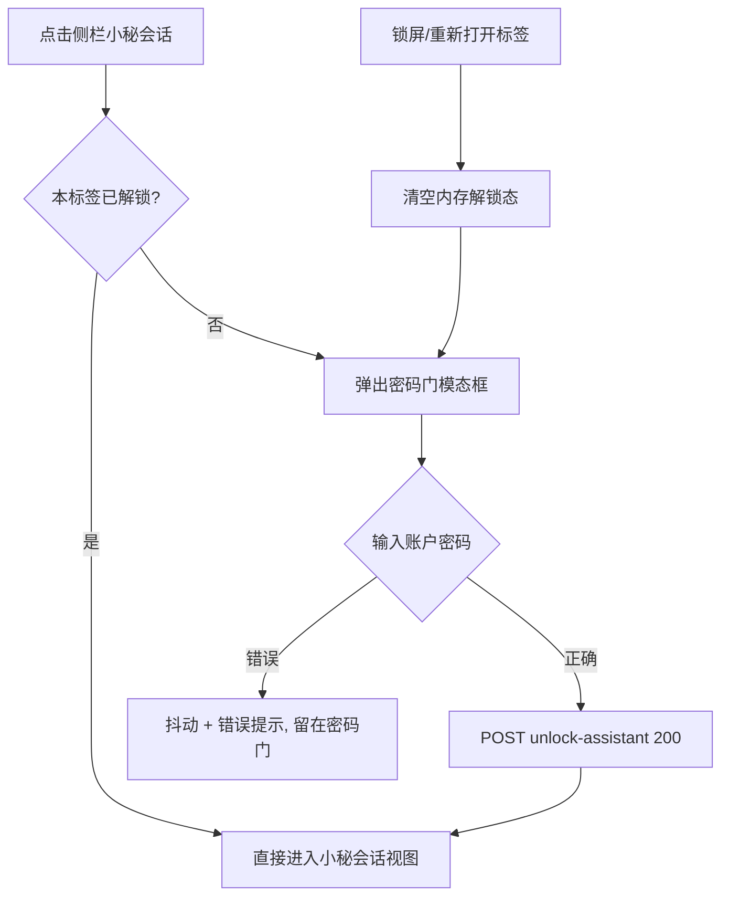
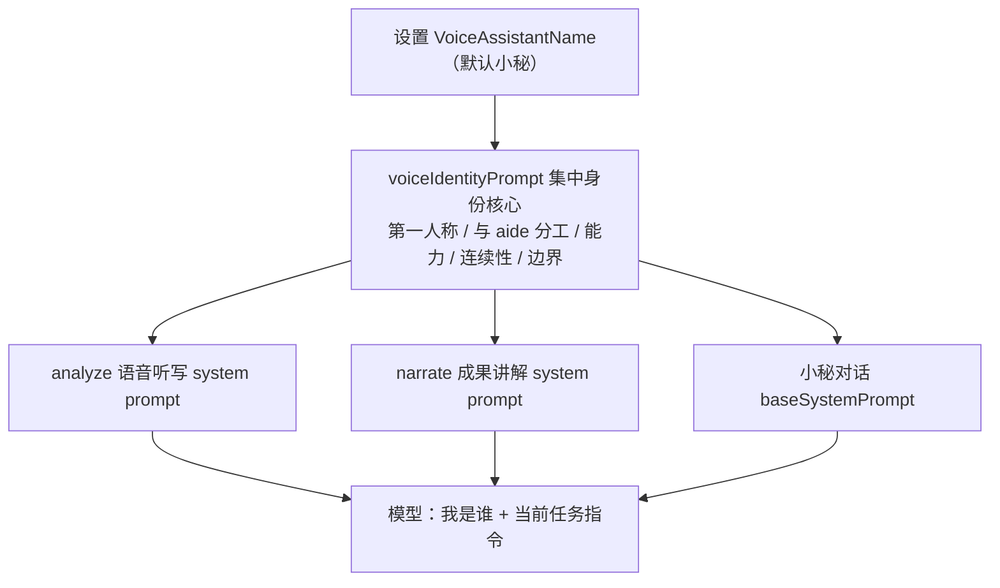
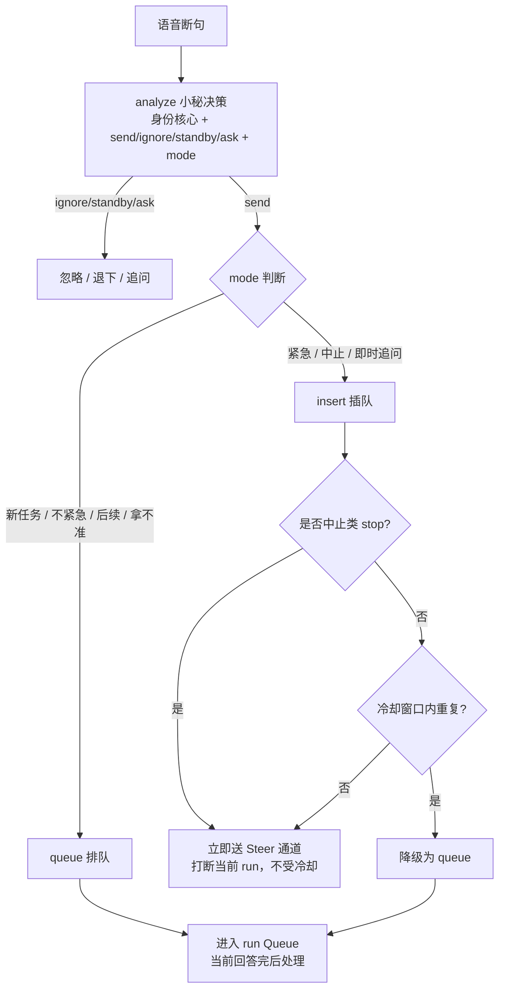
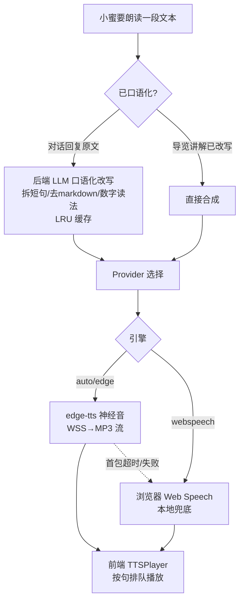
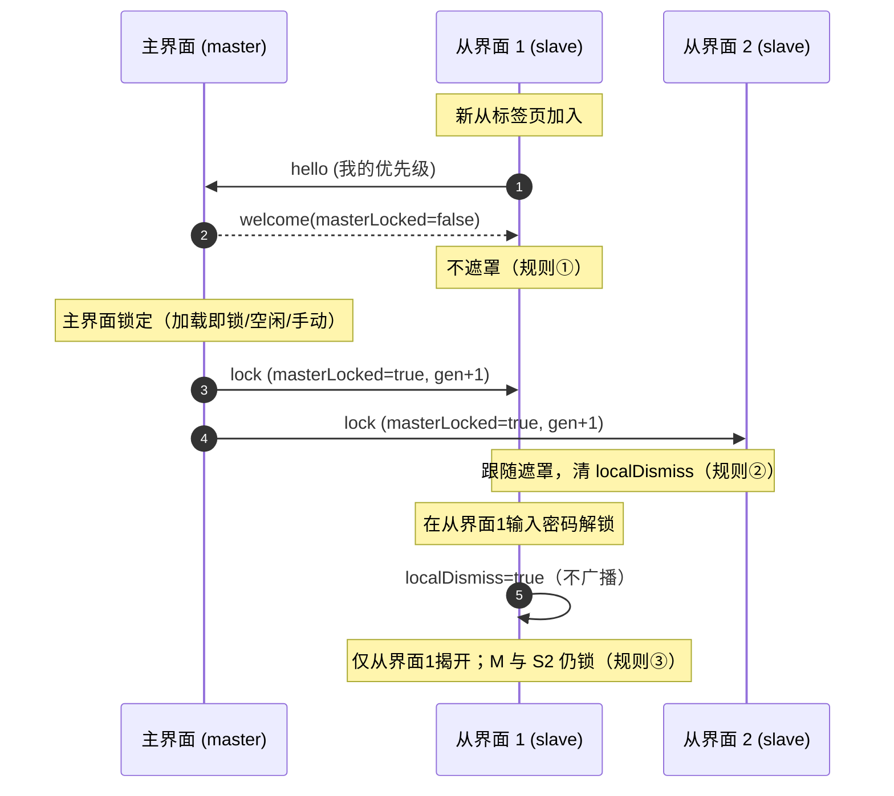
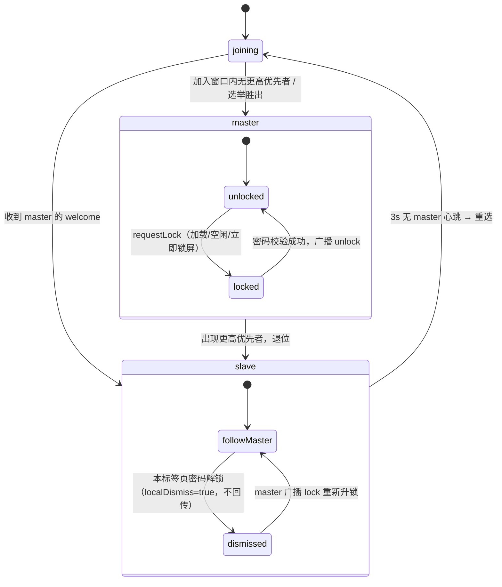
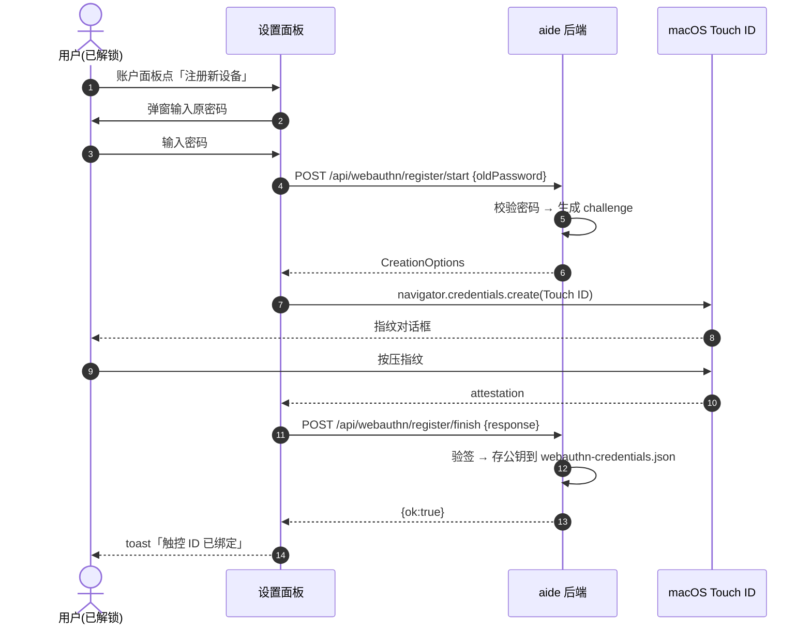
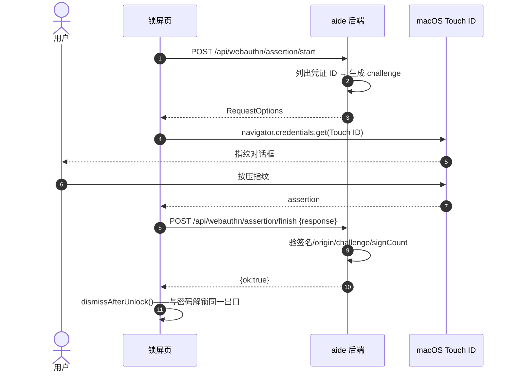

# aide 使用指南

> **启动配置以 `.env` 为准**：`start.command` → `scripts/aide.sh` → Docker Compose，统一读取 `AIDE_PORT`（默认 8097）和 `COMPOSE_FILE`。临时验收端口不是用户启动入口。目录范围和 macOS 共享根模式见 [工作目录配置](workspace-paths.md)。

适用：0.1.11.0 RC3。aide 可直接使用，也可交给 AI 按 [场景定制指南](customization.md) 改造成专属工作台。启动配置见 [README](../README.md)。

## 1. 认识工作台

- 左栏：新建会话、工作空间、最近会话、上下文概况和模型设置。
- 中间：对话、工作流步骤、修改提案；底部输入任务、选择策略与模式。
- 顶栏：聊天搜索、轨迹、插件与文件面板开关。
- 右栏：项目文件或插件。窄屏时通过按钮展开抽屉。
- 底部命令面板：手动执行当前工作区命令，显示输出、退出码与取消入口。

截图为隔离预览、示例工作区和模拟模型，不含实际账户信息。

## 2. 设置模型和策略

1. 打开"模型设置"，填写兼容服务的 API 根地址和密钥。
2. 点击自动获取模型，或手动添加模型 ID、显示名称和上下文窗口。
3. 选择当前模型并保存。最多 20 个模型，共用这一组 Base URL/API Key。
4. 在输入框旁的"策略"中选择模型以及 Profile。内置 default、precise、creative 不可从界面修改；自定义 Profile 在设置 → 模型参数中维护。
5. 手动策略使用指定 Profile；自动策略根据 `routing-policy.json` 的顺序匹配规则选择。它不是开发 Agent 工作流路由。
6. 先用短问题测试实际连接。失败时检查上游错误、模型 ID、账户权限和网络；不要仅根据"已配置"判断成功。

保存到数据卷的模型配置优先于启动环境变量。更改 `.env` 不会自动覆盖已保存模型配置。费用由模型提供商产生。

**API Key 加密存储（0.1.11.0-RC2 起）**：模型 API Key 不再明文写 `settings.json`，而是经 AES-256-GCM 加密存入统一凭证保险库 `/data/secrets/vault.enc`。界面只显示"是否已配置"（`hasApiKey`），**永不回显明文**；更换地址时留空密钥可复用已存 key，勾选清除则删除 vault 条目。已设账户密码的用户重启后 vault 默认锁定，调模型前会弹出解锁框（输账户密码，或在支持 Touch ID 的 Mac 上直接用指纹，见 §8 触控 ID）；未设密码的用户由机器绑定随机主密钥 `/data/secrets/master-key.bin`（0600）自动解锁，无感使用。从旧版升级时，`settings.json` 里的明文 key 在首次解锁后自动迁入 vault 并安全擦除旧文件。详见 [安全：统一凭证保险库](security/secret-vault.md)。

## 3. 选择工作空间和辅助资料

点左栏工作空间卡片，设置本地或远程 SSH 工作目录、系统文档路径及缓存路径。宿主机目录必须在 Docker 已挂载的范围内；界面设置不能凭空访问未挂载目录。

远程 SSH/SFTP 的登录密码、私钥与私钥口令统一存入加密凭证保险库（AES-256-GCM，主密钥由账户密码经 Argon2id 派生）。私钥可“粘贴”或“选择文件”（限定 /workspace、/context、/local 内），后者可选“仅引用路径”（不入库）或“导入加密副本”；界面永不回显私钥，保存后展示公钥 SHA-256 指纹。未设置账户密码时不允许保存 SSH 凭据。详见 [安全：统一凭证保险库](security/secret-vault.md)。

在文件面板切换“辅助资料”，添加并命名来源：

| 来源 | 可用方式 |
| --- | --- |
| 本地 / Skill | 浏览授权范围内的目录；Skill 来源是资料目录，不代表自动执行其中所有指令 |
| 链接 | 读取网页文本，实际可访问性由目标服务决定 |
| SFTP | 配置远端连接读取文件，读写受来源和账户权限约束 |
| FTP / FTPS / SMB | curl 通道，只读；不同服务器目录格式兼容性需实测 |
| MCP | 可登记信息，目前未实现协议调用，不应作为可用工具服务器 |

登记记录存入配置的缓存目录 `sources.json`，秘密保存在数据卷中。自动系统文档来源是自动挂载和读写标记，不代表系统会自动生成文档；底层只读挂载仍会拒绝写入。

## 4. 对话与文件修改

**分析问题**：打开文件 → 附加到任务 → 对话模式描述问题。工具循环可以额外读取工作区内容；不要将敏感目录挂入不需要的工作区。

**实现改动**：明确目标、文件范围和验收条件 → AI 工作流 → 观察规划、提案、审查 → 检查修改前后内容 → 应用 → 手动运行测试。

已有文件提案只允许修改本次已附加的工作区文件；AI 读过某个文件，不等于自动获准写入。应用时工作区身份和文件哈希必须一致。发生冲突应重新读取和生成提案，不能盲目覆盖。

“审查完成”表示模型返回审查文本，不表示编译、测试或业务验收已通过。AI 工作流提出的命令建议只会填入命令面板，仍须手动运行；模型也可通过 `run_shell` 在沙箱内直接执行命令并取回输出（只读沙箱下仅允许只读命令，危险命令在工作区可写模式下仍会被拦截）。

## 5. 文件编辑与独立标签页

打开 Markdown 默认预览，可切到编辑并保存。表格、任务列表、代码块由本地 Markdown 渲染器处理。其他文本文件直接编辑。

"新标签页"显示单文件路径、编辑/预览与保存按钮。同源标签页共用本地登录态；工作区发生切换后，旧文件页可能拒绝保存，这是防误写保护。回到工作台重新打开正确工作区文件。

只读来源禁用保存；并非所有图片、PDF 或二进制文件都支持编辑。**文本上限已从 256 KiB 放宽到 64 MiB**（0.1.11.0-RC2 起），仍校验 UTF-8 与无 NUL；大文件经 `GET /api/file` 的 `offset`/`limit` 字节窗口与 `read_file` 的行分段懒加载，不必一次性读入。

**编辑器标题栏（#59，RC2/RC3）**：删除独占第二行，只读 badge 并入标题栏；保存、新标签页、附加任务按钮归置标题栏右侧并贴右缘。只读类型（图片/PDF/STL/drawio/DXF/Word）不显示保存按钮。

**可视化查看器**：除图片/PDF/STL/drawio 外，0.1.11.0 起新增两类只读内联查看器：

- **DXF 矢量图（#57）**：`.dxf` 经 vendor `dxf-parser`（MIT）离线解析为 SVG，支持 LINE/CIRCLE/ARC/ELLIPSE/LWPOLYLINE/POLYLINE/SPLINE/TEXT/MTEXT/INSERT/DIMENSION，ACI 颜色/图层/线宽，工具栏缩放 ± 与适应窗口；只读，禁用保存。
- **Word 文档（#63）**：`.docx` 经 vendor `docx-preview` 0.3.2（Apache-2.0）+ JSZip 3.10.1（MIT）离线渲染，保留标题/表格/列表/图片排版；支持侧车批注（选中原文加批注、回复、标记解决；锚点因文档改动失效时标 stale 提示，不删除）。旧 `.doc` 二进制会提示"请另存为 .docx 后打开"。批注存 `/data/comments/`，与文档本体分离。

## 6. 搜索、轨迹与压缩

- **搜索**：顶栏输入关键词，或 ⌘K 聚焦。匹配会话标题、正文或摘要；点击结果打开会话。
- **轨迹**：查看各任务输入、阶段、工具参数与结果、提案、错误和用量。轨迹中的模型断言仍需与实际工具结果区分。
- **压缩**：轨迹入口可手动压缩；历史超过代码阈值 48,000 UTF-8 字节时会触发自动压缩，将旧消息摘要化并保留最近历史。压缩需要模型调用，可能计费或失败。

压缩不是备份、不是文件归档，也不等于清空历史磁盘记录。连续摘要可能损失细节，精确代码、数字和原始需求应保存到文件并按需重读。

### 会话编号

每个普通会话（含子会话）在创建时获得一个递增编号 `#N`，显示在会话列表与全局搜索结果标题前（如 `#3 项目讨论`）。

- 编号从 `#1` 开始，单调递增；删除会话**不会**复用其编号，编号只增不减。
- 编号随设置持久化，重启后保留；老版本升级上来的历史会话没有编号，仅新建会话带编号。
- 全局搜索（⌘K）结果同样以 `#N` 前缀展示，便于按号定位。

### 会话列表实时刷新（#60）

会话列表不再靠手动刷新。前端开一条 `GET /api/events` SSE 长连接，后端在会话创建/归档/置顶/改标题/状态变化/run 启动时广播 `sessions-changed` 事件（15s 心跳保活）；前端以 300ms 节流自动重载列表，**保留你已折叠的分组状态**，且当输入框正在聚焦打字时延后刷新、不打断输入。断开自动重连。

### 小秘系统会话

侧栏最顶部固定一个小秘系统会话条目（RC2 起用耳机线性 SVG 替代原 🤖 图标），它就是语音秘书「小秘」的对话视图：

- **包边卡片（#62，RC3）**：工作空间方块与小秘条目包进同一张卡片、零间距相接，相接处顶部直角用小三角填满；小秘呈底部浅蓝强调边（非全蓝实心），与普通会话区分。
- **标题固定**：标题固定显示设定名（语音助手名字），不被临时 prompt 覆盖。
- **密码进入**：点击小秘会话先弹主身份认证门（密码或 Touch ID 指纹二选一，见 §8 统一主身份认证），通过后本标签页内保持解锁，锁屏后需重新验证。
- **历史统一时间线（#62，RC3）**：原"设置 → 语音小秘 → 历史"独立视图已移除，语音往来与文字对话统一持久化进小秘会话的 runs/messages 时间线；打开小秘会话即可看到完整往来。
- **文字 = 语音（#62，RC3）**：在小秘会话里直接打字发送，与语音听写走同一条 `analyze` 意图管线（`POST /api/sessions/{id}/assistant-message`），同样会判断 send/ignore/standby 与插队/排队。
- **跨会话工具（#30 已接入工具循环）**：小秘在自己的会话里可调用 `search_sessions`（关键词搜全部会话含归档）、`get_session`（按 `#N` 或会话 ID 读取）、`follow_session`（标记跟进）、`push_to_session`（向指定会话推送备注/总结），并可经 `spawn_subagent` 创建/控制其他会话。这些工具不对普通会话暴露；assistant 会话恒用小秘人格。

### 小秘自我身份认知

小秘在所有场景（语音听写、成果讲解、与你直接对话）里都共享同一套稳定的"我是谁"。这套身份核心由后端 `voiceIdentityPrompt` 统一生成，动态读取设置里的「语音助手名字」，并拼接到每一次请求 system prompt 的最前面。

- **第一人称自我定位**：小秘以「{名字}」自称，始终用"我"说话——"我是{名字}"，而不是把自己叫成 aide 或某个通用助手。
- **与 aide 的分工**：aide 是负责实际干活的 AI 工作台（写代码、跑命令、操作文件、产出正式内容），它的主聊天不主动说话；小秘是你与 aide 之间的桥梁——倾听、听懂真实意图、把意图调度给 aide、总结成果、用大白话口头讲解、跟进待办与提醒，同时也承担生活助理与伙伴角色。专业产出交给 aide，小秘不越权替它写代码。
- **能力清单**：语音意图判断（`send`/`ignore`/`standby`/`ask`）；跨会话调度（`search_sessions`/`get_session`/`follow_session`/`push_to_session`，按 `#编号` 或会话 ID，含归档）；控制屏幕滚动、打开文件；总结与口头讲解；把书面回复改写成口语稿念给你听；必要时把任务交给子 agent 或 aide。
- **连续性与记忆**：小秘拥有独立的长期记忆与对话历史（加密保存），能引用过去说过的事，保持口吻、立场和称呼前后一致；它常驻在会话列表顶部的助理会话里。
- **边界准则**：不越权替 aide 产出；不编造你没说过的信息、不虚构自己没有的能力；保护隐私，遇到关键或不可逆动作先向你确认。
- **改名后立即跟随**：在设置里改「语音助手名字」后，小秘下一次说话的自我认知与自称立即使用新名字；助理会话标题也同步跟随。

### 小秘插队与排队

小秘把识别出的意图发给 aide 时，会自行判断这条是「插队(insert)」还是「排队(queue)」，而不是一律打断当前回答。

**判断信号**（在 analyze 的决策里一并给出）：
- **插队 insert（立即打断/插入当前 run）**：明确紧急措辞（立刻/马上/赶紧/现在就要）；中止或止损（停/停下来/取消/中止/不对、错了、不是这样、等一下）；强时效、必须现在处理；与当前上下文强相关、需要即时交互的追问。
- **排队 queue（等当前回答完再按顺序处理，这是默认）**：独立的新任务/新需求；不紧急、可以等当前完成；补充或后续事项（然后/待会/顺便/接下来）。
- 拿不准一律排队（保守默认）。

**与手动排队/插话的关系**：插队等价于手动输入时的「插话」——直接送进当前 run 的 steer 通道，立即影响本轮；排队等价于手动的「排队」——进入 run 的 Queue，当前回答结束后自动续跑。复用同一套既有机制，不另造。

**中止处理**：说「停 / 不对 / 错了 / 取消」等中止类指令时，小秘始终插队、立即打断当前 run；打断时已经流式产出的内容不会丢失（沿用 StreamBroker 的 interrupted 状态保留）。

**插队冷却**：为防止模型误判导致频繁打断，非中止类插队在冷却窗口内重复出现会被自动降级为排队。窗口由「插队敏感度」决定——保守 5 秒、适中 3 秒、激进 1 秒；明确中止指令不受冷却限制，随时插队。

**配置项**（设置 → 语音小秘 → 发送调度）：
- **默认发送模式**：排队（默认）/ 插队。小秘拿不准、或模型未给出 mode 时回落此值。
- **插队敏感度**：保守（默认）/ 适中 / 激进，控制冷却窗口长短。

**可观测**：小秘对话历史与语音面板日志里，每条已发送消息都会标注「插队」或「排队」，并附小秘的判断理由，便于复盘是哪条被插队、为什么。

## 7. 用量与费用

左上角 aide → 设置 → 消耗统计：查看每日热力图，悬停或用键盘方向键查看日期，点击/Enter 展开明细。

配置每百万输入/输出 Token 费率：0 表示免费，留空不是 0。按模型费率保存调用时快照，修改价格不重算历史。未配置费率的调用可能使用默认估算；旧统计显示未计价。余额查询取决于提供商支持。

本地费用不等于正式账单：缓存折扣、套餐、税费和提供商结算规则可能不同。上下文预览同样是字节启发式估算，并不是模型专用 tokenizer。

## 8. 外观与关于

左上角 aide → 设置 → 外观：

| 专业 | 浅色 | 深色 | 跟随系统 |
| --- | --- | --- | --- |
| 经典 | 浅色 | 深色 | 跟随系统 |

专业为中性蓝色，经典保留绿色。六种组合互斥，跟随系统只改变明暗、不改变所选风格；偏好仅存当前浏览器。

“关于”显示项目简介、运行版本和 GitHub 仓库链接。

### 语言切换

左上角 aide → **设置 → 语言**，在 中文 / English 之间即时切换。未显式选择时，英文浏览器 locale 用英文，其他 locale 用简体中文；保存了非法偏好则回退浏览器默认。偏好仅存当前浏览器、同标签页同步，不上服务器。

**当前英文覆盖状态**：0.1.10.2 RC1 起，产品自有界面文案已全部接入 i18n；此前 52 处把一句话拆成多段拼接的碎片文案已收口为整句 + 占位符 `{0}`，英文模式下不再回退成中英混杂的半截句子。

**切换后效果**：只改产品界面文案，不翻译对话内容、文件名、文件正文、自定义名称、模型回复、终端输出与未知的上游/服务端报错；已输入的草稿保持不变。需要英文模型回答时，用英文提问或直接要求模型用英文回答。UI 语言不换算货币：人民币计价仍显示 ¥。

### 设置面板分区

左上角 aide → 设置 按分区组织，完整分区如下：

| 分区 | 作用 |
| --- | --- |
| 消耗统计 | 见第 7 节 |
| 外观 | 本节 |
| 语言 | 中文 / English 即时切换，只改产品界面文案，不翻译对话、文件名与模型回复；偏好仅存当前浏览器、同标签页同步 |
| 模型参数 | 自定义 Profile 管理，见第 2 节；推理强度（自动/关闭/低/中/高五档）在输入框旁策略浮层切换 |
| 归档 | 会话归档与会话数据全部导出 |
| 权限管理 | 沙箱模式三级与工具轮数，见下 |
| 账户 | 用户名与锁屏密码；不设密码则不锁屏 |
| aide 性格 | 自定义性格提示词，随使用自动精简演化 |
| 语音小秘 | 麦克风转写、小秘名字、麦克风输入源、语音回复与**语音引擎（神经音合成）** |
| 无障碍 | 输出完成后自动朗读 |
| 配置备份 | 一键导出全部配置文件，或从备份导入；旧版本备份导入时自动补全新字段默认、非法值回退，无需重启即生效，详见 [安全：配置备份与跨版本兼容](security/config-backup.md) |
| 危险操作 | 恢复出厂设置：范围可选、默认只重置设置、执行前自动备份、用户文件永不删除（见下） |
| 关于 | 项目简介、运行版本与仓库链接 |

**配置备份与跨版本导入**：导出得到一份完整设置快照（可选择是否附带 API Key 等敏感材料与小秘历史）。从旧版本导出的备份在新版导入时，缺失的新字段会自动填上当前版本默认值，备份里显式给出的值（含显式 0）则予以保留；越界的数值或非法枚举会回退到安全默认值。导入后立即生效，无需重启，且与重启后的状态完全一致。备份来自更高版本时会被拒绝，避免新格式覆盖导致不可用。

**恢复出厂设置（危险操作）**：当 aide 的配置或本地数据需要推倒重来时，可在「设置 → 危险操作 → 恢复出厂设置」中按范围重置。范围**可选、默认安全**：

- **设置项**（默认勾选）：把模型 / TTS / 主题 / 权限 / 工具轮数 / 推理强度 / 沙箱 / 工作流 / 无障碍等恢复为当前版本默认值。默认**保留** API Key、登录密码哈希、调试令牌等凭据类字段——除非同时勾选「凭据与密钥」。
- **会话与记忆**（需主动勾选）：清空全部会话（活动 / 归档 / 小秘系统会话）、aide 核心记忆、小秘对话历史与长期记忆，并把性格恢复默认；重置后会自动重建一个小秘系统会话。
- **凭据与密钥**（需主动勾选）：清除登录密码哈希、API Key、SSH/vault 凭证、来源密钥、调试令牌、WebAuthn、KDF salt，并**轮换 access-token**，随后回到登录/首次引导。
- **工作空间配置**（需主动勾选）：把工作空间连接配置回到本地默认（local、空路径），不删除任何用户文件。

**强确认与本人复核**：执行前必须勾选「我了解此操作不可恢复」并输入「重置」二字；一旦涉及「凭据与密钥」或「会话与记忆」（含小秘历史），且你已设置登录密码，还须重新输入登录密码以确认本人，密码错误将被拒绝。

**后悔药（自动备份）**：在任何清除发生之前，系统会自动生成一份完整备份（含 secrets 加密信封与小秘历史），写入 `/data/config/backups/factory-reset-<时间戳>.json`，弹窗会展示该路径；该备份可经「配置备份 → 导入配置」恢复。

**用户文件零影响**：`/workspace` 与 `/context` 下你的代码与资料**永不删除**；重置只作用于 aide 的配置与本地数据卷。每次操作都会追加审计到 `/data/audit/factory-reset-audit.jsonl`（时间、范围、备份路径、结果，不含任何凭据正文）。重置凭据后需重新设置密码并重新接入模型。

**权限管理**：沙箱模式三级——只读（仅允许 ls/cat/git status 等只读命令）/ 工作区可写（默认，写操作仍经提案审批，危险命令被拦截）/ 完全访问（不建议日常使用）。工具轮数默认 60、范围 5–200；轮次耗尽时保留已有输出并提示继续。

**账户**：锁屏密码以 **Argon2id** 慢哈希存储（OWASP 推荐参数：64MB 内存、3 次迭代、4 线程），同时派生 AES-256 密钥加密人格自定义性格与小秘对话历史；空闲超时后回到登录页。从旧版升级的用户首次登录时，系统自动把旧的 SHA-256 哈希平滑升级为 Argon2id，并用新密钥重新封装已有密文（re-wrap），全程透明、无需手动操作。**传输**：0.1.11 起主端口走 HTTPS/TLS（最低 TLS 1.2、AEAD 前向保密套件），首次启动自动生成仅本机回环可用的自签证书，令牌与会话内容不再明文过网；详见 [安全：密码哈希与密钥派生](security/password-hashing.md) 与 [安全：HTTPS/TLS 入口加固](security/tls.md)。

**数据存储与完整性**：你的所有私有状态（会话、记忆、小秘、配置、密钥）都保存在命名卷 `/data`，与具体项目解耦，升级或换项目都不会丢，也不会被写进项目目录随 git 提交。0.1.11 起 `/data` 从旧版平铺的 30+ 个文件自动整理为语义化分层目录（`auth/` `sessions/` `assistant/` `memory/` `config/` `stats/` `audit/` `secrets/` `certs/`）；旧卷首次启动时自动迁移，全程先备份、复制校验通过后才归位，可回滚、可重入，无需手动操作。启动与每 5 分钟运行巡检会校验程序完整性与关键文件可解析性：缺失目录自动重建、可再生数据清空重建、损坏的用户数据移入 `.quarantine/` 隔离（绝不自动删除），程序疑似被篡改时 `/healthz` 标记 `degraded` 并提示重新部署。`GET /healthz` 返回的 `integrity` 字段即当前状态（ok / degraded / corrupted）。详见 [架构：数据目录分层与完整性自愈](architecture/data-layout.md)。

**语音小秘**：输入框旁麦克风调用浏览器 Web Speech API 实时转写，后端自动甄别"传达给 AI / 背景噪声 / 与他人闲聊"，识别闲聊自动退下；名字可自定义。

### 语音引擎与自然度

小蜜的朗读不再只用浏览器内置 Web Speech——macOS 上它常常回落到 Ting-Ting 这类机械老合成音。0.1.10.2 RC1 起，朗读默认优先走后端 **edge-tts 神经音**（微软"大声朗读"同款，中文晓晓/云希等音色自然度明显更好），不可用时自动降级回浏览器合成。

**引擎分层**：

**各引擎对比**：

| 引擎 | 自然度 | 音色 | 是否需要联网 | 隐私 |
| --- | --- | --- | --- | --- |
| edge-tts（默认） | 高（神经音） | 晓晓/云希/晓伊等十余个中文音色 | 是 | 朗读文本会发送给微软 |
| 浏览器 Web Speech | 低（macOS 常为 Ting-Ting 机械音） | 取决于系统 | 否 | 全本地，不出设备 |
| 云端/本地开源（预留） | 高 | 可扩展 | 视实现 | 视实现 |

**神经音与浏览器机械音的区别**：edge-tts 是后端把文本发到微软"大声朗读"通道，合成自然度高的神经音 MP3 再流式播给你；浏览器 Web Speech 是系统本地合成，离线可用但 macOS 上常回落到 Ting-Ting 这类单一机械音——这也是以前"怎么换音色都一个声"的根因：并非音色没生效，而是 edge 首包太慢被误降级，全程走了浏览器机械音。

**稳定性：超时分层与自动重试**：edge-tts 建连分三段独立计时，避免把"第一次握手稍慢"误判为不可用：

- TCP/TLS 建连 5s；WSS 握手 5s；**首包（第一个音频字节）5s**（此前是 1.5s，首次连接 + GEC 令牌生成常超 1.5s，故放宽）。
- 任一超时会用新连接 ID 自动重试 1 次；仍失败才降级浏览器合成。403 认证失败等非超时错误不重试、直接报错。
- 后端对 edge 可用性做 60s 健康缓存：启动与首次合成前轻量探测，`/api/config` 与 `/api/debug/overview` 可见 `edgeAvailable` 与上次失败原因；缓存过期自动重探，恢复后无缝切回神经音。

**降级提示**：当 edge 不可用、本次朗读临时改用浏览器机械音时，界面会弹出"神经音暂不可用，当前为浏览器机械音"提示；设置页语音引擎区也会常驻红色警告（含失败原因），edge 恢复后自动消失。

**口语化与韵律**：对话回复在朗读前先经一次轻量 LLM 改写——拆短句、去掉 markdown、数字按口语读法念、加自然语气词；改写结果按原文 hash 做内存 LRU 缓存，同一段回复不重复花 token。导览讲解词本身已由后端 `voice-narrate` 做过口语化，不再重复处理。语速、表现力（情感强度）在 edge 上映射为 SSML `prosody`/`express-as`。

**多引擎自动编排（不静默降级）**：后端按优先级 edge-tts → Azure 官方 Speech（填了 key 才启用）→ 浏览器 Web Speech 依次尝试。设置页"语音引擎"区会显示**当前实际生效引擎**（edge 神经音 / Azure 神经音 / 已降级浏览器机械音）与健康状态；edge 被微软服务端断连时，界面不再静默，而是明确标注降级原因。服务端主动关闭（风控/拒绝）会记录 WebSocket close code 与原因（如 code=1007 SSML 非法、1008 策略拒绝），这类断连不重试、直接标记 edge 不可用；仅连接/握手/首包超时才重试。

**语音回复详细度**：设置 → 语音小秘新增"语音回复详细度"——简要概括（默认，抓核心结论/关键数字/决策，强保真不臆测）/ 完整朗读（只口语化不删减，长文不截断）；朗读对象取最终完整 assistant 结论，排除工具过渡/过短消息。

**设置项**：设置 → 语音小秘 → **语音引擎**：

- **TTS 引擎**：自动（推荐）/ edge-tts / 浏览器合成。
- **音色**：按女声/男声分组列出；选 edge-tts 后可挑晓晓（女）/云希（男）/晓伊等；选"默认（按性别）"则按语音回复性别自动映射（女→晓晓，男→云希，中性→晓伊）。
- **语速**：0.8–1.3 倍。
- **表现力**：0–1，映射 edge 情感风格强度。
- **试听 / 保存**：试听严格用下拉当前所选音色（不污染已保存配置，播完还原按钮状态）；满意后点"保存"才写入设置。切换音色后，正在播的这一句用旧音色播完，下一句起用新音色。

**离线与隐私**：edge-tts 需要联网；离线环境自动降级浏览器合成（全本地）。edge-tts 会把朗读文本发给微软，**保密环境请在引擎里手动选"浏览器合成"**。API key 仅用于未来云端引擎，edge-tts 不需要、也不回显。

**不影响的地方**：主聊天每条消息上的"朗读"按钮是给任意文本做平直机械朗读用的，它仍然走裸浏览器 Web Speech，不受语音引擎设置影响。

### 多标签页锁屏语义

主界面（工作台标签页）与文件查看器（`#file=…` 从标签页）之间，锁屏状态按以下三条规则联动，不再各自为政：

1. **主界面未锁，从界面绝不锁**：主界面处于解锁态时，新打开或刷新的从标签页不会被遮罩。
2. **主界面锁定，所有从界面跟随锁**：主界面一旦锁定（加载即锁、空闲超时、或点"立即锁屏"），所有从标签页同步糊化遮罩，小秘在各标签页同步退下。
3. **从界面单独解锁只解自己**：在某个从标签页输入密码解锁，只解除该标签页的遮罩；主界面与其他从标签页仍保持锁定，不回传主界面。

实现上由浏览器 `BroadcastChannel`（频道 `aide-lock-v1`）在前端做一次 leader election：优先级 `(role: 主界面=0 < 文件查看器=1, bootTs, tabId)` 选出一个 **master**，`masterLocked` 只在 master 写入；其余标签页为 **slave**，各自记录 `localDismiss`。某标签页"是否真的被遮罩" = `masterLocked && !localDismiss`。

- **空闲计时只在 master**：`lockTimeoutSec` 的倒计时只在主界面跑；任意标签页的鼠标/键盘活动都会节流（≥1s）发 ping 给 master 续表，避免你在从界面看文件时主界面超时锁上。
- **加入窗口期**：新标签页打开时先显示"正在确认安全状态…"中性面纱（约 0.6s），既不泄露内容也不抢密码框；确认主界面锁态后再决定遮罩。
- **主界面崩溃/刷新后重选**：slave 约 3s 收不到 master 心跳即发起选举，优先级最高的现存标签页接任 master，并继承"最后已知的集群锁态"——集群原本锁着就继续锁，不会因为主标签被关就集体解锁。
- **降级**：浏览器不支持 `BroadcastChannel`（极旧环境）时退回各标签页独立锁，行为同旧版。

### 统一主身份认证（#43，RC2）

所有"证明本人在场"的敏感动作现在走同一个入口 `POST /api/auth/verify`：**密码或 Touch ID 指纹二选一**，通过即返回 `{ok:true, scope:"master"}` 并写审计。前端统一组件 `requestMasterAuth()` 优先弹指纹、不可用时回退密码框。已接入 6 处 A 类动作：锁屏解锁、小秘历史查看 ×3、改密码、vault 解锁（重启后调模型）、小秘会话进入。B 类动作（保存/清除 API Key、SSH 凭据、打开 PDF 密码等）仍走各自原流程。无密码用户身份天然确认，vault 由机器密钥自动解锁。

### 触控 ID 解锁（macOS）

在带 Touch ID 的 Mac 上，可以用指纹代替密码解锁锁屏遮罩。

**要求**：
- MacBook 自带 Touch ID 或外接带 Touch ID 的妙控键盘；
- macOS 13+，Chrome 120+ 或 Safari 16+；
- **必须用 `https://localhost:8097` 打开 aide**——WebAuthn 的 RP ID 不支持 IP 字面量，`127.0.0.1` 地址栏下按钮自动隐藏并提示改用 localhost；0.1.11 起主端口为 HTTPS，自签证书浏览器告警请选"继续"。

**注册步骤**（设置 → 账户 → 触控 ID / Passkey）：
1. 点「注册新设备」，输入原锁屏密码确认；
2. 系统弹出 Touch ID 对话框，按指纹完成验证；
3. 提示「触控 ID 已绑定」，设备名出现在列表中。

**解锁步骤**：锁屏页点「触控 ID 解锁」按钮，按指纹即可，与密码解锁走同一套 dismiss 逻辑。取消指纹弹窗则静默回退密码输入。

**多设备管理**：设置 → 账户中可查看已注册设备列表、删除设备（需再次输入密码）。

**安全说明**：指纹对应的私钥存于 macOS Secure Enclave / iCloud Keychain，后端仅存公钥与签名计数；每次解锁校验签名计数单调递增以防凭证克隆。触控 ID 解锁与密码解锁安全边界一致——都只解除本机锁屏遮罩，不改变后端 API 鉴权。

## 9. 常见问题

| 现象 | 建议 |
| --- | --- |
| 页面要求令牌 | 使用启动入口登录；访问令牌不是模型 API Key |
| 保存或应用失败 | 检查只读属性、文件变化、工作区切换及错误提示 |
| 修改源码但页面不变 | 正式服务需重建 Go embed 镜像；不能直接归因于浏览器缓存 |
| 命令交互无反应 | 不支持 PTY；不要在面板中运行 vim 或需要密码输入的命令 |
| 模型失败、取消或超时 | 在轨迹查看真实错误；确认上游配置和任务范围，未成功前不重复应用旧提案 |
| 浏览器打不开 | `bash scripts/aide.sh status` 检查端口与健康状态，再查看 logs |

备份与发布请继续阅读 [交接与运维](../HANDOVER.md)。

### 自动获取模型与未保存设置

「自动获取」使用输入框中当前的 API Base URL 和 API Key，无需先保存模型配置，也不会自动保存草稿。地址与已保存地址相同时，密钥留空可复用已保存密钥；更换地址时不会复用旧服务密钥，请重新填写新服务的 Key。勾选清除密钥会以无密钥方式获取。获取成功后，在模型 ID 输入框选择候选并添加，最后保存设置。上游须支持 `{Base URL}/models`。

### 环境说明插件

插件面板中的「环境说明 / Environment guide」默认启用。每次新任务自动向 AI 提供当前工作区、顶层文件样本、启用的辅助资料及使用方式。模型可据此解释哪些是工作文件、哪些是参考资料；具体项目用法仍需读取相关文件，不能仅凭文件名推断。插件不会自动读取所有文件、连接远程资料或执行资料中的指令。目录样本计入上下文预算，可通过上下文预览/请求快照查看。停用仅影响后续任务，已发出的请求不会被撤回。

### SQLite 数据库插件

「SQLite 数据库」插件（`sqlite`）基于 Node 内置 `node:sqlite`，零依赖、可离线，在授权挂载根内读写 SQLite 文件：参数化查询、事务、迁移、表结构查看与 CSV/备份导出。工具默认只读，写操作需显式 `readonly=false`；数据库路径限定 `/workspace`、`/context`、`/local`，参数化绑定防注入，结果默认截断。详见 [plugins/sqlite.md](plugins/sqlite.md)。

### 辅助资料类型与实际能力

| 来源 | 路径/连接 | 读取与保存 |
| --- | --- | --- |
| 本地 / Skill | 支持「浏览…」，范围由 AIDE_LOCAL_ROOT 挂载决定；可手填路径 | 浏览目录、读取；标记读写且挂载可写时可保存 |
| 网页链接 | 输入完整 HTTP(S) URL（保留查询参数） | 作为 resource.txt 单资源读取原始文本/HTML，不把网页当目录；只读 |
| SFTP | 主机、端口、用户名、远程目录、密码/私钥 | 登记后点击来源浏览；允许标记读写，实际权限由服务器决定 |
| FTP / FTPS | URL、用户名、密码 | 只读；支持常见 Unix LIST 格式和简单逐行列表，嵌套路径保留；非标准服务目录格式可能不兼容 |
| SMB1 | 指向文件的 smb/smbs URL、用户名、密码 | 单文件读取，当前不提供 SMB 目录枚举；当前 curl 仅支持 SMB1；SMB2/3-only 服务不兼容 |
| MCP | 命令或 URL | 仅登记，尚未实现协议调用，不支持读取/写入 |

URL 中不要嵌入账号密码，请使用独立输入框。远程用户名/密码表单不代表已经通过实机连通测试。读取文本遵循统一的 64 MiB、UTF-8、无 NUL 限制。AI 可通过 list_sources 查询启用的来源，再用 list_files/read_file 的 source 参数主动浏览与读取（read_file 支持行分段）；也可由用户附加文件。AI 对辅助资料只读，文件名不等于已读取正文。
