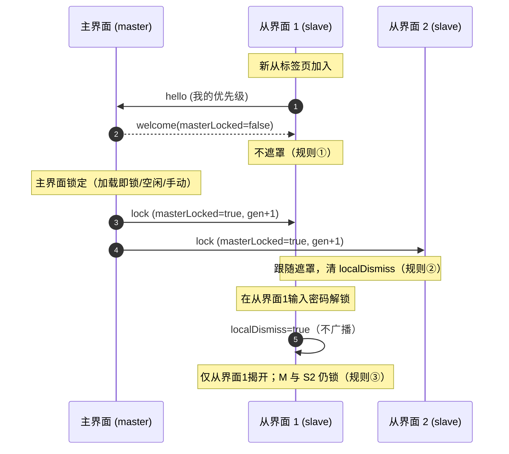
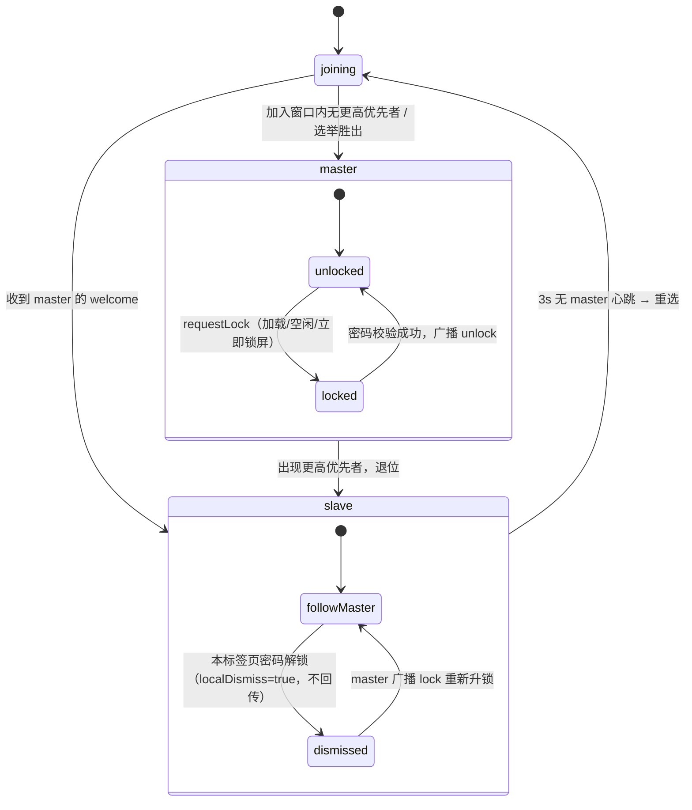

# aide 使用指南

> **启动配置以 `.env` 为准**：`start.command` → `scripts/aide.sh` → Docker Compose，统一读取 `AIDE_PORT`（默认 8097）和 `COMPOSE_FILE`。临时验收端口不是用户启动入口。目录范围和 macOS 共享根模式见 [工作目录配置](workspace-paths.md)。

适用：0.1.10.2 RC1。aide 可直接使用，也可交给 AI 按 [场景定制指南](customization.md) 改造成专属工作台。启动配置见 [README](../README.md)。

## 1. 认识工作台

- 左栏：新建会话、工作空间、最近会话、上下文概况和模型设置。
- 中间：对话、工作流步骤、修改提案；底部输入任务、选择策略与模式。
- 顶栏：聊天搜索、轨迹、插件与文件面板开关。
- 右栏：项目文件或插件。窄屏时通过按钮展开抽屉。
- 底部命令面板：手动执行当前工作区命令，显示输出、退出码与取消入口。

截图为隔离预览、示例工作区和模拟模型，不含实际账户信息。

## 2. 设置模型和策略

1. 打开“模型设置”，填写兼容服务的 API 根地址和密钥。
2. 点击自动获取模型，或手动添加模型 ID、显示名称和上下文窗口。
3. 选择当前模型并保存。最多 20 个模型，共用这一组 Base URL/API Key。
4. 在输入框旁的“策略”中选择模型以及 Profile。内置 default、precise、creative 不可从界面修改；自定义 Profile 在设置 → 模型参数中维护。
5. 手动策略使用指定 Profile；自动策略根据 `routing-policy.json` 的顺序匹配规则选择。它不是开发 Agent 工作流路由。
6. 先用短问题测试实际连接。失败时检查上游错误、模型 ID、账户权限和网络；不要仅根据“已配置”判断成功。

保存到数据卷的模型配置优先于启动环境变量。更改 `.env` 不会自动覆盖已保存模型配置。费用由模型提供商产生。

## 3. 选择工作空间和辅助资料

点左栏工作空间卡片，设置本地或远程 SSH 工作目录、系统文档路径及缓存路径。宿主机目录必须在 Docker 已挂载的范围内；界面设置不能凭空访问未挂载目录。

在文件面板切换“辅助资料”，添加并命名来源：

| 来源 | 可用方式 |
| --- | --- |
| 本地 / Skill | 浏览授权范围内的目录；Skill 来源是资料目录，不代表自动执行其中所有指令 |
| 链接 | 读取网页文本，实际可访问性由目标服务决定 |
| SFTP | 配置远端连接读取文件，读写受来源和账户权限约束 |
| FTP / FTPS / SMB | curl 通道，只读；不同服务器目录格式兼容性需实测 |
| MCP | 可登记信息，目前未实现协议调用，不应作为可用工具服务器 |

登记记录存入配置的缓存目录 `sources.json`，秘密保存在数据卷中。自动系统文档来源是自动挂载和读写标记，不代表系统会自动生成文档；底层只读挂载仍会拒绝写入。

## 4. 对话与文件修改

**分析问题**：打开文件 → 附加到任务 → 对话模式描述问题。工具循环可以额外读取工作区内容；不要将敏感目录挂入不需要的工作区。

**实现改动**：明确目标、文件范围和验收条件 → AI 工作流 → 观察规划、提案、审查 → 检查修改前后内容 → 应用 → 手动运行测试。

已有文件提案只允许修改本次已附加的工作区文件；AI 读过某个文件，不等于自动获准写入。应用时工作区身份和文件哈希必须一致。发生冲突应重新读取和生成提案，不能盲目覆盖。

“审查完成”表示模型返回审查文本，不表示编译、测试或业务验收已通过。AI 工作流提出的命令建议只会填入命令面板，仍须手动运行；模型也可通过 `run_shell` 在沙箱内直接执行命令并取回输出（只读沙箱下仅允许只读命令，危险命令在工作区可写模式下仍会被拦截）。

## 5. 文件编辑与独立标签页

打开 Markdown 默认预览，可切到编辑并保存。表格、任务列表、代码块由本地 Markdown 渲染器处理。其他文本文件直接编辑。

“新标签页”显示单文件路径、编辑/预览与保存按钮。同源标签页共用本地登录态；工作区发生切换后，旧文件页可能拒绝保存，这是防误写保护。回到工作台重新打开正确工作区文件。

只读来源禁用保存；并非所有图片、PDF 或二进制文件都支持编辑。文本上限 256 KiB，非 UTF-8 和含 NUL 的内容被拒绝。

## 6. 搜索、轨迹与压缩

- **搜索**：顶栏输入关键词，或 ⌘K 聚焦。匹配会话标题、正文或摘要；点击结果打开会话。
- **轨迹**：查看各任务输入、阶段、工具参数与结果、提案、错误和用量。轨迹中的模型断言仍需与实际工具结果区分。
- **压缩**：轨迹入口可手动压缩；历史超过代码阈值 48,000 UTF-8 字节时会触发自动压缩，将旧消息摘要化并保留最近历史。压缩需要模型调用，可能计费或失败。

压缩不是备份、不是文件归档，也不等于清空历史磁盘记录。连续摘要可能损失细节，精确代码、数字和原始需求应保存到文件并按需重读。

## 7. 用量与费用

左上角 aide → 设置 → 消耗统计：查看每日热力图，悬停或用键盘方向键查看日期，点击/Enter 展开明细。

配置每百万输入/输出 Token 费率：0 表示免费，留空不是 0。按模型费率保存调用时快照，修改价格不重算历史。未配置费率的调用可能使用默认估算；旧统计显示未计价。余额查询取决于提供商支持。

本地费用不等于正式账单：缓存折扣、套餐、税费和提供商结算规则可能不同。上下文预览同样是字节启发式估算，并不是模型专用 tokenizer。

## 8. 外观与关于

左上角 aide → 设置 → 外观：

| 专业 | 浅色 | 深色 | 跟随系统 |
| --- | --- | --- | --- |
| 经典 | 浅色 | 深色 | 跟随系统 |

专业为中性蓝色，经典保留绿色。六种组合互斥，跟随系统只改变明暗、不改变所选风格；偏好仅存当前浏览器。

“关于”显示项目简介、运行版本和 GitHub 仓库链接。

### 语言切换

左上角 aide → **设置 → 语言**，在 中文 / English 之间即时切换。未显式选择时，英文浏览器 locale 用英文，其他 locale 用简体中文；保存了非法偏好则回退浏览器默认。偏好仅存当前浏览器、同标签页同步，不上服务器。

**当前英文覆盖状态**：0.1.10.2 RC1 起，产品自有界面文案已全部接入 i18n；此前 52 处把一句话拆成多段拼接的碎片文案已收口为整句 + 占位符 `{0}`，英文模式下不再回退成中英混杂的半截句子。

**切换后效果**：只改产品界面文案，不翻译对话内容、文件名、文件正文、自定义名称、模型回复、终端输出与未知的上游/服务端报错；已输入的草稿保持不变。需要英文模型回答时，用英文提问或直接要求模型用英文回答。UI 语言不换算货币：人民币计价仍显示 ¥。

### 设置面板分区

左上角 aide → 设置 按分区组织，完整分区如下：

| 分区 | 作用 |
| --- | --- |
| 消耗统计 | 见第 7 节 |
| 外观 | 本节 |
| 语言 | 中文 / English 即时切换，只改产品界面文案，不翻译对话、文件名与模型回复；偏好仅存当前浏览器、同标签页同步 |
| 模型参数 | 自定义 Profile 管理，见第 2 节；推理强度（自动/关闭/低/中/高五档）在输入框旁策略浮层切换 |
| 归档 | 会话归档与会话数据全部导出 |
| 权限管理 | 沙箱模式三级与工具轮数，见下 |
| 账户 | 用户名与锁屏密码；不设密码则不锁屏 |
| aide 性格 | 自定义性格提示词，随使用自动精简演化 |
| 语音小秘 | 麦克风转写、小秘名字、麦克风输入源与语音回复 |
| 无障碍 | 输出完成后自动朗读 |
| 配置备份 | 一键导出全部配置文件，或从备份导入 |
| 关于 | 项目简介、运行版本与仓库链接 |

**权限管理**：沙箱模式三级——只读（仅允许 ls/cat/git status 等只读命令）/ 工作区可写（默认，写操作仍经提案审批，危险命令被拦截）/ 完全访问（不建议日常使用）。工具轮数默认 60、范围 5–200；轮次耗尽时保留已有输出并提示继续。

**账户**：锁屏密码以 SHA-256 存储，同时作为小秘对话历史的加密密钥；空闲超时后回到登录页。

**语音小秘**：输入框旁麦克风调用浏览器 Web Speech API 实时转写，后端自动甄别"传达给 AI / 背景噪声 / 与他人闲聊"，识别闲聊自动退下；名字可自定义。

### 多标签页锁屏语义

主界面（工作台标签页）与文件查看器（`#file=…` 从标签页）之间，锁屏状态按以下三条规则联动，不再各自为政：

1. **主界面未锁，从界面绝不锁**：主界面处于解锁态时，新打开或刷新的从标签页不会被遮罩。
2. **主界面锁定，所有从界面跟随锁**：主界面一旦锁定（加载即锁、空闲超时、或点"立即锁屏"），所有从标签页同步糊化遮罩，小秘在各标签页同步退下。
3. **从界面单独解锁只解自己**：在某个从标签页输入密码解锁，只解除该标签页的遮罩；主界面与其他从标签页仍保持锁定，不回传主界面。

实现上由浏览器 `BroadcastChannel`（频道 `aide-lock-v1`）在前端做一次 leader election：优先级 `(role: 主界面=0 < 文件查看器=1, bootTs, tabId)` 选出一个 **master**，`masterLocked` 只在 master 写入；其余标签页为 **slave**，各自记录 `localDismiss`。某标签页"是否真的被遮罩" = `masterLocked && !localDismiss`。

- **空闲计时只在 master**：`lockTimeoutSec` 的倒计时只在主界面跑；任意标签页的鼠标/键盘活动都会节流（≥1s）发 ping 给 master 续表，避免你在从界面看文件时主界面超时锁上。
- **加入窗口期**：新标签页打开时先显示"正在确认安全状态…"中性面纱（约 0.6s），既不泄露内容也不抢密码框；确认主界面锁态后再决定遮罩。
- **主界面崩溃/刷新后重选**：slave 约 3s 收不到 master 心跳即发起选举，优先级最高的现存标签页接任 master，并继承"最后已知的集群锁态"——集群原本锁着就继续锁，不会因为主标签被关就集体解锁。
- **降级**：浏览器不支持 `BroadcastChannel`（极旧环境）时退回各标签页独立锁，行为同旧版。

## 9. 常见问题

| 现象 | 建议 |
| --- | --- |
| 页面要求令牌 | 使用启动入口登录；访问令牌不是模型 API Key |
| 保存或应用失败 | 检查只读属性、文件变化、工作区切换及错误提示 |
| 修改源码但页面不变 | 正式服务需重建 Go embed 镜像；不能直接归因于浏览器缓存 |
| 命令交互无反应 | 不支持 PTY；不要在面板中运行 vim 或需要密码输入的命令 |
| 模型失败、取消或超时 | 在轨迹查看真实错误；确认上游配置和任务范围，未成功前不重复应用旧提案 |
| 浏览器打不开 | `bash scripts/aide.sh status` 检查端口与健康状态，再查看 logs |

备份与发布请继续阅读 [交接与运维](../HANDOVER.md)。

### 自动获取模型与未保存设置

「自动获取」使用输入框中当前的 API Base URL 和 API Key，无需先保存模型配置，也不会自动保存草稿。地址与已保存地址相同时，密钥留空可复用已保存密钥；更换地址时不会复用旧服务密钥，请重新填写新服务的 Key。勾选清除密钥会以无密钥方式获取。获取成功后，在模型 ID 输入框选择候选并添加，最后保存设置。上游须支持 `{Base URL}/models`。

### 环境说明插件

插件面板中的「环境说明 / Environment guide」默认启用。每次新任务自动向 AI 提供当前工作区、顶层文件样本、启用的辅助资料及使用方式。模型可据此解释哪些是工作文件、哪些是参考资料；具体项目用法仍需读取相关文件，不能仅凭文件名推断。插件不会自动读取所有文件、连接远程资料或执行资料中的指令。目录样本计入上下文预算，可通过上下文预览/请求快照查看。停用仅影响后续任务，已发出的请求不会被撤回。

### 辅助资料类型与实际能力

| 来源 | 路径/连接 | 读取与保存 |
| --- | --- | --- |
| 本地 / Skill | 支持「浏览…」，范围由 AIDE_LOCAL_ROOT 挂载决定；可手填路径 | 浏览目录、读取；标记读写且挂载可写时可保存 |
| 网页链接 | 输入完整 HTTP(S) URL（保留查询参数） | 作为 resource.txt 单资源读取原始文本/HTML，不把网页当目录；只读 |
| SFTP | 主机、端口、用户名、远程目录、密码/私钥 | 登记后点击来源浏览；允许标记读写，实际权限由服务器决定 |
| FTP / FTPS | URL、用户名、密码 | 只读；支持常见 Unix LIST 格式和简单逐行列表，嵌套路径保留；非标准服务目录格式可能不兼容 |
| SMB1 | 指向文件的 smb/smbs URL、用户名、密码 | 单文件读取，当前不提供 SMB 目录枚举；当前 curl 仅支持 SMB1；SMB2/3-only 服务不兼容 |
| MCP | 命令或 URL | 仅登记，尚未实现协议调用，不支持读取/写入 |

URL 中不要嵌入账号密码，请使用独立输入框。远程用户名/密码表单不代表已经通过实机连通测试。读取文本遵循统一的 256 KiB、UTF-8、无 NUL 限制。AI 可通过 list_sources 查询启用的来源，再用 list_files/read_file 的 source 参数主动浏览与读取；也可由用户附加文件。AI 对辅助资料只读，文件名不等于已读取正文。
